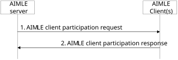

# 8.10 AIMLE client participation

## 8.10.1 General

The following clauses specify procedures, information flows, and APIs for AIMLE client participation.

## 8.10.2 Procedure

### 8.10.2.1 AIMLE client participation

Figure 8.10.2.1-1: AIMLE client participation

1\. An AIMLE server sends an AIMLE client participation request to an AIMLE client to verify participation in AI/ML operation(s). The request includes information as described in Table 8.10.3.1-1.

2\. The AIMLE client acknowledge its willingness to be part of (or removed from) the AIMLE client set in an AIMLE client participation response sent to the AIMLE server. The response includes information as described in Table 8.10.3.1-2.

NOTE: If the AIMLE client participation procedure is triggered for AIMLE clients selected via cross-domain/PLMN selection, the participation request may be initiated by a partner AIMLE server in the domain/PLMN where the AIMLE client is served, based on coordination between AIMLE servers over AIML-E.

## 8.10.3 Information flows

### 8.10.3.1 AIMLE client participation request

Table 8.10.3.1-1 shows the request sent by the AIMLE server to each AIMLE client selected for AIMLE client participation procedure.

Table 8.10.3.1-1: AIMLE client participation request

| Information element         | Status | Description                                                                                                                                                                         |
|-----------------------------|--------|-------------------------------------------------------------------------------------------------------------------------------------------------------------------------------------|
| Requestor identity          | M      | The identifier of the requestor.                                                                                                                                                    |
| AIMLE client set identifier | M      | An identifier for the AIMLE client set.                                                                                                                                             |
| Add/remove indicator        | M      | Indicator for adding/removing the AIMLE client to/from the AIMLE client set.                                                                                                        |
| ML model ID                 | M      | The ML model ID to use for the AI/ML operation.                                                                                                                                     |
| AI/ML operations            | M      | A list of AI/ML operations (e.g., training) required to be performed.                                                                                                               |
| Expected energy budget      | O      | The expected energy budget (e.g., watt-hour, joules) associated with performing the AI/ML operations.                                                                               |
| Operational schedule        | O      | Schedule for the AI/ML operations.                                                                                                                                                  |
| Dataset requirement         | M      | Dataset requirements for the AI/ML operations. Requirements includes dataset identifier, dataset size and age, and/or dataset features.                                             |
| Service requirement         | M      | Information about the required Service including its VAL service ID and its service permission level (e.g., premium resource usage standard resource usage, limited resource usage) |

### 8.10.3.2 AIMLE client participation response

Table 8.10.3.2-1 shows the response sent by the AIMLE clients to the AIMLE server for the AIMLE client participation procedure.

Table 8.10.3.2-1: AIMLE client participation response

<table>
<colgroup>
<col style="width: 33%" />
<col style="width: 13%" />
<col style="width: 53%" />
</colgroup>
<thead>
<tr class="header">
<th>Information element</th>
<th>Status</th>
<th>Description</th>
</tr>
</thead>
<tbody>
<tr class="odd">
<td>Status</td>
<td>M</td>
<td>The status for the request: success or failure.</td>
</tr>
<tr class="even">
<td>Participation agreement</td>
<td>
O

(NOTE)
</td>
<td>Indicated whether the AIMLE client is willing to be part or be removed from the AIMLE client set.</td>
</tr>
<tr class="odd">
<td>Cause</td>
<td>O</td>
<td>The cause for the request failure.</td>
</tr>
<tr class="even">
<td colspan="3">NOTE: This is present if the response status is success.</td>
</tr>
</tbody>
</table>
