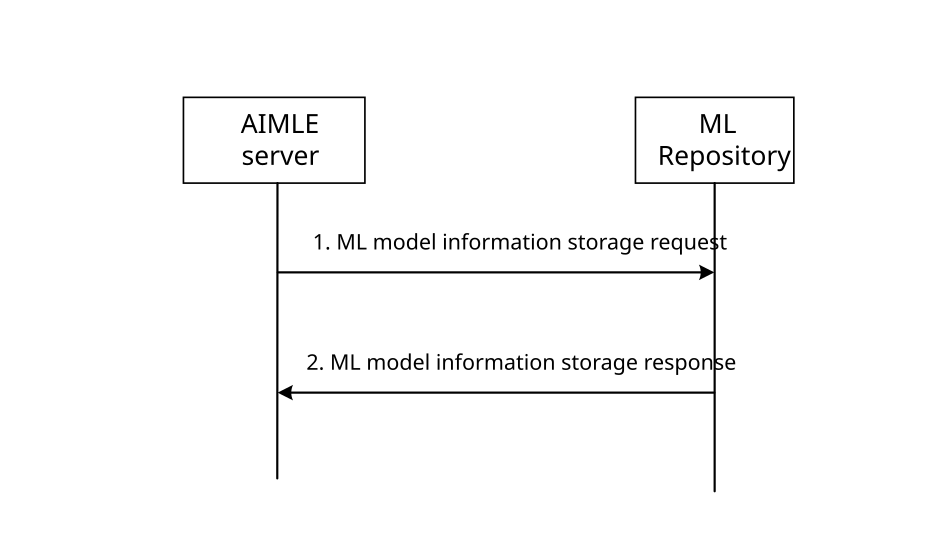
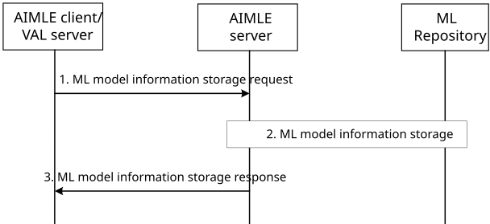
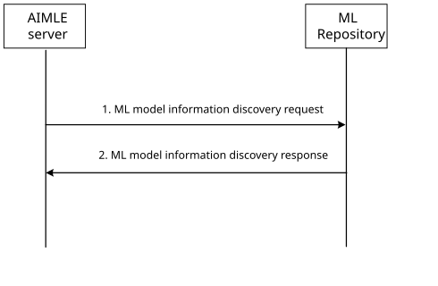

# 8.11 ML model management

## 8.11.1 General

In this functionality, two prodedures are described in more detail in clause 8.11.2 and clause 8.11.3 accordingly:

\- Clause 8.11.2 for ML model information storage;

\- Clause 8.11.3 for ML model information discovery.

## 8.11.2 ML model information storage

### 8.11.2.1 AIMLE server-initiated ML model information storage

Figure 8.11.2.1-1 illustrates the procedure of the AIMLE server-initiated ML model information storage.

Pre-condition:

1\. The AIMLE server has either received application specific model details from AIML consumer or produced analytics model.

Figure 8.11.2.1-1: AIMLE server-initiated ML model information storage

1\. The AIMLE server sends a ML model information storage request to the ML repository to store an ML model. The ML model included in the request is one trained by the ML repository consumer or its information is provisioned to the ML repository consumer. The request contains information elements as described in Table 8.11.4.1-1. The request message may contain Indication of continuous training and continuous training model parameter.

NOTE: The security requirements within the ML model storage requirements are out of scope.

2\. Upon receiving the ML model information storage request, the ML repository verifies if the AIMLE server is authorized to store the ML model identified by ADAE Analytics ID and/or list of the allowed vendors provided within the ML model information attribute. If the AIMLE server is authorized, the ML repository processes the request and records information of the ML model (e.g., by creating a ML model profile). The ML repository sends an ML model information storage response to the AIMLE server with an identifier of the created ML model profile.

### 8.11.2.2 AIMLE consumer-initiated ML model information storage

Figure 8.11.2.2-1 illustrates the procedure of AIMLE consumer-initiated ML model information storage.

Pre-condition:

1\. AIMLE consumer such as AIMLE client or VAL server has ML model or address to ML model.

Figure 8.11.2.2-1: AIMLE consumer-initiated ML model information storage

1\. An AIMLE client or a VAL server sends an ML model information storage request to an AIMLE server to store an ML model in the ML repository. The request includes the information elements as described in Table 8.11.4.1-1.

2\. The AIMLE server sends an ML model information storage request as described in clause 8.11.2.1 to store the ML model in the ML repository.

3\. The AIMLE server sends an ML model information storage response to the AIMLE client or VAL server with the information elements as described in Table 8.11.4.2-1.

## 8.11.3 ML model information discovery

Figure 8.11.3-1 illustrates the procedure of ML model information discovery.

Pre-condition:

1\. Either AIMLE consumer has requested to discover ML model or AIMLE server decides to discover model for training.

Figure 8.11.3-1: ML model information discovery

1\. The AIMLE server sends an ML model information discovery request to the ML repository. The request contains information elements as described in Table 8.11.4.3-1.

2\. Upon receiving the ML model information discovery request, the ML repository verifies if the requestor is authorized to discover the ML model(s) identified by the ML model ID. Further, it verifies whether the requestor is present in the list of allowed vendors or not. If the ML repository consumer is authorized, the ML repository processes the request and discovers the model based on ML model ID, ADAE Analytics ID, Base Model ID, and/or ML model interoperability information.

If the discovery request is for transfer of learning, the ML repository identifies all candidate models matching the domain and required accuracy level.

The ML repository sends the response message to the ML repository consumer. The response includes information of the discovered ML model.

NOTE: When the ML model is within training or re-training phase, the ML model is not available for discovery. The details are indicated within the Result IE in Table 8.11.4.4-1. The training and re-training phase is used during federated learning so that AIML enablement consumer can rely on model repository to get the model details.

> After the AIMLE server receives the response from the ML repository, the AIMLE server determines whether the received ML model satisfy the ML model requirement of the AIMLE server. If not, the AIMLE server needs to continuously train the model to satisfy the ML model requirement based on the AIMLE server capability of supporting continuous training and ML model profile (Indication of continuous model training, continuous training model parameter).

## 8.11.4 Information flows

### 8.11.4.1 ML model information storage request

Table 8.11.4.1-1 describes the information flow from the AIMLE server to the ML repository or from the AIMLE client/VAL server to the AIMLE server as a request for the ML model information storage.

Table 8.11.4.1-1: ML model information storage request

<table>
<colgroup>
<col style="width: 33%" />
<col style="width: 16%" />
<col style="width: 50%" />
</colgroup>
<thead>
<tr class="header">
<th>Information element</th>
<th>Status</th>
<th>Description</th>
</tr>
</thead>
<tbody>
<tr class="odd">
<td>Requestor Identity</td>
<td>M</td>
<td>The identity of the requestor performing the request.</td>
</tr>
<tr class="even">
<td>Security Credentials</td>
<td>
O

(NOTE 1)
</td>
<td>Security credentials of the requestor performing the request.</td>
</tr>
<tr class="odd">
<td>ML model</td>
<td>
O

(NOTE 2)
</td>
<td>The ML model to be stored in the ML repository.</td>
</tr>
<tr class="even">
<td>ML model address</td>
<td>
O

(NOTE 2)
</td>
<td>The address (e.g., a URL or an FQDN) of the ML model file.</td>
</tr>
<tr class="odd">
<td>ML model information</td>
<td>M</td>
<td>Provides information of the ML model, as described in Table 8.11.4.1-2.</td>
</tr>
<tr class="even">
<td colspan="3">
NOTE 1: This information is needed if the requestor is at the VAL service provider domain.

NOTE 2: At least one of these information elements shall be provided.
</td>
</tr>
</tbody>
</table>

Table 8.11.4.1-2: ML model information

<table>
<colgroup>
<col style="width: 33%" />
<col style="width: 16%" />
<col style="width: 50%" />
</colgroup>
<thead>
<tr class="header">
<th>Information element</th>
<th>Status</th>
<th>Description</th>
</tr>
</thead>
<tbody>
<tr class="odd">
<td>ML model identifier</td>
<td>M</td>
<td>An identifier for the ML model</td>
</tr>
<tr class="even">
<td>ADAE Analytics ID</td>
<td>O</td>
<td>Represents ADAE analytics ID for which the model can be used.</td>
</tr>
<tr class="odd">
<td>ML model size</td>
<td>O</td>
<td>Indicates the size of the ML model.</td>
</tr>
<tr class="even">
<td>ML model source identifier</td>
<td>O</td>
<td>The identifier of ML model source (e.g., VAL server ID, VAL client ID) that stored the model in the ML repository.</td>
</tr>
<tr class="odd">
<td>VAL service ID(s)</td>
<td>O</td>
<td>Identify the VAL service ID(s).</td>
</tr>
<tr class="even">
<td>Domain</td>
<td>O</td>
<td>Specifies domain for which the model can be used (e.g., for speech recognition, image recognition, video processing, location prediction, etc.).</td>
</tr>
<tr class="odd">
<td>List of allowed vendors</td>
<td>
O

(NOTE 1)
</td>
<td>Indicates which vendors that are allowed to use the ML model and thereby also are interoperable to the model.</td>
</tr>
<tr class="even">
<td>ML model interoperability information</td>
<td>
O

(NOTE 1)
</td>
<td>Represents the vendor-specific information that conveys, e.g., requested model file format, model execution environment, input/output parameters of the ML model, etc. The encoding, format, and value of ML Model Interoperable Information is not specified since it is vendor specific information, and is agreed between vendors, if necessary for sharing purposes.</td>
</tr>
<tr class="odd">
<td>ML Model phase</td>
<td>
O

(NOTE 1)
</td>
<td>Represents the ML model phase, e.g., in training, trained, re-training, deployed.</td>
</tr>
<tr class="even">
<td>&gt; Observed performance</td>
<td>
O

(NOTE 2)
</td>
<td>Provides information on the performance of the model e.g. accuracy, or application-specific performance metrics (if ML model is in trained or deployment phase).</td>
</tr>
<tr class="odd">
<td>&gt; Training information</td>
<td>
O

(NOTE 2)
</td>
<td>If the ML model is in trained or deployed phase: Information on the data that has been used to train the model (e.g. data sources, volume, freshness), and the base model ID in case of Transfer Learning.</td>
</tr>
<tr class="even">
<td>&gt; Indication of continuous model training</td>
<td>O</td>
<td>Indicates whether the model can be continuously trained or not.</td>
</tr>
<tr class="odd">
<td>&gt; Continuous model training parameter</td>
<td>O</td>
<td>Parameters required for continuous model training.</td>
</tr>
<tr class="even">
<td>ML model storage and discovery requirements</td>
<td>
O

(NOTE 1)
</td>
<td>Represents the requirements for the ML repository for the ML model storage and discovery.</td>
</tr>
<tr class="odd">
<td>&gt; Storage duration</td>
<td>O</td>
<td>Represents the ML model storage duration time. When the storage duration time is expired, the stored ML model and the related information shall be deleted.</td>
</tr>
<tr class="even">
<td>&gt; Security and access requirements</td>
<td>O</td>
<td>Represents the information on security requirements for storing the ML model information and the ML model access requirements (e.g., publicly available, private use only, or available for the list of VAL server IDs or VAL client IDs, time period and location access). If the access requirement is private use only, then the model is not discoverable by other consumers.</td>
</tr>
<tr class="odd">
<td>ML model usage requirements</td>
<td>O</td>
<td>Represents the requirements for using the ML model (e.g. for inference or for training). The requirements are used by the AIMLE server to determine whether an AIMLE client is capable of using the model based on comparing the requirements with information in the AIMLE client profile in Table 8.7.3.1-2.</td>
</tr>
<tr class="even">
<td>Energy consumption information</td>
<td>O</td>
<td>Energy consumption information associated with the ML model.</td>
</tr>
<tr class="odd">
<td>&gt; List of AI/ML operations</td>
<td>M</td>
<td>The AI/ML operations (e.g., ML model training, model transfer, model inference, model offload and model split).</td>
</tr>
<tr class="even">
<td>&gt;&gt; Expected energy budget</td>
<td>M</td>
<td>The expected energy budget (e.g., watt-hour, joules) associated with performing an AI/ML operation. The expected energy budget relates energy consumption values to a VAL UE’s processing capability as described in Table 8.7.3.2-2.</td>
</tr>
<tr class="odd">
<td>Federation information</td>
<td>O</td>
<td>List of information for different federation agreements related to the ML model, in particular the role of other edge/cloud providers in accessing or operating the ML model (or part of it).</td>
</tr>
<tr class="even">
<td>&gt; List of partner ECSPs</td>
<td>O</td>
<td>List of ECSPs that are authorized to receive information of the federated AIML service.</td>
</tr>
<tr class="odd">
<td>&gt;&gt; permissions per ECSP</td>
<td>O</td>
<td>The permissions per ECSP (e.g. model update, model (re-)training, model inference) associated with the ML model.</td>
</tr>
<tr class="even">
<td>&gt;&gt; capabilities per ECSP</td>
<td>O</td>
<td>The capabilities per ECSP associated with the ML model (processing power for training/inference, whether analytics is supported in ECSP platform, energy or load status or constraints or limitations)</td>
</tr>
<tr class="odd">
<td>&gt;&gt; availability time and area per ECSP</td>
<td>O</td>
<td>The availability per ECSP associated with the ML model. This may include the time of availability of the ECSP’s platform for a given area to potentially process/modify/update the ML model as part of the federated AI service.</td>
</tr>
<tr class="even">
<td>ML model deployment information</td>
<td>O</td>
<td>Indicates whether the model is stored and deployed on ground or on satellite.</td>
</tr>
<tr class="odd">
<td colspan="3">
NOTE 1: At least one of these information elements shall be provided.

NOTE 2: This IE is included only if trained ML model is available.
</td>
</tr>
</tbody>
</table>

### 8.11.4.2 ML model information storage response

Table 8.11.4.2-1 describes the information flow from the ML repository to the AIMLE server or from the AIMLE server to the AIMLE client/VAL server as a response for the ML model information storage request.

Table 8.11.4.2-1: ML model information storage response

| Information element         | Status | Description                                                                                          |
|-----------------------------|--------|------------------------------------------------------------------------------------------------------|
| Result                      | M      | Indicates success or failure of the request.                                                         |
| ML model profile identifier | O      | The identifier of the ML model profile created as a result of a successful ML model storage request. |

Table 8.11.4.2-2: ML model profile

| Information element         | Status | Description                                                                                                                 |
|-----------------------------|--------|-----------------------------------------------------------------------------------------------------------------------------|
| ML model profile identifier | M      | The identifier of the ML model profile.                                                                                     |
| AIMLE server identifier     | M      | The identifier of the AIMLE server that stored the ML model.                                                                |
| ML repository identifier    | M      | The identifier of the ML repository where the ML model is stored.                                                           |
| ML model information        | M      | The information about the ML model, as described in Table 8.11.4.1-2.                                                       |
| ML model retrieval endpoint | O      | Represents the ML model retrieval endpoint (e.g., URL, URI, IP address and Port) that can be used to download the ML model. |

### 8.11.4.3 ML model information discovery request

Table 8.11.4.3-1 describes the information flow from the AIMLE server to the ML repository as a request for the ML model information discovery.

Table 8.11.4.3-1: ML model information discovery request

| Information element | Status | Description                                                                                             |
|---------------------|--------|---------------------------------------------------------------------------------------------------------|
| Requester Identity  | M      | The identity of the ML repository consumer performing the request.                                      |
| Filtering criteria  | M      | Represents the filtering criteria, which can be any of the ML model information as in Table 8.11.4.1-2. |

### 8.11.4.4 ML model information discovery response

Table 8.11.4.4-1 describes the information flow from the model repository to the AIMLE server as a response for the ML model information discovery request.

Table 8.11.4.4-1: ML model information discovery response

<table>
<colgroup>
<col style="width: 33%" />
<col style="width: 16%" />
<col style="width: 50%" />
</colgroup>
<thead>
<tr class="header">
<th>Information element</th>
<th>Status</th>
<th>Description</th>
</tr>
</thead>
<tbody>
<tr class="odd">
<td>Successful response</td>
<td>
O

(NOTE 1)
</td>
<td>Indicates that the request was successful.</td>
</tr>
<tr class="even">
<td>&gt; ML model profile list</td>
<td>
O

(NOTE 2)
</td>
<td>Represents the ML model profile(s) of the discovered list of ML models, as described in Table 8.11.4.2-2.</td>
</tr>
<tr class="odd">
<td>&gt;&gt; ML model profile ID</td>
<td>M</td>
<td>Represents the ML model profile ID of the ML model profile.</td>
</tr>
<tr class="even">
<td>&gt; ML model list</td>
<td>
O

(NOTE 2)
</td>
<td>Represents the ML model(s) of the discovered list of ML models.</td>
</tr>
<tr class="odd">
<td>&gt;&gt; ML model ID</td>
<td>M</td>
<td>Represents the ML model ID of the ML model.</td>
</tr>
<tr class="even">
<td>&gt; Indication of continuous model training</td>
<td>O</td>
<td>Indicate whether the model needs to be continuously trained or not.</td>
</tr>
<tr class="odd">
<td>Failure response</td>
<td>
O

(NOTE 1)
</td>
<td>Indicates that the request failed.</td>
</tr>
<tr class="even">
<td>&gt; Cause</td>
<td>O</td>
<td>Indicates the failure cause.</td>
</tr>
<tr class="odd">
<td colspan="3">
NOTE 1: Only one of these information elements shall be provided.

NOTE 2: Only one of these information elements shall be provided.
</td>
</tr>
</tbody>
</table>
