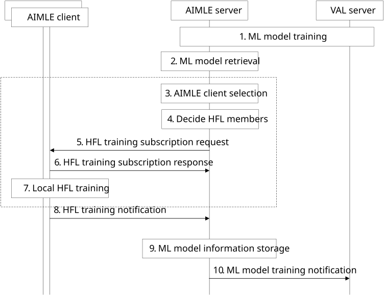
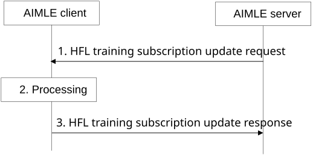
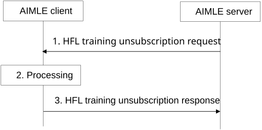

# 8.12 HFL training

## 8.12.1 General

AI/ML training is a highly iterative process and is performed over many training rounds. In the case of federated and distributed learning, the training is performed with many AIMLE clients. Due to the repetitive nature of AI/ML training, the AIMLE server can be configured to manage the training process over multiple training rounds for VAL servers. Note that the HFL training procedure supports horizontal federated learning, distributed learning, transfer learning, and split AI/ML.

The following clauses specify procedures, information flows, and APIs to support HFL training. The procedure for the HFL training is supported for AIMLE server:

\- subscription and notification;

\- subscription update; and

\- unsubscription.

## 8.12.2 Procedure

### 8.12.2.1 HFL training subscription and notification

Pre-conditions:

1\. AIMLE client discovery and selection have been performed.

2\. Datasets are available and prepared for AI/ML training at the AIMLE clients. The datasets are assigned identifiers for use in HFL training.

Figure 8.12.2-1: HFL training subscription and notification

1\. An AIMLE server receives an ML model training request from a VAL server as described in clause 8.3.2. If the AIMLE server determines to use HFL training, the procedure continues to step 2.

2\. The AIMLE server retrieves the indicated ML model using the ML model retrieval procedure as described in clause 8.1.

3\. For the HFL training, the AIMLE server performs AIMLE client selection using the AIMLE client selection criteria or a list of AIMLE clients provided in step 1. If AIMLE client selection criteria are provided in step 1, then the AIMLE server continuously monitors and selects AIMLE clients for the HFL training. If a list of AIMLE clients is provided in step 1, the AIMLE server selects the provided AIMLE clients for the HFL training.

4\. Based on the AIMLE client set determined in step 3, the AIMLE server checks with the selected AIMLE clients for their capability and participation in the HFL training as described in the clause 8.10.

5\. The AIMLE server configures training schedule for each of the AIMLE client and sends a HFL training subscription request with information as described in Table 8.12.3.1-1.

6\. Each AIMLE client sends a HFL training subscription response with information as described in Table 8.12.3.2-2. If the AIMLE client is not able to grant the subscription (e.g., is not able to perform the training), the AIMLE client sends a response with a failure status and the procedure skips to step 8.

7\. Each AIMLE client performs local training using the configured AI/ML model, model parameters, and the prepared local data associated with the dataset identifier for the specified number of samples according to the operational schedule.

8\. Upon completion or due to errors in the training, each AIMLE client sends a HFL training notification to the AIMLE server. The notification includes information as described in Table 8.12.3.1-3. The AIMLE client provides an VAL service ID for the HFL training operation.

9\. If errors were encountered, the procedure skips to step 10.

If training was successful, the AIMLE server aggregates (e.g. averages) the model parameters received from the AIMLE clients.

If the training schedule is not complete (e.g., there are remaining training rounds), the AIMLE server configures the next set of training schedules and steps 3 to 8 are repeated for the next training round.

When the training schedule has been exhausted (e.g. there are no remaining training round) and if configured, the AIMLE server makes a ML model information storage request as described in clause 8.11.2 to store the AI/ML model in the ML repository.

10\. The AIMLE server sends a ML model training notification to the VAL server as described in clause 8.3.2.

### 8.12.2.2 HFL training subscription update

Pre-conditions:

\- The AIMLE server has subscribed for the HFL training with the AIMLE client.

Figure 8.12.2-2: HFL training subscription update

1\. The AIMLE server sends the HFL training subscription update request containing the subscription identifier and new information as described in Table 8.12.3.1-4 to the AIMLE Client.

2\. Upon receiving the request from the AIMLE server, the AIMLE client validates if the AIMLE server is authorized for the request. If the AIMLE server is authorized, the AIMLE client updates the HFL training subscription.

3\. The AIMLE client sends the HFL training subscription update response to the AIMLE server. If the AIMLE client has updated the HFL training subscription, the response includes an indication of success. Otherwise, the response includes an indication of failure and may include a reason for failure.

### 8.12.2.3 HFL training unsubscription

Pre-conditions:

\- The AIMLE server has subscribed for the HFL training with the AIMLE client.

Figure 8.12.2-3: HFL training unsubscription

1\. The AIMLE server sends the HFL training unsubscription request containing the subscription identifier to the AIMLE Client.

2\. Upon receiving the request from the AIMLE server, the AIMLE client validates if the AIMLE server is authorized for the request. If the AIMLE server is authorized, the AIMLE client unsubscribe the HFL training subscription.

3\. The AIMLE client sends the HFL training unsubscription response to the AIMLE server. If the AIMLE client has unsubscribed the HFL training subscription, the response includes an indication of success. Otherwise, the response includes an indication of failure and may include a reason for failure.

## 8.12.3 Information flows

### 8.12.3.1 HFL training subscription request

Table 8.12.3.1-1 shows the request sent by the AIMLE server to AIMLE clients for the HFL training subscription and HLF training subscription update procedure.

Table 8.12.3.1-1: HFL training subscription request

<table>
<colgroup>
<col style="width: 33%" />
<col style="width: 12%" />
<col style="width: 53%" />
</colgroup>
<thead>
<tr class="header">
<th>Information element</th>
<th>Status</th>
<th>Description</th>
</tr>
</thead>
<tbody>
<tr class="odd">
<td>Requestor identifier</td>
<td>M</td>
<td>The identifier of the requestor.</td>
</tr>
<tr class="even">
<td>AI/ML model and model parameters</td>
<td>
M

(NOTE)
</td>
<td>Information about the AI/ML model, model parameters, current HFL training iteraction (to inform the client about current training iteration ongoing) and performance tracker (i.e. performance metrics, such as accuracy, etc.), for use in HFL training.</td>
</tr>
<tr class="odd">
<td>Dataset identifier</td>
<td>
M

(NOTE)
</td>
<td>The dataset identifier associated with the dataset used for HFL training.</td>
</tr>
<tr class="even">
<td>Number of data samples</td>
<td>
M

(NOTE)
</td>
<td>The number of data samples required for a round of HFL training.</td>
</tr>
<tr class="odd">
<td>Operational schedule</td>
<td>O</td>
<td>A schedule for when training is to occur.</td>
</tr>
<tr class="even">
<td>Notification settings</td>
<td>O</td>
<td>Settings for how often to send notifications providing status of HFL training. For example, periodic, event- triggered (e.g. based on percentage completion), upon completion of each training round.</td>
</tr>
<tr class="odd">
<td colspan="3">NOTE: These IEs are optional in HFL training subscription update procedure.</td>
</tr>
</tbody>
</table>

### 8.12.3.2 HFL training subscription response

Table 8.12.3.2-1 shows the response sent by AIMLE clients to the AIMLE server for the HFL training subscription procedure.

Table 8.12.3.2-1: HFL training subscription response

| Information element | Status | Description                                                       |
|---------------------|--------|-------------------------------------------------------------------|
| Status              | M      | The status for the subscription request: success, fail.           |
| Subscription ID     | O      | An identifier for the subscription only if the status is success. |
| VAL service ID      | M      | The VAL service identifier for the AIMLE HFL training operation.  |

### 8.12.3.3 HFL training subscription notification

Table 8.12.3.3-1 shows the notification sent by AIMLE clients to the AIMLE server for the HFL training subscription procedure.

Table 8.12.3.3-1: HFL training subscription notification

| Information element               | Status | Description                                                                                                                            |
|-----------------------------------|--------|----------------------------------------------------------------------------------------------------------------------------------------|
| Status                            | M      | Status for the request: success, fail.                                                                                                 |
| VAL service ID                    | M      | The VAL service identifier for the AIMLE HFL training operation.                                                                       |
| HFL training output               | M      | ML model parameters from HFL training.                                                                                                 |
| \> Performance records            | O      | The evaluation performance records (e.g. on accuracy, on latency) of received aggregated global model from AIMLE Server on local data. |
| \> ML model evaluation profile ID | O      | The identifier of the ML model evaluation profile used to perform the performance evaluation.                                          |
| Errors list                       | O      | A list of errors encountered during a HFL training round.                                                                              |
| Timestamp                         | O      | A timestamp for the notification.                                                                                                      |
