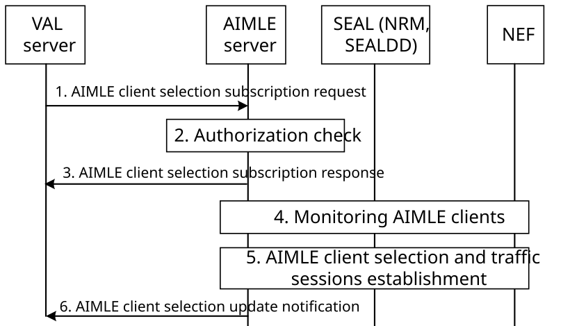
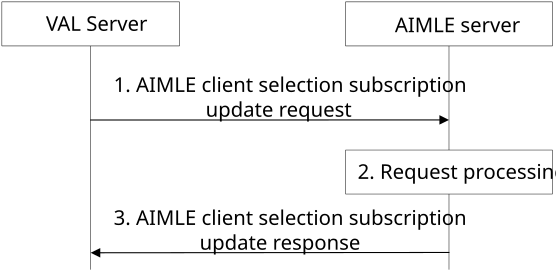
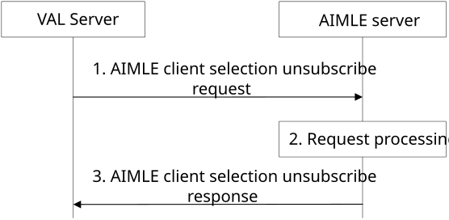

# 8.13 AIMLE client selection subscription and notification

## 8.13.1 General

AIMLE client selection subscription request and notification enable requestors (e.g. VAL Servers, AIMLE server) to subscribe for monitoring and selection of AIMLE clients and receive notification when there is an update on the selected and re-selected AIMLE client’s status when re-selection is performed according to AIML member selection criteria.

When permitted by policy/federation agreement, the serving AIMLE server may establish a selection subscription with partner AIMLE server(s) in another domain/PLMN over AIML-E to monitor selected AIMLE clients in that domain/PLMN and support re-selection

The AIMLE server interacts with the NEF and/or SEAL services to monitor AIML members who meet the selection criteria and obtain their identifiers and configuring the AIML traffic session(s) between the VAL Server and the VAL client associated with the selected AIMLE Client(s) who meet the criteria. When the AIMLE clients no more meet the criteria, the QoS adjustment is reversed.

The subscription may also be updated when the VAL Server's requirements change, ensuring that it remains relevant and accurate. The VAL server may also unsubscribe when the subscription is no longer needed so that the AIMLE Server terminates monitoring of AIMLE clients and reverses QoS adjustments.

## 8.13.2 Procedures

### 8.13.2.1 General

The following are supported for AIMLE client selection subscription and notification :

\- AIMLE client selection subscription and notification;

\- AIMLE client selection subscription update; and

\- AIMLE client selection unsubscribe

### 8.13.2.2 AIMLE client selection subscription and notification

Figure 8.13.2.2-1: AIMLE client selection subscription and notification

1\. A requestor (e.g. VAL server) sends an AIMLE client selection subscription request to the AIMLE Server. The AIMLE client selection subscription request includes information as described in Table 8.13.3.2-1 which includes selection criteria.

2\. The AIMLE server validates the AIMLE client selection subscription request. The AIMLE server further performs authentication and authorization checks to determine if the requestor is able to subscribe to the selected AIMLE client selection subscription request.

> 3\. The AIMLE server sends the AIMLE client selection subscription response to the VAL server.

4\. The AIMLE server monitors AIMLE clients whether they fulfil the selection criteria as provided in step 1. The AIMLE server interacts with the NEF and/or SEAL services (including SEALDD) to establish monitoring. The AIMLE server utilizes SEAL-LMS (as in 3GPP TS 23.434 \[5\] clause 9.3.11, or 3GPP TS 23.434 \[5\] clause 9.3.12) or 3GPP 5G Core Network Services (such as GMLC as in 3GPP TS 23.273 \[13\] and NEF as in 3GPP TS 23.273 \[13\] or 3GPP TS 23.502 \[9\]) to establish monitoring of UEs entering or present in the target location provided in the location information in the selection criteria.

> If the serving AIMLE server determines that monitoring and selection of AIMLE clients in another domain/PLMN is needed to satisfy the selection criteria (e.g. insufficient suitable AIMLE clients in the serving domain/PLMN), the serving AIMLE server may identify a partner AIMLE server in that domain/PLMN and establish an AIMLE client selection subscription with the partner AIMLE server over AIML-E for the remaining AIMLE clients, using the selection criteria provided in step 1 (subject to policy/federation agreement).

The partner AIMLE server monitors AIMLE clients in its domain/PLMN and notifies the serving AIMLE server of selected and de-selected AIMLE clients and related status updates according to the subscription.

5\. The AIMLE Server obtains the identifiers of the AIMLE clients from the monitoring and/or from notifications received from partner AIMLE server(s) (when applicable) and selects the clients that fulfil the selection criteria and remove the AIMLE clients which do not fulfil the selection criteria. The AIMLE server and/or the partner AIMLE server(s) use the location monitoring for selecting UEs that fulfil the location criteria and removing UEs which cease to fulfil the location criteria as provided in the location information in the AIMLE client selection criteria. The AIMLE Server and/or the partner AIMLE server(s) may determine the application QoS parameters (e.g. bandwidth, latency, jitter) for the AIML traffic session between the VAL server and the VAL client associated with the selected AIMLE client and configure the AIML traffic session(s) via SEALDD (Sdd_RegularTransmission API) or NEF services (AfSessionWithQoS API). When the AIMLE clients no more meet the criteria, the QoS adjustment is reversed.

The AIMLE server and/or the partner AIMLE server(s) may determine the application QoS parameters based on the VAL Service ID.

The AIMLE server retrieves a list of ML model information from the ML repository based on energy consumption requirements using the ML model information discovery procedure as described in clause 8.11.3. The AIMLE server uses information from the AIMLE client selection criteria as filtering criteria for ML model information discovery.

The AIMLE server selects candidate AIMLE clients that can fulfill the expected energy consumption needs of the ML model. The expected energy consumption needs are based on the requested AI/ML operations and on the AIMLE client'sprocessing capability.

> The AIMLE server identifies and selects ML models and candidate AIMLE clients that can perform the requested AI/ML operations without exceeding the maximum energy budget.

If a desired service in the selection criteria is ceased to be provided by the client or its profile change so that it no longer meets the selection criteria, the AIMLE server and/or the partner AIMLE server(s) removes the AIMLE clients which ceases to fulfil the criteria and selects other clients that fulfil selection criteria.

NOTE 1: To determine the application QoS parameters based on the VAL service ID, the AIMLE server can use the VAL service ID associated AIMLE client QoS requirements in the AIMLE client selection criteria provided in step 1.

NOTE 2: In case of AIMLE server determining the application QoS parameters based on the VAL service ID, how it does this is up to implementation.

6\. The AIMLE Server notifies the requestor (e.g. the VAL server) about the selected and re-selected AIMLE clients e.g., the AIMLE Client A is de-selected and replaced by AIMLE Client B.

### 8.13.2.3 AIMLE client selection subscription update

Figure 8.13.2.3-1 illustrates the procedure for an VAL server to update a subscription with the AIMLE server.

Pre-conditions:

1\. The AIMLE client or VAL server has subscribed for AIMLE client selection with the AIMLE Server.

Figure 8.13.2.3-1: AIMLE client selection subscription update

1\. A VAL server sends a AIMLE client selection subscription update request to the AIMLE server. The AIMLE client selection subscription update request includes the subscription identifier and may include information as described in Table 8.13.3.w-1 for updated subscription.

2\. Upon receiving the request from the VAL server, the AIMLE server validates if the VAL server is authorized for the request. If the VAL server is authorized, the AIMLE server updates the subscription.

3\. The AIMLE server sends a AIMLE client selection subscription update response to the VAL server. If the AIMLE server has updated the subscription, the response includes an indication of success. If the AIMLE server has not updated the subscription, the response includes an indication of failure and may include a reason for failure.

> If the subscription update request in step 1 include updated information as in Table 8.13.3.w-1, the AIMLE server also adjusts step 4 and 5 as in clause 8.13.2.2 based on the updated information in the subscription update.

### 8.13.2.4 AIMLE client selection unsubscribe

Figure 8.13.2.4-1 illustrates the procedure for a VAL server to unsubscribe with the AIMLE server.

Pre-conditions:

1\. The VAL server has subscribed for AIMLE client selection with the AIMLE Server.

Figure 8.13.2.4-1: AIMLE client selection unsubscribe

1\. A VAL server sends a AIMLE client selection unsubscribe request to the AIMLE server. The request includes the subscription identifier.

2\. Upon receiving the request from the requestor, the AIMLE server validates if the VAL server is authorized for the request. If the VAL is authorized, the AIMLE server unsubscribes the subscription.

3\. The AIMLE server sends a AIMLE client selection unsubscribe response to the VAL server. If the AIMLE server has unsubscribed the subscription, the response includes an indication of success. If the AIMLE server has not unsubscribed the subscription, the response includes an indication of failure and may include a reason for failure.

> If the AIMLE server has successfully unsubscribed the subscription, it also cancels its corresponding subscriptions with the NEF and/or SEAL services (including SEALDD) associated with the subscription. Additionally, the AIMLE server reverses the QoS adjustments performed as described in step 5 of clause 8.13.2.2.

## 8.13.3 Information flows

### 8.13.3.1 General

The following information flows are specified for AIMLE client registration:

\- AIMLE client selection subscription and notification request and response;

\- AIMLE client selection subscription update request and response; and

\- AIMLE client selection unsubscribe request and response

### 8.13.3.2 AIMLE client selection subscription request

Table 8.13.3.2-1 shows the request sent by a requestor (e.g., VAL server, AIMLE server) to an AIMLE server for the Selected AIMLE Client selection subscription.

Table 8.13.3.2-1: AIMLE client selection subscription request

| Information element                                   | Status | Description                                                                                                                                                                      |
|-------------------------------------------------------|--------|----------------------------------------------------------------------------------------------------------------------------------------------------------------------------------|
| Requestor identity                                    | M      | The identifier of the requestor (e.g., VAL server, AIMLE server).                                                                                                                |
| AIMLE client selection criteria                       | M      | Selection criteria for finding suitable AIMLE clients for AIML operations as detailed in per clause 8.8.3.1-2.                                                                   |
| Number of the required AIML clients                   | O      | Indicates the requested number of AIML clients to be selected based on member selection policies.                                                                                |
| Notification endpoint for the selected AIMLE Client’s | M      | Represents the endpoint at the requestor (e.g., VAL server or AIMLE server) for receiving the notifications on the selected AIMLE Client’s status update.                        |
| Federation indication                                 | O      | Indicates whether federation with other AIMLE server(s) in another PLMN/domain may be used to satisfy the selection/monitoring criteria, subject to policy/federation agreement. |

### 8.13.3.3 AIMLE client selection subscription response

Table 8.13.3.3-1 shows the response sent by the AIMLE server to the VAL server for the selected AIMLE client selection subscription response.

Table 8.13.3.3-1: AIMLE client selection subscription response

<table>
<colgroup>
<col style="width: 33%" />
<col style="width: 16%" />
<col style="width: 50%" />
</colgroup>
<thead>
<tr class="header">
<th>Information element</th>
<th>Status</th>
<th>Description</th>
</tr>
</thead>
<tbody>
<tr class="odd">
<td>Successful response</td>
<td>
O

(NOTE)
</td>
<td>Indicates that the subscription was successful.</td>
</tr>
<tr class="even">
<td>&gt; Subscription ID</td>
<td>M</td>
<td>The identifier of the subscription.</td>
</tr>
<tr class="odd">
<td>&gt; Expiration time</td>
<td>O</td>
<td>
Indicates the expiration time of the updated subscription. To maintain an active subscription status, a subscription update is required before the expiration time.

If the Expiration time IE is not included, it indicates that the updated subscription never expires.
</td>
</tr>
<tr class="even">
<td>Failure response</td>
<td>
O

(NOTE)
</td>
<td>Indicates that the subscription request failed.</td>
</tr>
<tr class="odd">
<td>&gt; Cause</td>
<td>O</td>
<td>Indicates the cause of subscription request failure</td>
</tr>
<tr class="even">
<td colspan="3">NOTE: One of the IEs shall be present.</td>
</tr>
</tbody>
</table>

### 8.13.3.4 AIMLE client selection update notification

Table 8.13.3.4-1 shows the notification sent by the AIMLE Server to the VAL server for the AIMLE client selection update notification.

Table 8.13.3.4-1: AIMLE client selection update notification

| Information element                                    | Status | Description                                                                                                                                |
|--------------------------------------------------------|--------|--------------------------------------------------------------------------------------------------------------------------------------------|
| Requestor ID                                           | M      | The identifier of the requestor.                                                                                                           |
| List of the selected AIMLE Client status update events | M      | Represents the list of selected AIMLE Client status update events, e.g., the AIMLE Client A is de-selected and replaced by AIMLE Client B. |

### 8.13.3.5 AIMLE client subscription update request

Table 8.13.3.5-1 shows the request sent by a VAL server to an AIMLE server for the AIMLE client selection subscription update request.

Table 8.13.3.5-1: AIMLE client selection subscription update request

| Information element                                   | Status | Description                                                                                                             |
|-------------------------------------------------------|--------|-------------------------------------------------------------------------------------------------------------------------|
| Subscription ID                                       | M      | Identifier of the existing subscription for which the update request applies.                                           |
| AIMLE client selection criteria                       | O      | Selection criteria for finding suitable AIMLE clients for AIML operations as detailed in per clause 8.8.3.1-2.          |
| Number of the required AIML clients                   | O      | Indicates the requested number of AIML clients to be selected based on member selection policies.                       |
| Notification endpoint for the selected AIMLE Client’s | O      | Represents the endpoint at the VAL server for receiving the notifications on the selected AIMLE Client’s status update. |

### 8.13.3.6 AIMLE client selection subscription update response

Table 8.13.3.6-1 shows the AIMLE client selection subscription update response sent by the AIMLE server to the VAL server.

Table 8.13.3.6-1: AIMLE client selection subscription update response

<table>
<colgroup>
<col style="width: 33%" />
<col style="width: 16%" />
<col style="width: 50%" />
</colgroup>
<thead>
<tr class="header">
<th>Information element</th>
<th>Status</th>
<th>Description</th>
</tr>
</thead>
<tbody>
<tr class="odd">
<td>Successful response</td>
<td>
O

(NOTE)
</td>
<td>Indicates that the subscription update request was successful.</td>
</tr>
<tr class="even">
<td>&gt; Expiration time</td>
<td>O</td>
<td>
Indicates the expiration time of the updated subscription. To maintain an active subscription status, a subscription update is required before the expiration time.

If the Expiration time IE is not included, it indicates that the updated subscription never expires.
</td>
</tr>
<tr class="odd">
<td>Failure response</td>
<td>
O

(NOTE)
</td>
<td>Indicates that the subscription update request failed.</td>
</tr>
<tr class="even">
<td>&gt; Cause</td>
<td>O</td>
<td>Indicates the cause of subscription update request failure.</td>
</tr>
<tr class="odd">
<td colspan="3">NOTE: One of the IEs shall be present.</td>
</tr>
</tbody>
</table>

### 8.13.3.7 AIMLE client selection unsubscribe request

Table 8.13.3.7-1 shows the request sent by a VAL server to an AIMLE server for the AIMLE client selection unsubscribe request.

Table 8.13.3.7-1: AIMLE client selection unsubscribe request

| Information element | Status | Description                                                                        |
|---------------------|--------|------------------------------------------------------------------------------------|
| Subscription ID     | M      | Identifier of the existing subscription for which the unsubscribe request applies. |

### 8.13.3.8 AIMLE client selection unsubscribe response

Table 8.13.3.8-1 shows the AIMLE client selection unsubscribe response sent by the AIMLE server to the VAL server.

Table 8.13.3.8-1: AIMLE client selection unsubscribe response

<table>
<colgroup>
<col style="width: 33%" />
<col style="width: 16%" />
<col style="width: 50%" />
</colgroup>
<thead>
<tr class="header">
<th>Information element</th>
<th>Status</th>
<th>Description</th>
</tr>
</thead>
<tbody>
<tr class="odd">
<td>Successful response</td>
<td>
O

(NOTE)
</td>
<td>Indicates that the unsubscribe request was successful.</td>
</tr>
<tr class="even">
<td>Failure response</td>
<td>
O

(NOTE)
</td>
<td>Indicates that the unsubscribe request failed.</td>
</tr>
<tr class="odd">
<td>&gt; Cause</td>
<td>O</td>
<td>Indicates the cause of unsubscribe request failure.</td>
</tr>
<tr class="even">
<td colspan="3">NOTE: One of the IEs shall be present.</td>
</tr>
</tbody>
</table>
