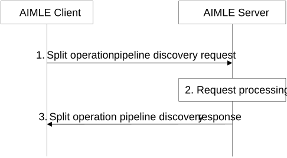

# 8.14.2.2 Split operation pipeline discovery

Figure 8.14.2.2-1 illustrates the procedure for an AIMLE client to discover instance(s) of split AI/ML operation pipeline or processing nodes from the AIMLE server.

Pre-conditions:

1\. The AIMLE client has received information (e.g. URI, IP address) related to the AIMLE Server;

2\. The AIMLE client has received security credentials authorizing it to communicate with the AIMLE server;

Figure 8.14.2.2-1: Split operation pipeline discovery

1\. The AIMLE client sends split operation pipeline discovery request to the AIMLE server; the request may be based on a VAL client requirement(s) and the split operation request includes information defined in Table 8.14.3.2-1.

2\. Upon receiving the request from the AIMLE client, the AIMLE server validates if the requestor is authorized for the request. If the requestor is authorized, the AIMLE server may determine if existing instance(s) of a split operation pipeline satisfy the request parameters. If the AIMLE server determines existing instance(s) of split operation pipeline, the AIMLE server may proceed to step 3.

> If no instance of a split operation pipeline satisfies the request parameters, the AIMLE server determines if an instance of a split operation pipeline can be created. The determination for split operation pipeline creation is based on availability of ML models and determination of available processing nodes (e.g., VAL server(s), NWDAF(s), etc.) to execute operations for such ML models (e.g., inference). VAL server nodes register with the AIMLE server to indicate their availability and capabilities as described in clause 8.14.2.4. If the AIMLE server determines that an instance of a split operation pipeline can be created, the AIMLE server creates a split operation profile accordingly as defined in Table 8.14.3.3-2.

3\. The AIMLE server sends a split operation pipeline discovery response to the requestor. If the AIMLE server has determined instance(s) of split operation pipeline (e.g., existing, or new), the response includes an indication of success and includes the corresponding split operation profile(s). Otherwise, the response includes an indication of failure and may include a reason for failure.

Upon receiving a response including split operation profile(s), the AIMLE client stores the discovered split operation profile(s). The AIMLE client provides split operation profile information (e.g. endpoints, usage, etc.) to VAL client(s). The VAL client may use the provided information to access the split operation pipeline.

If the VAL client is a data provider, the VAL client may use the endpoint information to send data (e.g., intermediate inference data) towards the split operation pipeline instance’s head endpoint.

If the VAL client is a data consumer, the VAL client may use the endpoint information to request results or subscribe to results from the split operation pipeline instance’s tail endpoint.
