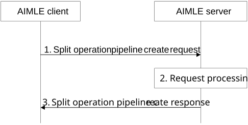

# 8.14.2.3 Split operation pipeline creation

Figure 8.14.2.3-1 illustrates the procedure for an AIMLE client to create an instance of a split operation pipeline at the AIMLE server. If the required number of nodes are not discovered in using the discovery procedure (i.e., the number of nodes in the discovery response message are less than the required minimum number of nodes), then the AIML enablement client can discover the remaining required processing nodes from other AIMLE server(s).

Pre-conditions:

1\. The AIMLE client has received information (e.g. URI, IP address) related to the AIMLE Server;

2\. The AIMLE client has received security credentials authorizing it to communicate with the AIMLE server;

3\. The AIMLE client has discovered information about processing nodes available with the AIMLE server;

4\. The VAL client (along with the AIMLE client) selects the nodes, which can take part in the split operation and decides the order in which nodes should perform the split operation inference.

Figure 8.14.2.3-1: Split operation pipeline creation

1\. The AIMLE client sends a split operation pipeline create request to the AIMLE server. The request includes information defined in Table 8.14.3.4-1.

2\. Upon receiving the request from the AIMLE client, the AIMLE server validates if the requestor is authorized for the request. If the requestor is authorized, the AIMLE server validates if the requested split operation pipeline can be created based on the information included in the request.

If the requestor is authorized and the AIMLE server has determined that an instance of a split operation pipeline can be created, the AIMLE server creates a split operation profile along with its identifier and notifies the appropriate processing nodes indicated in the request about their inclusion in the split operation pipeline as described in clause 8.14.2.5.

3\. The AIMLE server sends a split operation pipeline create response message to the AIMLE client. If the AIMLE server has created an instance of a split operation pipeline, the response includes an indication of success, and the corresponding split operation profile. Otherwise, the response includes an indication of failure and may include a reason for failure.

Upon receiving a response including a split operation profile, the AIMLE client can store the split operation profile. The AIMLE client provides split operation profile information to VAL client(s). Split operation profile information can be used to access the split operation as described in clause 8.14.2.2.
