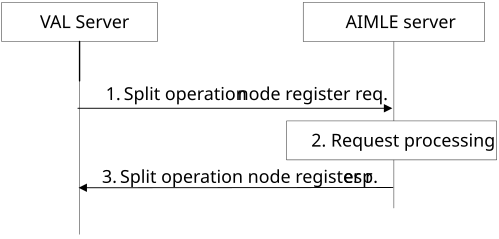
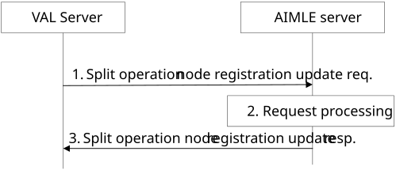
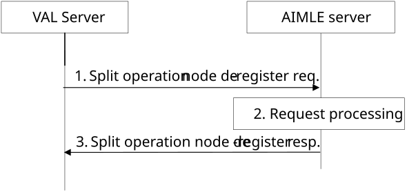

# 8.14.2.4 Split operation node registration

## 8.14.2.4.1 General

Clause 8.14.2.4.2 illustrates the split operation node registration procedure.

Clause 8.14.2.4.3 illustrates the split operation node registration update procedure.

Clause 8.14.2.4.4 illustrates the split operation node de-registration procedure.

## 8.14.2.4.2 Split operation node registration

Figure 8.14.2.4.2-1 illustrates the procedure for VAL server to register with the AIMLE server to indicate split operation capabilities.

Pre-conditions:

1\. The VAL server has received information (e.g. URI, IP address) related to the AIMLE Server;

2\. The VAL server has received security credentials authorizing it to communicate with the AIMLE server;

Figure 8.14.2.4.2-1: Split operation node registration

1\. The VAL server sends a split operation node register request to the AIMLE server to indicate the split operation capabilities of the VAL server. The request includes information defined in Table 8.14.3.6-1.

2\. Upon receiving the request from the VAL server, the AIMLE server validates if the requestor is authorized for the request, the AIMLE server stores the registration information.

3\. The AIMLE server sends a split operation node register response to the requestor. If the AIMLE server has registered the requestor, the response includes an indication of success and may include an updated expiration time. The requestor shall send a registration update request before the expiration time to maintain the registration; otherwise, the split operation node registration expires. If the requestor was not registered, the response includes an indication of failure and may include a reason for failure.

## 8.14.2.4.3 Split operation node registration update

Figure 8.14.2.5-1 illustrates the procedure for VAL server to update a split operation node registration with the AIMLE server.

Pre-conditions:

1\. The VAL server has registered with the AIMLE Server.

Figure 8.14.2.4.3-1: Split operation node registration update

1\. The VAL server sends a split operation node registration update request to the AIMLE server to update an existing split operation registration. The request includes information defined in Table 8.14.3.8-1.

2\. Upon receiving the request from the VAL server, the AIMLE server validates if the requestor is authorized for the request. If the requestor is authorized, the AIMLE server updates the registration information.

3\. The AIMLE server sends a split operation node registration update response to the requestor. If the AIMLE server has successfully updated the registration, the response includes an indication of success and may include an updated expiration time. The requestor shall send a registration update request before the expiration time to maintain the registration; otherwise, the split operation registration expires. If the registration was not updated, the response includes an indication of failure and may include a reason for failure.

## 8.14.2.4.4 Split operation node de-registration

Figure 8.14.2.4.4-1 illustrates the procedure for VAL server to de-register for split operation with the AIMLE server.

Pre-conditions:

1\. The VAL server has registered with the AIMLE Server.

Figure 8.14.2.4.4-1: Split operation node de-registration

1\. The VAL server sends a split operation node de-register request to the AIMLE server. The request includes information defined in Table 8.14.3.10-1.

2\. Upon receiving the request from the VAL server, the AIMLE server validates if the requestor is authorized for the request. If the requestor is authorized, the AIMLE server terminates the registration for split operation.

3\. The AIMLE server sends a split operation node de-register response to the requestor. If the AIMLE server has successfully terminated the registration for split operation node, the response includes an indication of success. If the registration for split operation was not terminated, the response includes an indication of failure and may include a reason for failure.
