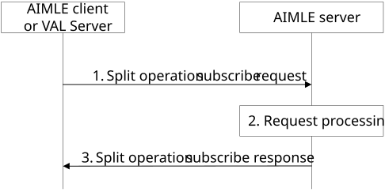
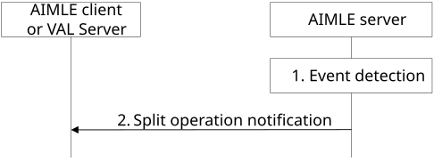
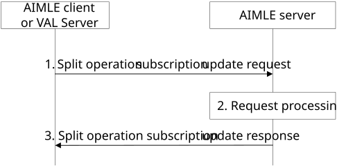
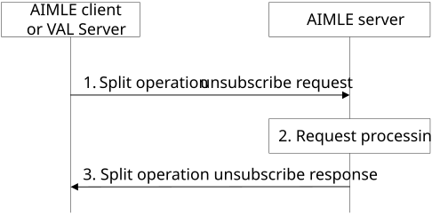

# 8.14.2.5 Split operation event subscription

## 8.14.2.5.1 General

Clause 8.14.2.5.2 and clause 8.14.2.5.3 together illustrate the split operation subscribe/notify model.

Clause 8.14.2.5.4 illustrates the split operation subscription update procedure.

Clause 8.14.2.5.5 illustrates the split operation unsubscribe procedure.

## 8.14.2.5.2 Subscribe

Figure 8.14.2.5.2-1 illustrates the procedure for an AIMLE client or VAL server to subscribe with the AIMLE server to be notified of events related to split AI/ML operation.

Pre-conditions:

1\. The AIMLE client or VAL server has received information (e.g. URI, IP address) related to the AIMLE Server;

2\. The AIMLE client or VAL server has received security credentials authorizing it to communicate with the AIMLE server;

Figure 8.14.2.5.2-1: Split operation subscription

1\. The requestor (e.g., AIMLE client or VAL server) sends a split operation subscribe request to the AIMLE server. The request includes information defined in Table 8.14.3.12-1.

a\. The requestor (e.g., AIMLE client or VAL server) may include the "split operation pipeline information" event to indicate the AIMLE server to notify the requestor when a split operation profile is created or an existing pipeline is updated (e.g., node is added or removed, stage order or ML models are modified, etc.) or deleted and satisfy the discovery filters of the subscription request.

b\. The requestor (e.g., AIMLE client or VAL server) may include the " split operation assistance information" event to indicate the AIMLE server to notify the requestor when the AIMLE server determines assistance information related to the split operation usage.

2\. Upon receiving the request from the requestor, the AIMLE server validates if the requestor is authorized for the request. If the requestor is authorized, the AIMLE server creates the subscription and stores the subscription information.

3\. The AIMLE server sends a split operation subscribe response to the requestor. If the AIMLE server has created the subscription, the response includes an indication of success, the subscription identity and may include an expiration time; to maintain the subscription, the requestor shall send a subscription update request before the expiration time, otherwise the split operation subscription expires. If the AIMLE server has not created the subscription, the response includes an indication of failure and may include a reason for failure.

If the subscription is for "assistance information", the AIMLE Server considers the assistance information included in the subscription request and can perform the following:

The AIMLE Server aggregates the collected assistance information from NEF, NWDAF, and/or ADAES to generate assistance information, e.g. Time (time point(s) or time window(s)) to deliver the task or data for the split operation. Or the AIMLE server performs inference using ML model to generate assistance information, e.g. achievable QoS with current configuration for task or data delivery, or suggestion of QoS for task or data delivery.

> \- For assistance information from NEF, the AIMLE Server, acting as AF, sends a request to NEF for assistance information (e.g. PDTQ on recommended time windows for AI/ML operations with QoS, QoS monitoring) as described in clause 4.16.15 of 3GPP TS 23.502 \[9\]. The request may include the information of the AI/ML task/ML model/data (e.g. size of the task or ML model, or data volume), information of the receiving nodes, requirement on the delivery/distribution (e.g. time budget, time critical or not, QoS), maximum time for complete the distribution/delivery.
>
> \- For assistance information from NWDAF, the AIMLE Server can send a request or subscription request to NWDAF for analytics (e.g. E2E data volume transfer time, DN performance, Network performance, UE mobility). The details parameters in the requests to NWDAF for analytics are given in 3GPP TS 23.288 \[2\].
>
> \- For assistance information from ADAES, the AIMLE Server can send a request or subscription request to ADAES for analytics (e.g. slice-specific application performance analytics, UE-to-UE application performance analytics). The details parameters in the requests to ADAES for analytics are given in 3GPP TS 23.436 \[4\].

## 8.14.2.5.3 Notify

Figure 8.14.2.5.3-1 illustrates the split operation notify operation between the AIMLE server and an AIMLE client or VAL server.

Pre-conditions:

2\. The AIMLE client or VAL server has subscribed for split operation with the AIMLE Server;

Figure 8.14.2.5.3-1: Split operation notification

1\. The AIMLE server detects event(s) that satisfies trigger conditions for notifying a subscriber (e.g., AIMLE client or VAL server) according to subscribed events.

a\. If the subscribed event is for "split operation pipeline information" and the AIMLE server detects that a new split operation profile is created or an existing pipeline is updated (e.g., node is added or removed, stage order or ML models are modified, etc.) or deleted and satisfy the discovery filters of the subscription, the AIMLE server notifies the subscriber (e.g., AIMLE client or VAL server) accordingly;

b\. If the subscribed event is for "split operation assistance information" and the AIMLE server has determined assistance information related to split operation usage, the AIMLE server notifies the subscribers (e.g., AIMLE client or VAL server) accordingly.

2\. The AIMLE server sends a split operation notification to the requestor indicating the event. The notification includes a subscription identity and may include a split operation profile(s), split operation node information, or split operation assistance information dependent on the associated event.

## 8.14.2.5.4 Subscription update

Figure 8.14.2.5.4-1 illustrates the procedure for an AIMLE client or VAL server to update a subscription with the AIMLE server.

Pre-conditions:

2\. The AIMLE client or VAL server has subscribed for split operation with the AIMLE Server;

Figure 8.14.2.5.4-1: Split operation subscription update

1\. The requestor (e.g., AIMLE client or VAL server) sends a split operation subscription update request to the AIMLE server. The request includes information defined in Table 8.14.3.15-1.

2\. Upon receiving the request from the requestor, the AIMLE server validates if the requestor is authorized for the request. If the requestor is authorized, the AIMLE server updates the subscription information.

3\. The AIMLE server sends a split operation subscription update response to the requestor. If the AIMLE server has updated the subscription, the response includes an indication of success and may include an expiration time. To maintain the subscription, the requestor shall send a subscription update request before the expiration time, otherwise the split operation subscription expires. If the AIMLE server has not updated the subscription, the response includes an indication of failure and may include a reason for failure.

## 8.14.2.5.5 Unsubscribe

Figure 8.14.2.5.5-1 illustrates the procedure for an AIMLE client or VAL server to unsubscribe with the AIMLE server.

Pre-conditions:

1\. The AIMLE client or VAL server has subscribed for split operation with the AIMLE Server;

Figure 8.14.2.5.4-1: Split operation unsubscribe

1\. The requestor (e.g., AIMLE client or VAL server) sends a split operation unsubscribe request to the AIMLE server. The request includes information defined in Table 8.14.3.17-1.

2\. Upon receiving the request from the requestor, the AIMLE server validates if the requestor is authorized for the request. If the requestor is authorized, the AIMLE server cancels the subscription associated with the subscription identifier.

3\. The AIMLE server sends a split operation unsubscribe response to the requestor. If the AIMLE server has canceled the subscription, the response includes an indication of success. If the AIMLE server has not canceled the subscription, the response includes an indication of failure and may include a reason for failure.
