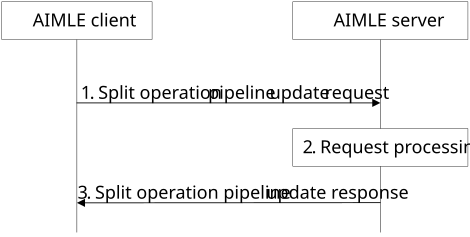

# 8.14.2.6 Split operation pipeline update

Figure 8.14.2.6-1 illustrates the procedure for an AIMLE client to update an instance of a split operation pipeline at the AIMLE server. The AIMLE client or VAL client can determine that some of the nodes in the split operation pipeline may not be able to perform the required operation and decides to modify the pipeline either to add or remove the nodes.

In case of multi-client split operation pipeline, a participating AIMLE client may become associated with a different processing node which may be already associated with another participating AIMLE client. In such a case, the AIMLE client or VAL client may update the pipeline, including the partitioning of the split model for one or more participating AIMLE clients.

Pre-conditions:

1\. The AIMLE client has received information related to split operation pipeline profile as specified in clause 8.14.2.3.

Figure 8.14.2.6-1: Split operation pipeline update

1\. The AIMLE client sends a split operation pipeline update request to the AIMLE server. The update request may include updated split operation pipeline information such as updated node information, stage information and model partitioning information. The request includes information defined in Table 8.14.3.19-1.

2\. Upon receiving the request from the AIMLE client, the AIMLE server validates if the requestor is authorized for the request. If the requestor is authorized, the AIMLE server validates if the requested split operation pipeline can be updated based on the split operation pipeline identifier included in the request.

If the requestor is authorized and a split operation pipeline profile is determined, the AIMLE server updates the split operation pipeline profile, including updated model partitioning information if provided in the request, and notifies the appropriate processing nodes indicated in the request about their inclusion or exclusion in the split operation pipeline as described in clause 8.14.2.5. The AIMLE server also notifies the already existing nodes about modification of the existing pipeline as described in clause 8.14.2.5.

3\. The AIMLE server sends a split operation pipeline update response message to the AIMLE client. If the AIMLE server has updated an instance of a split operation pipeline profile, the response includes an indication of success, and the corresponding split operation profile. Otherwise, the response includes an indication of failure and may include a reason for failure.
