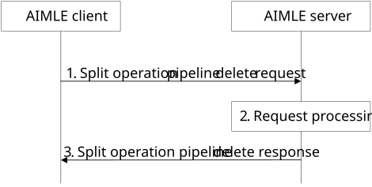

# 8.14.2.7 Split operation pipeline delete

Figure 8.14.2.7-1 illustrates the procedure for an AIMLE client to delete an instance of a split operation pipeline at the AIMLE server. The AIMLE client or VAL client can determine to delete a split operation pipeline when it is no longer needed.

Pre-conditions:

1\. The AIMLE client has received information related to split operation pipeline profile as specified in clause 8.14.2.3.

Figure 8.14.2.7-1: Split operation pipeline delete

1\. The AIMLE client sends a split operation pipeline delete request to the AIMLE server. The request includes information defined in Table 8.14.3.21-1.

2\. Upon receiving the request from the AIMLE client, the AIMLE server validates if the requestor is authorized for the request. If the requestor is authorized, the AIMLE server validates if the requested split operation pipeline can be deleted based on the split operation pipeline identifier included in the request.

If the requestor is authorized and a split operation pipeline is determined, the AIMLE server deletes the split operation pipeline profile and notifies the appropriate processing nodes about deletion of the split operation pipeline as described in clause 8.14.2.5.

3\. The AIMLE server sends a split operation pipeline delete response message to the AIMLE client. If the AIMLE server has deleted a split operation profile, the response includes an indication of success. Otherwise, the response includes an indication of failure and may include a reason for failure.
