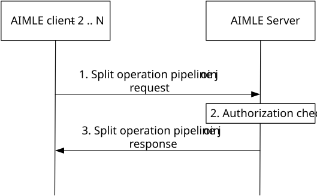

# 8.14.2.8 Split operation pipeline join

Figure 8.14.2.8-1 illustrates the procedure for an AIMLE client to join an existing split operation pipeline with the AIMLE server.

Pre-conditions:

1, The AIMLE client has performed split operation pipeline discovery with the AIMLE server and a split operation profile indicating multi-client split operation pipeline support has been found.

2\. The AIMLE client has received information (e.g. URI, IP address) related to the AIMLE server.

3\. The AIMLE client has received security credentials authorizing it to communicate with the AIMLE server.

Figure 8.14.2.8-1: Split operation pipeline join

1\. The AIMLE client sends a split operation pipeline join request to the AIMLE server. The request includes information defined in Table 8.14.3.23-1. The AIMLE client may include computing resource information in the request.

2\. Upon receiving the request from the AIMLE client, the AIMLE server validates if the requestor is authorized for the request. If the requestor is authorized, the AIMLE server validates if the identified split operation pipeline supports multi-client split operation and if the AIMLE client can join the split operation pipeline.

> If the requestor is authorized and the AIMLE client is allowed to join the split operation pipeline, the AIMLE server updates the split operation pipeline profile as needed, including model partitioning information where applicable, and may trigger split operation notification as described in clause 8.14.2.5.

3\. The AIMLE server sends a split operation pipeline join response message to the AIMLE client. If the AIMLE server has accepted the join request, the response includes an indication of success. Otherwise, the response includes an indication of failure and may include a reason for failure.
