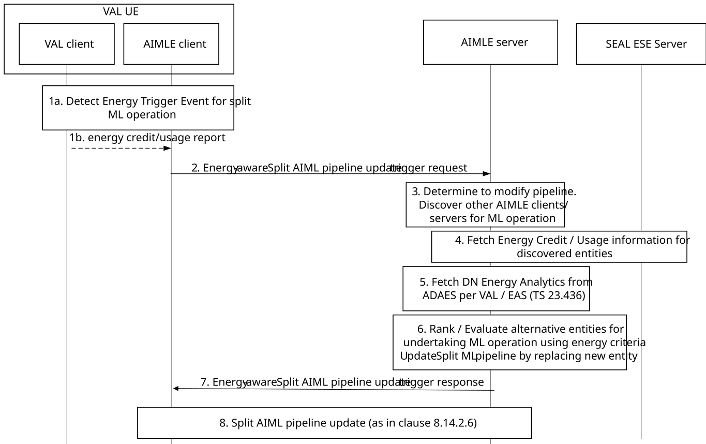

# 8.14.2.9 Energy-aware split operation pipeline update

In this procedure, the cause for split AI/ML operation pipeline update is the energy criteria/conditions, and particularly the energy credit or budget per VAL UE (or per application or aggregately for the entire pipeline) which is reaching a threshold. Hence, the AI/ML client detects that due to high energy consumption, it needs to modify the pipeline to offload the ongoing split ML operation to a target AI/ML member which can be an edge AIMLE server or another AIMLE client.

Figure 8.14.2.9-1 illustrates the procedure for an AIMLE client to update an instance of a split operation pipeline at the AIMLE server. The AIMLE client or the VAL client determines that some of the nodes in the split operation pipeline may not be able to perform the required operation (due to VAL UE energy credit/budget starvation/limitation) and decides to modify the pipeline either to add or remove the nodes.

Pre-conditions:

1\. The AIMLE client has received information related to split operation pipeline profile as specified in clause 8.14.2.3.

2\. VAL client is aware of the energy credit/budget for the VAL UE.

3\. AIMLE server has provided in advance to AIMLE clients configuration for reporting trigger events related to energy status changes.

Figure 8.14.2.9-1: Split operation pipeline update due to energy criteria

1\. AIMLE client detects an energy trigger event based on step 1 and optionally monitoring the energy status at the VAL UE. This can be done by monitoring the energy data/analytics per VAL client / AIMLE client, and application traffic schedule or pattern from the VAL application. The detection may also be based on receiving a notification/reporting from SEAL ESE client on the energy status or changes as in 3GPP TS 23.366 \[16\].

> Optionally, as in 1a, such detection is triggered by VAL client or ESE client providing in advance a VAL UE energy credit/budget report to AIMLE client (via AIMLE-C API) to indicate the current status of the energy credit (remaining) and/or the maximum credit limit for the application.

2\. The AIMLE client sends an energy-aware split pipeline update trigger request message to the AIMLE server. The trigger includes a status update and in particular either an energy credit limit/budget per VAL UE is expected to reach, or a high predicted or actual or expected energy consumption or credit/budget for VAL UE/application.

3\. The AIMLE server requests the SEAL ESE Server to provide energy information (e.g. consumption/usage status) for the list of alternative AIMLE servers/clients in this service area and receives the energy status (or credit/budget status) information for the list of alternative AIMLE clients and servers as in 3GPP TS 23.366 \[16\].

NOTE 1: In this step, the AIMLE server can alternatively fetch the energy credit information from a charging function in the operator’s charging domain, which is outside the scope of this specification.

NOTE 2: The capability related to the energy usage of the list of alternative candidate AIMLE clients or AIMLE servers may also be directly fetched by the ML repository.

4\. The AIMLE server identifies the split operation pipeline(s) for which the VAL UE is applicable and determines whether the split operation pipeline needs to be updated based on the split operation pipeline identifier and the energy status trigger.

> If the split operation pipeline profile is determined, the AIMLE server updates the split operation pipeline profile and notifies the appropriate processing nodes indicated in the request about their inclusion or exclusion in the split operation pipeline as described in clause 8.14.2.5. The AIMLE server also notifies the involved nodes about modification of the existing pipeline as described in clause 8.14.2.5.
>
> Then, the AIMLE server determines to check alternative entities (AIMLE clients or AIMLE servers) to undertake the task and discovers the entities (AIMLE clients or another AIMLE server).

NOTE 3: If the alternative entity is an AIMLE client, this is only limited to the AIMLE client acting as a relay/intermedia node as in the “Intermediate Node discovery in ML model split learning operations” capability in clause 8.29.

5\. For the list of AIMLE servers (deployed at the edge DN), AIMLE server may also consume the DN energy analytics service from ADAES (using the corresponding analytics service as in 3GPP TS 23.436). Additionally, for the AIMLE clients the AIMLE server may also collect analytics based on ADAES Support for AIMLE client energy sustainability analytics (clause 8.xx of 3GPP TS 23.436).

6\. AIMLE server evaluates (by rating or ranking) the alternative candidate entities (AIMLE clients or AIMLE servers) for undertaking the task using the performance for the split operation as well as the energy sustainability factor (if ADAE analytics AIMLE client energy sustainability analytics are used).

> AIMLE server determines one or more entities to be selected or considered as alternative to the AIMLE client of interest for becoming part of the updated split operation pipeline.

7\. The AIMLE server sends energy-aware split pipeline update trigger response message to the AIMLE client, as notification on the alternative entities to be candidate for being considered in the pipeline update. If the AIMLE server has updated an instance of a split operation pipeline profile, the notification includes the corresponding split operation profile.

8\. The AIMLE client determines to request an update of the the split AIML pipeline using one of the alternative entities and performs the procedure of Split AIML pipeline update as in clause 8.14.2.5.
