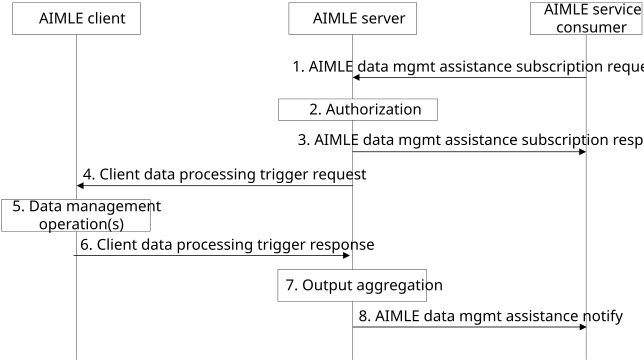

# 8.15 AIMLE data management assistance

## 8.15.1 General

AIMLE data management assistance is the process of the AIMLE server assisting AIMLE service consumers with managing data operations performed by VAL clients. The data operations include data preparation and data analysis, and data drift detection. The AIMLE server offloads the AIMLE service consumer from interacting with AIMLE clients to manage the data operations. The VAL clients perform the actual data preparation data analysis, and data drift detection operations and send the outputs to the AIMLE server for aggregation.

The following clauses specify procedures, information flows, and APIs for AIMLE data management assistance.

## 8.15.2 Procedure

Pre-conditions:

1\. AIMLE clients have registered with AIMLE server.

2\. UE application data for AI/ML operations has been collected and dataset identifier has been assigned to each dataset. EVEX mechanism can be reused for data collection as described in 3GPP TS 26.531 \[10\].

Figure 8.15.2-1: AIMLE data management assistance

1\. An AIMLE service consumer (e.g., VAL server) makes a request for AIMLE data management assistance. The request includes information as described in Table 8.15.3.1-1.

To prepare data for AIML operations, the AIMLE service consumer configures Data management operations to data preparation. Data preparation is performed to process data into a format that is required by ML models for the models to function properly, e.g.; before training or inferencing. The AIMLE service consumer includes data preparation requirements as described in Table 8.15.3.1-2.

To analyse data for AIML operations (i.e., to perform exploratory data analysis or EDA), the AIMLE service consumer configures Data management operations to data analysis. The AIMLE service consumer includes data analysis requirements as described in Table 8.15.3.1-3.

To perform data drift detection for AIML operations, the AIMLE service consumer configures Data management operations to data drift detection. Data drift detection is utilized to assist with determining changes in statistical properties of input data. The AIMLE service consumer includes data drift requirements as described in 8.15.3.1-4.

> In addition to providing the data management requirements, the AIMLE service consumer provides either a list of AIMLE clients (if known) or AIMLE client selection criteria. When providing the AIMLE client selection criteria, the AIMLE service consumer indicates that the AIMLE server performs AIMLE client selection to select AIMLE clients for the data management operations.

2\. The AIMLE server authenticates and authorizes the request. If authorized, the AIMLE server assigns an identifier for the subscription.

3\. The AIMLE server sends an AIMLE data management assistance subscription response to the AIMLE service consumer. The response includes information as described in Table 8.15.3.2-1.

4\. The AIMLE server sends Client data processing trigger requests to AIMLE clients. The request can be for data preparation or data analysis. The request includes information as described in Table 8.15.3.4-1. If AIMLE client selection criteria were provided in step 1, the AIMLE server performs AIMLE client selection to select AIMLE clients that have Dataset ID and Dataset feature ID indicated in the data management requirements.

5\. Each AIMLE client sends the requirements to trigger data management for the VAL client to perform the requested data operation. The VAL client performs the operation locally.

NOTE: The data preparation and data analysis functions operate in a similar manner as ML models. The AIMLE layer is able to transport the functions to the VAL clients and the VAL clients performs the associated function on the application data identified by the Dataset ID and Dataset feature ID as part of data preparation or data analysis in a similar manner as ML training.

6\. After the data operation completes, each AIMLE client sends a response to the AIMLE server with information as described in Table 8.15.3.5-1.

7\. The AIMLE server aggregates the output of each AIMLE client. Aggregation includes combining or performing a statistical operation on the received data. Data received from the AIMLE clients can be numerical or categorical, which allows the AIMLE server to aggregate the output data from the AIMLE clients. If necessary, steps 4–7 are repeated to complete all the required data operations.

8\. The AIMLE server sends an AIMLE data management assistance notification to the AIMLE service consumer with information as described in Table 8.15.3.3-1.

## 8.15.3 Information flows

### 8.15.3.1 AIMLE data management assistance subscription request

Table 8.15.3.1-1 shows the request sent by an AIMLE service consumer to an AIMLE server for the AIMLE data management assistance subscription procedure.

Table 8.15.3.1-1: AIMLE data management assistance subscription request

<table>
<colgroup>
<col style="width: 33%" />
<col style="width: 16%" />
<col style="width: 50%" />
</colgroup>
<thead>
<tr class="header">
<th>Information element</th>
<th>Status</th>
<th>Description</th>
</tr>
</thead>
<tbody>
<tr class="odd">
<td>Requestor identifier</td>
<td>M</td>
<td>The identifier of the requestor.</td>
</tr>
<tr class="even">
<td>Data management operations</td>
<td>M</td>
<td>An indicator showing what data management type is being requested: data preparation, data analysis, data drift detection.</td>
</tr>
<tr class="odd">
<td>Data management requirements</td>
<td>M</td>
<td>Requirements for the data management request:</td>
</tr>
<tr class="even">
<td>&gt;Data preparation requirements</td>
<td>
O

(NOTE 1)
</td>
<td>Data preparation requirements as detailed in Table 8.15.3.1-2.</td>
</tr>
<tr class="odd">
<td>&gt;Data analysis requirements</td>
<td>
O

(NOTE 1)
</td>
<td>Data analysis requirements as detailed in Table 8.15.3.1-3.</td>
</tr>
<tr class="even">
<td>&gt; Data drift detection requirements</td>
<td>O 
(NOTE 1)</td>
<td>Data drift detection requirements in Table 8.15.3.1-4.</td>
</tr>
<tr class="odd">
<td>AIMLE clients list</td>
<td>
O

(NOTE 2)
</td>
<td>A list of AIMLE clients for which data management should be performed. The list may be specified by AIMLE client set identifier.</td>
</tr>
<tr class="even">
<td>AIMLE client selection criteria</td>
<td>
O

(NOTE 2)
</td>
<td>Selection criteria for finding suitable AIMLE clients for AI/ML operations as detailed in Table 8.8.3.1-2.</td>
</tr>
<tr class="odd">
<td colspan="3">
NOTE 1: At least one of the information elements shall be provided.

NOTE 2: At least one of the information elements shall be provided.
</td>
</tr>
</tbody>
</table>

Table 8.15.3.1-2: Data preparation requirements

| Information element           | Status | Description                                                                                                                                                                                                                                               |
|-------------------------------|--------|-----------------------------------------------------------------------------------------------------------------------------------------------------------------------------------------------------------------------------------------------------------|
| Dataset identifier            | M      | An identifier for the dataset.                                                                                                                                                                                                                            |
| Data preparation requirements | M      | Requirements for data preparation.                                                                                                                                                                                                                        |
| \> Dataset ID                 | M      | The identifier for the dataset.                                                                                                                                                                                                                           |
| \> Dataset feature ID         | M      | Identifier or name of dataset feature to process.                                                                                                                                                                                                         |
| \> Data preparation function  | M      | This indicates the function which prepares the data, and it could be an identifier of a function if the function is available locally at the UE or an executable included in the request. A function may be used to process one or more dataset features. |

Table 8.15.3.1-3: Data analysis requirements

| Information element           | Status | Description                                                                                                                                                                                                                                                        |
|-------------------------------|--------|--------------------------------------------------------------------------------------------------------------------------------------------------------------------------------------------------------------------------------------------------------------------|
| Dataset identifier            | M      | An identifier for the dataset.                                                                                                                                                                                                                                     |
| Dataset analysis requirements | M      | Requirements for data analysis.                                                                                                                                                                                                                                    |
| \> Dataset ID                 | M      | The identifier for the dataset.                                                                                                                                                                                                                                    |
| \> Dataset feature ID         | M      | Identifier or name of dataset feature.                                                                                                                                                                                                                             |
| \> Data analysis function     | M      | This indicates the function which performs the data analysis, and it could be an identifier of a function if the function is available locally at the UE or an executable included in the request. A function may be used to process one or more dataset features. |

Table 8.15.3.1-4: Data drift detection requirements

| Information element               | Status | Description                                                                                                                                                                                                                                                         |
|-----------------------------------|--------|---------------------------------------------------------------------------------------------------------------------------------------------------------------------------------------------------------------------------------------------------------------------|
| Dataset identifier                | M      | An identifier for the dataset.                                                                                                                                                                                                                                      |
| Data drift detection requirements | M      | Requirements for data drift detection.                                                                                                                                                                                                                              |
| \> Dataset ID                     | M      | The identifier for the dataset.                                                                                                                                                                                                                                     |
| \> Dataset feature ID             | M      | Identifiers or names of dataset feature.                                                                                                                                                                                                                            |
| \> Baseline dataset ID            | M      | The identifier for the baseline dataset used to determine data drift.                                                                                                                                                                                               |
| \> Data drift detection function  | O      | This indicates the function which performs the drift detection, and it could be an identifier of a function if the function is available locally at the UE or an executable included in the request. A function may be used to process one or more dataset features |

### 8.15.3.2 AIMLE data management assistance subscription response

Table 8.15.3.2-1 shows the response sent by the AIMLE server to the AIMLE service consumer for the AIMLE data management assistance subscription procedure.

Table 8.15.3.2-1: AIMLE data management assistance subscription response

| Information element     | Status | Description                                  |
|-------------------------|--------|----------------------------------------------|
| Status                  | M      | The status for the data management operation |
| Subscription identifier | M      | An identifier for the subscription.          |
| Expiration time         | O      | Expiration time for the subscription         |

### 8.15.3.3 AIMLE data management assistance notify

Table 8.15.3.3-1 shows the notification sent by the AIMLE server to the AIMLE service consumer for the AIMLE data management assistance subscription procedure.

Table 8.15.3.3-1: AIMLE data management assistance notify

<table>
<colgroup>
<col style="width: 33%" />
<col style="width: 16%" />
<col style="width: 50%" />
</colgroup>
<thead>
<tr class="header">
<th>Information element</th>
<th>Status</th>
<th>Description</th>
</tr>
</thead>
<tbody>
<tr class="odd">
<td>Status</td>
<td>M</td>
<td>The status for the data management operation</td>
</tr>
<tr class="even">
<td>Aggregated data preparation outputs</td>
<td>
O

(NOTE 1)

(NOTE 2)
</td>
<td>Provides outputs for data preparation: dataset identifier, dataset features, and prepared data output.</td>
</tr>
<tr class="odd">
<td>Aggregated data analysis outputs</td>
<td>
O

(NOTE 1)

(NOTE 2)
</td>
<td>Provides outputs for data analysis: dataset identifier, statistical outputs for each feature, list of outlier and anomaly values, and feature correlation information.</td>
</tr>
<tr class="even">
<td>Aggregated data drift detection outputs</td>
<td>
O

(NOTE 1, NOTE 2)
</td>
<td>Provides outputs for data drift detection: dataset identifier, data drift detection status (e.g. detected data drift of the dataset features).</td>
</tr>
<tr class="odd">
<td>Timestamp</td>
<td>O</td>
<td>Timestamp of the data management notification</td>
</tr>
<tr class="even">
<td colspan="3">
NOTE 1: At least one of the information elements shall be provided in the output.

NOTE 2: The output format can be numerical or categorical. If categorical, the format can be nominal or ordinal.
</td>
</tr>
</tbody>
</table>

### 8.15.3.4 Client data processing trigger request

Table 8.15.3.4-1 shows the request sent by the AIMLE server to AIMLE clients for the AIMLE client data processing trigger procedure.

Table 8.15.3.4-1: Client data processing trigger request

<table>
<colgroup>
<col style="width: 33%" />
<col style="width: 16%" />
<col style="width: 50%" />
</colgroup>
<thead>
<tr class="header">
<th>Information element</th>
<th>Status</th>
<th>Description</th>
</tr>
</thead>
<tbody>
<tr class="odd">
<td>Requestor identifier</td>
<td>M</td>
<td>The identifier of the requestor.</td>
</tr>
<tr class="even">
<td>Data management type</td>
<td>M</td>
<td>An indicator showing what data management type is being requested: data preparation, data analysis.</td>
</tr>
<tr class="odd">
<td>Data management requirements</td>
<td>M</td>
<td>Requirements for the data management request:</td>
</tr>
<tr class="even">
<td>&gt;Data preparation requirements</td>
<td>
O

(NOTE)
</td>
<td>Data preparation requirements as detailed in Table 8.15.3.1-2.</td>
</tr>
<tr class="odd">
<td>&gt;Data analysis requirements</td>
<td>
O

(NOTE)
</td>
<td>Data preparation requirements as detailed in Table 8.15.3.1-3.</td>
</tr>
<tr class="even">
<td>&gt; Data drift detection</td>
<td>
O

(NOTE)
</td>
<td>Data drift detection requirements as defined in Table 8.15.3.1-4.</td>
</tr>
<tr class="odd">
<td>Operational schedule</td>
<td>O</td>
<td>A schedule to perform the requested data management operation.</td>
</tr>
<tr class="even">
<td colspan="3">NOTE: At least one of the information elements shall be provided.</td>
</tr>
</tbody>
</table>

### 8.15.3.5 Client data processing trigger response

Table 8.15.3.5-1 shows the response sent by AIMLE clients to the AIMLE server for the Client data processing trigger procedure.

Table 8.15.3.5-1: Client data processing trigger response

<table>
<colgroup>
<col style="width: 33%" />
<col style="width: 16%" />
<col style="width: 50%" />
</colgroup>
<thead>
<tr class="header">
<th>Information element</th>
<th>Status</th>
<th>Description</th>
</tr>
</thead>
<tbody>
<tr class="odd">
<td>Status</td>
<td>M</td>
<td>The status for the data management operation</td>
</tr>
<tr class="even">
<td>Data preparation outputs</td>
<td>
O

(NOTE 1)
</td>
<td>The output data after performing data preparation. One output data is generated for each requirement. (NOTE 2)</td>
</tr>
<tr class="odd">
<td>Data analysis outputs</td>
<td>
O

(NOTE 1)
</td>
<td>The output data generated by data analysis. One output data is generated for each requirement. (NOTE 2)</td>
</tr>
<tr class="even">
<td>Data drift detection outputs</td>
<td>
O

(NOTE 1)
</td>
<td>
The output of data drift detection status (e.g. detected data drift of the dataset features).

(NOTE 2)
</td>
</tr>
<tr class="odd">
<td>Timestamp</td>
<td>O</td>
<td>Timestamp of the data management operation</td>
</tr>
<tr class="even">
<td colspan="3">
NOTE 1: At least one of the information elements shall be provided in the output.

NOTE 2: The output format can be numerical or categorical. If categorical, the format can be nominal or ordinal. The AIMLE server is able to process either type of data.
</td>
</tr>
</tbody>
</table>
