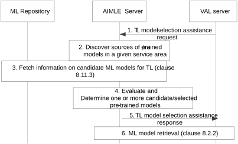
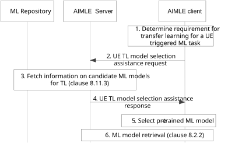

# 8.16 Support for Transfer Learning enablement

## 8.16.1 General

This clause provides the procedures for the transfer learning (TL) enablement service, including the server-triggered procedure (in clause 8.16.2) and the client-triggered procedure (in clause 8.16.3).

## 8.16.2 Procedure for server-triggered transfer learning enablement

Figure 8.16.2-1 illustrates the procedure where the TL enablement is performed based on the request for either an ML task from VAL layer or for an analytics task from ADAES. Such TL enablement allows the consumer to discover the similar ML models to be used as base models for the TL, as well as to support the selection of the best model to be used as pre-trained model.

Pre-conditions:

1\. VAL server is connected to AIMLE Server.

Figure 8.16.2-1: Procedure for Transfer Learning enablement

1\. The VAL server sends a Transfer Learning model selection assistance request message to the AIMLE server to provide support for discovering and selecting the appropriate pre-trained model for a given ML task (for ADAE analytics ID or for a certain ML model ID).

2\. The AIMLE Server discovers the possible entities which can provide a pre-trained model for this request. Such entities can be VAL servers or other ADAES or other AIMLE servers.

3\. The AIMLE Server requests one or more pre-trained ML models which can be used for transfer learning for the target ML task. The ML repository identifies the base ML model as a pre-trained ML model that can be mapped to the target ML task and sends information on the models to AIMLE server which are candidate as pre-trained models available for the target task. This step reuses the ML model information discovery procedure as in clause 8.11.3.

4\. The AIMLE Server evaluates with the support of the ML model repository, whether the pre-trained models are applicable to the ML task (ADAE analytics ID or model ID). This can be assisted using historical data or ML model rating based on previous utilization of these models for the certain ML task. Based on the evaluation (which can be based on the rating), the AIMLE Server determines one or more pre-trained models to be used for the ML task.

NOTE: In this step, the AIMLE Server can rate or set a weight to the pre-trained model or the source of the model.

5\. The AIMLE Server sends to the VAL server a transfer learning selection assistance response to the VAL server, including the information for the pre-trained models (e.g., model ID, profile) which are identified for the ML task. Also, this may include the rating/weight for the pre-trained model if the VAL server needs to select among a list of them.

6\. Based on the selected pre-trained model information, the VAL server retrieves the selected ML model using the procedure as in clause 8.2.2.

## 8.16.3 Procedure for client-triggered transfer learning enablement

Figure 8.16.3-1 illustrates the procedure where the TL enablement is performed for a VAL UE task which is a UE analytics task (e.g. ADAEC-provided analytics). Such TL enablement allows the VAL UE to perform ML model training using a pre-trained model from the server side and is beneficial for minimizing the computational load at the VAL UE side.

Pre-conditions:

1\. AIMLE client is connected to AIMLE Server.

Figure 8.16.3-1 Procedure for client-triggered Transfer Learning enablement

1\. The AIMLE client determines a requirement for using a pre-trained ML models for transfer learning for a VAL UE triggered ML task (e.g., UE analytics event).

2\. The AIMLE client sends a UE transfer learning model selection assistance request to the AIMLE server to receive one or more pre-trained ML models which can be used for transfer learning for the target UE-triggered ML task.

3\. The AIMLE Server requests one or more pre-trained ML models which can be used for transfer learning for the target ML task. The ML repository identifies the base ML model as a pre-trained ML model that can be mapped to the target ML task and sends information on the models to AIMLE server which are candidate as pre-trained models available for the target task.

4\. The AIMLE Server sends a UE transfer learning model selection assistance response to the AIMLE client which includes information on the ML models which are candidate as pre-trained models available for the target UE ML task. Such models may be pre-trained for an ADAES analytics task (e.g., VAL server performance analytics) and are applicable to be used for the VAL UE analytics task (e.g. VAL session performance analytics).

5\. The AIMLE client evaluates whether the pre-trained models are applicable to the target ML task. Based on the evaluation, the AIMLE client selects a base model to be used as pre-trained model for the ML task.

6\. Based on the selected pre-trained model information, the AIMLE client retrieves the selected ML model using the procedure as in clause 8.2.2.

## 8.16.4 Information flows

### 8.16.4.1 Transfer learning model selection assistance request

Table 8.16.4.1-1 shows the request sent by the VAL server to AIMLE server for the server-triggered transfer learning support procedure.

Table 8.16.4.1-1: Transfer learning model selection assistance request

<table>
<colgroup>
<col style="width: 33%" />
<col style="width: 16%" />
<col style="width: 50%" />
</colgroup>
<thead>
<tr class="header">
<th>Information element</th>
<th>Status</th>
<th>Description</th>
</tr>
</thead>
<tbody>
<tr class="odd">
<td>Requestor identity</td>
<td>M</td>
<td>Identity of the VAL server performing the request.</td>
</tr>
<tr class="even">
<td>VAL service identity</td>
<td>M</td>
<td>The identity of the VAL service for which the request applies.</td>
</tr>
<tr class="odd">
<td>ML task identity</td>
<td>
O

(NOTE)
</td>
<td>The ML task for which the transfer learning is to be used.</td>
</tr>
<tr class="even">
<td>ADAE analytics ID</td>
<td>
O

(NOTE)
</td>
<td>The ADAES analytics ID (as specified in TS 23.436) for which the transfer learning is to be used, in case when transfer learning is used per analytics task.</td>
</tr>
<tr class="odd">
<td>ML model profile</td>
<td>
O

(NOTE)
</td>
<td>The ML model profile for which the transfer learning is to be used.</td>
</tr>
<tr class="even">
<td>Transfer learning criteria</td>
<td>M</td>
<td>
The criteria for identifying and selecting one or more pre-trained ML models. Such criteria include:

<ul>
<li>
the required feature(s) of a pre-trained model.
</li>
<li>
training data requirements.
</li>
<li>
type of transfer learning.
</li>
<li>
the environment associated with the target ML task.
</li>
<li>
permissions / restrictions for the pre-trained model.
</li>
</ul></td>
</tr>
<tr class="odd">
<td>ML model requirement information</td>
<td>O</td>
<td>Identifies the requirement for selecting a base model to be trained as pre-trained.</td>
</tr>
<tr class="even">
<td>List of VAL UE IDs</td>
<td>O</td>
<td>List of VAL UEs associated with the ML model task</td>
</tr>
<tr class="odd">
<td>Model rating requirement</td>
<td>O</td>
<td>Identifies the requirement for providing rating of the ML model(s) to serve as pre-trained model.</td>
</tr>
<tr class="even">
<td colspan="3">NOTE: At least one of these IE shall be present.</td>
</tr>
</tbody>
</table>

### 8.16.4.2 Transfer learning model selection assistance response

Table 8.16.4.2-1 shows the response sent by the AIMLE server to the VAL server for the server-triggered transfer learning support procedure.

Table 8.16.4.2-1: Transfer learning model selection assistance response

<table>
<colgroup>
<col style="width: 33%" />
<col style="width: 16%" />
<col style="width: 50%" />
</colgroup>
<thead>
<tr class="header">
<th>Information element</th>
<th>Status</th>
<th>Description</th>
</tr>
</thead>
<tbody>
<tr class="odd">
<td>Success response</td>
<td>
O

(NOTE)
</td>
<td>Indicates that the transfer learning model selection assistance request was successful.</td>
</tr>
<tr class="even">
<td>&gt; List of ML models</td>
<td>O</td>
<td>List of ML models selected by AIMLE server for training as candidate pre-trained model.</td>
</tr>
<tr class="odd">
<td>&gt;&gt; ML repository identifier and address</td>
<td>O</td>
<td>Provides the ID and address of the ML repository which stores the pre-trained ML model selected by AIMLE server for training as pre-trained model.</td>
</tr>
<tr class="even">
<td>&gt;&gt; ML model information</td>
<td>O</td>
<td>Information on the selected model, specified in Table 8.11.4.1-2.</td>
</tr>
<tr class="odd">
<td>&gt;&gt; ML model rating</td>
<td>O</td>
<td>If requested, a rating parameter for the ML model to serve as pre-trained. Such rating can be based on the ML task similarity score e.g. based on the feature.</td>
</tr>
<tr class="even">
<td>Failure response</td>
<td>
O

(NOTE)
</td>
<td>Indicates that the transfer learning model selection assistance request was failure.</td>
</tr>
<tr class="odd">
<td>&gt; Cause</td>
<td>M</td>
<td>Reason for the failure.</td>
</tr>
<tr class="even">
<td colspan="3">NOTE: Only one of these information elements shall be present</td>
</tr>
</tbody>
</table>

### 8.16.4.3 UE transfer learning model selection assistance request

Table 8.16.4.3-1 shows the request sent by the AIMLE client to AIMLE server for the client-triggered transfer learning support procedure.

Table 8.16.4.3-1: UE transfer learning model selection assistance request

<table>
<colgroup>
<col style="width: 33%" />
<col style="width: 16%" />
<col style="width: 50%" />
</colgroup>
<thead>
<tr class="header">
<th>Information element</th>
<th>Status</th>
<th>Description</th>
</tr>
</thead>
<tbody>
<tr class="odd">
<td>VAL UE identity</td>
<td>M</td>
<td>Identity of the VAL UE (VAL client ID or AIMLE client ID) performing the request.</td>
</tr>
<tr class="even">
<td>VAL service identity</td>
<td>M</td>
<td>The identity of the VAL service for which the request applies.</td>
</tr>
<tr class="odd">
<td>ML task identity</td>
<td>
O

(NOTE)
</td>
<td>The ML task for which the transfer learning is to be used.</td>
</tr>
<tr class="even">
<td>ADAE analytics ID</td>
<td>
O

(NOTE)
</td>
<td>The ADAE analytics ID (as specified in 3GPP TS 23.436) for which the transfer learning is to be used, in case when transfer learning is used per UE analytics task.</td>
</tr>
<tr class="odd">
<td>ML model profile</td>
<td>
O

(NOTE)
</td>
<td>The ML model profile for which the transfer learning is to be used.</td>
</tr>
<tr class="even">
<td>Transfer learning criteria</td>
<td>M</td>
<td>
The criteria for identifying and selecting one or more pre-trained ML models. Such criteria include:

<ul>
<li>
the required feature(s) of a pre-trained model.
</li>
<li>
training data requirements.
</li>
<li>
type of transfer learning.
</li>
<li>
the environment associated with the target ML task.
</li>
<li>
permissions / restrictions for the pre-trained model.
</li>
</ul></td>
</tr>
<tr class="odd">
<td>ML model requirement information</td>
<td>O</td>
<td>Identifies the requirement for selecting a base model to be trained as pre-trained.</td>
</tr>
<tr class="even">
<td>Model rating requirement</td>
<td>O</td>
<td>Identifies the requirement for providing rating of the ML model(s) to serve as pre-trained model.</td>
</tr>
<tr class="odd">
<td colspan="3">NOTE: At least one of these IE shall be present.</td>
</tr>
</tbody>
</table>

### 8.16.4.4 UE transfer learning model selection assistance response

Table 8.16.4.4-1 shows the response sent by the AIMLE server to the AIMLE client for the client-triggered transfer learning support procedure.

Table 8.16.4.4-1: UE transfer learning model selection assistance response

<table>
<colgroup>
<col style="width: 33%" />
<col style="width: 16%" />
<col style="width: 50%" />
</colgroup>
<thead>
<tr class="header">
<th>Information element</th>
<th>Status</th>
<th>Description</th>
</tr>
</thead>
<tbody>
<tr class="odd">
<td>Success response</td>
<td>
O

(NOTE)
</td>
<td>Indicates that the UE transfer learning model selection assistance request was successful.</td>
</tr>
<tr class="even">
<td>&gt; List of ML models</td>
<td>O</td>
<td>List of ML models selected by AIMLE server for training as pre-trained model.</td>
</tr>
<tr class="odd">
<td>&gt;&gt; ML model information</td>
<td>O</td>
<td>Information on the selected model, specified in Table 8.11.4.1-2.</td>
</tr>
<tr class="even">
<td>&gt;&gt; ML model rating</td>
<td>O</td>
<td>If requested, a rating parameter for the ML model to serve as pre-trained.</td>
</tr>
<tr class="odd">
<td>Failure response</td>
<td>
O

(NOTE)
</td>
<td>Indicates that the UE transfer learning model selection assistance request was failure.</td>
</tr>
<tr class="even">
<td>&gt; Cause</td>
<td>M</td>
<td>Reason for the failure.</td>
</tr>
<tr class="odd">
<td colspan="3">NOTE: Only one of these information elements shall be present</td>
</tr>
</tbody>
</table>
