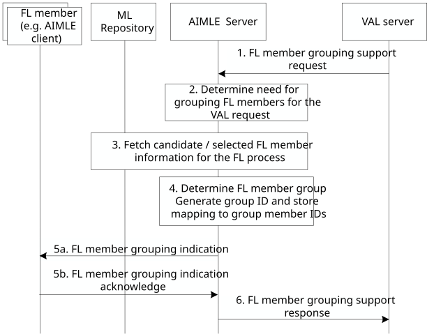

# 8.17 Support for FL member grouping

## 8.17.1 General

This clause provides the procedure for the grouping of the FL members using AIMLE. Such grouping for the given FL process, applicable to a specific VAL request or ML model ID or ADAE analytics ID. This grouping can be applicable also for a given service area in which one or more FL processes are expected to run. The grouping of FL members is performed for optimizing the process of selection and updating FL members which are entering or leaving the group, since due to dynamicity of FL member (e.g. AIMLE clients) changes this would be impose additional signalling / complexity.

## 8.17.2 Procedure

In this procedure, the AIMLE support capability is described for grouping the FL members, where the grouping is tailored to a specific ML task (VAL triggered task or analytics event/ID).

The grouping procedure covers the:

\- creation of the FL member group;

\- query for an individual FL Member whether it is part of the created group;

\- change of the FL member group, including

a\) modification of the group member based on a change on the availability or capability of the FL member (e.g. due to high load or energy consumption the FL member may have limited capability to act as FL client for a given area and time);

b\) update of the group due to a new member entering or an existing member leaving the FL group; and

\- deletion of the FL member group, and notification of the FL members regarding the deletion of the FL member group.

Figure 8.17.2-1 illustrates the procedure for supporting the FL member grouping.

Pre-conditions:

1\. VAL Server is connected to AIMLE Server.

2\. The candidate/selected FL member has registered to the FL member registry based on the capability in clause 8.4.

Figure 8.17.2-1: Procedure for FL member grouping

1\. The VAL server sends an FL member grouping support request to the AIMLE Server for supporting an FL process. The initial request is to create the FL member grouping support as described in Table 8.17.3.1-1, which may be followed by other requests for querying (as described in Table 8.17.3.1-2), change (as described in Table 8.17.3.1-3), or deletion (as described in Table 8.17.3.1-4) of the FL member grouping support.

NOTE 1: The FL member grouping support request can be triggered by the AIMLE Server itself.

2\. The AIMLE Server based on the request, determines the need for creating and processing a group consisting of the needed FL members for a given ML task (i.e., an ML model training/inference job ID). The need for creating an FL member group may be based on an ML task for a given AIMLE service area or for a given AIMLE service area where one or more ML tasks are expected to run, based on step 1 request.

3\. To create, query, or change the FL member grouping support, the AIMLE Server fetches the available FL members for the given ML task (i.e., an ML model training/inference job ID) from the ML repository. Based on this information, AIMLE Server may select one or more FL members for the group for the ML task.

NOTE 2: If the FL member is an AIMLE client, this step re-uses procedure 8.9.2 on AIMLE client selection.

4\. The AIMLE Server creates, configures, and processes the FL member group based on the available or selected FL members by the aggregator which may be the VAL Server or the AIMLE Server, generate group ID and store mapping to group member IDs. The criteria for determining the group members can be the capabilities of the FL participants, or whether the candidate participants are fixed or mobile nodes and their availabilities, the proximity of the participants among them.

> For the creation of the FL member group, AIMLE may utilize SEAL GMS capability for the FL member group ID generation.

5\. The AIMLE Server interacts with the each candidate FL member from the configured FL member group as shown in step 5a.

NOTE 3: If the request is about the deletion of the FL member group, the FL member grouping indication includes notification for the deletion of the FL member group.

5a. The AIMLE Server sends indication to the candidate FL member (the AIMLE client which is deployed on UE) about the group ID and the group member identities for the ML model ID / ADAE analytics ID (based on the request in step 1.

5b. The candidate FL member sends to the AIMLE Server a FL grouping indication acknowledge.

6\. The AIMLE Server sends an FL member grouping support response to the VAL request indicating the group creation or providing the query response, change or deletion (based on step 1 request) and the group information.

## 8.17.3 Information flows

### 8.17.3.1 FL member grouping support request

Table 8.17.3.1-1 shows the request sent by the VAL Server to AIMLE Server for the FL member grouping procedure to create the FL member grouping support.

Table 8.17.3.1-1: FL member grouping support create request

<table>
<colgroup>
<col style="width: 33%" />
<col style="width: 16%" />
<col style="width: 50%" />
</colgroup>
<thead>
<tr class="header">
<th>Information element</th>
<th>Status</th>
<th>Description</th>
</tr>
</thead>
<tbody>
<tr class="odd">
<td>Requestor identity</td>
<td>M</td>
<td>Identity of the VAL Server performing the request.</td>
</tr>
<tr class="even">
<td>VAL service identity</td>
<td>O (NOTE)</td>
<td>The identity of the VAL service for which the request applies.</td>
</tr>
<tr class="odd">
<td>ML model ID</td>
<td>O (NOTE)</td>
<td>The model ID for which the request applies</td>
</tr>
<tr class="even">
<td>ADAE analytics ID</td>
<td>O (NOTE)</td>
<td>The ADAES analytics ID (as specified in TS 23.436) for which the FL grouping is to be used, in case when FL process is used for a given analytics task.</td>
</tr>
<tr class="odd">
<td>ML task information</td>
<td>O</td>
<td>Information related to the ML task / job for which the FL grouping is used. Such task can be an FL training task or FL inference task. This information may include an ML task ID which may be an FL process ID or correlation ID.</td>
</tr>
<tr class="even">
<td>ML model profile</td>
<td>O</td>
<td>The ML model profile for which the FL grouping is to be used.</td>
</tr>
<tr class="odd">
<td>List of candidate/selected FL member IDs</td>
<td>O</td>
<td>
The list of candidate or selected FL member identities (if known by the VAL Server) which are to be used in the grouping.

If the FL member is a VAL UE, this is equivalent to the VAL UE ID.
</td>
</tr>
<tr class="even">
<td>&gt; FL member type</td>
<td>O</td>
<td>The type of FL members (FL client, FL Server)</td>
</tr>
<tr class="odd">
<td>&gt; FL member status</td>
<td>O</td>
<td>The status (selected, candidate) of the FL member.</td>
</tr>
<tr class="even">
<td colspan="3">NOTE: At least one of these information elements shall be present</td>
</tr>
</tbody>
</table>

Table 8.17.3.1-2 shows the request sent by the VAL Server to AIMLE Server for the FL member grouping procedure to query the FL member within the group.

Table 8.17.3.1-2: FL member grouping support query request

| Information element      | Status | Description                                         |
|--------------------------|--------|-----------------------------------------------------|
| FL member group identity | M      | Identity of the FL member group which queried       |
| FL member identity       | O      | Information on the queried FL member to be queried. |

Table 8.17.3.1-3 shows the request sent by the VAL Server to AIMLE Server for the FL member grouping procedure to change the FL member grouping support.

**Table 8.17.3.1-3: FL member grouping support change request**

<table>
<colgroup>
<col style="width: 33%" />
<col style="width: 16%" />
<col style="width: 50%" />
</colgroup>
<thead>
<tr class="header">
<th><strong>Information element</strong></th>
<th><strong>Status</strong></th>
<th><strong>Description</strong></th>
</tr>
</thead>
<tbody>
<tr class="odd">
<td>FL member group identity</td>
<td>M</td>
<td>Identity of the FL member grouping support</td>
</tr>
<tr class="even">
<td>FL member group change</td>
<td>M</td>
<td>Information on the change type for the FL member group</td>
</tr>
<tr class="odd">
<td>&gt;FL member update</td>
<td>
O

(NOTE)
</td>
<td>Identifies the FL Members that are to be updated</td>
</tr>
<tr class="even">
<td>&gt;&gt;Cause</td>
<td>O</td>
<td>The cause for the FL member group update (e.g. FL member enter or leave the group)</td>
</tr>
<tr class="odd">
<td>&gt;FL member group modify</td>
<td>
O

(NOTE)
</td>
<td>Identifies the FL Members that are to be modified</td>
</tr>
<tr class="even">
<td>&gt;&gt;Cause</td>
<td>O</td>
<td>The cause for the FL member group modifies (e.g. change FL member availability, capability or FL member information).</td>
</tr>
<tr class="odd">
<td colspan="3">NOTE: At least one of these shall be present</td>
</tr>
</tbody>
</table>

Table 8.17.3.1-4 shows the request sent by the VAL Server to AIMLE Server for the FL member grouping procedure to delete the FL member grouping support.

**Table 8.17.3.1-4: FL member grouping support delete request**

| **Information element**  | **Status** | **Description**                            |
|--------------------------|------------|--------------------------------------------|
| FL member group identity | M          | Identity of the FL member grouping support |
| Cause                    | O          | Cause for the deletion of the group        |

### 8.17.3.2 FL member grouping support response

Table 8.17.3.2-1 shows the response sent by the AIMLE Server to the VAL Server for the FL member grouping procedure to create the FL member grouping support.

Table 8.17.3.2-1: FL member grouping support create response

<table>
<colgroup>
<col style="width: 33%" />
<col style="width: 16%" />
<col style="width: 50%" />
</colgroup>
<thead>
<tr class="header">
<th>Information element</th>
<th>Status</th>
<th>Description</th>
</tr>
</thead>
<tbody>
<tr class="odd">
<td>Success response</td>
<td>
O

(NOTE)
</td>
<td>Indicates that the FL process support request was successful.</td>
</tr>
<tr class="even">
<td>&gt; FL group identifier(s)</td>
<td>O</td>
<td>Identifies the AIMLE-created FL group for the FL process and ML task (FL training or inference).</td>
</tr>
<tr class="odd">
<td>&gt; List of FL member IDs / addresses</td>
<td>O</td>
<td>Provides the ID and address of the FL members which are part of the FL group.</td>
</tr>
<tr class="even">
<td>&gt;&gt; FL member information</td>
<td>O</td>
<td>Information on the FL members such as availability, constraints, role/type.</td>
</tr>
<tr class="odd">
<td>Failure response</td>
<td>
O

(NOTE)
</td>
<td>Indicates that the FL process support request was failure.</td>
</tr>
<tr class="even">
<td>&gt; Cause</td>
<td>M</td>
<td>Reason for the failure.</td>
</tr>
<tr class="odd">
<td colspan="3">NOTE: Only one of these information elements shall be present</td>
</tr>
</tbody>
</table>

Table 8.17.3.2-2 shows the response sent to the VAL Server by the AIMLE Server for the FL member grouping procedure to query the FL member within the group.

**Table 8.17.3.2-2: FL member grouping support query response**

<table>
<colgroup>
<col style="width: 33%" />
<col style="width: 16%" />
<col style="width: 50%" />
</colgroup>
<thead>
<tr class="header">
<th><strong>Information element</strong></th>
<th><strong>Status</strong></th>
<th><strong>Description</strong></th>
</tr>
</thead>
<tbody>
<tr class="odd">
<td>Success response</td>
<td>
O

(NOTE)
</td>
<td>Indicates that the FL process support query request was successful.</td>
</tr>
<tr class="even">
<td>&gt; List of FL member IDs / addresses</td>
<td>O</td>
<td>Provides the ID and address of the FL members which are part of the FL group.</td>
</tr>
<tr class="odd">
<td>&gt;&gt; FL member information</td>
<td>O</td>
<td>Information on the FL members such as availability, constraints, role/type.</td>
</tr>
<tr class="even">
<td>Failure response</td>
<td>
O

(NOTE)
</td>
<td>Indicates that the FL process query support request was failure.</td>
</tr>
<tr class="odd">
<td>&gt; Cause</td>
<td>M</td>
<td>Reason for the failure.</td>
</tr>
<tr class="even">
<td colspan="3">NOTE: Only one of these information elements shall be present</td>
</tr>
</tbody>
</table>

Table 8.17.3.2-3 shows the response sent to the VAL Server by the AIMLE Server for the FL member grouping procedure to change the FL member grouping support.

**Table 8.17.3.2-3: FL member grouping support change response**

<table>
<colgroup>
<col style="width: 33%" />
<col style="width: 16%" />
<col style="width: 50%" />
</colgroup>
<thead>
<tr class="header">
<th><strong>Information element</strong></th>
<th><strong>Status</strong></th>
<th><strong>Description</strong></th>
</tr>
</thead>
<tbody>
<tr class="odd">
<td>Success response</td>
<td>
O

(NOTE)
</td>
<td>Indicates that the FL process support request was successful.</td>
</tr>
<tr class="even">
<td>&gt; FL group identifier(s)</td>
<td>O</td>
<td>Identifies the AIMLE updated or modified FL group for the FL process and ML task (FL training or inference).</td>
</tr>
<tr class="odd">
<td>&gt; List of FL member IDs / addresses</td>
<td>O</td>
<td>Provides the ID and address of the update or modified FL members which are part of the FL group.</td>
</tr>
<tr class="even">
<td>&gt;&gt; FL member information</td>
<td>O</td>
<td>Information on the updated or modified FL members such as availability, constraints, role/type.</td>
</tr>
<tr class="odd">
<td>Failure response</td>
<td>
O

(NOTE)
</td>
<td>Indicates that the FL process support request was failure.</td>
</tr>
<tr class="even">
<td>&gt; Cause</td>
<td>M</td>
<td>Reason for the failure.</td>
</tr>
<tr class="odd">
<td colspan="3">NOTE: Only one of these information elements shall be present</td>
</tr>
</tbody>
</table>

Table 8.17.3.3-4 shows the response sent to the VAL Server by the AIMLE Server for the FL member grouping procedure to delete the FL member grouping support.

**Table 8.17.3.2-4: FL member grouping support delete response**

| **Information element** | **Status** | **Description**                                                               |
|-------------------------|------------|-------------------------------------------------------------------------------|
| Result                  | M          | Positive or negative acknowledgement for the deletion of the FL member group. |

### 8.17.3.3 FL grouping indication

Table 8.17.3.3-1 shows the notification sent by the AIMLE Server to the FL members (AIMLE clients, VAL Servers) for the FL member grouping procedure.

Table 8.17.3.3-1: FL grouping indication

<table>
<colgroup>
<col style="width: 33%" />
<col style="width: 16%" />
<col style="width: 50%" />
</colgroup>
<thead>
<tr class="header">
<th>Information element</th>
<th>Status</th>
<th>Description</th>
</tr>
</thead>
<tbody>
<tr class="odd">
<td>Requestor identity</td>
<td>M</td>
<td>Identity of the AIMLE Server performing the request.</td>
</tr>
<tr class="even">
<td>VAL service identity</td>
<td>O (NOTE 1)</td>
<td>The identity of the VAL service for which the grouping indication applies.</td>
</tr>
<tr class="odd">
<td>ML model ID</td>
<td>O (NOTE 1)</td>
<td>The model ID for which the indication applies</td>
</tr>
<tr class="even">
<td>ADAE analytics ID</td>
<td>O (NOTE 1)</td>
<td>The ADAES analytics ID (as specified in 3GPP TS 23.436) for which the FL grouping is to be used, in case when FL process is used for a given analytics task.</td>
</tr>
<tr class="odd">
<td>FL group identifier(s)</td>
<td>M</td>
<td>Identifies the AIMLE-created, changed FL group for the FL process.</td>
</tr>
<tr class="even">
<td>&gt; List of FL member IDs / addresses</td>
<td>O</td>
<td>Provides the ID and address of the FL members which are part of the FL group.</td>
</tr>
<tr class="odd">
<td>&gt;&gt; FL member information</td>
<td>O</td>
<td>Information on the FL members such as availability, constraints, role/type.</td>
</tr>
<tr class="even">
<td>FL group deletion information</td>
<td>
O

(NOTE 2)
</td>
<td>Indication that the FL group is going to be deleted based on VAL server request</td>
</tr>
<tr class="odd">
<td>&gt; Cause</td>
<td>O</td>
<td>Cause for the expected deletion of the FL members group (e.g., due to AI/ML service termination or group UE mobility to different service area).</td>
</tr>
<tr class="even">
<td>&gt; Expiration time</td>
<td>O</td>
<td>Indicates the expiration time of the FL group deletion (in case the deletion of the FL group is expected in future time instance). If the Expiration time IE is not included, it indicates that the deletion of the group is instant.</td>
</tr>
<tr class="odd">
<td colspan="3">
NOTE 1: At least one of these information elements shall be present.

NOTE 2: This IE is mandatory if the indication is related to an FL group deletion.
</td>
</tr>
</tbody>
</table>

### 8.17.3.4 FL grouping indication acknowledge

Table 8.17.3.4-1 describes the information flow FL grouping indication acknowledge from the FL members (AIMLE clients which are deployed on UEs) to the AIMLE server.

Table 8.17.3.4-1: FL grouping indication acknowledge

<table>
<colgroup>
<col style="width: 33%" />
<col style="width: 16%" />
<col style="width: 50%" />
</colgroup>
<thead>
<tr class="header">
<th>Information element</th>
<th>Status</th>
<th>Description</th>
</tr>
</thead>
<tbody>
<tr class="odd">
<td>Success response</td>
<td>
O

(NOTE)
</td>
<td>Acknowledgement of FL grouping indication.</td>
</tr>
<tr class="even">
<td>Failure response</td>
<td>
O

(NOTE)
</td>
<td>Indicates that the FL grouping indication was failure.</td>
</tr>
<tr class="odd">
<td>&gt; Cause</td>
<td>O</td>
<td>Reason for the failure.</td>
</tr>
<tr class="even">
<td colspan="3">NOTE: Only one of these information elements shall be present</td>
</tr>
</tbody>
</table>
