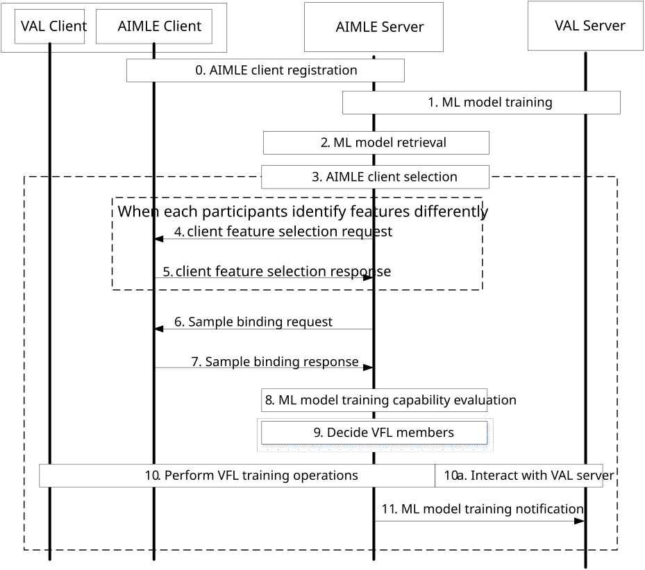
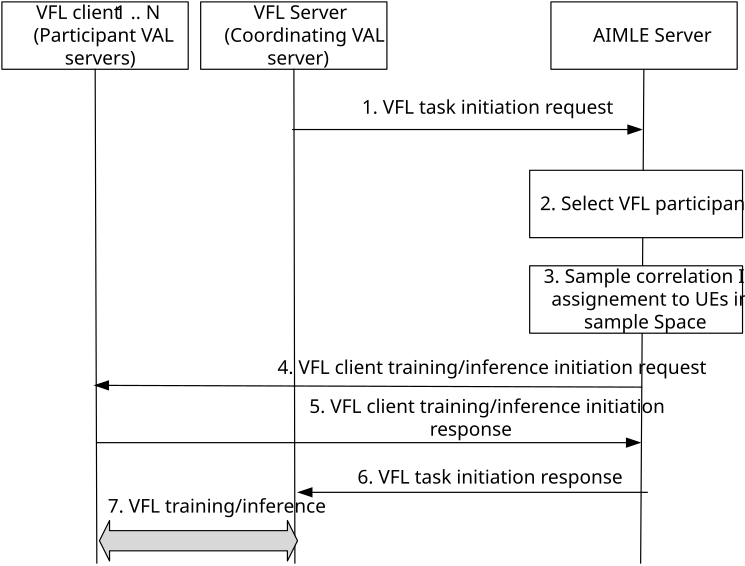

# 8.18 Support Vertical FL

This clause describes procedure for supporting VFL among application layer multiple UEs and VFL sample alignment among VAL servers acting as VFL clients and VFL server(s).

## 8.18.1 General

The following clauses specify procedures, information flows and APIs to support VFL among Application Layer multiple UEs and VFL sample alignment among VAL servers acting as VFL clients and VFL server(s).

## 8.18.2 Procedure for supporting VFL

Pre-conditions:

1\. VFL members registered their AIMLE client profile to the AIMLE Server. The VFL members may update their status or information in their AIMLE client profile to the AIMLE Server.

2\. The datasets of each of the UEs (where the AIMLE Clients (as VFL members) are deployed on) belong to more than one different data domains.

3\. The VAL server has successfully subscribed/registered with the AIMLE server for model training notifications.

Figure 8.18.2-1: Procedure for supporting VFL

0\. An AIMLE client registers with AIMLE server as specified in clause 8.7. The registration message includes the list of feature collection capabilities and also the data domains in which features can be collected and processed. The registration message also includes the list of feature ID(s) status its expiration time.

NOTE 1: The AIMLE server keeps record of all AIMLE clients with similar feature collection capabilities and data domain.

1\. An AIMLE server receives an ML model training request from a VAL server as described in clause 8.3.2.The request includes sample pool, and sample binding criteria. The member selection criteria are enhanced to select the members for VFL training if they have features bound to at least one sample within the sample pool. If ML model training request is received and the AIMLE server determines to use VFL training (VFL training between different data domains), the procedure continues to step 2. The AIMLE server also assigns ML task identity to the determined task. The AIMLE server selects the candidate AIMLE clients for the training based on the corresponding feature collection record of AIMLE clients that are capable of collecting features within the scope of determined VFL task and sample pool. The AIMLE server sends response which includes ML task identity and candidate AIMLE client list.

2\. \[Optional\] The AIMLE server retrieves the indicated ML model in step 1 using the ML model retrieval procedure as described in clause 8.1. If the retrieved model is already trained and meets the machine learning requirements requested by the consumer, the procedure continues to step 7.

3\. If AIMLE client selection criteria are provided in step 1, then the AIMLE server continuously monitors and selects AIMLE clients for the VFL training as described step 4 of the clause 8.13.2. If a number of the required AIML clients is provided, the AIMLE server ensures the requirement is met when selecting AIMLE clients for VFL training. If a list of AIMLE clients is provided in step 1, the AIMLE server selects the provided AIMLE clients for the VFL training.

4\. \[Optional\] The AIMLE Server sends a client feature selection request to some clients asking to activate or de-activate some of their feature ID(s)/ feature list for each data domain. The message includes information as described in Table 8.18.3.5-1.

5\. \[Optional\] AIMLE client sends response indicating the activation or deactivation status of their feature ID(s) or feature list for each data domain. The response message includes information as described in Table 8.18.3.6-1. Based on the response message, the AIMLE server finds common feature ID(s) by comparing features descriptions / feature ID(s) of clients. The AIMLE server constructs the pairwise relation among candidates' datasets considering their shared feature ID(s).

NOTE 2: The AIMLE server gets the hashed feature values from the candidates for their data samples if the feature ID(s) are subsets of feature space union

6\. AIMLE server send a sample binding request to AIMLE clients that are capable of collecting or having features corresponding to the defined VFL task for each data domain. This request contains a set of samples that are defined to be the sample pool of the VFL task by the VAL server. The message includes information as described in Table 8.18.3.7-1.

7\. AIMLE client receives the binding request, and it matches its available dataset (i.e. features) at the UE to a corresponding sample within the sample pool of the VFL task according to the received sample binding criteria. AIMLE client sends the sample binding response to AIMLE server. If the AIMLE client was able to match its dataset (i.e. features) to at least one sample within the sample pool of the VFL task, it sends the successful binding response to AIMLE server to continue the process of VFL sample alignment. Otherwise, it sends a failure response to the sample binding request by AIMLE server. The binding response message includes information as described in Table 8.18.3.8-1.

8\. The AIMLE Server gets VFL members information (the VFL members information may be included in the request in step 1 (Table 8.3.3.1-1) or be obtained through step 3. The AIMLE Server interacts with the VFL members (AIMLE Clients which are deployed on UEs) for each data domain for ML model training capability evaluation as described in clause 8.19.2.

9\. The AIMLE Server determines the VFL members for this VFL training process based on the information received in step 4 and parameters received in step 1 (Table 8.3.3.1-1). The AIMLE Server determines VFL members for each data domain. The criteria used by the AIMLE Server include:

\- Available data and minimum number of data samples for the same sample among the VFL members.

\- Feature alignment of the sample/datasets with data labels among the VFL members.

\- Available time of the VFL members for support the VFL training operations.

\- Capability and minimum number of the VFL members for the VFL training operations.

\- AIML model information for the VFL members and for the AIMLE Server.

10\. The AIMLE Server coordinates the selected VFL members for VFL training. During VFL training process, the VFL members send intermediate results to the AIMLE Server, and the AIMLE Server responds to the VFL members with the updated information (e.g. gradients). The information from the AIMLE server can be used to update the model parameters maintained at each VFL member for the different data domains.

10a. The AIMLE server may report to the VAL server with the training status, that includes intermediate training results, The VAL server may adjust its request on the ML model training. If the VAL Server is providing data labels to complete the training, the VAL Server sends updated training parameters for the AIMLE Server to distribute to the VFL members. The updated training parameters apply for models of VFL members associated with each data domain.

NOTE: How AIMLE Server coordinates the selected VFL members to perform VFL training is out of scope for this release.

11\. The AIMLE server sends a ML model training notification to the VAL server as described in clause 8.3.2. If the training schedule is not complete (e.g., there are remaining training rounds), the AIMLE server configures the next set of training schedules and steps 3 to 6 are repeated for the next training round.

## 8.18.2b Procedure for sample alignment and VFL member initiation

This clause specifies a procedure for enabling sample alignment among VAL servers acting as VFL clients and VAL server acting as VFL server.

Pre-conditions:

1.  The VAL servers acting as VFL clients and the VAL server acting as VFL server have registered their FL member information to the AIMLE server as FL members (clause 8.4), including, when applicable, the Feature ID list and Sample ID list.

2.  The AIMLE server is authorized to resolve local UE identifiers to unified UE identifiers via interaction with Core Network functions for sample alignment purposes.

3.  The AIMLE server can obtain FL member registration information from the ML repository.

Figure 8.18.2b-1: Procedure for sample alignment and VFL member initiation

1.  The AIMLE server receives a VFL task initiation request from a VFL server (coordinating VAL server) as in clause 8.18.3.1.

2.  The AIMLE server selects candidate VFL client(s) among the registered FL members based on the FL member registration information stored in the ML repository (Table 8.4.4.2-1) and the VFL task initiation request in clause 8.18.3.1.

3.  For each selected VFL client, the AIMLE server determines the Selected feature ID list for the FL task using the Feature ID list as in Table 8.4.4.2-1, if available, and the Required feature ID list(s) as in Table 8.18.3.1-1.

> The AIMLE server associates each Required feature ID list with one selected VFL client and includes the resulting Selected feature ID(s) in the initiation request.
>
> If the AIMLE server cannot determine an appropriate feature selection for one or more selected VFL clients, the AIMLE server shall treat the request as failed and proceed to step 7 with a failure response.

4.  The AIMLE server performs sample alignment for the FL task as follows:

> \- The AIMLE server uses the Required sample ID lists received in step 1 identified by local UE identifiers in the VFL server to obtain the corresponding unified UE identifier (e.g., GPSI such as MSISDN) via interaction with Core Network functions via NEF-based UE ID retrieval procedures (as in 3GPP TS 23.502 \[9\] clause 4.15.10 and for GPSI in MSISDN format, clause 4.15.10A) subject to authorization and applicable operator policy/consent requirements.

\- The AIMLE server determines the set of samples that are common across the selected VFL client(s) and the VFL server for the request, based on the unified UE identifiers stored in the selected VFL clients registrations and obtained for the VFL server.

\- For each common sample, the AIMLE server assigns a correlation ID and maintains an internal association between the correlation ID, the unified UE identifier, and the corresponding local UE identifier of that sample at each selected VFL client and at the VFL server.

The unified UE identifier shall not be shared with VFL client(s) and VFL server.

5.  The AIMLE server sends a VFL client training/inference initiation request to each selected VFL client as specified in clause 8.18.3.2, including the coordinating VFL server and the Selected sample list along with the corresponding assigned correlation ID for each sample and the Selected feature ID list.

6.  Each selected VFL client responds to the AIMLE server with a VFL client training/inference initiation response as specified in clause 8.18.3.3. If one or more selected VFL clients respond with failure, the AIMLE server may either: re-select alternate VFL clients (if available) and repeat steps 3–6, or return a failure response to the VFL server in step 7.

7.  The AIMLE server sends a VFL task initiation response to the VFL server as specified in clause 8.18.3.4.

8.  Upon successful completion of the procedure, the VFL server and the selected VFL client(s) proceed with the requested FL task (training or inference) using the correlation IDs to coordinate operations for aligned samples. Subsequent training/inference operations are outside the scope of this procedure.

NOTE: Subsequent training/inference operations are outside the scope of this procedure.

## 8.18.3 Information flows

### 8.18.3.1 VFL task initiation request

Table 8.18.3.1-1 describes information elements for the VFL task initiation request sent from the VFL server (coordinating VAL server) to the AIMLE server.

**Table 8.18.3.1-1: VFL task initiation request**

| **Information element**   | **Status** | **Description**                                                                                                                          |
|---------------------------|------------|------------------------------------------------------------------------------------------------------------------------------------------|
| VFL server identifier     | M          | The identifier of the coordinating VFL server.                                                                                           |
| FL task type              | M          | The requested FL task which can be either inference or training.                                                                         |
| Required feature ID lists | M          | The required feature ID list(s) for each data domain for the FL task. At least two feature lists are provided, one for each data domain. |
| Required sample ID lists  | M          | Local UE identifiers that are common in the sample space for which the VFL server requests sample alignment for the FL task.             |

### 8.18.3.2 VFL client training/inference initiation request

Table 8.18.3.2-1 describes information elements for the VFL client training/inference initiation request sent from the AIMLE server to the selected VFL client(s).

**Table 8.18.3.2-1: VFL client training/inference initiation request**

| **Information element**  | **Status** | **Description**                                                                                       |
|--------------------------|------------|-------------------------------------------------------------------------------------------------------|
| VFL server identifier    | M          | The identifier of the coordinating VFL server.                                                        |
| FL task type             | M          | The requested FL task which can be either inference or training.                                      |
| Selected feature ID list | M          | The selected feature ID list for the FL task for the VFL client.                                      |
| Selected sample list     | M          | List of the selected samples for the VFL task. Each element includes the information described below. |
| \> sample ID             | M          | The local UE identifier in the VFL client for the selected sample.                                    |
| \> correlation ID        | M          | The corresponding assigned correlation ID for the sample ID.                                          |

### 8.18.3.3 VFL client training/inference initiation response

Table 8.18.3.3-1 describes information elements for the VFL client training/inference initiation response sent from the selected VFL client(s) to the AIMLE server.

**Table 8.18.3.3-1: VFL client training/inference initiation response**

| **Information element**                                 | **Status** | **Description**                            |
|---------------------------------------------------------|------------|--------------------------------------------|
| Successful response (NOTE)                              | O          | Indicates that the request was successful. |
| Failure response (NOTE)                                 | O          | Indicates that the request failed.         |
| \> Cause                                                | O          | Indicates the failure cause.               |
| NOTE: One of these IEs shall be present in the message. |            |                                            |

### 8.18.3.4 VFL task initiation response

Table 8.18.3.4-1 describes information elements for the VFL task initiation response sent from the AIMLE server to the VFL server.

**Table 8.18.3.4-1: VFL task initiation response**

| **Information element**                                 | **Status** | **Description**                                                                                       |
|---------------------------------------------------------|------------|-------------------------------------------------------------------------------------------------------|
| Successful response (NOTE)                              | O          | Indicates that the request was successful.                                                            |
| \> Selected VFL client(s)                               | M          | List of selected VFL client(s). Each element includes the information described below.                |
| \>\> Selected VFL client identifier                     | M          | Identifier of the selected VFL client. Each element includes the information described below.         |
| \>\> Selected Feature ID list                           | M          | The selected feature ID list for the VFL client.                                                      |
| \> Selected sample list                                 | M          | List of the selected samples for the VFL task. Each element includes the information described below. |
| \>\> sample ID                                          | M          | The local UE identifier in the VFL server for the selected sample.                                    |
| \>\> correlation ID                                     | M          | The corresponding assigned correlation ID for the sample ID.                                          |
| Failure response (NOTE)                                 | O          | Indicates that the request failed.                                                                    |
| \> Cause                                                | O          | Indicates the failure cause.                                                                          |
| NOTE: One of these IEs shall be present in the message. |            |                                                                                                       |

### 8.18.3.5 Client feature selection request

Table 8.18.3.5-1 shows the request sent by the AIMLE server to AIMLE client for the Client feature selection request.

Table 8.18.3.5-1: Client feature selection request

| Information element               | Status | Description                                                                                                                    |
|-----------------------------------|--------|--------------------------------------------------------------------------------------------------------------------------------|
| Requestor identifier              | M      | The identifier of the AIMLE Server.                                                                                            |
| List of Feature ID(s)             | M      | Server requests List of feature ID(s) targeted for activation or deactivation.                                                 |
| \> Action type                    | M      | Server specifies via indicators whether the request is for activation or deactivation.                                         |
| Feature Priority Level indicator  | O      | Indicates the priority of the feature for VFL training                                                                         |
| Minimum expiration Time indicator | O      | Server informs the client UE(s) on the minimum expiration time to enforce the requested action (activate /deactivate features) |

### 8.18.3.6 Client feature selection response

Table 8.18.3.6-1 shows the response sent by the AIMLE client to the AIMLE server for the Client feature selection procedure.

Table 8.18.3.6-1: Client feature selection response

| Information element                                           | Status | Description                                                                                                                                                                                                                |
|---------------------------------------------------------------|--------|----------------------------------------------------------------------------------------------------------------------------------------------------------------------------------------------------------------------------|
| Successful response (NOTE)                                    | O      | Indicates that the request was successful.                                                                                                                                                                                 |
| \> List of Feature ID(s)                                      | M      | List of feature ID(s) which are activated / deactivated.                                                                                                                                                                   |
| \>\> Action Type status                                       | M      | Status of feature ID(s) activate/deactivate operation                                                                                                                                                                      |
| \> Feature priority level success rate                        | O      | Indicates the percentage of the available features prioritized for VFL training.                                                                                                                                           |
| \> Feature Minimum expiration Time reliability rate           | O      | Client (UE)s informs the server about the specified feature set/feature ID(s) enforced expiration Time. In case of conflict of interest between UE and server, UE send remarks about further adjustment in expiration time |
| Failure response (NOTE)                                       | O      | Indicates that the request failed.                                                                                                                                                                                         |
| \> Failure cause                                              | O      | Indicates the failure cause.                                                                                                                                                                                               |
| NOTE: Only one of these information elements shall be present |        |                                                                                                                                                                                                                            |

### 8.18.3.7 Sample binding request

Table 8.18.3.7-1 shows the request sent by the AIMLE server to AIMLE client for the binding the samples.

Table 8.18.3.7-1: Sample binding request

| ***Information element*** | ***Status*** | ***Description***                                                                                                                                                          |
|---------------------------|--------------|----------------------------------------------------------------------------------------------------------------------------------------------------------------------------|
| Requestor identifier      | M            | The identifier of the AIMLE Server.                                                                                                                                        |
| VFL Task ID               | M            | The identifier of the VFL task assigned to AIMLE server by the VAL server                                                                                                  |
| Sample Pool               | M            | A set of samples IDs that are defined within the scope of VFL task to be trained on them.                                                                                  |
| Sample binding criteria   | M            | Identifies the criteria (e.g. common feature IDs) for each data domain that the available or collecting dataset (features) can be bound to samples within the sample pool. |

Editor’s Note: Details about sample binding criteria is FFS.

### 8.18.3.8 Sample binding response

Table 8.18.3.8-1 shows the response sent by the AIMLE client to the AIMLE server for the binding sample procedure.

Table 8.18.3.8-1: Sample binding response

| ***Information element*** | ***Status*** | ***Description***                                                         |
|---------------------------|--------------|---------------------------------------------------------------------------|
| VFL Task ID               | M            | The identifier of the VFL task assigned to AIMLE server by the VAL server |
| Binding result            | M            | The binding result either “success” or “failure”                          |
