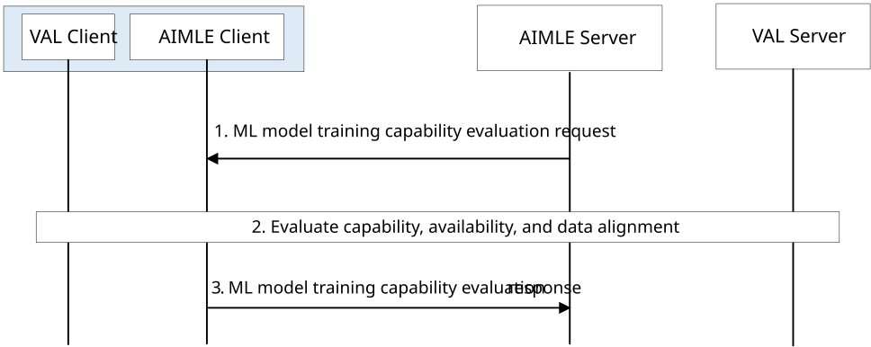

# 8.19 ML Model Training Capability Evaluation

This clause describes procedure for supporting ML model training capability evaluation for FL (e.g., HFL, VFL).

## 8.19.1 General

The following clauses specify procedures, information flows and APIs to support ML model training capability evaluation for FL (e.g., HFL, VFL). The ML model training capability result can be used by the AIMLE server to select FL members for FL training process (e.g. HFL, VFL).

## 8.19.2 Procedure for ML model training capability evaluation

Pre-conditions:

1\. AIMLE server determines to use FL (e.g., HFL, VFL) training.

2\. AIMLE Server knows the information of the FL (e.g., HFL, VFL) members (e.g., AIMLE Client which is deployed to a UE).

Figure 8.19.2-1: Procedure for ML model training capability evaluation

1\. The AIMLE Server sends ML model training capability evaluation request to the FL members (AIMLE Clients which are deployed on UEs). The request message includes information as described in Table 8.19.3.1-1.

2\. The FL members evaluate their capability and availability to join the FL training process. The FL members (AIMLE Clients which are deployed on UEs) run the test task contained in the request in step 1 and determine if it can join the FL process. For VFL, as part of the test task, data alignment between the datasets of the different domains are determined. The VAL server may also provide data labels for the data alignment.

NOTE: The procedures for data collection from UE need to take user consent into account.

3\. The FL members (AIMLE Clients which are deployed on UEs) send ML model training capability evaluation response to the AIMLE Server. The response message contains the information as described in Table 8.19.3.2-1.

## 8.19.3 Information flows

### 8.19.3.1 ML model training capability evaluation request

Table 8.19.3.1-1 shows the request sent by AIMLE server to FL (e.g., HFL, VFL) members (AIMLE Clients which are deployed on UEs) for ML model training capability evaluation.

Table 8.19.3.1-1: ML model training capability evaluation request

<table>
<colgroup>
<col style="width: 33%" />
<col style="width: 12%" />
<col style="width: 53%" />
</colgroup>
<thead>
<tr class="header">
<th>Information element</th>
<th>Status</th>
<th>Description</th>
</tr>
</thead>
<tbody>
<tr class="odd">
<td>Requestor identifier</td>
<td>M</td>
<td>The identifier of the requestor.</td>
</tr>
<tr class="even">
<td>Available time</td>
<td>O</td>
<td>Requirement on available time for supporting FL operations.</td>
</tr>
<tr class="odd">
<td>Test task</td>
<td>O</td>
<td>The task for test ML model training capability.</td>
</tr>
<tr class="even">
<td>AI/ML model and model parameter(s)</td>
<td>O</td>
<td>Information about the AI/ML model and model parameters for use in FL training. In VFL, AI/ML models for different data domains are provided.</td>
</tr>
<tr class="odd">
<td>Requirement on dataset</td>
<td>O</td>
<td>Requirements on dataset for FL training.</td>
</tr>
<tr class="even">
<td>&gt;Common feature ID(s)</td>
<td>
O

(NOTE 1)
</td>
<td>Identifier(s) of the required features common to the dataset of the different data domains.</td>
</tr>
<tr class="odd">
<td>&gt;Data domain feature ID lists</td>
<td>
O

(NOTE 1)
</td>
<td>List of features for each data domain(s) of the datasets at the UE.</td>
</tr>
<tr class="even">
<td>&gt;Data source</td>
<td>
O

(NOTE 2)
</td>
<td>Data source for the FL training.</td>
</tr>
<tr class="odd">
<td colspan="3">
NOTE 1: If Requirement on dataset is provided, at least one of these IEs shall be present when for VFL.

NOTE 2: If Requirement on dataset is provided, the IE shall be present when for HFL.
</td>
</tr>
</tbody>
</table>

NOTE: The detail content of the Test task and AI/ML model is up to implementation.

### 8.19.3.2 ML model training capability evaluation response

Table 8.19.3.2-1 shows the response sent by FL members (AIMLE Clients which are deployed on UEs) to AIMLE server for the ML model training capability evaluation.

Table 8.19.3.2-1: ML model training capability evaluation response

<table>
<colgroup>
<col style="width: 33%" />
<col style="width: 12%" />
<col style="width: 53%" />
</colgroup>
<thead>
<tr class="header">
<th>Information element</th>
<th>Status</th>
<th>Description</th>
</tr>
</thead>
<tbody>
<tr class="odd">
<td>Status</td>
<td>M</td>
<td>
The status for the evaluation: success, fail.

<ul>
<li>
Success means join the FL training process.
</li>
<li>
Fail means not join the FL training process.
</li>
</ul></td>
</tr>
<tr class="even">
<td>Test result</td>
<td>O</td>
<td>The test result of the ML model training capability evaluation. The "test result" shall be provided when the "status" is "success".</td>
</tr>
<tr class="odd">
<td>Fail reason</td>
<td>O</td>
<td>The reason of the ML model training capability evaluation fail. The "fail reason" shall be provided when the "status" is "fail".</td>
</tr>
</tbody>
</table>
