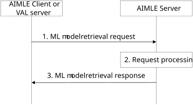
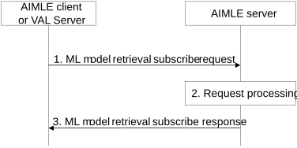
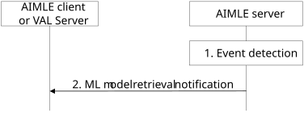
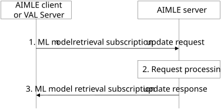
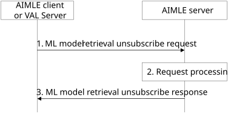

# 8.2 ML model retrieval

## 8.2.1 General

ML model retrieval enable applications consuming services from the AI/ML application enablement layer to retrieve ML models available with the enablement layer.

ML model retrieval enables an AIMLE client or VAL server to obtain ML models of interest. The retrieval of ML models is based on matching ML model retrieval filters provided in the request.

ML model retrieval subscription enables an AIMLE client or VAL server to receive notifications about ML models of interest. The subscription is based on matching ML model retrieval filters provided in the subscription request.

## 8.2.2 Procedure

### 8.2.2.1 General

Following procedures are supported for ML model retrieval:

\- ML model retrieval request-response procedure;

\- ML model subscribe-notify procedures for retrieval of ML models, comprising:

\- Subscription procedure;

\- Subscription update procedure; and

\- Unsubscribe procedure;

### 8.2.2.2 ML model retrieval

Figure 8.2.2.2-1 illustrates the procedure for an AIMLE client or VAL server to discover and obtain ML models from the AIMLE server.

Pre-conditions:

1\. The AIMLE client or VAL server has received information (e.g., URI, IP address) related to the AIMLE Server.

2\. The AIMLE client or VAL server has received security credentials authorizing it to communicate with the AIMLE server.

Figure 8.2.2.2-1: ML model retrieval

1\. The requestor (e.g., AIMLE client or VAL server) sends a ML model retrieval request to the AIMLE server. The request includes the requestor identifier along with security credentials and may include ML model retrieval filters.

2\. Upon receiving the request from the requestor, the AIMLE server validates if the requestor is authorized for the request.

> If the requestor is authorized, the AIMLE server may determine if the requested ML model is available with the AIMLE server based on ML model retrieval filters. If the ML model is not available with the AIMLE server, the AIMLE server performs the ML model information discovery procedure with the ML repository as described in clause 8.11.3.
>
> If the request is received from an AIMLE client that has registered with the AIMLE server, the AIMLE server determines the ML model based on the AIMLE client profile (Table 8.7.3.2-2), e.g. supported AI/ML model types, application layer AIMLE client capabilities.

3\. The AIMLE server sends a ML model retrieval response to the requestor. If the AIMLE server has determined ML models (e.g., locally, or from the ML repository), the response includes an indication of success and may include the ML models. Otherwise, the response includes an indication of failure and may include a reason for failure.

Upon receiving a response including ML models, the requestor can store the ML models and may provide the ML model to the VAL client(s) if the requestor is the AIMLE client.

### 8.2.2.3 ML model retrieval subscription

#### 8.2.2.3.1 General

Clause 8.2.2.3.2 and clause 8.2.2.3.3 together illustrate the ML model retrieval subscribe-notify ML model.

Clause 8.2.2.3.4 illustrates the ML model retrieval subscription update procedure.

Clause 8.2.2.3.5 illustrates the ML model retrieval unsubscribe procedure.

#### 8.2.2.3.2 Subscribe

Figure 8.2.2.3.2-1 illustrates the procedure for an AIMLE client or VAL server to subscribe with the AIMLE server to be notified of retrieval of ML models.

Pre-conditions:

1\. The AIMLE client or VAL server has received information (e.g. URI, IP address) related to the AIMLE Server.

2\. The AIMLE client or VAL server has received security credentials authorizing it to communicate with the AIMLE server.

Figure 8.2.2.3.2-1: ML model retrieval subscription

1\. The requestor (e.g., AIMLE client or VAL server) sends a ML model retrieval subscribe request to the AIMLE server. The request includes the requestor identifier, security credentials and may include ML model retrieval filters and expiration time.

2\. Upon receiving the request from the requestor, the AIMLE server validates if the requestor is authorized for the request. If the requestor is authorized, the AIMLE server creates the subscription and stores the subscription information.

3\. The AIMLE server sends a ML model retrieval subscribe response to the requestor. If the AIMLE server has created the subscription, the response includes an indication of success, the subscription identity and may include an expiration time; to maintain the subscription, the requestor shall send a subscription update request before the expiration time, otherwise the ML model retrieval subscription expires. If the AIMLE server has not created the subscription, the response includes an indication of failure and may include a reason for failure.

#### 8.2.2.3.3 Notify

Figure 8.2.2.3.3-1 illustrates the ML model retrieval notify operation between the AIMLE server and an AIMLE client or VAL server.

Pre-conditions:

1\. The AIMLE client or VAL server has subscribed for ML model retrieval with the AIMLE Server.

Figure 8.2.2.3.3-1: ML model retrieval notification

> 1\. An event occurs at the AIMLE server that satisfies trigger conditions for notifying a subscriber (e.g., AIMLE client or VAL server). The event may be the detection of availability of new ML model(s) (e.g., new ML model or new revision of a ML model) that satisfies the ML model retrieval filters of the subscription, or changes in the AIMLE client profile. For example, the AIMLE server receives an updated AIMLE client profile with updated “supported AI/ML model type” which indicates the existing model is no longer supported and a new model needs to be retrieved. The detection of availability of new ML models by the AIMLE server is based on ML model storage in the ML repository as described in clause 8.11.2.

2\. The AIMLE server sends a ML model retrieval notification to the requestor indicating newly available ML models. The notification includes a subscription identity and newly available ML model(s).

#### 8.2.2.3.4 Subscription update

Figure 8.2.2.3.4-1 illustrates the procedure for an AIMLE client or VAL server to update a subscription with the AIMLE server.

Pre-conditions:

1\. The AIMLE client or VAL server has subscribed for ML model retrieval with the AIMLE Server.

Figure 8.2.2.3.4-1: ML model retrieval subscription update

1\. The requestor (e.g., AIMLE client or VAL server) sends a ML model retrieval update request to the AIMLE server. The request includes the requestor identifier, security credentials and the subscription identifier and may include ML model retrieval filters and expiration time.

2\. Upon receiving the request from the requestor, the AIMLE server validates if the requestor is authorized for the request. If the requestor is authorized, the AIMLE server updates the subscription information.

3\. The AIMLE server sends a ML model retrieval subscription update response to the requestor. If the AIMLE server has updated the subscription, the response includes an indication of success and may include an expiration time. To maintain the subscription, the requestor shall send a subscription update request before the expiration time, otherwise the ML model retrieval subscription expires. If the AIMLE server has not updated the subscription, the response includes an indication of failure and may include a reason for failure.

#### 8.2.2.3.5 Unsubscribe

Figure 8.2.2.3.5-1 illustrates the procedure for an AIMLE client or VAL server to unsubscribe with the AIMLE server.

Pre-conditions:

1\. The AIMLE client or VAL server has subscribed for ML model retrieval with the AIMLE Server.

Figure 8.2.2.3.5-1: ML model retrieval unsubscribe

1\. The requestor (e.g., AIMLE client or VAL server) sends a ML model retrieval unsubscribe request to the AIMLE server. The request includes the requestor identifier, security credentials and the subscription identifier.

2\. Upon receiving the request from the requestor, the AIMLE server validates if the requestor is authorized for the request. If the requestor is authorized, the AIMLE server cancels the subscription.

3\. The AIMLE server sends a ML model retrieval unsubscribe response to the requestor. If the AIMLE server has canceled the subscription, the response includes an indication of success. If the AIMLE server has not canceled the subscription, the response includes an indication of failure and may include a reason for failure.

## 8.2.3 Information flows

### 8.2.3.1 ML model retrieval request

Table 8.2.3.1-1 describes information elements for the ML model retrieval request from the AIMLE client or VAL server to the AIMLE server.

Table 8.2.3.1-1: ML model retrieval request

| Information element  | Status | Description                                                                                             |
|----------------------|--------|---------------------------------------------------------------------------------------------------------|
| Requestor identifier | M      | The identifier of the requestor (e.g., AIMLE client or VAL server).                                     |
| Security credentials | M      | The security credentials of the requestor.                                                              |
| Filtering criteria   | O      | Represents the filtering criteria, which can be any of the ML model information as in Table 8.11.4.1-2. |

### 8.2.3.2 ML model retrieval response

Table 8.2.3.2-1 describes information elements for the ML model retrieval response from the AIMLE server.

Table 8.2.3.2-1: ML model retrieval response

<table>
<colgroup>
<col style="width: 33%" />
<col style="width: 16%" />
<col style="width: 50%" />
</colgroup>
<thead>
<tr class="header">
<th>Information element</th>
<th>Status</th>
<th>Description</th>
</tr>
</thead>
<tbody>
<tr class="odd">
<td>Successful response</td>
<td>
O

(NOTE 2)
</td>
<td>Indicates that the ML model retrieval request was successful.</td>
</tr>
<tr class="even">
<td>&gt;List of ML models</td>
<td>M</td>
<td>List of retrieved ML models; the nested information elements are provided for each ML model in the list.</td>
</tr>
<tr class="odd">
<td>&gt;&gt; ML model identifier</td>
<td>M</td>
<td>The ML model identifier.</td>
</tr>
<tr class="even">
<td>&gt;&gt; ML model retrieval endpoint (NOTE 1)</td>
<td>O</td>
<td>The endpoint (e.g., URL, URI, IP address) where the ML model file can be retrieved.</td>
</tr>
<tr class="odd">
<td>&gt;&gt; ML model (NOTE 1)</td>
<td>O</td>
<td>The ML model containing a retrieved ML model.</td>
</tr>
<tr class="even">
<td>Failure response</td>
<td>
O

(NOTE 2)
</td>
<td>Indicates that the request has failed.</td>
</tr>
<tr class="odd">
<td>&gt; Cause</td>
<td>O</td>
<td>The cause for the request failure.</td>
</tr>
<tr class="even">
<td colspan="3">
NOTE 1: At least one of these information elements is needed.

NOTE 2: One of the IEs shall be present.
</td>
</tr>
</tbody>
</table>

### 8.2.3.3 ML model retrieval subscribe request

Table 8.2.3.3-1 describes information elements for the ML model retrieval subscription request from the AIMLE client or VAL server to the AIMLE server.

Table 8.2.3.3-1: ML model retrieval subscription request

| Information element         | Status | Description                                                                                             |
|-----------------------------|--------|---------------------------------------------------------------------------------------------------------|
| Requestor identifier        | M      | The identifier of the requestor (e.g., AIMLE client or VAL server).                                     |
| Security credentials        | M      | The security credentials of the requestor.                                                              |
| Notification Target Address | M      | Notification target address (e.g. URL) where the notifications should be sent.                          |
| Proposed expiration time    | O      | Proposed expiration time for the subscription.                                                          |
| Filtering criteria          | O      | Represents the filtering criteria, which can be any of the ML model information as in Table 8.11.4.1-2. |

### 8.2.3.4 ML model retrieval subscription response

Table 8.2.3.4-1 describes information elements for the ML model retrieval subscription response from the AIMLE server.

Table 8.2.3.4-1: ML model retrieval subscription response

<table>
<colgroup>
<col style="width: 33%" />
<col style="width: 16%" />
<col style="width: 50%" />
</colgroup>
<thead>
<tr class="header">
<th>Information element</th>
<th>Status</th>
<th>Description</th>
</tr>
</thead>
<tbody>
<tr class="odd">
<td>Successful response</td>
<td>
O

(NOTE)
</td>
<td>Indicates that the ML model retrieval request was successful.</td>
</tr>
<tr class="even">
<td>&gt; Subscription ID</td>
<td>M</td>
<td>Subscription identifier corresponding to the subscription.</td>
</tr>
<tr class="odd">
<td>&gt; Expiration time</td>
<td>O</td>
<td>Indicates the expiration time of the subscription. To maintain an active subscription, a subscription update is required before the expiration time.</td>
</tr>
<tr class="even">
<td>Failure response</td>
<td>
O

(NOTE)
</td>
<td>Indicates that the request has failed.</td>
</tr>
<tr class="odd">
<td>&gt; Cause</td>
<td>O</td>
<td>The cause for the request failure.</td>
</tr>
<tr class="even">
<td colspan="3">NOTE: One of the IEs shall be present.</td>
</tr>
</tbody>
</table>

### 8.2.3.5 ML model retrieval notification

Table 8.2.3.5-1 describes information elements for the ML model retrieval subscription response from the AIMLE server.

Table 8.2.3.5-1: ML model retrieval notification

| Information element                             | Status | Description                                                                                              |
|-------------------------------------------------|--------|----------------------------------------------------------------------------------------------------------|
| Subscription ID                                 | M      | Subscription identifier corresponding to the subscription.                                               |
| List of ML models                               | O      | List of retrieved ML models; the nested information elements are provided for each ML model in the list. |
| \> ML model identifier                          | O      | The ML model identifier.                                                                                 |
| \> ML model retrieval endpoint (NOTE)           | O      | The endpoint (e.g., URL, URI, IP address) where the ML model file can be retrieved.                      |
| \> ML model (NOTE)                              | O      | The ML model containing a retrieved ML model.                                                            |
| NOTE: At least one of these elements is needed. |        |                                                                                                          |

### 8.2.3.6 ML model retrieval subscription update request

Table 8.2.3.6-1 describes information elements for the ML model retrieval subscription update request from the AIMLE client or VAL server to the AIMLE server.

Table 8.2.3.6-1: ML model retrieval subscription update request

| Information element         | Status | Description                                                                                             |
|-----------------------------|--------|---------------------------------------------------------------------------------------------------------|
| Requestor identifier        | M      | The identifier of the requestor (e.g., AIMLE client or VAL server).                                     |
| Security credentials        | M      | The security credentials of the requestor.                                                              |
| Subscription ID             | M      | Subscription identifier corresponding to the subscription to be updated.                                |
| Notification Target Address | O      | Notification target address (e.g. URL, URI, IP address) where the notifications should be sent.         |
| Proposed expiration time    | O      | Proposed expiration time for the subscription.                                                          |
| Filtering criteria          | O      | Represents the filtering criteria, which can be any of the ML model information as in Table 8.11.4.1-2. |

### 8.2.3.7 ML model retrieval subscription update response

Table 8.2.3.7-1 describes information elements for the ML model retrieval subscription update response from the AIMLE server.

Table 8.2.3.7-1: ML model retrieval subscription update response

<table>
<colgroup>
<col style="width: 33%" />
<col style="width: 16%" />
<col style="width: 50%" />
</colgroup>
<thead>
<tr class="header">
<th>Information element</th>
<th>Status</th>
<th>Description</th>
</tr>
</thead>
<tbody>
<tr class="odd">
<td>Successful response</td>
<td>
O

(NOTE)
</td>
<td>Indicates that the ML model retrieval subscription update request was successful.</td>
</tr>
<tr class="even">
<td>&gt; Expiration time</td>
<td>O</td>
<td>Indicates the expiration time of the subscription. To maintain an active subscription, a subscription update is required before the expiration time.</td>
</tr>
<tr class="odd">
<td>Failure response</td>
<td>
O

(NOTE)
</td>
<td>Indicates that the request has failed.</td>
</tr>
<tr class="even">
<td>&gt; Cause</td>
<td>O</td>
<td>The cause for the request failure.</td>
</tr>
<tr class="odd">
<td colspan="3">NOTE: One of the IEs shall be present.</td>
</tr>
</tbody>
</table>

### 8.2.3.8 ML model retrieval unsubscribe request

Table 8.2.3.8-1 describes information elements for the ML model retrieval unsubscribe request from the AIMLE client or VAL server to the AIMLE server.

Table 8.2.3.8-1: ML model retrieval unsubscribe request

| Information element  | Status | Description                                                                   |
|----------------------|--------|-------------------------------------------------------------------------------|
| Requestor identifier | M      | The identifier of the requestor (e.g., AIMLE client or VAL server).           |
| Security credentials | M      | The security credentials of the requestor.                                    |
| Subscription ID      | M      | Subscription identifier corresponding to the subscription to be unsubscribed. |

### 8.2.3.9 ML model retrieval unsubscribe response

Table 8.2.3.9-1 describes information elements for the ML model retrieval unsubscribe response from the AIMLE server.

Table 8.2.3.9-1: ML model retrieval unsubscribe response

<table>
<colgroup>
<col style="width: 33%" />
<col style="width: 16%" />
<col style="width: 50%" />
</colgroup>
<thead>
<tr class="header">
<th>Information element</th>
<th>Status</th>
<th>Description</th>
</tr>
</thead>
<tbody>
<tr class="odd">
<td>Successful response</td>
<td>
O

(NOTE)
</td>
<td>Indicates that the ML model retrieval unsubscribe request was successful.</td>
</tr>
<tr class="even">
<td>Failure response</td>
<td>
O

(NOTE)
</td>
<td>Indicates that the request has failed.</td>
</tr>
<tr class="odd">
<td>&gt; Cause</td>
<td>O</td>
<td>The cause for the request failure.</td>
</tr>
<tr class="even">
<td colspan="3">NOTE: One of the IEs shall be present.</td>
</tr>
</tbody>
</table>
