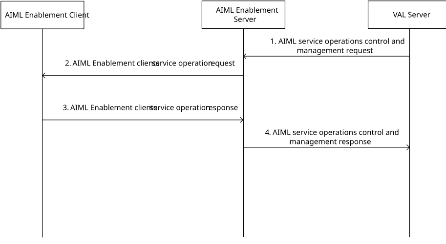

# 8.20 AIML service operations control and management procedure

## 8.20.1 General

The control and management of the AIML services is an essential requirement for the applications to manage the AIML services like model training, inference, discovery etc.

## 8.20.2 AIML service operations control and management procedure

Figure 8.20.1-1: AIML service operations control and management procedure

1\. The VAL server sends AIML service operations control and management request to the AIML Enablement server as per the Table 8.20.3.1-1.

2-3. The AIMLE server determines the required service operation mode to manage the AIML service operation lifecycle based on the AIML service operation mode, AIML service operation information. For example, the AIMLE server can perform client discovery/selection using the procedure defined in 3GPP TS 23.482 clause 9.3 and model training using the procedure defined in 3GPP TS 23.482 clause 8.3. Based on the AIML client identifier the AIMLE server sends the AIML Enablement client service operation request as per Table 8.20.3.3-1.

> The AIML service operation mode includes start and stop operation. Start indicates the initiation of the AIML service and stop indicates termination of the AIML service.
>
> The AIML Enablement client receiving the AIML service operation mode performs the service operation mode for the AIML service operation. The AIMLE client can configure and monitor the AIML service operation as per the AIML service operation mode configuration. Based on the AIML service operation mode status reporting configuration (periodic or event-triggered), the AIML client reports the service operation mode status to the AIML Enablement server. The AIML Enablement client sends a response indicating the success or failure of the AIML Enablement client service operation as per Table 8.20.3.4-1.

4\. The AIML Enablement server provides the AIML service operations control and management response to the VAL server. The message includes AIML service operation ID and the reporting status of the AIML service operation.

## 8.20.3 Information flows

### 8.20.3.1 AIML service operations control and management request

Table 8.20.3.1-1 shows the request sent by an AIML service consumer (e.g., VAL server) to an AIMLE server for the AIML service operations control and management request.

Table 8.20.3.1-1: AIML service operations control and management request

<table>
<colgroup>
<col style="width: 31%" />
<col style="width: 13%" />
<col style="width: 55%" />
</colgroup>
<thead>
<tr class="header">
<th>Information element</th>
<th>Status</th>
<th>Description</th>
</tr>
</thead>
<tbody>
<tr class="odd">
<td>Requestor identity</td>
<td>M</td>
<td>The identifier of the requestor (e.g., VAL server).</td>
</tr>
<tr class="even">
<td>VAL service identifier</td>
<td>O</td>
<td>An identifier for the VAL service associated with the requestor.</td>
</tr>
<tr class="odd">
<td>AIMLE client identifier(s)</td>
<td>
O

(NOTE)
</td>
<td>Indicates the identifier(s) of AIML enablement client(s).</td>
</tr>
<tr class="even">
<td>AIMLE client set identifier</td>
<td>
O

(NOTE)
</td>
<td>An identifier for the AIMLE client set.</td>
</tr>
<tr class="odd">
<td>AIML service operation identifier</td>
<td>O</td>
<td>Indicates the AIML service operation identifier to identify the AIML service. (e.g., model training id, ml task id)</td>
</tr>
<tr class="even">
<td>AIML service operation information</td>
<td>O</td>
<td>Indicates AIML service operation information. It includes AIML service model container, URI of the model to fetch the model from a repository, AIML service aggregator URI to send model updates, AIML service operation optimization assistance like maximum convergence time</td>
</tr>
<tr class="odd">
<td>AIML service operation mode</td>
<td>M</td>
<td>Indicates the required AIMLE service operation modes like start, stop. The start mode defines the initiation of the AIML service. The stop mode is defined to stop the AIML operation.</td>
</tr>
<tr class="even">
<td>AIML service operation mode configuration</td>
<td>O</td>
<td>Indicates the configuration of the AIML service operation modes. It includes network utilization (like stop the AIML service when latency is worse than x milliseconds, time limit threshold (like stop the AIML service after 24 hours), model performance (like stop the AIML service when model accuracy is 99% achieved)</td>
</tr>
<tr class="odd">
<td>AIML service operation mode status reporting</td>
<td>O</td>
<td>Indicates the reporting configuration of the AIML service operation status like periodic (e.g. time interval) or event based (e.g., transition of AIML service operation from stop to start)</td>
</tr>
<tr class="even">
<td colspan="3">NOTE: One of the information elements is present.</td>
</tr>
</tbody>
</table>

### 8.20.3.2 AIML service operations control and management response

Table 8.20.3.2-1 shows the request sent by an AIML Enablement server to an AIML service consumer (e.g., VAL server) for the AIML service operations control and management response.

Table 8.20.3.2-1: AIML service lifecycle management response

| Information element                       | Status | Description                                                               |
|-------------------------------------------|--------|---------------------------------------------------------------------------|
| VAL service identifier                    | O      | An identifier for the VAL service associated with the requestor.          |
| AIML service operation ID                 | M      | An identifier to identify the AIML service operation ID                   |
| AIML service operation mode report status | M      | Indicates the current state of AIMLE service operation. E.g., start, stop |

### 8.20.3.3 AIML Enablement client service operation request

Table 8.20.3.3-1 shows the request sent by an AIML Enablement server to an AIML Enablement client for the AIML Enablement client service operation request.

Table 8.20.3.3-1: AIML Enablement client service operation request

| Information element                          | Status | Description                                                                                                                                                                                                                                                                                                                  |
|----------------------------------------------|--------|------------------------------------------------------------------------------------------------------------------------------------------------------------------------------------------------------------------------------------------------------------------------------------------------------------------------------|
| Requestor identity                           | M      | The identifier of the requestor (e.g. AIML service consumer).                                                                                                                                                                                                                                                                |
| VAL service identifier                       | O      | An identifier for the VAL service associated with the requestor.                                                                                                                                                                                                                                                             |
| AIML service operation ID                    | M      | An identifier to identify the AIML service operation ID                                                                                                                                                                                                                                                                      |
| AIML service operation mode                  | M      | Indicates the required AIMLE service operation modes like start, stop.                                                                                                                                                                                                                                                       |
| AIML service operation information           | O      | Indicates AIML service operation information. It includes AIML service model container, URI of the model to fetch the model from a repository, AIML service aggregator URI to send model updates, AIML service operation optimization assistance like maximum convergence time                                               |
| AIML service operation mode configuration    | O      | Indicates the configuration of the AIML service operation modes. It includes network utilization (like stop the AIML service when latency is worse than x milliseconds, time limit threshold (like stop the AIML service after 24 hours), model performance (like stop the AIML service when model accuracy is 99% achieved) |
| AIML service operation mode status reporting | O      | Indicates the reporting configuration of the AIML service operation status like periodic (e.g. time interval) or event based (e.g. transition of AIML service operation from stop to start)                                                                                                                                  |

### 8.20.3.4 AIML Enablement client service operation response

Table 8.20.3.4-1 shows the request sent by an AIML Enablement client to an AIML Enablement server for the AIML Enablement client service operation response or update response.

Table 8.20.3.4-1: AIML Enablement client service operation response

| Information element                | Status | Description                                                                         |
|------------------------------------|--------|-------------------------------------------------------------------------------------|
| VAL service identifier             | O      | An identifier for the VAL service associated with the requestor.                    |
| AIML service operation ID          | M      | An identifier to identify the AIML service operation ID                             |
| AIML service operation mode status | M      | Indicates the current state of AIMLE service operation. Possible values start, stop |
