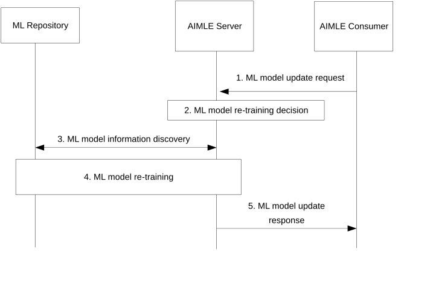

# 8.21 ML model update

## 8.21.1 General

This clause provides the procedures to support ML model re-training and update when model performance degradation is observed by the AIML enablement layer. The model update procedure also supports using an existing model to re-train the model using Transfer Learning. Additionally, if the degraded model is related to other models due to e.g., Transfer Learning, the AIMLE server may trigger the update of those related models as well.

## 8.21.2 Procedure

Figure 8.21.2-1 depicts the procedure where the AIML enablement capability can trigger model update upon detecting model performance degradation.

Pre-conditions:

1\. The AIMLE Server has provided a ML model to the AIMLE Consumer. The AIMLE consumer can be a VAL server, AIMLE client, or ADAE server.

2\. The AIMLE Consumer detects a performance degradation of the ML model. If the consumer is an ADAE server, performance degradation may be detected as described in clause 8.17 in 3GPP TS 23.436 \[4\].

Figure 8.21.2-1: Support for ML model update

1\. The AIMLE Consumer sends an ML model update request to the AIMLE Server that includes the ID of the model and performance degradation information.

2\. Based on the performance degradation information, the AIMLE Server determines whether to update the ML model. If the AIMLE Server does not update the model, steps 3 and 4 are skipped.

3\. The AIMLE Server retrieves the ML model information from the ML Repository as described in clause 8.11.3. The AIMLE Server may also perform ML model discovery to determine whether an existing ML model stored by the ML Repository can be used to replace the degraded model or train the new model (e.g., using Transfer Learning). If an existing model can be used to replace the degraded model, step 4 is skipped, and the identified model is provided in step 5.

The AIMLE Server can also discover models that are related due to Transfer Learning or the use of the same training data, to identify additional models that may require an update.

4\. The AIMLE Server performs ML model re-training, which corresponds to the ML model training procedure as described in clause 8.3. The updated model is stored in the ML repository once re-training is complete.

If the degraded model is linked to other models (e.g., due to Transfer Learning, or the same training data has been used), the AIMLE Server may trigger the re-training and update of those related models.

5\. The AIMLE Server provides the updated ML model to the AIMLE Consumer either by sending it directly, or by providing endpoint information to retrieve it from the ML Repository.

## 8.21.3 Information flows

### 8.21.3.1 ML model update request

Table 8.21.3.1-1 details the ML model update request IEs.

Table 8.21.3.1-1: ML model update request

| **Information element**             | **Status** | **Description**                                                                                                                                                    |
|-------------------------------------|------------|--------------------------------------------------------------------------------------------------------------------------------------------------------------------|
| Requestor Identity                  | M          | The identity of the AIMLE Consumer sending the request.                                                                                                            |
| ML model ID                         | M          | Provides the ID of ML model for which the performance degradation has been detected.                                                                               |
| Performance degradation information | O          | Provides details about the detected performance degradation, such as the time, instances, or information on the degraded metrics (e.g. accuracy, recall, F1score). |
| ML model retrieval endpoint         | O          | The endpoint (e.g., URL, URI, IP address) where the ML model file can be retrieved.                                                                                |

### 8.21.3.1 ML model update response

Table 8.21.3.2-1 details the ML model update response IEs.

Table 8.21.3.2-1: ML model update response

<table>
<colgroup>
<col style="width: 33%" />
<col style="width: 16%" />
<col style="width: 50%" />
</colgroup>
<thead>
<tr class="header">
<th><strong>Information element</strong></th>
<th><strong>Status</strong></th>
<th><strong>Description</strong></th>
</tr>
</thead>
<tbody>
<tr class="odd">
<td>Successful response</td>
<td>
O

(NOTE 1)
</td>
<td>Indicates that the model has been updated.</td>
</tr>
<tr class="even">
<td>&gt; ML model</td>
<td>
O

(NOTE 2)
</td>
<td>Provides the updated ML model.</td>
</tr>
<tr class="odd">
<td>&gt; ML model retrieval endpoint</td>
<td>
O

(NOTE 2)
</td>
<td>The endpoint (e.g., URL, URI, IP address) where the ML model file can be retrieved.</td>
</tr>
<tr class="even">
<td>&gt; ML model information</td>
<td>O</td>
<td>Provides information of the ML model, specified in Table 8.11.4.1-2.</td>
</tr>
<tr class="odd">
<td>Failure response</td>
<td>
O

(NOTE 1)
</td>
<td>Indicates that the request has failed.</td>
</tr>
<tr class="even">
<td>&gt; Cause</td>
<td>O</td>
<td>Indicates the failure cause.</td>
</tr>
<tr class="odd">
<td colspan="3">
NOTE 1: Only one of these information elements shall be provided.

NOTE 2: At least one of these information elements shall be provided.
</td>
</tr>
</tbody>
</table>
