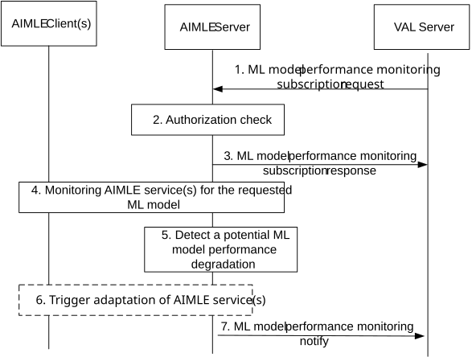

# 8.22 ML model performance monitoring

## 8.22.1 General

The following clauses specify procedures, information flows, and APIs for ML model performance monitoring and potential degradation detection.

## 8.22.2 Procedure

Pre-conditions:

1\. One or more AIMLE services (at the AIMLE server or clients) using the given ML model are ongoing.

Figure 8.22.2-1: ML model performance monitoring

1\. The VAL server sends an ML model performance monitoring subscription request to AIMLE server, requesting to assist in monitoring the ML model performance. This request consists of ML model information and optionally the AIML service information, etc. The request also includes the ML model evaluation profile ID which is associated with a ML model evaluation profile containing the baseline validation dataset information which is the baseline reference for evaluation of HFL model after each round of parameter aggregation.

2\. The AIMLE server checks whether the VAL server is authorized to perform the ML model performance monitoring request.

3\. If the VAL server is authorized, AIMLE server returns the success response, otherwise a failure response indication the reason for failure.

4\. The AIMLE server identifies the AIMLE services which are utilizing the requested ML model. Such AIMLE services can be an ML model training service or an HFL service at the AIMLE server or clients.

The identification of the AIMLE services may be performed via fetching ML model information from the ML repository using ML model management procedure as in clause 8.11.3. The ML Evaluation profile ID is used to obtain the ML model evaluation profile (e.g., baseline validation dataset) which is used to determine the ML model performance.

Then, the AIMLE server then starts monitoring the AIMLE service performance (e.g. accuracy, a KPI or QoS metric related to the AIML operation). This step includes receiving information from one or more AIMLE clients performing an operation based on the target ML model (e.g., based on step 7 of procedure in clause 8.12.2 or step 6 of procedure in clause 8.15.2), with an expected or experienced deviation of the required performance of the AIMLE service.

In order to get the information, the request includes Aggregated AI/ML model parameters indicating Information about the AI/ML model and model parameters for use in HFL training, Performance Metrics that are used to evaluate the performance of model (e.g. accuracy, latency) and ML model evaluation profile ID (The identifier of the ML model evaluation profile).

Each AIMLE client use the ML evaluation profile ID to obtain the ML model evaluation profile which is used to determine the ML model performance. Each AIMLE client evaluates the performance of the received aggregated global model on the local data based on the received Aggregated AI/ML model parameters, performance metrics and ML model evaluation profile. Each AIMLE client sends the performance report of aggregated global model on the local data as the response message to AILMLE Server. The performance report response message includes information AIMLE Client ID, AIMLE service ID, Performance records – indicating the evaluation performance records (e.g. on accuracy, on latency) of received aggregated global model from AIMLE Server on local data, and the identifier of the ML model evaluation profile used to perform the performance evaluation.

Upon receiving the performance report from the AIMLE client, the AIMLE server evaluates the model parameters based on baseline validation dataset. The AIMLE server further uses the baseline validation dataset to evaluate the global aggregated model also.

5\. The AIMLE server detects an expected ML model degradation (e.g., model drift, data drift) based on the deviation of the performance of the AIMLE service as indicated in step 4.

6\. The AIMLE server based on the expected ML model degradation, it may also indicate and execute a trigger action to ensure meeting the AIMLE service requirement. Further, AIMLE Server optionally sends a configuration request to increase training collaboration to only AIMLE Clients that have degraded performance records.

Such trigger action may be either an adaptation of the AIMLE service, such as training of a new ML model for the AIMLE by the same or a different AIMLE client, or re-training of the ML model by the same or different AIMLE client; or termination of the AIMLE service and initiating a new AIMLE service with a new ML model.

NOTE: If this action involves re-selecting an AIMLE client for the AIMLE service, this is based on the procedure defined in clause 8.9.

7\. The AIMLE server notifies the VAL server on the expected ML model degradation and if requested the triggered adaptation of the AIMLE service.

## 8.22.3 Information flows

### 8.22.3.1 ML model performance monitoring subscription request

Table 8.22.3.1-1 shows the request sent by a VAL server to an AIMLE server for the ML model performance monitoring.

Table 8.22.3.1-1: ML model performance monitoring subscription request

| Information element             | Status | Description                                                                                                                                                                                              |
|---------------------------------|--------|----------------------------------------------------------------------------------------------------------------------------------------------------------------------------------------------------------|
| Requestor identity              | M      | The identifier of the requestor (e.g., VAL server).                                                                                                                                                      |
| ML model identifier             | M      | The identifier of the ML model for which the monitoring applies.                                                                                                                                         |
| Notification endpoint           | M      | The notification endpoint (e.g. URL/URI/IP address) where the notifications should be sent to.                                                                                                           |
| AIML operation information      | O      | The AIMLE operation (ML model training, HFL, VFL, TL) for which the ML model is used.                                                                                                                    |
| \> VAL service ID               | O      | The VAL service identifier of the AIMLE service using the ML model (if known by the requestor).                                                                                                          |
| \> AIMLE client ID(s)           | O      | The identifier(s) of the AIMLE client(s) training the ML model (if known by the requestor).                                                                                                              |
| \> AIMLE service KPI            | O      | One or more KPIs for the AIMLE service performance (latency, accuracy, etc).                                                                                                                             |
| ML model evaluation profile ID  | O      | The identifier of the ML model evaluation profile.                                                                                                                                                       |
| Monitoring report configuration | M      | The reporting configuration for the monitoring service (thresholds for triggering a monitoring event, e.g. minimum accuracy, delay, whether the reporting is one time or periodical or event-triggered). |
| Area of interest                | O      | The geographical or service area for which the monitoring applies.                                                                                                                                       |
| Time validity                   | O      | The time validity for the monitoring subscription.                                                                                                                                                       |
| Trigger Action requirement      | O      | This requirement identifies policies for triggering an action based on a monitoring event (e.g. if degradation is detected, to train a new model or re-selecting AIMLE clients).                         |

### 8.22.3.2 ML model performance monitoring subscription response

Table 8.22.3.2-1 shows the response sent by the AIMLE server to the VAL server for the ML model performance monitoring subscription.

Table 8.22.3.2-1: ML model performance monitoring subscription response

<table>
<colgroup>
<col style="width: 33%" />
<col style="width: 11%" />
<col style="width: 54%" />
</colgroup>
<thead>
<tr class="header">
<th>Information element</th>
<th>Status</th>
<th>Description</th>
</tr>
</thead>
<tbody>
<tr class="odd">
<td>Successful response</td>
<td>
O

(NOTE)
</td>
<td>Indicates that the ML model performance monitoring request was successful.</td>
</tr>
<tr class="even">
<td>&gt; Subscription ID</td>
<td>M</td>
<td>Subscription identifier corresponding to the subscription.</td>
</tr>
<tr class="odd">
<td>&gt; Expiration time</td>
<td>O</td>
<td>Indicates the expiration time of the subscription. To maintain an active subscription, a subscription update is required before the expiration time.</td>
</tr>
<tr class="even">
<td>Failure response</td>
<td>
O

(NOTE)
</td>
<td>Indicates that the request has failed.</td>
</tr>
<tr class="odd">
<td>&gt; Cause</td>
<td>O</td>
<td>The cause for the request failure.</td>
</tr>
<tr class="even">
<td colspan="3">NOTE: Only one of these information elements shall be present.</td>
</tr>
</tbody>
</table>

### 8.22.3.3 ML model performance monitoring notify

Table 8.22.3.2-1 shows the notification sent by the AIMLE server to the VAL server for the ML model performance degradation.

Table 8.22.3.2-1: ML model performance monitoring notify

<table>
<colgroup>
<col style="width: 33%" />
<col style="width: 11%" />
<col style="width: 54%" />
</colgroup>
<thead>
<tr class="header">
<th>Information element</th>
<th>Status</th>
<th>Description</th>
</tr>
</thead>
<tbody>
<tr class="odd">
<td>Subscription ID</td>
<td>M</td>
<td>Subscription identifier corresponding to the subscription.</td>
</tr>
<tr class="even">
<td>ML model ID</td>
<td>M</td>
<td>Identity of the ML model.</td>
</tr>
<tr class="odd">
<td>ML model degradation indication</td>
<td>M</td>
<td>Identifies the degradation of the ML model.</td>
</tr>
<tr class="even">
<td>&gt;ML model degradation parameters</td>
<td>O</td>
<td>The performance metrics which are expected to be degraded (F1-score, recall, precision, accuracy).</td>
</tr>
<tr class="odd">
<td>&gt; Cause</td>
<td>O</td>
<td>The cause for the degradation of the ML model.</td>
</tr>
<tr class="even">
<td>Trigger Action</td>
<td>O</td>
<td>
The trigger action, which is notified, and may be one of the following:

<ul>
<li>
the adaptation of the AIMLE service, such as training of a new ML model for the AIMLE by the same or a different AIMLE client,
</li>
<li>
the re-training of the ML model by the same or different AIMLE client,
</li>
<li>
the termination of the AIMLE service and initiating a new AIMLE service with a new ML model.
</li>
</ul></td>
</tr>
</tbody>
</table>
