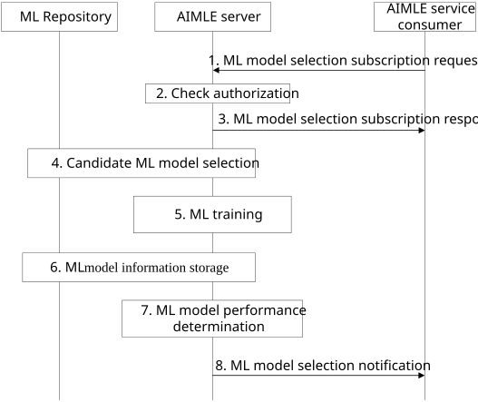

# 8.23 AIMLE assisted ML model selection

## 8.23.1 General

ML model selection is an important consideration for successful ML training and deployment. Many ML models exist for ML applications and some models can generate better results than other models for a particular dataset. The procedure allows AIMLE service consumers to request assistance from an AIMLE server with the selection of appropriate ML models for a given dataset and for the provided requirements. The AIMLE server coordinates the selection of candidate ML models and training the ML models with the given dataset. A list of ML models with corresponding performance is return to the AIMLE service consumer.

The following clauses specify procedures, information flows, and APIs for ML model selection.

## 8.23.2 Procedure

Pre-conditions:

1\. The AIMLE service consumer has identified datasets and ML requirements.

Figure 8.23.2-1: AIMLE assisted ML model selection

1\. An AIMLE service consumer (e.g. VAL server) sends a subscription request to an AIMLE server. The request includes information as described in Table 8.23.3.1-1. The AIMLE service consumer provides a list of candidate ML models, dataset identifiers, and requirements for training the candidate ML models. The AIMLE service consumer can either provide AIMLE client set identifiers or AIMLE client selection criteria for selecting the AIMLE clients to train the candidate ML models.

2\. The AIMLE server authenticates the requestor and checks authorization for the request. If authorized, the AMILE server assigns an identifier for the subscription.

3\. The AIMLE server sends a ML model selection subscription response that includes information in Table 8.23.3.2-1.

4\. The AIMLE server determines if additional ML models can be candidates for the type of ML application based on the ML model requirements provided in step 1 and selects additional candidate ML models to train with the given dataset. The AIMLE server can discover models from ML repository to determine the list of candidate ML models as described in clause 8.11.3.

5\. The AIMLE server performs ML model training for each candidate model. ML model training can be for split AI/ML operation as described in clause 8.14, Transfer Learning as described in clause 8.16, or Federated Learning as described in clauses 8.12 and 8.18. If AIMLE client selection criteria were provided in step 1, the AIMLE server performs AIMLE client selection as described in clauses 8.9 or 8.13 during the training of the candidate ML models.

6\. The AIMLE server performs ML model information storage as described in clause 8.11 for each trained ML model.

7\. The AIMLE server aggregates and determines the performance of each ML model with the given dataset.

8\. The AIMLE server sends a notification to the AIMLE service consumer and include information as described in Table 8.23.3.3-1. The notification includes a list of trained candidate ML models with corresponding model information and performance. The AIMLE service consumer can then select the best performing ML models from the list provided in the notification.

## 8.23.3 Information flows

### 8.23.3.1 AIMLE assisted ML model selection subscription request

Table 8.23.3.1-1 shows the request sent by an AIMLE service consumer to an AIMLE server for the AIMLE assisted ML model selection subscription procedure.

Table 8.23.3.1-1: ML model selection subscription request

<table>
<colgroup>
<col style="width: 33%" />
<col style="width: 16%" />
<col style="width: 50%" />
</colgroup>
<thead>
<tr class="header">
<th>Information element</th>
<th>Status</th>
<th>Description</th>
</tr>
</thead>
<tbody>
<tr class="odd">
<td>Requestor identifier</td>
<td>M</td>
<td>The identifier of the requestor.</td>
</tr>
<tr class="even">
<td>AIML profile</td>
<td>M</td>
<td>Requirements for the ML model selection operation.</td>
</tr>
<tr class="odd">
<td>&gt; Candidate ML models</td>
<td>M</td>
<td>A list of ML model identifiers (and initial model parameters) to train. The list provides candidate ML models to evaluate against the provided dataset.</td>
</tr>
<tr class="even">
<td>&gt; ML model requirements</td>
<td>O</td>
<td>ML model requirements for the AIMLE server to use for selecting additional candidate ML models for training with the provided datasets. The requirements can be any of the ML model information as described in Table 8.11.4.1-2.</td>
</tr>
<tr class="odd">
<td>&gt; AIMLE client set identifiers</td>
<td>
O

(NOTE1)
</td>
<td>A list of AIMLE client set identifiers to train the ML model.</td>
</tr>
<tr class="even">
<td>&gt; AIMLE client selection criteria</td>
<td>
O

(NOTE1)
</td>
<td>Selection criteria for finding suitable AIMLE clients for training the ML model.</td>
</tr>
<tr class="odd">
<td>&gt; Number of required AIMLE clients</td>
<td>
O

(NOTE2)
</td>
<td>A minimal number of AIMLE clients required for training the ML model.</td>
</tr>
<tr class="even">
<td>&gt; Dataset identifiers</td>
<td>M</td>
<td>Dataset identifiers to use for training and evaluating model performance to obtain a list of ML model rankings.</td>
</tr>
<tr class="odd">
<td>&gt; Training requirements</td>
<td>M</td>
<td>Training requirements as detailed in Table 8.23.3.1-2.</td>
</tr>
<tr class="even">
<td>Notification target</td>
<td>O</td>
<td>Endpoint information for receiving notifications.</td>
</tr>
<tr class="odd">
<td>Notification settings</td>
<td>O</td>
<td>Notification settings for which the AIMLE server provides ML model status: after, after certain job percentage completion, periodically based on date and time, upon error events, etc.</td>
</tr>
<tr class="even">
<td colspan="3">
NOTE1: At least one of the information elements shall be provided.

NOTE2: Mandatory if AIMLE client selection criteria are present.
</td>
</tr>
</tbody>
</table>

Table 8.23.3.1-2: Training requirements

| Information element       | Status | Description                                                                                                                                                                                                                                |
|---------------------------|--------|--------------------------------------------------------------------------------------------------------------------------------------------------------------------------------------------------------------------------------------------|
| Performance metric        | M      | Identifies the performance metric to evaluate ML model training. Performance metric can be mean absolute error, mean squared error, accuracy, precision and recall, etc. The performance metric indicates the performance of the ML model. |
| Performance target        | O      | A target performance that indicates acceptable performance has been reached and training can be stopped.                                                                                                                                   |
| Number of training rounds | M      | A minimum number of training rounds for the ML training.                                                                                                                                                                                   |
| Number of data samples    | M      | A minimum number of data samples for the ML training.                                                                                                                                                                                      |

### 8.23.3.2 ML model selection subscription response

Table 8.23.3.2-1 shows the response sent by the AIMLE server to the AIMLE service consumer for the AIMLE assisted ML model selection subscription procedure.

Table 8.23.3.2-1: ML model selection subscription response

| Information element     | Status | Description                                     |
|-------------------------|--------|-------------------------------------------------|
| Status                  | M      | The status for the ML model selection operation |
| Subscription identifier | M      | An identifier for the subscription.             |

### 8.23.3.3 ML model selection notification

Table 8.23.3.3-1 shows the notification sent by the AIMLE server to the AIMLE service consumer for the AIMLE assisted ML model selection subscription procedure.

Table 8.23.3.3-1: ML model selection notification

| Information element     | Status | Description                                                                                                                                                |
|-------------------------|--------|------------------------------------------------------------------------------------------------------------------------------------------------------------|
| Subscription identifier | M      | The identifier for the subscription that notification is associated with.                                                                                  |
| Operational status      | M      | The status for the ML model selection operation. The status can represent the estimate percentage completion or associated with the notification settings. |
| Trained ML models       | M      | The results of the ML model training.                                                                                                                      |
| \> ML model information | M      | Information about the ML model such as the ML model type as described in Table 8.11.4.1-2.                                                                 |
| \> Model performance    | M      | The performance metric for training the ML model.                                                                                                          |
| Elapse time             | O      | The time that has elapsed for the ML model selection operation.                                                                                            |
| Timestamp               | O      | Timestamp of the notification.                                                                                                                             |
