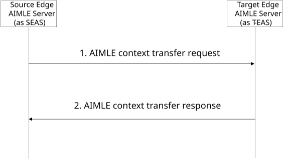

# 8.24 AIMLE context transfer

## 8.24.1 General

This clause describes AIMLE context transfer procedure between AIMLE servers (over AIML-E reference point).

## 8.24.2 Procedure

Pre-conditions:

1\. Each edge AIMLE server manages the AIMLE clients within its service area to perform AI/ML operations.

2\. A UE associated with an AIMLE client moves from a source service area (managed by a source edge AIMLE server) to a target service area (managed by a target edge AIMLE server). The transition triggers application context relocation (ACR) procedure between the two edge AIMLE servers (as source EAS and target EAS, respectively) as specified in 3GPP TS 23.558 \[12\].

Figure 8.24.2-1. AIMLE context transfer

1\. The source edge AIMLE server sends an AIMLE context transfer request to the target AIMLE server as described in Table 8.24.3.1-1. The request includes AIMLE context information which is generated based on the responses/notifications received from the transitioned AIMLE client (e.g. step 7 of clause 8.12.2 or step 3 of clause 8.20.1).

> The AIMLE context information is used by the target edge AIMLE server to determine whether the information (e.g. AI/ML operation output/result) received from the AIMLE client should be transferred to the source edge AIMLE server (or another edge AIMLE server that has been associated with the AIMLE client). For example, the target AIMLE server can forward the AIMLE service results received from the AIMLE client to the source AIMLE server if the results are only applicable to the source service area or the AIMLE client is part of a split operation pipeline formed in the source service area.If the AIMLE service needs to change the AIML model to another model onboard a satellite, then the AIMLE context information should contains the corresponding satellite information (ML model deployment information) as part of the ML model information.

2\. The target edge AIMLE server sends an AIMLE context transfer response to the source edge AIMLE server as described in Table 8.24.3.2-1.

## 8.24.3 Information flows

### 8.24.3.1 AIMLE context transfer request

Table 8.24.3.1-1 shows the AIMLE context transfer request that is sent by a source AIMLE server to a target AIMLE server.

Table 8.24.3.1-1: AIMLE context transfer request

| Information element       | Status | Description                                                     |
|---------------------------|--------|-----------------------------------------------------------------|
| Requestor identifier      | M      | The identifier of the requestor (e.g., AIMLE server).           |
| AIMLE Context Information | M      | The AIMLE context information as described in Table 8.24.3.1-2. |

Table 8.24.3.1-2: AIMLE context information

<table>
<colgroup>
<col style="width: 33%" />
<col style="width: 12%" />
<col style="width: 53%" />
</colgroup>
<thead>
<tr class="header">
<th>Information element</th>
<th>Status</th>
<th>Description</th>
</tr>
</thead>
<tbody>
<tr class="odd">
<td>AIMLE client ID</td>
<td>M</td>
<td>The identifier of the AIMLE client associated with the context.</td>
</tr>
<tr class="even">
<td>Current managing AIMLE server</td>
<td>O</td>
<td>The identifier of the AIMLE server that is currently managing the AIMLE client, i.e. the AIMLE server associated with the service area that the AIMLE client is currently in.</td>
</tr>
<tr class="odd">
<td>Previous managing AIMLE server</td>
<td>O</td>
<td>List of identifiers of AIMLE servers that have been associated with the AIMLE client. The list is populated by adding the identifier of the source edge AIMLE server whenever the UE transitioned from a source edge area to a target edge area.</td>
</tr>
<tr class="even">
<td>AIMLE service status</td>
<td>O</td>
<td>Status of the AIML operations (task) at the AIMLE client, e.g. “active”, “paused”, “completed”, percentage of completion.</td>
</tr>
<tr class="odd">
<td>AIMLE service results</td>
<td>O</td>
<td>Results of the AIML operations (task) performed by the AIMLE client.</td>
</tr>
<tr class="even">
<td>AIMLE service applicability</td>
<td>O</td>
<td>Applicability information of the AIML operations performed by the AIMLE client, e.g. the operation results are applicable within a certain edge service area, the operations are applicable within a certain split operation pipeline.</td>
</tr>
<tr class="odd">
<td>&gt;ML context information</td>
<td>O</td>
<td>Context information related to the ML operation that the AIMLE client is participating in or performing.</td>
</tr>
<tr class="even">
<td>&gt;&gt; VAL service Information</td>
<td>O</td>
<td>Information related to the VAL service for which the AIMLE task is performed (e.g., the VAL service identifier for the AIMLE HFL training operation).</td>
</tr>
<tr class="odd">
<td>&gt;&gt; ML task</td>
<td>O</td>
<td>Type of ML task (model training, model testing, model inference, model transfer, model offload, model split, intermediate AI/ML operation/task) to be continued at the target AIMLE server.</td>
</tr>
<tr class="even">
<td>&gt;&gt; ML task information</td>
<td>O</td>
<td>
Information related to the ML task mentioned in “ML task” information element.

The Model Training task Information may include training objective to be achieved, HFL training information, VFL training information, data set information for training, status of training operation at AIMLE client (e.g. “active”, “paused”, “completed”), training results, etc.

The Model Inference task information may include Inference results, inference job id, etc.

The Model split task information may include split operation profile as specified in table 8.14.3.3-2.
</td>
</tr>
<tr class="odd">
<td>&gt;&gt; ML model information</td>
<td>M</td>
<td>Model information related to the ML task. This information may include, the model identifier, Information to fetch ML model information, address (e.g., a URL or an FQDN) of the ML model file or address of the model repository where the ML model resides, Model parameters from ML training, etc)</td>
</tr>
<tr class="even">
<td>Serving PLMN Information</td>
<td>O</td>
<td>The identifier of the serving PLMN, where the UE hosting the AIMLE client is currently registered.</td>
</tr>
</tbody>
</table>

### 8.24.3.2 AIMLE context transfer response

Table 8.24.3.2-1 shows the AIMLE context transfer response that is sent by the target edge AIMLE server to the source edge AIMLE server.

Table 8.24.3.2-1: AIMLE context transfer response

<table>
<colgroup>
<col style="width: 32%" />
<col style="width: 13%" />
<col style="width: 54%" />
</colgroup>
<thead>
<tr class="header">
<th><strong>Information element</strong></th>
<th><strong>Status</strong></th>
<th><strong>Description</strong></th>
</tr>
</thead>
<tbody>
<tr class="odd">
<td>Successful response</td>
<td>
O

(NOTE)
</td>
<td>Indicates that the request was successful.</td>
</tr>
<tr class="even">
<td>Failure response</td>
<td>
O

(NOTE)
</td>
<td>Indicates that the request failed.</td>
</tr>
<tr class="odd">
<td>&gt; Cause</td>
<td>O</td>
<td>Indicates the cause of request failure</td>
</tr>
<tr class="even">
<td colspan="3">NOTE: One of the IEs shall be present.</td>
</tr>
</tbody>
</table>
