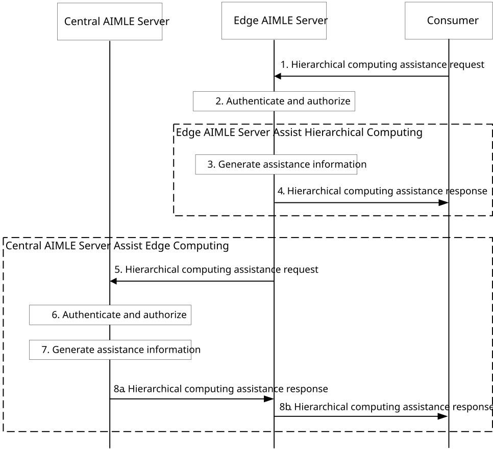

# 8.25 Support of AIML Services for Assisting Hierarchical Computing

This clause describes procedure for supporting AIML services for assisting hierarchical computing.

## 8.25.1 General

This clause describes the procedure for assisting hierarchical computing by the AIMLE server. A entity (e.g. CAS or EAS which are defined in 3GPP TS 23.558 \[12\]) can have different roles in hiearchitical computing (with one root node (e.g., CAS, EAS), the root has one or more children which are also known as sub-root node(s) (e.g., EAS), and multiple leaf nodes (e.g. EAS) with no children). Here, hierarchical computing represents a computation architecture with multiple computation entities involved and multiple levels of computations for a computation task.

## 8.25.2 Procedure for assisting hierarchical computing process

Figure 8.25.2-1 illustrates the procedures for AIMLE server to assist a hierarchical computing process.

Pre-conditions:

1\. An AI/ML task be treated as a specical computing task being completed at consumer (e.g., CAS, EAS).

2.- The consumer decides its role in the hierarchical computing architecture for an AI/ML task (e.g. FL training) based on its local configuration.

3\. The AIMLE server can assist a hierarchical computing process by providing time window(s) recommendation for computing task distribution if the consumer is a root node in a hierarchical computing process, providing time window(s) recommendation for intermediate output delivery if the consumer is a leaf node in a hierarchical computing process, and candidate execution node list provisioning or computing preparation status provisioning, etc.

4\. The consumer decides that assistance from AIMLE server to support the hierarchical computing process (AI/ML task) is needed, due to lack of capability on e.g. execution node selection.

5\. AIMLE Server is deployed following the hierarchical deployment model described in A.4.

Figure 8.25.2-1: Procedure for assist a hiearchitical computing process

Figure 8.25.2-1 illustrates the procedure for AIMLE servers assist a hierarchical computing process. The corresponding procedure in detail is as follows:

1\. The VAL server (e.g. CAS, EAS) sends hierarchical computing assistance request to the edge AIMLE server for a hierarchical computing process (AI/ML task). The request message includes information as described in Table 8.25.3.1-1.

2\. The edge AIMLE server authenticates and authorizes the request from the consumer and checks its capability to provide the requested assistance information.

> If the request is authorized and the edge AIMLE server can generate the required assistance information (e.g. computing preparation status at an execution node which is registered to it), it performs step 3 and 4.
>
> If the request is authorized but the edge AIMLE server cannot generate the required assistance information (e.g. execution nodes are registered to different edge AIMLE servers), it performs step 5 and skips steps 3 and 4.

3\. The edge AIMLE server performs operations to generate assistance information which is requested in step 1. For example, for computing preparation status at an execution node, the edge AIMLE server may subscribe/request analytics from ADAE server (e.g. edge load analytics, edge computing preparation analytics) and aggregate the information received to generate assistance information.

4\. The edge AIMLE server sends hierarchical computing assistance response to the consumer (e.g. computing preparation status at the execution node). The response message contains the information as described in Table 8.25.3.2-1.

5\. If the edge AIMLE server cannot generate the required assistance information, it sends hierarchical computing assistance request to central AIMLE server. The request message includes information as described in Table 8.25.3.1-1.

6\. The central AIMLE server authenticates and authorizes the request from the edge AIMLE server.

7\. If the request is authorized, the central AIMLE server performs operations to generate assistance information which is requested in step 1.

> For example, for execution node selection, according to the role of the VAL server in request message in step 1, the central AIMLE server derives the requirements on the execution node (e.g. high computation capability, high communication capability, or both). Then, the central AIMLE server may subscribe/request analytics from ADAE server (e.g. edge load analytics, edge computing preparation analytics), trigger generation of split operation assistance information, retrieve FL member information from ML Repository (the FL member with EAS ID). The existing services can be reused for execution node selection, e.g., the step 3 in clause 8.12.2.

8\. The central AIMLE server sends hierarchical computing assistance response with the generated assistance information (e.g. a list of selected candidate execution nodes). The response message contains the information as described in Table 8.25.3.2-1.

8a. The central AIMLE server sends the hierarchical computing assistance response to the edge AIMLE server.

8b. The edge AIMLE server sends the hierarchical computing assistance response to the consumer.

The VAL server (e.g. CAS, EAS) uses the assistance information for decision making on its computing operations.

NOTE: If the VAL server (e.g. CAS, EAS) know the information of the central AIMLE server, it can send the hiearchitical computing assistance request to the central AIMLE server directly for the hiearchitical computing process (AI/ML task). The procedure is the same as the steps 5-8a in Figure 8.25.2-1 with replacing edge AIMLE server by consumer.

## 8.25.3 Information flows

### 8.25.3.1 Hiearchitical computing assistance request

Table 8.25.3.1-1 shows the request sent by VAL server (e.g. CAS, EAS) to the AIMLE server for assistance of a hiearchitical computing process (AI/ML task).

Table 8.25.3.1-1: Hiearchitical computing assistance request

| Information element           | Status | Description                                                                                                                                                                                     |
|-------------------------------|--------|-------------------------------------------------------------------------------------------------------------------------------------------------------------------------------------------------|
| Requestor identifier          | M      | The identifier of the requestor.                                                                                                                                                                |
| Original requestor identifier | O      | The identifier of the original requestor, e.g. VAL server ID, EAS ID, CAS ID.                                                                                                                   |
| Role                          | M      | Represents the role of the VAL server in a hiearchitical computing architecture (e.g. root node, sub-root node or leaf node of a hierarchical computing process).                               |
| Computing task type           | M      | The type of computing task (e.g. VFL, HFL).                                                                                                                                                     |
| Assistance information type   | M      | Represents the assistance information type, which is used to indicate the assistance information needed, e.g. candidate execution node list, computing preparation status at an execution node. |
| Execution node(s)             | O      | Represent one execution node or a list of candidate execution nodes.                                                                                                                            |

### 8.25.3.2 Assist hierarchical computing response

Table 8.25.3.2-1 shows the response sent by AIMLE server to the VAL server (e.g. CAS, EAS) for assisting the hierarchical computing process.

Table 8.25.3.2-1: Hierarchical computing assistance response

<table>
<colgroup>
<col style="width: 33%" />
<col style="width: 12%" />
<col style="width: 53%" />
</colgroup>
<thead>
<tr class="header">
<th>Information element</th>
<th>Status</th>
<th>Description</th>
</tr>
</thead>
<tbody>
<tr class="odd">
<td>Success response</td>
<td>
O

(NOTE 1)
</td>
<td>Indicates that the assist hierarchical computing request was successful.</td>
</tr>
<tr class="even">
<td>&gt;Assistance information</td>
<td>M</td>
<td>The assistance information for assisting hierarchical computing process, e.g. candidate execution node list, computing preparation status at an execution node.</td>
</tr>
<tr class="odd">
<td>&gt;&gt;List of candidate execution nodes</td>
<td>
O

(NOTE 2)
</td>
<td>A list of selected candidate execution nodes.</td>
</tr>
<tr class="even">
<td>&gt;&gt;Preparation status</td>
<td>
O

(NOTE 2)
</td>
<td>Computing preparation status at the execution node provided in request.</td>
</tr>
<tr class="odd">
<td>Failure response</td>
<td>
O

(NOTE 1)
</td>
<td>Indicates that the assist hierarchical computing request was failure.</td>
</tr>
<tr class="even">
<td>&gt;Cause</td>
<td>M</td>
<td>Reason for the failure.</td>
</tr>
<tr class="odd">
<td colspan="3">
NOTE 1: One of the IEs shall be present.

NOTE 2: At least one of the IEs shall be present.
</td>
</tr>
</tbody>
</table>
