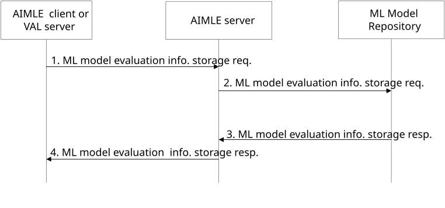
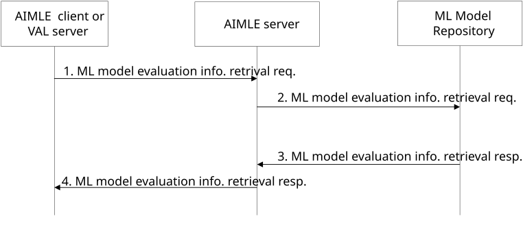
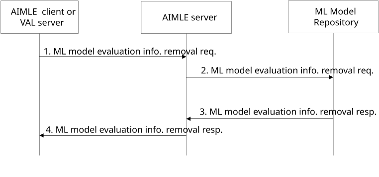
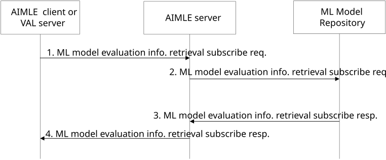
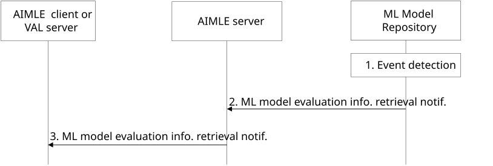
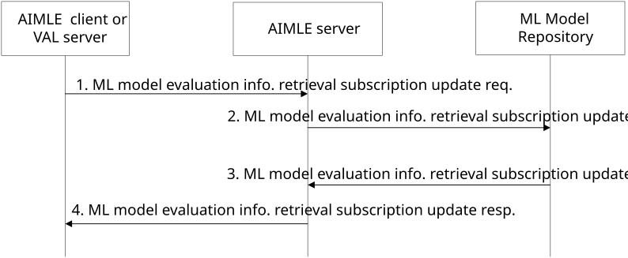
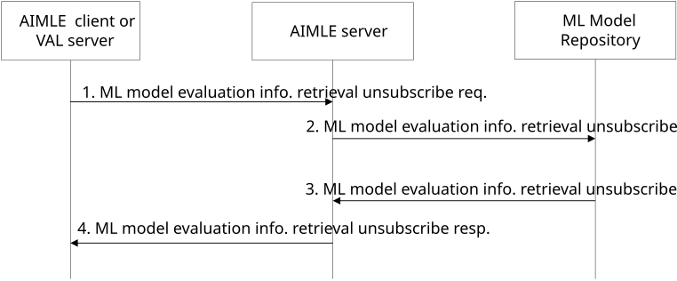

# 8.26.2 Procedure

## 8.26.2.1 General

Following procedures are supported for ML model evaluation information management:

\- ML model evaluation information storage request-response procedure:

\- ML model evaluation information retrieval request-response procedure;

\- ML model evaluation information removal request-response procedure ;

\- ML model evaluation information retrieval subscribe-notify procedures.

## 8.26.2.2 ML model evaluation information storage

Figure 8.26.2.2-1 describes procedures for storing ML model evaluation information in the ML model repository.

**Figure 8.26.2.2-1: ML model evaluation information storage**

1\. The requestor (e.g., AIMLE client or VAL server) sends an ML model evaluation information storage request to the AIMLE server. The request includes the requestor identifier and ML model evaluation information.

2\. Upon receiving the request from the requestor, the AIMLE server validates if the requestor is authorized for the request. If the requestor is authorized, the AIMLE server sends an ML model evaluation information storage request to store the ML model evaluation information in the ML repository. The request includes the requestor identifier and ML model evaluation information.

3\. Upon receiving the request from the AIMLE server, the ML model repository validates if the requestor is authorized for the request. If the requestor is authorized, the ML model repository stores the ML model evaluation information, creates an ML model evaluation profile including a ML model evaluation profile identifier and sends an ML model evaluation information storage response to the AIMLE server. The response includes an indication of success for the request and the ML model evaluation profile identifier if the request was successful.

4\. Upon receiving the response from the ML model repository, the AIMLE server sends an ML model evaluation information storage response to the AIMLE client or VAL server. The response includes an indication of success for the request and the ML model evaluation profile identifier if the request was successful.

## 8.26.2.3 ML model evaluation information retrieval

Figure 8.26.2.3-1 describes procedures for retrieving ML model evaluation information from the ML model repository.

**Figure 8.26.2.3-1: ML model evaluation information retrieval**

1\. The requestor (e.g., AIMLE client or VAL server) sends an ML model evaluation information retrieval request to the AIMLE server. The request includes the requestor identifier and ML model evaluation information retrieval filters.

2\. Upon receiving the request from the requestor, the AIMLE server validates if the requestor is authorized for the request. If the requestor is authorized, the AIMLE server sends an ML model evaluation information retrieval request to obtain the ML model evaluation information from the ML repository. The request includes the requestor identifier and ML model evaluation information retrieval filters.

3\. Upon receiving the request from the AIMLE server, the ML model repository validates if the requestor is authorized for the request. If the requestor is authorized, the ML model repository identifies ML model evaluation profiles based on the ML model evaluation information retrieval filters and sends a ML model evaluation information retrieval response to the requestor. The response includes an indication of success for the request and the identified ML model evaluation profiles if the request was successful.

4\. Upon receiving the response from the ML model repository, the AIMLE server sends an ML model evaluation information retrieval response to the AIMLE client or VAL server. The response includes an indication of success for the request and the ML model evaluation profile(s) if the request was successful.

## 8.26.2.4 ML model evaluation information removal

Figure 8.26.2.4-1 describes procedures for removal of ML model evaluation information removal from the ML model repository.

**Figure 8.26.2.4-1. ML model evaluation information removal**

1\. The requestor (e.g., AIMLE client or VAL server) sends an ML model evaluation information removal request to the AIMLE server. The request includes the requestor identifier and ML model evaluation information identifier(s) to be removed.

2\. Upon receiving the request from the requestor, the AIMLE server validates if the requestor is authorized for the request. If the requestor is authorized, the AIMLE server sends an ML model evaluation information removal request to remove the ML model evaluation information from the ML repository. The request includes the requestor identifier and ML model evaluation information identifier(s).

3\. Upon receiving the request from the AIMLE server, the ML model repository validates if the requestor is authorized for the request. If the requestor is authorized, the ML model repository removes the ML model evaluation information based on the ML model evaluation information identifier(s) and sends a ML model evaluation information removal response to the requestor. The response includes an indication of success for the request and the ML model evaluation information identifiers that were removed if the request was successful.

4\. Upon receiving the response from the ML model repository, the AIMLE server sends an ML model evaluation information removal response to the AIMLE client or VAL server. The response includes an indication of success for the request and the ML model evaluation information identifiers that were removed if the request was successful.

## 8.26.2.5 ML model evaluation information retrieval subscription

### 8.26.2.5.1 General

Clause 8.26.2.5.2 and clause 8.26.2.5.3 together illustrate the ML model evaluation information retrieval subscribe-notify procedure.

Clause 8.26.2.5.4 illustrates the ML model evaluation information retrieval subscription update procedure.

Clause 8.26.2.5.5 illustrates the ML model evaluation information retrieval unsubscribe procedure.

### 8.26.2.5.2 Subscribe

Figure 8.26.2.5.2-1 illustrates the procedure for an AIMLE client or VAL server to subscribe with the AIMLE server to be notified of retrieval of ML model evaluation information.

Pre-conditions:

1\. The AIMLE client or VAL server possesses information (e.g. URI, IP address) related to the AIMLE Server.

2\. The AIMLE client or VAL server possesses security credentials authorizing it to communicate with the AIMLE server.

3\. The AIMLE server possesses information (e.g. URI, IP address) related to the ML model repository.

4\. The AIMLE server possesses security credentials authorizing it to communicate with the ML model repository.

Figure 8.26.2.5.2-1: ML model evaluation information retrieval subscribe

1\. The requestor (e.g., AIMLE client or VAL server) sends a ML model evaluation information retrieval subscribe request to the AIMLE server. The request includes the information as described in clause 8.26.3.7.

2\. Upon receiving the request from the requestor, the AIMLE server validates if the requestor is authorized for the request. If the requestor is authorized, the AIMLE server sends an ML model evaluation information retrieval subscribe request to the ML model repository. The request includes information as described in clause 8.26.3.7.

> Upon receiving the request from the AIMLE server, the ML model repository validates if the AIMLE server is authorized for the request. If the AIMLE server is authorized, the ML model repository creates the subscription and stores the subscription information.

3\. The ML model repository sends a ML model evaluation information retrieval subscribe response to the AIMLE server. If the ML model repository has created the subscription, the response includes an indication of success, the subscription identity and may include an expiration time; to maintain the subscription, the requestor shall send a subscription update request before the expiration time, otherwise the ML model evaluation information retrieval subscription expires. If the ML model repository has not created the subscription, the response includes an indication of failure and may include a reason for failure.

> If the subscription was created successfully at the ML model repository, the AIMLE server creates a subscription that associated with the subscription identifier from the ML model repository and stores the subscription information.

4\. The AIMLE server sends a ML model evaluation information retrieval subscribe response to the requestor. If the AIMLE server has created the subscription, the response includes an indication of success, the subscription identity and may include an expiration time; to maintain the subscription, the requestor shall send a subscription update request before the expiration time, otherwise the ML model evaluation information retrieval subscription expires. If the AIMLE server has not created the subscription, the response includes an indication of failure and may include a reason for failure.

### 8.26.2.5.3 Notify

Figure 8.26.2.5.3-1 illustrates the ML model evaluation information retrieval notify operation between the AIMLE server and an AIMLE client or VAL server.

Pre-conditions:

1\. The AIMLE client or VAL server has subscribed for ML model evaluation information retrieval with the AIMLE Server.

2\. The AIMLE server has subscribed for ML model evaluation information retrieval with the ML model repository.

Figure 8.26.2.5.3-1: ML model evaluation information retrieval notification

1\. An event occurs at the ML Model Repository that satisfies trigger conditions for notifying a subscriber (e.g., AIMLE server). The event may be the detection of availability of new ML model evaluation information (e.g., new ML model evaluation information or new revision of a ML model evaluation information) that satisfies the ML model evaluation information retrieval filters of the subscription.

2\. The ML model repository sends a ML model evaluation information retrieval notification to AIMLE server(s) for which a valid subscription satisfies the ML model evaluation information retrieval filters. The notification includes information as described in clause 8.26.3.9.

3\. The AIMLE server retrieves the subscription information that is associated with the subscription identifier included in the ML model repository notification and sends a ML model evaluation information retrieval notification to the associated requestor(s) for which an valid subscription satisfies the ML model evaluation information retrieval filters. The notification includes information as described in clause 8.26.3.9.

### 8.26.2.5.4 Update

Figure 8.26.2.5.4-1 illustrates the procedure for an AIMLE client or VAL server to update a subscription with the AIMLE server.

Pre-conditions:

1\. The AIMLE client or VAL server has subscribed for ML model evaluation information retrieval with the AIMLE Server.

2\. The AIMLE Server has subscribed for ML model evaluation information retrieval with the ML model repository.

Figure 8.26.2.5.4-1: ML model evaluation information retrieval subscription update

1\. The requestor (e.g., AIMLE client or VAL server) sends a ML model evaluation information retrieval update request to the AIMLE server. The request includes information as described in clause 8.26.3.10.

2\. Upon receiving the request from the requestor, the AIMLE server validates if the requestor is authorized for the request. If the requestor is authorized, the AIMLE server retrieves the subscription information that is associated with the subscription identifier included in the request and sends a ML model evaluation information retrieval update request, as described in clause 8.26.3.10, to the associated ML model repository.

> Upon receiving the request from the AIMLE server, the ML model repository validates if the AIMLE server is authorized for the request. If the AIMLE server is authorized, the ML model repository updates the subscription information.

3\. The ML model repository sends a ML model evaluation information retrieval subscription update response to the AIMLE server. If the ML model repository has updated the subscription, the response includes an indication of success and may include an expiration time. To maintain the subscription, the AIMLE server shall send a subscription update request before the expiration time, otherwise the ML model evaluation information retrieval subscription expires. If the ML model repository has not updated the subscription, the response includes an indication of failure and may include a reason for failure.

> If the subscription was updated successfully at the ML model repository, the AIMLE server updates the associated subscription.

4\. The AIMLE server sends a ML model evaluation information retrieval subscription update response to the requestor. If the AIMLE server has updated the subscription, the response includes an indication of success and may include an expiration time. To maintain the subscription, the requestor shall send a subscription update request before the expiration time, otherwise the ML model evaluation information retrieval subscription expires. If the AIMLE server has not updated the subscription, the response includes an indication of failure and may include a reason for failure.

### 8.26.2.5.5 Unsubscribe

Figure 8.26.2.5.5-1 illustrates the procedure for an AIMLE client or VAL server to unsubscribe with the AIMLE server.

Pre-conditions:

1\. The AIMLE client or VAL server has subscribed for ML model evaluation information retrieval with the AIMLE Server.

Figure 8.26.2.5.5-1: ML model evaluation information retrieval unsubscribe

1\. The requestor (e.g., AIMLE client or VAL server) sends a ML model evaluation information retrieval unsubscribe request to the AIMLE server. The request includes information as described in clause 8.26.3.12.

2\. Upon receiving the request from the requestor, the AIMLE server validates if the requestor is authorized for the request. If the requestor is authorized, the AIMLE server retrieves the subscription information that is associated with the subscription identifier included in the request and sends a ML model evaluation information retrieval unsubscribe request, as described in clause 8.26.3.12, to the associated ML model repository.

Upon receiving the request from the AIMLE server, the ML model repository validates if the AIMLE server is authorized for the request. If the AIMLE server is authorized, the ML model repository cancels the subscription.

3\. The ML model repository sends a ML model evaluation information retrieval unsubscribe response to the AIMLE server. If the ML model repository has cancelled the subscription, the response includes an indication of success. If the ML model repository has not cancelled the subscription, the response includes an indication of failure and may include a reason for failure.

If the subscription was cancelled successfully at the ML model repository, the AIMLE server cancels the associated subscription.

> 4\. The AIMLE server sends a ML model evaluation information retrieval unsubscribe response to the requestor. If the AIMLE server has cancelled the subscription, the response includes an indication of success. If the AIMLE server has not cancelled the subscription, the response includes an indication of failure and may include a reason for failure.
