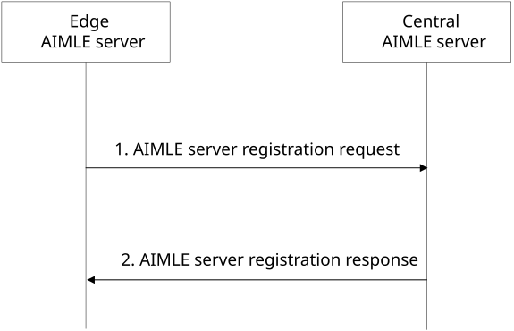
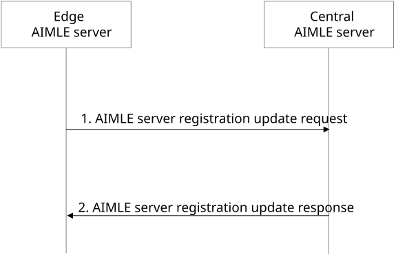
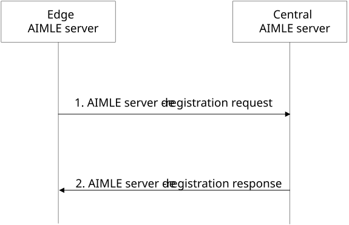

# 8.27 AIMLE server registration in hierarchical AIMLE deployments

This clause describes procedures for supporting AIMLE server registration in hierarchical AIMLE deployments.

## 8.27.1 General

This clause describes AIMLE server registration procedures considering AIMLE deployments in edge data networks as described in Annex A.4, Figure A.4-1. The registration of an edge AIMLE server with a central AIMLE server enables the central AIMLE server to be aware of the edge AIMLE server capabilities and of the clients registered with the edge AIMLE server.

A central AIMLE server needs information about AIMLE clients available in different EDN service areas when performing operations requiring the selection of AIMLE clients. The AIMLE clients in an EDN service area may register to the edge AIMLE server, therefore, registration of the edge AIMLE server with the central AIMLE server is needed to support hierarchical AIMLE deployment scenarios.

## 8.27.2 Procedures for supporting hierarchical AIMLE deployments

### 8.27.2.1 AIMLE server registration

Figure 8.27.2.1-1 illustrates a procedure for an AIMLE server to register with another AIMLE server in hierarchical AIMLE deployments. In such a scenario, the registering AIMLE server, which is deployed as an EAS located at an EDN, registers to a central AIMLE server.

Pre-conditions:

1.  AIMLE clients have registered with an edge deployed AIMLE server (i.e., an AIMLE server deployed as EAS which is located at an EDN) as described in clause 8.7.2.2 of 3GPP TS 23.482. The edge deployed AIMLE server receives AIMLE client profiles associated with each registered AIMLE client in the EDN service area.

2.  The edge deployed AIMLE server has been pre-configured with endpoint information of a central AIMLE server.

Figure 8.27.2.1-1: AIMLE server registration procedure

1\. The edge deployed AIMLE server sends an AIMLE server registration request to a central AIMLE server. The registration request includes the requestor identifier, endpoint information and a list of AIMLE clients registered with the AIMLE server. The request may include EDN information and AIMLE server capabilities. The request message includes information as described in Table 8.27.3.1-1.

2\. Upon receiving the request, the central AIMLE server validates if the requestor is authorized for the request. If the request is authorized, the central AIMLE server stores the registration information in the ML repository as defined in clause 8.4.2 and creates a registration identifier. The central AIMLE server sends an AIMLE server registration response to the requestor. If the central AIMLE server has registered the requestor, the response includes an indication of success, a registration identifier and may include an expiration time. The requestor shall send a registration update request before the expiration time to maintain the registration; otherwise, the registration expires. If the requestor was not registered, the response includes an indication of failure and may include a reason for failure. If a registration request is received for a Requestor identifier that is already registered, the central AIMLE server shall either return the existing registration identifier or replace the old entry, according to local policy.

### 8.27.2.2 AIMLE server registration update

Figure 8.27.2.2-1 illustrates a procedure for an AIMLE server to update its registration to a central AIMLE server in hierarchical AIMLE deployments.

Pre-conditions:

1.  The edge deployed AIMLE server has registered with the central AIMLE Server as described in clause 8.27.2.1.

Figure 8.27.2.2-1: AIMLE server registration update procedure

1\. The edge deployed AIMLE server sends an AIMLE server registration update request to the central AIMLE server. The request includes the registration identifier and may include updated AIMLE server information as described in Table 8.27.3.3-1. If the request is to renew the registration, only the registration identifier is included in the request.

2\. Upon receiving the request, the central AIMLE server validates if the requestor is authorized for the request. If the request is authorized, the central AIMLE server updates the information associated with the registration identifier in the ML repository as defined in clause 8.4.3 and shall update the registration expiration time if the request only includes the registration identifier. The central AIMLE server sends a AIMLE server registration update response to the requestor. If the central AIMLE server has updated the registration, the response includes an indication of success and may include an expiration time. The requestor shall send a registration update request before the expiration time to maintain the registration; otherwise, the registration expires. If the registration was not updated, the response includes an indication of failure and may include a reason for failure.

### 8.27.2.3 AIMLE server de-registration

Figure 8.27.2.3-1 illustrates a procedure for an AIMLE server to delete its registration from a central AIMLE server in hierarchical AIMLE deployments.

Pre-conditions:

1.  The edge deployed AIMLE server has registered with the central AIMLE Server as described in clause 8.27.2.1.

Figure 8.27.2.3-1: AIMLE server de-registration procedure

1\. The edge deployed AIMLE server sends an AIMLE server de-registration request to the central AIMLE server. The de-registration request includes the registration identifier.

2\. Upon receiving the request, the central AIMLE server validates if the requestor is authorized for the request. If the request is authorized, the central AIMLE server removes the context of the edge AIMLE server registration from the ML repository as defined in clause 8.4.3a. The central AIMLE server sends an AIMLE server de-registration response to the requestor. If the central AIMLE server has de-registered the requestor, the response includes an indication of success. If the requestor was not de-registered, the response includes an indication of failure and may include a reason for failure.

## 8.27.3 Information flows

### 8.27.3.1 AIMLE server registration request

Table 8.27.3.1-1 shows the request sent by an edge deployed AIMLE server (i.e., an AIMLE server deployed as EAS located at an EDN) to a central AIMLE server for registering the edge deployed AIMLE server and available AIMLE clients in the EDN service area.

Table 8.27.3.1-1: AIMLE server registration request

<table>
<colgroup>
<col style="width: 33%" />
<col style="width: 12%" />
<col style="width: 53%" />
</colgroup>
<thead>
<tr class="header">
<th>Information element</th>
<th>Status</th>
<th>Description</th>
</tr>
</thead>
<tbody>
<tr class="odd">
<td>Requestor identifier</td>
<td>M</td>
<td>The identifier of the registering AIMLE server.</td>
</tr>
<tr class="even">
<td>AIMLE server endpoint</td>
<td>M</td>
<td>The endpoint information (e.g., URL, URI, IP address, port) of the registering AIMLE server.</td>
</tr>
<tr class="odd">
<td>AIMLE server capabilities</td>
<td>O</td>
<td>The capability information of the registering AIMLE server (e.g. ML application type, allowed resource usage level).</td>
</tr>
<tr class="even">
<td>EDN service area identifier</td>
<td>
O

(NOTE 1)
</td>
<td>The identifier of the EDN service area associated with the registering AIMLE server.</td>
</tr>
<tr class="odd">
<td>EDN service area information</td>
<td>
O

(NOTE 1)
</td>
<td>The information of the EDN service area (e.g., location, area, edge load of the area, etc.) associated with the registering AIMLE server.</td>
</tr>
<tr class="even">
<td>EAS information</td>
<td>
O

(NOTE 2)
</td>
<td>Indicates information of the AIMLE server deployed as EAS in the EDN, which may include EAS ID, DNAIs.</td>
</tr>
<tr class="odd">
<td>List of registered AIMLE clients</td>
<td>M</td>
<td>The list of registered AIMLE client profiles, as described in 3GPP TS 23.482 Table 8.7.3.2-2, that are registered with the registering AIMLE server.</td>
</tr>
<tr class="even">
<td colspan="3">
NOTE 1: At least one of the information elements is present.

NOTE 2: The information element shall be present for edge deployed AIMLE server.
</td>
</tr>
</tbody>
</table>

### 8.27.3.2 AIMLE server registration response

Table 8.27.3.2-1 shows the response sent by the central AIMLE server to the edge deployed AIMLE server in response to the registration request.

Table 8.27.3.2-1: AIMLE server registration response

<table>
<colgroup>
<col style="width: 33%" />
<col style="width: 12%" />
<col style="width: 53%" />
</colgroup>
<thead>
<tr class="header">
<th><strong>Information element</strong></th>
<th><strong>Status</strong></th>
<th><strong>Description</strong></th>
</tr>
</thead>
<tbody>
<tr class="odd">
<td>Successful response</td>
<td>
O

(NOTE)
</td>
<td>Indicates that the registration was successful.</td>
</tr>
<tr class="even">
<td>&gt; Registration ID</td>
<td>M</td>
<td>The identifier of the registration.</td>
</tr>
<tr class="odd">
<td>&gt; Expiration time</td>
<td>O</td>
<td>
Indicates the expiration time of the registration.

If the Expiration time IE is not included, it indicates that the registration never expires.
</td>
</tr>
<tr class="even">
<td>Failure response</td>
<td>
O

(NOTE)
</td>
<td>Indicates that the registration failed.</td>
</tr>
<tr class="odd">
<td>&gt; Cause</td>
<td>O</td>
<td>Indicates the cause of the failure</td>
</tr>
<tr class="even">
<td colspan="3">NOTE: One of the information elements must be present.</td>
</tr>
</tbody>
</table>

### 8.27.3.3 AIMLE server registration update request

Table 8.27.3.3-1 shows the request sent by an edge deployed AIMLE server to a central AIMLE server for the AIMLE server registration update request.

Table 8.27.3.3-1: AIMLE server registration update request

<table>
<colgroup>
<col style="width: 33%" />
<col style="width: 12%" />
<col style="width: 53%" />
</colgroup>
<thead>
<tr class="header">
<th>Information element</th>
<th>Status</th>
<th>Description</th>
</tr>
</thead>
<tbody>
<tr class="odd">
<td>Requestor identifier</td>
<td>M</td>
<td>The identifier of the registering AIMLE server.</td>
</tr>
<tr class="even">
<td>AIMLE server endpoint</td>
<td>M</td>
<td>The endpoint information (e.g., URL, URI, IP address, port) of the registering AIMLE server.</td>
</tr>
<tr class="odd">
<td>AIMLE server capabilities</td>
<td>O</td>
<td>The capability information of the registering AIMLE server (e.g. ML application type, allowed resource usage level).</td>
</tr>
<tr class="even">
<td>EDN service area identifier</td>
<td>
O

(NOTE 1)
</td>
<td>The identifier of the EDN service area associated with the registering AIMLE server.</td>
</tr>
<tr class="odd">
<td>EDN service area information</td>
<td>
O

(NOTE 1)
</td>
<td>The information of the EDN service area (e.g., location, area, edge load of the area, etc.) associated with the registering AIMLE server.</td>
</tr>
<tr class="even">
<td>EAS information</td>
<td>
O

(NOTE 2)
</td>
<td>Indicates information of the AIMLE server deployed as EAS in the EDN, which may include EAS ID, DNAIs.</td>
</tr>
<tr class="odd">
<td>List of registered AIMLE clients</td>
<td>M</td>
<td>The list of registered AIMLE client profiles, as described in 3GPP TS 23.482 Table 8.7.3.2-2, that are registered with the registering AIMLE server.</td>
</tr>
<tr class="even">
<td colspan="3">
NOTE 1: At least one of the information elements is present.

NOTE 2: The information element shall be present for edge deployed AIMLE server.
</td>
</tr>
</tbody>
</table>

### 8.27.3.4 AIMLE server registration update response

Table 8.27.3.4-1 shows the AIMLE server registration update response sent by the central AIMLE server to the edge deployed AIMLE server.

Table 8.27.3.4-1: AIMLE server registration update response

<table>
<colgroup>
<col style="width: 33%" />
<col style="width: 12%" />
<col style="width: 53%" />
</colgroup>
<thead>
<tr class="header">
<th><strong>Information element</strong></th>
<th><strong>Status</strong></th>
<th><strong>Description</strong></th>
</tr>
</thead>
<tbody>
<tr class="odd">
<td>Successful response</td>
<td>
O

(NOTE)
</td>
<td>Indicates that the registration update was successful.</td>
</tr>
<tr class="even">
<td>&gt; Expiration time</td>
<td>O</td>
<td>
Indicates the expiration time of the updated registration.

If the Expiration time IE is not included, it indicates that the updated registration never expires.
</td>
</tr>
<tr class="odd">
<td>Failure response</td>
<td>
O

(NOTE)
</td>
<td>Indicates that the registration update failed.</td>
</tr>
<tr class="even">
<td>&gt; Cause</td>
<td>O</td>
<td>Indicates the cause the failure.</td>
</tr>
<tr class="odd">
<td colspan="3">NOTE: One of the information elements must be present.</td>
</tr>
</tbody>
</table>

### 8.27.3.5 AIMLE server de-registration request

Table 8.27.3.5-1 shows the request sent by an edge deployed AIMLE server to a central AIMLE server for the AIMLE server registration update request.

Table 8.27.3.5-1: AIMLE server de-registration request

| **Information element** | **Status** | **Description**                              |
|-------------------------|------------|----------------------------------------------|
| Registration identifier | M          | The identifier of the existing registration. |

### 8.27.3.6 AIMLE server de-registration response

Table 8.27.3.6-1 shows the AIMLE server registration update response sent by the central AIMLE server to the edge deployed AIMLE server.

Table 8.27.3.6-1: AIMLE server de-registration response

<table>
<colgroup>
<col style="width: 33%" />
<col style="width: 12%" />
<col style="width: 53%" />
</colgroup>
<thead>
<tr class="header">
<th><strong>Information element</strong></th>
<th><strong>Status</strong></th>
<th><strong>Description</strong></th>
</tr>
</thead>
<tbody>
<tr class="odd">
<td>Successful response</td>
<td>
O

(NOTE)
</td>
<td>Indicates that the de-registration was successful.</td>
</tr>
<tr class="even">
<td>Failure response</td>
<td>
O

(NOTE)
</td>
<td>Indicates that the de-registration failed.</td>
</tr>
<tr class="odd">
<td>&gt; Cause</td>
<td>O</td>
<td>Indicates the cause of the failure.</td>
</tr>
<tr class="even">
<td colspan="3">NOTE: One of the information elements must be present.</td>
</tr>
</tbody>
</table>
