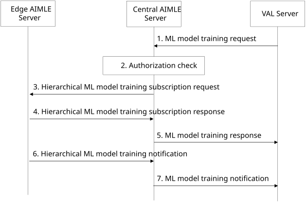

# 8.28 ML model training in hierarchical AIMLE deployments

This clause describes a procedure for supporting ML model training in hierarchical AIMLE deployments.

## 8.28.1 General

This clause describes ML model training considering AIMLE deployments in edge data networks as described in Annex A.4, Figure A.4-1.

ML model training procedure is described in clause 8.3. In hierarchical AIMLE deployment scenarios, a VAL server requests the central AIMLE server for ML model training. Since the member clients that will participate in the training process may be distributed in different EDN service areas, the central AIMLE server can distribute the training request to the corresponding edge AIMLE servers.

## 8.28.2 Procedure for Hierarchical ML model training

Figure 8.28.2-1 illustrates a procedure for central and edge AIMLE servers to support ML model training in hierarchical AIMLE deployments based on a request from a VAL server.

Pre-conditions:

3.  AIMLE clients have registered with the corresponding edge deployed AIMLE servers as described in clause 8.7.2.2. The edge deployed AIMLE servers receive AIMLE client profiles associated with each registered AIMLE client in the EDN service area.

4.  Edge deployed AIMLE servers have registered with a central AIMLE server.

Figure 8.28.2-1: Hierarchical ML model training

> 1\. A VAL server sends an ML model training request to a central AIMLE server as described in step 1 of Figure 8.3.2-1 in clause 8.3. The request includes information described in Table 8.3.3.1-1.
>
> 2\. The central AIMLE server checks whether the VAL server is authorized to perform the ML model training as described in step 2 of Figure 8.3.2-1. The central AIMLE server uses information from AIMLE server registration procedure to identify edge AIMLE servers that can fulfil the ML model training requirements.
>
> 3\. Based on the ML model training request from step 1 and the identified edge AIMLE servers, the central AIMLE server determines to distribute the training request to identified edge AIMLE servers. The central AIMLE server identifies the EDN service areas based on information in the ML model training request (e.g. training type, list of member clients, member selection criteria) and the AIMLE client profiles (e.g. supported AI/ML operations, AIMLE client capabilities) received from the AIMLE server registrations. For example, the central AIMLE server determines the distribution of the request based on the number of required AIML clients in the request and the number of available clients in each EDN service area or based on the dataset identifiers in the request and the dataset availability of clients in each EDN service area. The central AIMLE server sends a Hierarchical ML model training subscription request to the edge AIMLE server in each of the identified EDN service areas. The subscription request includes information described in Table 8.28.3.1-1. The Edge training identifier is included in the request sent from the central AIMLE server to track the ML training performed by each edge AIMLE server to correlate with the ML model training request that was sent in step 1.
>
> 4\. The edge AIMLE server sends a Hierarchical ML model training response to the central AIMLE server.
>
> 5\. The central AIMLE server returns the success or failure response, as described in step 3 of Figure 8.3.2-1. The response includes information described in Table 8.3.3.2-1.
>
> 6\. The edge AIMLE server notifies the central AIMLE server of the progress of the ML model training, including the list of member clients selected or de-selected for the ML model training, the training output, the percentage completion, or errors encountered during the training process. The notification includes information listed in Table 8.28.3.3-1.
>
> 7\. The central AIMLE server aggregates the notifications received from the edge AIMLE servers and sends the aggregated notification to the VAL server. The notification includes information described in Table 8.3.3.3-1.

## 8.28.3 Information flows

### 8.28.3.1 Hierarchical ML model training subscription request

Table 8.28.3.1-1 shows the information flow from the central AIMLE server to the edge AIMLE server for subscribing to ML model training in the EDN service area.

Table 8.28.3.1-1: Hierarchical ML model training subscription request

| **Information element**      | **Status** | **Description**                                                                                                                                                                                                                                                                            |
|------------------------------|------------|--------------------------------------------------------------------------------------------------------------------------------------------------------------------------------------------------------------------------------------------------------------------------------------------|
| Original requestor identity  | M          | Identity of the VAL server of the original ML training request.                                                                                                                                                                                                                            |
| Edge training identifier     | M          | Identifier to associate with the original ML training request (from the VAL server to the central AIMLE server).                                                                                                                                                                           |
| Operational requirements     | O          | Requirements for the training operations, e.g. latency, QoS requirements, etc.                                                                                                                                                                                                             |
| Reporting requirements       | O          | Indicates what information regarding the training operations needs to be sent to the central AIMLE server by the edge AIMLE server (e.g. update related to new member clients selected or de-selected). The reporting requirements includes a specific schedule for sending notifications. |
| ML model training parameters | M          | The parameters for the ML model training as described in Table 8.3.3.1-1.                                                                                                                                                                                                                  |

### 8.28.3.2 Hierarchical ML model training subscription response

Table 8.28.3.2-1 shows the information flow of Hierarchical ML model training subscription response from the edge AIMLE server to the central AIMLE server.

Table 8.28.3.2-1: Hierarchical ML model training subscription response

<table>
<colgroup>
<col style="width: 33%" />
<col style="width: 16%" />
<col style="width: 50%" />
</colgroup>
<thead>
<tr class="header">
<th><strong>Information element</strong></th>
<th><strong>Status</strong></th>
<th><strong>Description</strong></th>
</tr>
</thead>
<tbody>
<tr class="odd">
<td>Success response</td>
<td>
O

(NOTE 1)
</td>
<td>Indicates that the Hierarchical ML model training request was successful.</td>
</tr>
<tr class="even">
<td>&gt; Edge training identifier</td>
<td>M</td>
<td>Identifier to associate with the original ML training request (from the VAL server to the central AIMLE server).</td>
</tr>
<tr class="odd">
<td>&gt; EDN service area identifier</td>
<td>M</td>
<td>The identifier of the EDN service area associated with the edge AIMLE server.</td>
</tr>
<tr class="even">
<td>Failure response</td>
<td>
O

(NOTE 1)
</td>
<td>Indicates that the Hierarchical ML model training request was failure.</td>
</tr>
<tr class="odd">
<td>&gt; Cause</td>
<td>M</td>
<td>Reason for the failure.</td>
</tr>
<tr class="even">
<td colspan="3">NOTE: Only one of these information elements shall be present.</td>
</tr>
</tbody>
</table>

### 8.28.3.3 Hierarchical ML model training notification

Table 8.28.3.3-1 shows the information flow of Hierarchical ML model training notification from the edge AIMLE server to the central AIMLE server.

Table 8.28.3.3-1: Hierarchical ML model training notification

<table>
<colgroup>
<col style="width: 33%" />
<col style="width: 16%" />
<col style="width: 50%" />
</colgroup>
<thead>
<tr class="header">
<th><strong>Information element</strong></th>
<th><strong>Status</strong></th>
<th><strong>Description</strong></th>
</tr>
</thead>
<tbody>
<tr class="odd">
<td>Edge training identifier</td>
<td>M</td>
<td>Identifier to associate with the original ML training request (from the VAL server to the central AIMLE server).</td>
</tr>
<tr class="even">
<td>EDN service area identifier</td>
<td>M</td>
<td>The identifier of the EDN service area associated with the registering AIMLE server.</td>
</tr>
<tr class="odd">
<td>EDN service area information</td>
<td>O</td>
<td>The information of the EDN service area (e.g., location, area, edge load of the area, etc.) associated with the edge AIMLE server.</td>
</tr>
<tr class="even">
<td>Percentage completion</td>
<td>M</td>
<td>Indicates a completion percentage for the training.</td>
</tr>
<tr class="odd">
<td>List of AIMLE clients</td>
<td>
O

(NOTE)
</td>
<td>Indicates the list of AIMLE clients selected or de-selected for the ML model training in the EDN service area.</td>
</tr>
<tr class="even">
<td>Training output</td>
<td>
O

(NOTE)
</td>
<td>Output of training, e.g., ML model parameters for the training.</td>
</tr>
<tr class="odd">
<td>Errors list</td>
<td>
O

(NOTE)
</td>
<td>A list of errors, if any, encountered during training process.</td>
</tr>
<tr class="even">
<td colspan="3">NOTE: At least one of these IEs shall be present.</td>
</tr>
</tbody>
</table>
