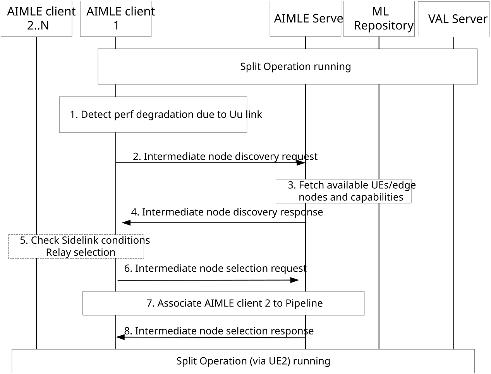

# 8.29 Intermediate Node discovery in ML model split learning operations

## 8.29.1 General

The following clauses specify procedures, information flows, and APIs for Intermediate Node discovery in ML model split learning operations.

Such intermediate entity can be an application layer relay UE which either doesn’t provide any processing and is not aware of the data to relay (encrypted), or 2) intermediate node which undertakes some layers of the split operations (e.g. layers 5-15) instead of the source VAL UE. For both cases, the intermediate entity is expected to be associated with the split operation pipeline as processing entity or just relaying entity.

The need for such intermediate node if it is a relay will assist in scenarios when the network conditions from the VAL UE to the network are poor or the UE is expected to be out of coverage; hence the role of a relay will support the AIMLE service continuity without disrupting the application session performance in a UE-to-Network relay fashion. For the case when the intermediate node is handling part of the processing (some layers/cuts), the scenario can be related to high computational load or energy consumption at the UE side, which requires to offload part of its processing to another VAL UE in close proximity.

## 8.29.2 Procedure

Pre-conditions:

1.  A split AIML pipeline is created, and the UE and VAL server has an ongoing connection session for undertaking jointly the split learning operation.

2.  One or more VAL UEs or edge nodes (e.g. EAS) have registered their capabilities in the ML repository / AIMLE server.

Figure 8.29.2-1: Support for intermediate node discovery

1\. A VAL UE detects that a ML model performance is degraded or expected to degrade. The detection can have different flavours either based on UE mobility and channel conditions or due to load/energy status and degradation of the ongoing ML task. More specifically, the detections may be due to:

\- VAL client notifies the AIMLE client that the task is delaying or expected to delay via AIMLE-C.

\- AIMLE client utilizes ADAE analytics on VAL session performance (based on 3GPP TS 23.436 clause 8.2.3) and predicts the downgrade of the link between the VAL UE and the VAL server

\- VAL UE mobility prediction to an area with no coverage or poor coverage or bad channel conditions.

2\. The AIMLE client determines a requirement for updating the pipeline to include a relay/intermediate node and sends an intermediate node discovery request message to the AIMLE server.

3\. The AIMLE server requests from ML repository and receives the registered nodes (available AIMLE clients to serve as candidate relays) with their roles as requested at the discovery criteria as described in clause 8.8.3.1.

4\. The AIMLE server sends an intermediate node discovery response to the AIMLE client including the discovered nodes and their capabilities.

5\. The AIMLE client after receiving the list of discovered AIMLE clients, it checks whether the other VAL UEs in the list are active and in close proximity. Hence it sends a groupcast/broadcast or unicast message via AIMLE-PC5 to all listed AIMLE clients, to receive reporting on the availability and conditions related to the sidelink interface. The other AIMLE clients can provide response if available and the source AIMLE client will establish a connection/session with them if they fulfil the application layer KPI (e.g. latency for the handshake is less than a pre-defined threshold).

Additionally, the sidelink status check may be in form of requesting from the target UEs additional /supplementary information on the channel status, load, energy and mobility information locally. The status check can be also using ADAE analytics for VAL UE-to-UE session performance stats/predictions as specified in TS 23.436 clause 8.4.2.

6\. The AIMLE client of the VAL UE of interest (source UE) selects one of the candidate intermediate/relay nodes (edge or UE based relays) given criteria which can be equivalent to the discovery criteria and the performance KPI for the split learning operation. This may be based on local or VAL UE or server policies on the selection, e.g. to select UEs to meet KPIs with higher energy /load remaining capacity or prefer static UEs or edge nodes vs UEs.

Then the AIMLE client sends an intermediate node selection request message to request an AIMLE pipeline update using the selected intermediate node (AIMLE client or EAS) to the AIMLE server, including the identifier of the selected node and the time to activate (time of validity) for the addition to the pipeline, as well as to a pipeline ID (of the pipeline to be modified).

7\. AIMLE server associates the selected intermediate node in the AIML pipeline. This can be performed in different ways based on whether the intermediate node is a UE or an edge node and whether the intermediate node is expected to undertake part of the processing:

\- If the relay is a UE (AIMLE or VAL client), the AIML pipeline update adds the relay UE as another entity in the existing pipeline with the associated flag as relay/intermediate and the type of relay and the layers that it is going to process (or this can be an indication of the type of processing that the relay will undertake if this is pre-configured, e.g. “relay_split_X corresponds to relay node handling layers 5-15”)

\- If the relay is an edge node (EAS/edge AIMLE) then the AIMLE pipeline update add the edge node as another entity in the pipeline or creates two further pipelines (VAL UE-edge node, edge node to VAL server) which are coupled/associated with the first pipeline for the give AIML task/ split learning operation.

8\. The AIMLE server sends an intermediate node selection response to confirm on the intermediate AIMLE client on the addition of the intermediate / relay node to the pipeline (or to the creation of dependent/partner pipelines to the existing pipeline).

## 8.29.3 Information flows

### 8.29.3.1 Intermediate node discovery request

Table 8.29.3.1-1 shows the request sent by an AIMLE client to the AIMLE server for the intermediate node discovery procedure.

Table 8.29.3.1-1: Intermediate node discovery request

| Information element             | Status | Description                                                                                                |
|---------------------------------|--------|------------------------------------------------------------------------------------------------------------|
| AIMLE client identity           | M      | The identifier of the AIMLE client performing the request.                                                 |
| AIMLE service ID                | M      | The identifier of the AIMLE service for which the discovery applies.                                       |
| AIMLE client discovery criteria | M      | Discovery criteria for finding suitable AIMLE clients for AI/ML operations as detailed in Table 8.8.3.1-2. |
| Area of validity                | O      | The service or geographical area for which the discovery request applies.                                  |
| Time of interest                | O      | The time validity of the discovery request.                                                                |

### 8.29.3.2 Intermediate node discovery response

Table 8.29.3.2-1 shows the response sent by an AIMLE server to the AIMLE client for the intermediate node discovery procedure.

Table 8.29.3.2-1: Intermediate node discovery response

| Information element                              | Status | Description                                                                                                                                          |
|--------------------------------------------------|--------|------------------------------------------------------------------------------------------------------------------------------------------------------|
| Status                                           | M      | The status for the request: success or fail.                                                                                                         |
| List of intermediate node IDs erver IDs          | M      | A list of server (EAS, VAL server, AIMLE server, V2X server) and/or AIMLE or VAL client IDs that match the intermediate node discovery criteria.     |
| \>Split Operation / Learning related information | O      | The VAL UE capability and availability information for acting as intermediate / relay node for the Split Operation.                                  |
| \>\> supported role(s)                           | M      | The role of the AIMLE client as relay/intermediate node and the type of relay (Amplify&Forward, Store&Forward, handle some layers/cuts).             |
| \>\> time and area of validity                   | M      | The time and geographical/topological area in which the AIMLE client can be used as relay/intermediate node.                                         |
| \>\> List of DNs/VAL servers                     | O      | The list of servers/DNs for which the VAL UE can be utilized in the split operation as relay.                                                        |
| \>\> mobility information                        | O      | The mobility status of the discovered UE, e.g. static, low mobile, high mobile).                                                                     |
| \>\> supported split model topologies            | O      | The supported split ML model operation topology, e.g. whether the discovered node supports data parallelism or model parallelism or hybrid approach. |

### 8.29.3.3 Intermediate node selection request

Table 8.29.3.3-1 shows the request sent by an AIMLE client to the AIMLE server for the intermediate node selection procedure.

Table 8.29.3.3-1: Intermediate node selection request

| Information element              | Status | Description                                                                                                                                                                |
|----------------------------------|--------|----------------------------------------------------------------------------------------------------------------------------------------------------------------------------|
| AIMLE client identity            | M      | The identifier of the AIMLE client performing the request.                                                                                                                 |
| AIMLE service ID                 | M      | The identifier of the AIMLE service for which the selection applies.                                                                                                       |
| Selected intermediate node ID(s) | M      | The selected intermediate node ID who can be a server ID (EAS, VAL server, AIMLE server, V2X server) and/or an AIMLE client ID, based on the disovered intermediate nodes. |
| Area of validity                 | O      | The service or geographical area for which the selection request applies.                                                                                                  |
| Time of interest                 | O      | The time validity of the selection request.                                                                                                                                |

### 8.29.3.4 Intermediate node selection response

Table 8.29.3.4-1 shows the response sent by an AIMLE server to the AIMLE client for the intermediate node selection procedure.

Table 8.29.3.4-1: Intermediate node selection response

| Information element                                      | Status   | Description                                     |
|----------------------------------------------------------|----------|-------------------------------------------------|
| Status                                                   | M        | The status for the request: success or failure. |
| Cause                                                    | O (NOTE) | The cause for the request failure.              |
| NOTE: This is present if the response status is failure. |          |                                                 |
