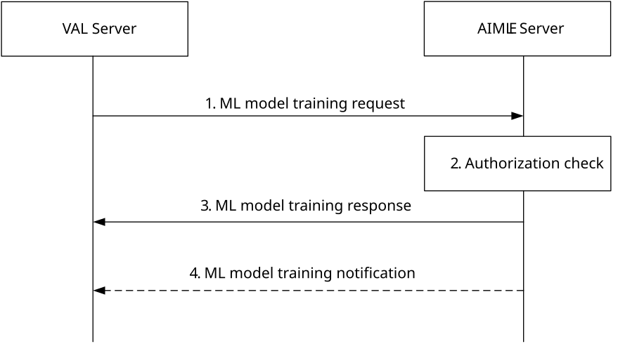

# 8.3 ML model training

## 8.3.1 General

This clause describes the procedure for supporting the ML model training by the AIMLE server. The VAL server requests the AIMLE server for the ML model training. VAL server requests the AIMLE server to train a ML model by specifying the type of learning, details about the ML model to be trained or requirements to select a ML model for training and criteria for selecting the members who can participate in the ML model training.

## 8.3.2 Procedure for ML model training

Figure 8.3.2-1 illustrates the procedure for AIMLE server to support ML model training based on the request from the VAL server.

Figure 8.3.2-1: ML model training

1\. The VAL server sends an ML model training request to AIMLE server, requesting to assist in its ML model training. This request consists of ML model information or ML model requirement information, etc.

2\. The AIMLE server checks whether the VAL server is authorized to perform the ML model training request. If no model information is provided but only the model requirement information is provided in step 1, the AIMLE server identifies and selects the appropriate ML model for training based on the ML model requirement information using the procedure as specified in clause 8.11.3.

3\. If the VAL server is authorized, AIMLE server returns the success response, otherwise a failure response indication the reason for failure.

4\. The AIMLE server notifies the VAL server to update the list FL/ML clients selected or de-selected for the ML model training or to share the training output or any errors during the training process.

## 8.3.3 Information flows

### 8.3.3.1 ML model training request

Table 8.3.3.1-1 describes the information flow from the VAL server to the AIMLE server for requesting the ML model training.

Table 8.3.3.1-1: ML model training request

<table>
<colgroup>
<col style="width: 33%" />
<col style="width: 16%" />
<col style="width: 50%" />
</colgroup>
<thead>
<tr class="header">
<th>Information element</th>
<th>Status</th>
<th>Description</th>
</tr>
</thead>
<tbody>
<tr class="odd">
<td>Requestor identity</td>
<td>M</td>
<td>Identity of the VAL server performing the request.</td>
</tr>
<tr class="even">
<td>Training type</td>
<td>
O

(NOTE 4)
</td>
<td>Identifies whether the VFL or HFL training to be performed.</td>
</tr>
<tr class="odd">
<td>List of member clients</td>
<td>
O

(NOTE 1)
</td>
<td>List of member clients or AIMLE client set identifier to be utilized for training the ML model.</td>
</tr>
<tr class="even">
<td>Member selection criteria</td>
<td>
O

(NOTE 1)
</td>
<td>Identifies the criteria that needs to be continuously monitored for selecting the member clients (e.g., AIMLE clients in a particular location, member availability duration, new member clients registering with the required capabilities, AIMLE clients support renewable energy).</td>
</tr>
<tr class="odd">
<td>Number of required AIML clients</td>
<td>O</td>
<td>Indicates the requested number of AIML clients to be selected based on member selection criteria.</td>
</tr>
<tr class="even">
<td>ML model information</td>
<td>
O

(NOTE 2)
</td>
<td>Identifies the ML model that has to be distributed to the selected member clients for training. This information consists of the model identifier, address (e.g., a URL or an FQDN) of the ML model file or address of the model repository where the ML model resides</td>
</tr>
<tr class="odd">
<td>ML model requirement information</td>
<td>
O

(NOTE 2)
</td>
<td>Identifies the requirement for selecting a model to be trained and this information contains the filtering criteria for selecting the model as specified in Table 8.11.4.1-2.</td>
</tr>
<tr class="even">
<td>Dataset identifiers</td>
<td>M</td>
<td>Identifier of dataset used to HFL or VFL training. For VFL training, multiple dataset identifiers is specified for different data domains.</td>
</tr>
<tr class="odd">
<td>Number of data samples</td>
<td>O</td>
<td>The number of data samples required for a round of HFL or VFL training.</td>
</tr>
<tr class="even">
<td>Operational schedule</td>
<td>O</td>
<td>A schedule for when training is to occur.</td>
</tr>
<tr class="odd">
<td>VFL specific parameters</td>
<td>
O

(NOTE 3)
</td>
<td>Parameters specific to VFL training</td>
</tr>
<tr class="even">
<td>&gt; Dataset common features</td>
<td>
O

(NOTE 3)
</td>
<td>A list of one or more common features is specify for VFL training. Common features can be UE identifiers, AIMLE client identifiers, group identifier, VAL service identifier, area of interest, and VAL service area.</td>
</tr>
<tr class="odd">
<td>&gt; Data domain feature ID lists</td>
<td>
O

(NOTE 3)
</td>
<td>List of features for each data domain(s) of the datasets at the UE for VFL training.</td>
</tr>
<tr class="even">
<td>&gt; Feature alignment information</td>
<td>O</td>
<td>Information provided to align features from dataset of different domains for VFL training. Alignment information is also provided for data domain features with ground truth data.</td>
</tr>
<tr class="odd">
<td>&gt; Data labels</td>
<td>O</td>
<td>Ground truth data provided for VFL training.</td>
</tr>
<tr class="even">
<td>Training objective</td>
<td>O</td>
<td>Identifies the termination condition for the ML model training. Table 8.3.3.1-2 describes the information related to training objective.</td>
</tr>
<tr class="odd">
<td>Members update notification</td>
<td>O</td>
<td>Indicates whether requestor needs to be notified whenever there is update related to new member clients selected or de-selected.</td>
</tr>
<tr class="even">
<td>Notification Target Address</td>
<td>O</td>
<td>Notification target address (e.g. URL) where the notifications should be sent.</td>
</tr>
<tr class="odd">
<td colspan="3">
NOTE 1: At least one of these IE shall be present when the training type is federation learning.

NOTE 2: At least one of these IE shall be present.

NOTE 3: These IE shall be present for VFL training.

NOTE 4: This IE shall be present when the training type is federation learning.
</td>
</tr>
</tbody>
</table>

Table 8.3.3.1-2: ML model training objective

| Information element        | Status | Description                                                            |
|----------------------------|--------|------------------------------------------------------------------------|
| Objective Type             | M      | Identifies the metric to be optimized by the ML model (e.g. accuracy.) |
| Target Value               | O      | Identifies the threshold to be reached for the objective type.         |
| Early stopping Criteria    | O      | Identifies the metric to be used for early stopping.                   |
| Maximum number of Epochs   | O      | Identifies the maximum number of training epochs                       |
| Acceptable training errors | O      | Maximum error acceptable with training.                                |
| Inference Latency          | O      | Inference latency requirements for the trained model.                  |

### 8.3.3.2 ML model training response

Table 8.3.3.2-1 describes the information flow of ML model training response from the AIMLE server to the VAL server.

Table 8.3.3.2-1: ML model training response

<table>
<colgroup>
<col style="width: 33%" />
<col style="width: 16%" />
<col style="width: 50%" />
</colgroup>
<thead>
<tr class="header">
<th>Information element</th>
<th>Status</th>
<th>Description</th>
</tr>
</thead>
<tbody>
<tr class="odd">
<td>Success response</td>
<td>
O

(NOTE)
</td>
<td>Indicates that the ML model training request was successful.</td>
</tr>
<tr class="even">
<td>&gt; ML model training identifier</td>
<td>M</td>
<td>An identifier for the ML model training request.</td>
</tr>
<tr class="odd">
<td>&gt; ML model identifier</td>
<td>O</td>
<td>Identifies the ML model selected by AIMLE server for training.</td>
</tr>
<tr class="even">
<td>Failure response</td>
<td>
O

(NOTE)
</td>
<td>Indicates that the ML model training request was failure.</td>
</tr>
<tr class="odd">
<td>&gt; Cause</td>
<td>M</td>
<td>Reason for the failure.</td>
</tr>
<tr class="even">
<td colspan="3">NOTE: Only one of these information elements shall be present</td>
</tr>
</tbody>
</table>

### 8.3.3.3 ML model training notification

Table 8.3.3.3-1 describes the information flow of ML model training notification from the AIMLE server to the VAL server.

Table 8.3.3.3-1: ML model training notification

<table>
<colgroup>
<col style="width: 33%" />
<col style="width: 16%" />
<col style="width: 50%" />
</colgroup>
<thead>
<tr class="header">
<th>Information element</th>
<th>Status</th>
<th>Description</th>
</tr>
</thead>
<tbody>
<tr class="odd">
<td>ML model training identifier</td>
<td>M</td>
<td>An identifier for the ML model training request the notification is for.</td>
</tr>
<tr class="even">
<td>List of AIMLE clients</td>
<td>
O

(NOTE)
</td>
<td>Indicates the list of AIMLE clients selected or de-selected for the ML model training.</td>
</tr>
<tr class="odd">
<td>Training output</td>
<td>
O

(NOTE)
</td>
<td>Output of training, e.g., ML model parameters for the training.</td>
</tr>
<tr class="even">
<td>Percentage completion</td>
<td>O</td>
<td>Indicates a completion percentage for the training.</td>
</tr>
<tr class="odd">
<td>Errors list</td>
<td>
O

(NOTE)
</td>
<td>A list of errors, if any, encountered during training process.</td>
</tr>
<tr class="even">
<td colspan="3">NOTE: At least one of these IEs shall be present.</td>
</tr>
</tbody>
</table>
