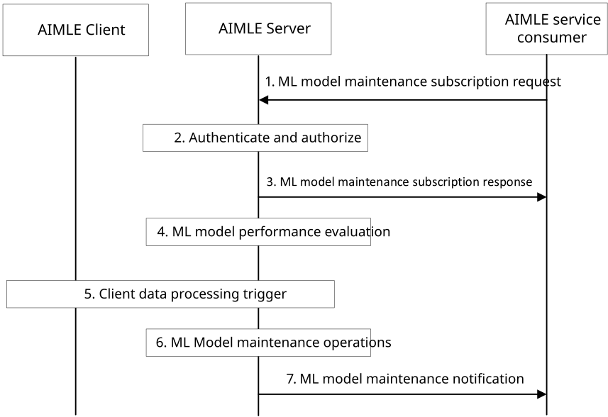

# 8.30 ML Model Maintenance

## 8.30.1 General

The procedure is described in clause 8.30.2 for supporting ML model maintenance.

## 8.30.2 Procedure

Pre-conditions:

1\. AIMLE clients have registered with AIMLE server.

Figure 8.30.2-1: AIMLE support ML model maintenance procedure

1\. An AIMLE service consumer (e.g., VAL server) sends a ML model maintenance subscription request to the AIMLE server. The request includes information as described in Table 8.30.3.1-1.

2\. The AIMLE server authenticates and authorizes the request. If authorized, the AIMLE server assigns an identifier for the subscription.

3\. The AIMLE server sends an ML model maintenance subscription response to the AIMLE service consumer. The response includes information as described in Table 8.30.3.2-1.

4\. The AIMLE server performs operations for ML model performance evaluation to check the ML model performance. The AIMLE server retrieves the ML model evaluation information from the provided ML evaluation profile identifier as described in clause 8.26 and performs the ML model performance evaluation. If the performance of the ML model is not as expected as request in step 1, the AIMLE server determines date drift detection. The ML model performance evaluation can use the ML model performance monitoring service as described in clause 8.22 or use ML model evaluation procedure as introduced in clause 8.30.

5\. The AIMLE server request and get client data processing trigger response as described in clause 8.15 with data drift detection outputs from the AIMLE client, by using the enhanced AIMLE data management assistance service.

6\. Based on the data drift information received in step 5 and the ML model evaluation information obtained in step 4, the AIMLE server determines if actions are required (e.g. model replacement (e.g. select other ML model) or transfer learning (e.g. re-train the ML model based on the original ML model)) to keep the ML model performance within the performance requirements received in step 1.

7\. The AIMLE server sends an ML model maintenance notification based on the notification requirements received in step 1 to the AIMLE service consumer with information as described in Table 8.30.3.3-1.

## 8.30.3 Information flows

### 8.30.3.1 ML model maintenance subscription request

Table 8.30.3.1-1 shows the request sent by an AIMLE service consumer (e.g. VAL server) to an AIMLE server for the ML model maintenance subscription.

Table 8.30.3.1-1: ML model maintenance subscription request

<table>
<colgroup>
<col style="width: 33%" />
<col style="width: 16%" />
<col style="width: 50%" />
</colgroup>
<thead>
<tr class="header">
<th>Information element</th>
<th>Status</th>
<th>Description</th>
</tr>
</thead>
<tbody>
<tr class="odd">
<td>Requestor identifier</td>
<td>M</td>
<td>The identifier of the requestor (e.g. VAL server ID).</td>
</tr>
<tr class="even">
<td>ML model ID</td>
<td>M</td>
<td>The identifier of the model that will be maintained.</td>
</tr>
<tr class="odd">
<td>ML model retrieval endpoint</td>
<td>
O

(NOTE 1)
</td>
<td>The endpoint (e.g. URL, URI, IP address) where the ML model file can be retrieved.</td>
</tr>
<tr class="even">
<td>ML model</td>
<td>
O

(NOTE 1)
</td>
<td>The ML model that will be maintained.</td>
</tr>
<tr class="odd">
<td>ML model maintenance requirements</td>
<td>M</td>
<td>Requirements for the ML model maintenance.</td>
</tr>
<tr class="even">
<td>&gt; ML model performance requirements</td>
<td>M</td>
<td>ML model performance requirements for the maintenance.</td>
</tr>
<tr class="odd">
<td>&gt; ML model evaluation profile ID</td>
<td>M</td>
<td>The identifier of the ML model evaluation profile.</td>
</tr>
<tr class="even">
<td>&gt; Dataset ID</td>
<td>
O

(NOTE 2)
</td>
<td>An identifier for the dataset, which is used for training the ML model, or be used by the ML model for its task.</td>
</tr>
<tr class="odd">
<td>&gt; AIMLE clients list</td>
<td>
O

(NOTE 2)
</td>
<td>A list of AIMLE clients from which the datasets for the ML model maintenance applied for.</td>
</tr>
<tr class="even">
<td>&gt; Maintenance mode</td>
<td>M</td>
<td>The maintenance mode, e.g., periodically or event triggered (e.g. ML model performance degradation detected, data drift detected).</td>
</tr>
<tr class="odd">
<td>Notification requirements</td>
<td>M</td>
<td>Indicates the requirements for notification, e.g. periodically or event triggered (e.g. ML model status changed).</td>
</tr>
<tr class="even">
<td>Notification endpoint</td>
<td>O</td>
<td>The notification endpoint where the notifications should be sent to.</td>
</tr>
<tr class="odd">
<td>Expiration time</td>
<td>O</td>
<td>The proposed expiration time of the subscription.</td>
</tr>
<tr class="even">
<td colspan="3">
NOTE 1: At least one of the information elements shall be provided.

NOTE 2: At least one of the information elements shall be provided.
</td>
</tr>
</tbody>
</table>

### 8.30.3.2 ML model maintenance subscription response

Table 8.30.3.2-1 shows the response sent by the AIMLE server to the AIMLE service consumer (e.g. VAL server) for the ML model maintenance subscription.

Table 8.30.3.2-1: ML model maintenance subscription response

<table>
<colgroup>
<col style="width: 33%" />
<col style="width: 16%" />
<col style="width: 50%" />
</colgroup>
<thead>
<tr class="header">
<th><strong>Information element</strong></th>
<th><strong>Status</strong></th>
<th><strong>Description</strong></th>
</tr>
</thead>
<tbody>
<tr class="odd">
<td>Successful response</td>
<td>
O

(NOTE)
</td>
<td>Indicates that the ML model maintenance subscription request was successful.</td>
</tr>
<tr class="even">
<td>&gt; Subscription identifier</td>
<td>M</td>
<td>An identifier for the subscription.</td>
</tr>
<tr class="odd">
<td>&gt; Expiration time</td>
<td>O</td>
<td>Expiration time for the subscription</td>
</tr>
<tr class="even">
<td>Failure response</td>
<td>
O

(NOTE)
</td>
<td>Indicates that the request has failed.</td>
</tr>
<tr class="odd">
<td>&gt; Cause</td>
<td>O</td>
<td>The cause for the request failure.</td>
</tr>
<tr class="even">
<td colspan="3">NOTE: One of the information elements shall be present.</td>
</tr>
</tbody>
</table>

### 8.30.3.3 ML model maintenance notification

Table 8.30.1.2.3-1 shows the notification sent by the AIMLE server to the AIMLE service consumer (e.g. VAL server) for the ML model maintenance subscription.

Table 8.30.3.3-1: ML model maintenance notification

| Information element       | Status | Description                                                                                                                |
|---------------------------|--------|----------------------------------------------------------------------------------------------------------------------------|
| Subscription identifier   | M      | The identifier of the subscription.                                                                                        |
| Model maintenance outputs | M      | The outputs for model maintenance, e.g. updated ML model, or ML model status (e.g. updated ML model ID, ML model version). |
| Timestamp                 | O      | Timestamp of the data management notification.                                                                             |
