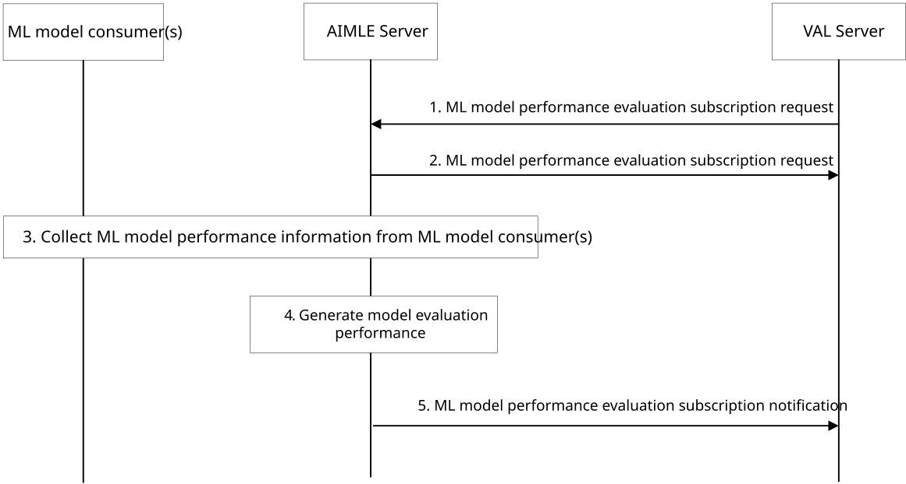

# 8.31 ML Model Performance Evaluation with Information Collection from ML Model Consumer

## 8.31.1 General

In this functionality, procedure is described in clasue 8.31.2 for supporting ML model performance evaluation with information collection from ML model consumers.

## 8.31.2 ML model performance evaluation

Figure 8.31.2-1: ML model performance evaluation with information collection from ML model consumer

Figure 8.31.2-1 illustrates the procedure on ML model performance with information collection from ML model consumer. The corresponding procedure in detail is as follows:

1\. The VAL server sends to the AIMLE server the ML model performance evaluation subscription request message containing the ML model ID, the VAL Service ID, the ML model performance evaluation ID, and the purpose on the ML model as specified in Table 8.31.3.1-1. The ML evaluation profile ID is used to obtain the ML model performance evaluation profile which is used to determine the ML model performance in step 10.

2\. The AIMLE server sends the ML model performance evaluation subscription response message to the VAL server, containing a success message if the VAL server is authorized to subscribe. Otherwise, an error message is sent to the VAL server. The requested message includes the information specified in Table 8.31.3.2-1.

3\. The AIMLE server collects ML model performance information from the ML model consumer(s) directly or via A-DCCF data collection service as defined in 3GPP TS 23.436 \[4\].

Editor's Note: How the AIMLE server can trigger A-DCCF data collection service will be further discussed during normative phase.

4\. Based on the ML model performance received in the previous step, the AIMLE server computes the ML model performance metrics based on the information provided by the ML consumers and the ML model performance evaluation profile information.

5\. The AIMLE server sends to the VAL server the ML model performance evaluation subscription notification containing the information about the performance of the requested ML model. The detail information contains in the notification is as specified in Table 8.31.3.3-1.

## 8.31.3 Information flows

### 8.31.3.1 ML model performance evaluation subscription request

Table 8.31.3.1-1 describes information elements for the ML model performance evaluation subscription request from the VAL server to the AIMLE server.

Table 8.31.3.1-1: ML model performance evaluation subscription request

| Information element                        | Status | Description                                                    |
|--------------------------------------------|--------|----------------------------------------------------------------|
| ML model ID                                | M      | The ML model identifier.                                       |
| VAL service ID                             | M      | The identifier of the VAL service.                             |
| ML model performance evaluation profile ID | M      | The identifier of the ML model performance evaluation profile. |

### 8.31.3.2 ML model performance evaluation subscription response

Table 8.31.3.2-1 describes information elements for the ML model performance evaluation subscription response from the AIMLE server to the VAL server.

Table 8.31.3.2-1: ML model performance evaluation subscription response

<table>
<colgroup>
<col style="width: 33%" />
<col style="width: 18%" />
<col style="width: 48%" />
</colgroup>
<thead>
<tr class="header">
<th>Information element</th>
<th>Status</th>
<th>Description</th>
</tr>
</thead>
<tbody>
<tr class="odd">
<td>Subscription ID</td>
<td>M</td>
<td>The identifier of the subscription.</td>
</tr>
<tr class="even">
<td>Model ID</td>
<td>M</td>
<td>The identifier of the Model.</td>
</tr>
<tr class="odd">
<td>VAL service ID</td>
<td>M</td>
<td>The identifier of the VAL service.</td>
</tr>
<tr class="even">
<td>Request successful</td>
<td>
O

(NOTE)
</td>
<td>ML model performance evaluation request successful message.</td>
</tr>
<tr class="odd">
<td>Error message</td>
<td>
O

(NOTE)
</td>
<td>ML model performance evaluation request error message.</td>
</tr>
<tr class="even">
<td colspan="3">NOTE: At least one of these IE shall be present.</td>
</tr>
</tbody>
</table>

### 8.31.3.3 ML model performance evaluation notification

Table 8.31.3.3-1 describes information elements for the ML model performance evaluation notification from the AIMLE server to the VAL server.

Table 8.31.3.3-1: ML model performance evaluation notification

| Information element              | Status | Description                                                                                                                                                       |
|----------------------------------|--------|-------------------------------------------------------------------------------------------------------------------------------------------------------------------|
| Model ID                         | M      | The identifier of the model.                                                                                                                                      |
| VAL service ID                   | M      | The identifier of the VAL service.                                                                                                                                |
| ML model performance information | M      | It contains the aggregated information regarding the performance of the ML model identified by the Model ID on the data sources. (e.g., accuracy, F1 score, AUC). |
