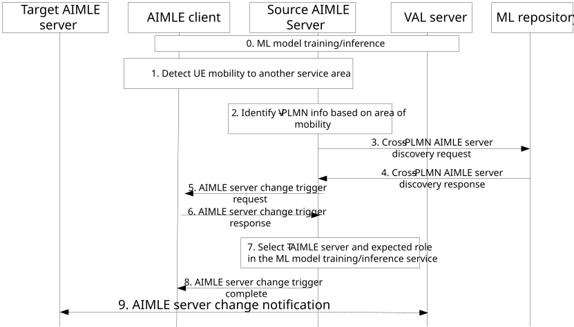

# 8.32 AIMLE service migration in UE roaming scenarios

## 8.32.1 General

This clause describes a mechanism for supporting the continuity of the ML training / inference capability in scenarios where the ML model training / inference happens at the UE (e.g. AIMLE client) while the UE client is expected to move to an area served by another PLMN.

In this mechanism, the assumption is that the VAL UE undertakes an ML operation (such as training or inference) and is served by a source AIMLE server to which it is connected via H-PLMN, and the VAL UE is roaming while the operation is ongoing. In such scenario, to prevent AIMLE service disruption, this solution provides a mechanism to enable the migration of AIMLE service to the target AIMLE server who is bound to VPLMN.

The following clauses specify procedures, information flows, and APIs for AIMLE service migration in UE roaming scenarios.

## 8.32.2 Procedure

Pre-conditions:

1\. AIMLE client / server has subscribed to receive location reporting from SEAL LMS or location analytics from SEAL ADAES.

Figure 8.32.2-1: Procedure for support for VAL UE roaming

0\. The AIMLE client is performing an ML model training and/or inference operation based on VAL request.

1\. The AIMLE client detects an expected or predicted mobility of UE to an area covered by different PLMN. The AIMLE client optionally sends a mobility report to the source-AIMLE server indicating a cross-PLMN mobility event notification for the VAL UE.

2\. The source AIMLE server identifies the V-PLMN info and the time when the VAL UE is expected to reach V-PLMN.

3\. The source AIMLE server discovers the available AIMLE servers via CAPIF or via sending a cross-PLMN AIMLE server discovery request to the ML repository to fetch the available AIMLE servers in target V-PLMN.

4\. The source AIMLE server receives a cross-PLMN AIMLE server discovery response from the ML repository with the available AIMLE servers in target V-PLMN, based on the discovery criteria.

NOTE 1: It is assumed that the available AIMLE servers for the V-PLMN are pre-configured at the ML repository.

5\. The source AIMLE server sends an AIMLE server change trigger request to AIMLE client for notifying on the available AIMLE servers, where the message includes the list of available AIMLE servers in VPLMN and some context information (e.g. rating/ranking, capability information, energy/load status).

6\. AIMLE client based on the received list, optionally down-selects the T-AIMLE server from a list of AIMLE servers, based on the fetched information, and provides an AIMLE server change trigger response to the source AIMLE server.

> The selection criteria may be:

\- Capabilities (computational, processing) and coverage (geographical or topological area covered by T-AIMLE server)

\- Expected delay / latency for accessing the T-AIMLE server (e.g., in case of relaying ML inference task). This can be estimated based on probes or based on relative location of platform hosting the T-AIMLE server or based on the interface / API statistics on delay or failures based on high delay.

\- Cost for task migration: The computational effort and/or processing required, or time required, or energy required for offloading a task to the T-AIMLE server. Such cost may be based on the distance among servers (e.g. edge to regional cloud) or based on the task to be offloaded.

\- Such rate can be stored and updated at ML repository (or shared among repositories) after fulfilling each task based on consumer feedback or based on internal evaluation at the AIMLE (based on success or failure of tasks under similar conditions)

7\. The source AIMLE server determines the T-AIMLE server to be selected for the ML model training/inference service continuity at the target VPLMN for the AIMLE client, based on the selection criteria in step 6.

8\. The source AIMLE server requests the AIMLE client to change serving AIMLE server with a AIMLE server change trigger complete message, where it passes the target AIMLE server info, also possible limitations in target V-PLMN (lower priority, capacity limitations for ML operation).

Following, the AIMLE client confirms and connects to target AIMLE server via the source AIMLE server.

NOTE 2: Based on successful AIMLE server migration, the AIMLE context transfer procedure follows.

9\. The S-AIMLE server sends an AIMLE server change notification to T-AIMLE server as well as the VAL server on the expected change of the AIMLE server from source to target (in VPLMN).

## 8.32.3 Information flows

### 8.32.3.1 Cross-PLMN AIMLE server discovery request

Table 8.32.3.1-1 shows the request sent by a requestor (e.g., VAL server, AIMLE server) to the ML repository for the AIMLE server discovery procedure.

Table 8.32.3.1-1: cross-PLMN AIMLE server discovery request

<table>
<colgroup>
<col style="width: 31%" />
<col style="width: 13%" />
<col style="width: 55%" />
</colgroup>
<thead>
<tr class="header">
<th>Information element</th>
<th>Status</th>
<th>Description</th>
</tr>
</thead>
<tbody>
<tr class="odd">
<td>Requestor identity</td>
<td>M</td>
<td>The identifier of the requestor (e.g., VAL server, AIMLE server).</td>
</tr>
<tr class="even">
<td>AIMLE server discovery criteria</td>
<td>M</td>
<td>The discovery criteria for finding suitable AIMLE server in cross-PLMN scenario.</td>
</tr>
<tr class="odd">
<td>&gt; AIMLE server capability</td>
<td>M</td>
<td>Identifies the capability requirement (computational, processing) for the AIMLE servers to be discovered</td>
</tr>
<tr class="even">
<td>&gt; AIMLE coverage area</td>
<td>
O

(NOTE)
</td>
<td>Geographical or topological area covered by T-AIMLE server to be discovered.</td>
</tr>
<tr class="odd">
<td>&gt; AIMLE server Load/energy status</td>
<td>
O

(NOTE)
</td>
<td>Load and energy status of the target AIMLE server, based on monitoring or querying possible overload or high energy consumption.</td>
</tr>
<tr class="even">
<td>&gt; rate/ranking requirement</td>
<td>
O

(NOTE)
</td>
<td>A rate/ranking/weighting requirement for discovering the target AIMLE server based on fulfilment of previous tasks and statistics.</td>
</tr>
<tr class="odd">
<td colspan="3">NOTE: At least one shall be present</td>
</tr>
</tbody>
</table>

### 8.32.3.2 Cross-PLMN AIMLE server discovery response

Table 8.32.3.2-1 shows the response sent by the ML repository to the AIMLE server for the AIMLE server discovery procedure.

Table 8.32.3.2-1: cross-PLMN AIMLE server discovery response

| Information element              | Status | Description                                                                                                                                                                                                                                                  |
|----------------------------------|--------|--------------------------------------------------------------------------------------------------------------------------------------------------------------------------------------------------------------------------------------------------------------|
| Status                           | M      | The status for the request: success or fail.                                                                                                                                                                                                                 |
| List of AIMLE server IDs         | M      | A list of AIMLE server IDs that matches the AIMLE server discovery criteria as in table 8.32.3.2-1.                                                                                                                                                          |
| \> PLMN ID/name per AIMLE client | O      | The PLMN in which the VAL UE is connected/registered.                                                                                                                                                                                                        |
| AIML supported tasks             | O      | Indicates the discovered AIML task providers fulfilling the AIML task and AIML task requirements. It includes expected AIML task KPIs like latency, available AIML tasks service duration, list of AIML task providers like IDs or URI, and supported tasks. |

### 8.32.3.3 AIMLE server change trigger request

Table 8.32.3.3-1 shows the request sent from the AIMLE server to the AIMLE client for the AIMLE server discovery procedure.

Table 8.32.3.3-1: AIMLE server change trigger request

<table>
<colgroup>
<col style="width: 33%" />
<col style="width: 16%" />
<col style="width: 50%" />
</colgroup>
<thead>
<tr class="header">
<th>Information element</th>
<th>Status</th>
<th>Description</th>
</tr>
</thead>
<tbody>
<tr class="odd">
<td>AIMLE service ID</td>
<td>M</td>
<td>The identifier of the AIMLE service for which the AIMLE server change is triggered</td>
</tr>
<tr class="even">
<td>VAL UE ID(s)</td>
<td>O</td>
<td>The identifier of the UE ID(s) for which the AIMLE service needs to change</td>
</tr>
<tr class="odd">
<td>List of AIMLE server IDs</td>
<td>M</td>
<td>A list of AIMLE server IDs who are candidate AIMLE servers as target.</td>
</tr>
<tr class="even">
<td>&gt; AIMLE server capability</td>
<td>
O

(NOTE)
</td>
<td>Identifies the capability requirement (computational, processing) for the AIMLE server.</td>
</tr>
<tr class="odd">
<td>&gt; AIMLE coverage area</td>
<td>
O

(NOTE)
</td>
<td>Geographical or topological area covered by T-AIMLE server.</td>
</tr>
<tr class="even">
<td>&gt; AIMLE server Load/energy status</td>
<td>
O

(NOTE)
</td>
<td>Load and energy consumption/efficiency status of the target AIMLE server.</td>
</tr>
<tr class="odd">
<td>&gt; rate /ranking</td>
<td>
O

(NOTE)
</td>
<td>A rate/ranking/weighting of the target AIMLE server based on fulfilment of previous tasks and statistics.</td>
</tr>
<tr class="even">
<td>V-PLMN info</td>
<td>O</td>
<td>Identity of the V-PLMN /MNO name in which the VAL UE is expected to roam</td>
</tr>
<tr class="odd">
<td>AIMLE service migration type</td>
<td>M</td>
<td>The type of AIMLE service continuity which can be either 1) migrating the AIMLE service (e.g. ML model inference) to the T-AIMLE server, or 2) relaying AIMLE service output to the consumer via VPLMN.</td>
</tr>
<tr class="even">
<td colspan="3">NOTE: At least one of these shall be present</td>
</tr>
</tbody>
</table>

### 8.32.3.4 AIMLE server change trigger response

Table 8.32.3.4-1 shows the response sent from the AIMLE client to the AIMLE server for the AIMLE server discovery procedure.

Table 8.32.3.4-1: AIMLE server change trigger response

| Information element              | Status | Description                                                                                                   |
|----------------------------------|--------|---------------------------------------------------------------------------------------------------------------|
| Result                           | M      | The positive or negative result of the AIMLE server change trigger.                                           |
| Limited list of AIMLE server IDs | O      | A limited list of AIMLE server IDs as target of those candidate AIMLE servers received from the AIMLE server. |

### 8.32.3.5 AIMLE server change trigger complete

Table 8.32.3.5-1 shows the AIMLE server change trigger complete sent from the AIMLE client to the AIMLE server for the completion of the AIMLE server change.

Table 8.32.3.5-1: AIMLE server change trigger complete

| Information element          | Status | Description                                                                                                                                                                                             |
|------------------------------|--------|---------------------------------------------------------------------------------------------------------------------------------------------------------------------------------------------------------|
| AIMLE client ID              | M      | The identifier of the AIMLE client which triggers the the adaptation of the AIMLE server                                                                                                                |
| VAL UE ID(s)                 | O      | The identifier of the UE ID(s) for which the AIMLE service needs to change                                                                                                                              |
| T-AIMLE server ID            | M      | The identifier of the AIMLE server who will be the target AIMLE server.                                                                                                                                 |
| V-PLMN info                  | O      | Identity of the V-PLMN /MNO name in which the VAL UE is expected to roam.                                                                                                                               |
| AIMLE service migration type | M      | The type of AIMLE service continuity which can be either 1) migrating the AIMLE service (e.g. ML model inference) to the T-AIMLE server, or 2) relaying AIMLE service output to the consumer via VPLMN. |

### 8.32.3.6 AIMLE server change notification

Table 8.32.3.6-1 shows the AIMLE server change notification sent from the AIMLE server to the VAL server and/or the target AIMLE server.

Table 8.32.3.6-1: AIMLE server change notification

| Information element          | Status | Description                                                                                                                                                                                             |
|------------------------------|--------|---------------------------------------------------------------------------------------------------------------------------------------------------------------------------------------------------------|
| AIMLE client ID              | M      | The identification of the AIMLE client                                                                                                                                                                  |
| AIMLE service ID             | O      | The identification of the AIMLE service.                                                                                                                                                                |
| T-AIMLE server ID            | M      | The identifier of the AIMLE server who will be the target AIMLE server.                                                                                                                                 |
| V-PLMN info                  | O      | Identity of the V-PLMN /MNO name in which the VAL UE is expected to roam.                                                                                                                               |
| AIMLE service migration type | M      | The type of AIMLE service continuity which can be either 1) migrating the AIMLE service (e.g. ML model inference) to the T-AIMLE server, or 2) relaying AIMLE service output to the consumer via VPLMN. |
