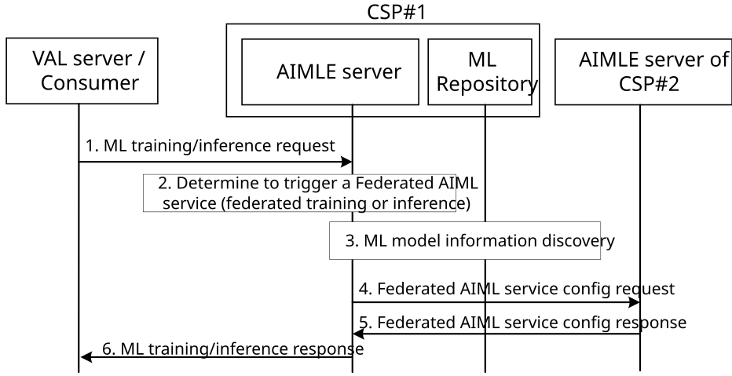

# 8.33 Federated AIML service enablement

## 8.33.1 General

This clause describes a mechanism for the configuration of the federated AIML service based on the VAL request for an AI/ML task (ML model training or inference request).

The following clauses specify procedures, information flows, and APIs for federated AIML service enablement.

## 8.33.2 Procedure

Pre-conditions:

1\. AIMLE consumer such as AIMLE client or VAL server has ML model or address to ML model.

Figure 8.33.2-1: Procedure on support for federated AI services

1\. An AIMLE server of CSP #1 receives an ML model training request from a VAL server as described in clause 8.3.3.1 or an ML model inference request as described in clause 8.36.3.1.

2\. The AIMLE server determines to trigger a federated AIML service, which can be an AIMLE service such as federated training or inference spanning across different CSPs. The determination can be based on the capability or availability limitations of CSP #1 for providing the AI/ML service; hence support from another CSP is needed.

3\. The AIMLE server performs an ML model information discovery, to discover ML model support for federated AI scenarios, where the discovery request (as specified in 3GPP TS 23.482 clause 8.11.4.3) includes federation information as part of the ML model informaiton, i.e. list of information for different federation agreements related to the ML model, in particular the role of other edge/cloud providers in accessing or operating the ML model (or part of it). This includes information on partner CSPs, permissions, capabilities and availability of the CSP offering part of the AIML service.

4\. In this step, the AIMLE server obtains the identity and address of the target CSP which is planned to undertake part of the AI/ML service based on step 3.

The AIMLE server determines to select the target AIMLE server of CSP #2 to form the Federated AIML service and generates and Federated Service ID. The AIMLE server of CSP #1 provides a configuration of the federated AIML service including the service area of interest, time validity, operation expected per lead and partner OP, the dataset requirements by the partner OP.

Then, AIMLE server sends a Federated AIML service configuration request to the partner CSP (AIMLE server in target CSP) to provide the configuration parameters.

5\. The target AIMLE server after authorizing the request, it checks the federation agreement (with its ML repository) and confirms or negotiates the configuration parameters. Then, the target AIMLE server provides a positive or negative response to the source AIMLE server (or CSP #1).

6\. The AIMLE server sends an ML model training response as described in clause 8.3.3.2 or an ML model inference response as described in clause 8.36.3.2 including also the trained/inferred model.

## 8.33.3 Information flows

### 8.33.3.1 Federated AIML service config request

Table 8.33.3.1-1 shows the request sent from the requestor AIMLE server to another AIMLE server of different CSP for providing the federated AIML service configuration.

**Table 8.33.3.1-1: Federated AIML service config request**

| **Information element**                           | **Status** | **Description**                                                                                                                                                                                               |
|---------------------------------------------------|------------|---------------------------------------------------------------------------------------------------------------------------------------------------------------------------------------------------------------|
| Requestor identifier                              | M          | The identifier of the requestor AIMLE server or VAL server.                                                                                                                                                   |
| AIMLE service ID                                  | M          | The AIMLE service identifier, where this service may be a ML model training service or an ML model inference service.                                                                                         |
| Target AIMLE server                               | M          | The target AIMLE server who is selected to participate in the Federated AIML service.                                                                                                                         |
| Partner CSP/ECSP info                             | O          | Name and identity of the CSP/ECSP who is selected to participate in the Federated AIML service.                                                                                                               |
| Federated Service ID                              | M          | The generated identifier for the Federated AIML service.                                                                                                                                                      |
| Configuration information                         | M          | The configuration information for the federated AIML service.                                                                                                                                                 |
| \> service area info                              | M          | The service or geographical area where the federated AIML service is available.                                                                                                                               |
| \> time validity                                  | O          | The time validity for the federated AIML service.                                                                                                                                                             |
| \> capability requirement of partner AIMLE server | M          | The capability requirement of the partner AIMLE server, including the compute and processing capabilities, the network access capabilities and the load/energy requirement.                                   |
| \> role of target AIMLE server                    | M          | The expected role of the target AIMLE server in the federated AIML service (e.g. FL server, FL client) and the expected operation that he will undertake.                                                     |
| \> Dataset requirements                           | O          | Information about dataset requirement for the federated AIML service.                                                                                                                                         |
| \>\> Dataset availability                         | O          | Dataset availability, including dataset identifiers, dataset size, age, list of dataset features.                                                                                                             |
| \>\> Data capabilities                            | O          | A list of data capabilities such as the type of data that can be collected (e.g., raw data), supported data processing capabilities (e.g., processed data) and supported exploratory data analysis functions. |

### 8.33.3.2 Federated AIML service config response

Table 8.33.3.2-1 shows the response sent from the AIMLE server of CSP#2 to the AIMLE server of CSP#1 for supporting the federated AIML service configuration.

**Table 8.33.3.2-1: Federated AIML service config response**

| **Information element**                                  | **Status** | **Description**                                 |
|----------------------------------------------------------|------------|-------------------------------------------------|
| Federated Service ID                                     | M          | The identifier of the Federated AIML service.   |
| Status                                                   | M          | The status for the request: success or failure. |
| Cause                                                    | O (NOTE)   | The cause for the request failure.              |
| NOTE: This is present if the response status is failure. |            |                                                 |
