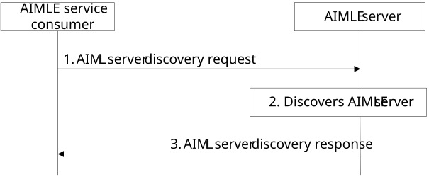

# 8.34 AIMLE server discovery

This clause describes a procedure for supporting the discovery of AIMLE servers based on the discovery requirements from the AIMLE service consumers (i.e., AIMLE client, VAL server).

## 8.34.1 General

This procedure describes the discovery of AIMLE servers. The AIMLE service consumer possesses (e.g., pre-configured) with a AIMLE server URI. The AIMLE server exposes a discovery API that returns a list of AIMLE servers matching given criteria. The need for availing services from another AIMLE server may arise at AIMLE client/VAL server for various conditions like change in AIMLE client's ML task requirement, AIMLE client's mobility planning/requirements etc. When such requirement arises, the AIMLE service consumer invokes the AIMLE server discovery service to fetch the appropriate AIMLE server meeting the requirements.

## 8.34.2 Procedure for AIMLE server discovery

When the AIMLE service consumer wants to use certain ML model or change in its ML task requirement, then the AIMLE service consumer can request the AIMLE server to discover another AIMLE server that can fulfil AIMLE requirements like training a certain ML model.

Assumptions:

\- AIMLE server is aware of the other AIMLE servers’ information, for example, AIMLE servers may have registered their capabilities with ML repository.

\- There are various deployments that include multiple AIMLE servers, for example, hierarchichal, Edge deployments etc.

Pre-conditions:

\- Each AIMLE client or VAL server is pre-configured with an AIMLE server URI. The AIMLE server exposes the discovery API that returns a list of AIMLE servers matching given criteria.

Figure 8.34.2-1: AIMLE server discovery procedure

1\. An AIMLE service consumer (e.g., VAL server, AIMLE client) sends an AIMLE server discovery request message to discover the list of suitable AIMLE servers. The request message includes AIMLE server requirements to discover suitable servers based on discovery criteria like geographical proximity etc.

2\. The AIMLE server performs authentication and authorization, checks to determine if the requestor can discover AIMLE servers. If the requestor is authorized, the AIMLE server performs the discovery based on the discovery criteria in the request message. The AIMLE server utilizes the provided criteria to filter and identify suitable AIMLE servers. If there are multiple AIMLE servers that fulfil the criteria, then the AIMLE server provides the suitable servers, ensuring that the returned list is optimized for the requestor's needs, improving performance and reliability.

3\. The AIMLE server sends the list of the suitable AIMLE servers to the requestor. The list may have an availability duration and this duration informs the requestor about the time frame within which the servers are guaranteed to be available, allowing for better planning and resource allocation. 

The discovery request needs to be initiated again by the AIMLE service consumer if the availability duration information is expired.

NOTE: AIMLE server discovery is to identify another AIMLE server that can match the AIMLE service consumer requirements. CAPIF discovery procedure can be used for discovering the service APIs exposed by AIMLE server.

Editor's Note: The usage of ML repository to discover the AIMLE servers is FFS.

## 8.34.3 Information flows

### 8.34.3.1 AIMLE server discovery request

Table 8.34.3.1-1 shows the information elements for the AIMLE server discovery request from the AIMLE client/VAL server to the AIMLE server.

Table 8.34.3.1-1: AIMLE server discovery request

<table>
<colgroup>
<col style="width: 33%" />
<col style="width: 16%" />
<col style="width: 50%" />
</colgroup>
<thead>
<tr class="header">
<th><strong>Information element</strong></th>
<th><strong>Status</strong></th>
<th><strong>Description</strong></th>
</tr>
</thead>
<tbody>
<tr class="odd">
<td>Requestor identity</td>
<td>M</td>
<td>The identifier of the requestor (e.g., VAL server, AIMLE client).</td>
</tr>
<tr class="even">
<td>AIMLE server discovery criteria</td>
<td>M</td>
<td>Discovery criteria for discovering suitable AIMLE servers for AI/ML operations.</td>
</tr>
<tr class="odd">
<td>&gt; Location</td>
<td>
O

(NOTE 1)
</td>
<td>Indicates the location information (e.g., cell Identity, Tracking Area Identity, GPS coordinates, VAL service area ID), serving area information of the AIMLE server to be discovered.</td>
</tr>
<tr class="even">
<td>&gt; VAL service ID</td>
<td>
O

(NOTE 1)
</td>
<td>The identity of the VAL service for which the request applies.</td>
</tr>
<tr class="odd">
<td>&gt; Task Type</td>
<td>
O

(NOTE 1)
</td>
<td>The type of AI/ML operations that should be supported (e.g., model training, testing, inference, model split, etc).</td>
</tr>
<tr class="even">
<td>&gt; ML Models Supported</td>
<td>
O

(NOTE 1)
</td>
<td>Types of ML model supported identifiers of the ML models.</td>
</tr>
<tr class="odd">
<td>&gt; Availability</td>
<td>
O

(NOTE 1)
</td>
<td>The required availability duration or schedule of the AIMLE server.</td>
</tr>
<tr class="even">
<td>&gt; Processing capability</td>
<td>
O

(NOTE 1)
</td>
<td>The processing capability (e.g., CPU, GPU, Memory, etc) of the AIMLE server.</td>
</tr>
<tr class="odd">
<td>&gt; Inference task requirements</td>
<td>O</td>
<td>The requirements related to the inference task type. This information may be present when the Task type is inference.</td>
</tr>
<tr class="even">
<td>&gt;&gt; Modality</td>
<td>
O

(NOTE 2)
</td>
<td>Modality supported</td>
</tr>
<tr class="odd">
<td>&gt;&gt; Precision</td>
<td>
O

(NOTE 2)
</td>
<td>Required precision of the inference task.</td>
</tr>
<tr class="even">
<td>&gt;&gt; Performance / Qos requirements</td>
<td>
O

(NOTE 2)
</td>
<td>Target latency, throughput, concurrency/batch requirements, confidence reporting, etc.</td>
</tr>
<tr class="odd">
<td colspan="3">
NOTE 1: At least one of the information elements shall be present.

NOTE 2: At least one of the information elements shall be present.
</td>
</tr>
</tbody>
</table>

### 8.34.3.2 AIMLE server discovery response

Table 8.34.3.2-1 shows the information elements for the AIMLE Server Discovery response from the AIMLE server to the AIMLE client / VAL server.

Table 8.34.3.2-1: AIMLE server discovery response

<table>
<colgroup>
<col style="width: 33%" />
<col style="width: 16%" />
<col style="width: 50%" />
</colgroup>
<thead>
<tr class="header">
<th><strong>Information element</strong></th>
<th><strong>Status</strong></th>
<th><strong>Description</strong></th>
</tr>
</thead>
<tbody>
<tr class="odd">
<td>Success response</td>
<td>
O

(NOTE 1)
</td>
<td>Indicates that the AIMLE server discovery request was successful.</td>
</tr>
<tr class="even">
<td>&gt; List of AIMLE servers</td>
<td>M</td>
<td>A list of AIMLE servers information matching the AIML server discovery criteria.</td>
</tr>
<tr class="odd">
<td>&gt;&gt; Server identifier</td>
<td>M</td>
<td>Identifier of the AIMLE server</td>
</tr>
<tr class="even">
<td>&gt;&gt; End point</td>
<td>M</td>
<td>Service endpoint (e.g., URI/FQDN) together with the supported interface profile (API version, authentication scheme).</td>
</tr>
<tr class="odd">
<td>&gt;&gt; Model identifiers</td>
<td>O</td>
<td>Identifiers of the supported ML models by the AIMLE server.</td>
</tr>
<tr class="even">
<td>&gt;&gt; Processing capability</td>
<td>O</td>
<td>The processing capability (e.g., CPU, GPU, Memory, etc) of the AIMLE server.</td>
</tr>
<tr class="odd">
<td>&gt;&gt; Functional cpaabilities</td>
<td>O</td>
<td>Functional capabilities of the AIMLE server, such as supported modalities, maximum input/output length, supported quantizations, streaming/batch support.</td>
</tr>
<tr class="even">
<td>&gt;&gt; Performance profile</td>
<td>O</td>
<td>Performance parameters of the AIMLE server, such as latency ranges, throughput, and concurrency limits.</td>
</tr>
<tr class="odd">
<td>&gt;&gt; Availability Schedule</td>
<td>O</td>
<td>The availability duration or schedule of the AIMLE server.</td>
</tr>
<tr class="even">
<td>Failure response</td>
<td>
O

(NOTE 1)
</td>
<td>Indicates that the AIMLE server discovery request was failure.</td>
</tr>
<tr class="odd">
<td>&gt; Cause</td>
<td>M</td>
<td>Reason for the failure.</td>
</tr>
<tr class="even">
<td colspan="3">NOTE 1: Only one of these information elements shall be present.</td>
</tr>
</tbody>
</table>
