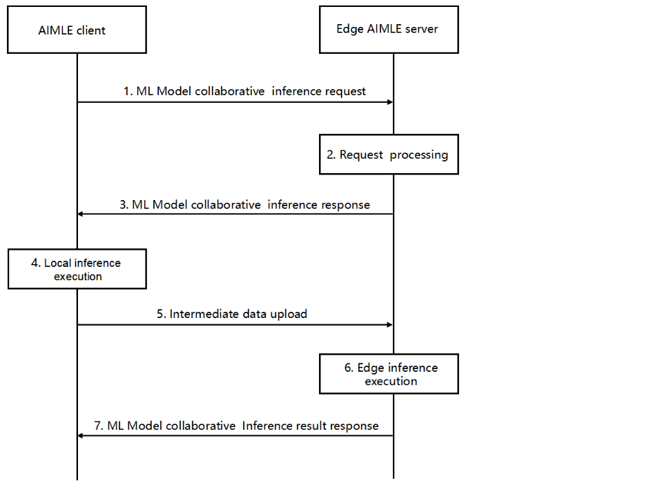

# 8.35 ML model collaborative inference

## 8.35.1 General

The split AI/ML operation pipeline framework defined in clause 8.14 provides a generic lifecycle and coordination framework for pipelines, rather than a dedicated procedure for inference between a UE-resident AIMLE client and an edge AIMLE server. Specifically, the split pipeline procedures focus on pipeline discovery/profile, processing node registration, and subscribe/notify for pipeline events.

This clause describes the procedure for supporting collaborative inference between AIMLE client and edge AIMLE server. In this procedure, a VAL UE executes the initial part of a model locally and offloads the remaining part to a nearby edge AIMLE server to provide a concrete, time-critical inference invocation. It complements the existing split pipeline framework and addresses collaborative inference use cases.

## 8.35.2 Procedure for ML model collaborative inference

Figure 8.35.2-1 illustrates the procedure for AIMLE server to support collaborative inference between AIMLE client and edge AIMLE server.

Pre-condition:

1\. The ML model needed to be used for this ML model inference is available by the AIMLE server.

Figure 8.35.2-1: ML model collaborative inference

1\. The AIMLE client initiates the inference service by sending a request to the edge AIMLE server. This request indicates that the UE intends to perform an ML model inference collaboratively (split between UE and edge AIMLE). The AIMLE client identifies the target ML model or inference task and that an edge AIMLE is needed to complete the inference. This request consists of the ML model identifier , and potentially the inference partitioning info. It may carry an inference session ID or a request for the edge to allocate resources. The information elements presented in the request are described in Table 8.35.3.1-1.

2\. The edge AIMLE server performs an authorization check. It also ensures the specified model (or sub-model for the later layers) is available. If the client only provided a task type (no specific model ID), the AIMLE server selects an appropriate ML model for the task using the AIMLE model discovery/selection procedure (per 3GPP TS 23.482 clause 8.11.3).

3\. If the request is authorized and a model is ready, the edge AIMLE server replies with a ML Model collaborative inference response, the Inference Setup Response acknowledging readiness, otherwise a failure response indicates the reason for failure. The information elements presented in the message are described in Table 8.35.3.2-1.

4\. Upon confirmation, the AIMLE client proceeds to execute the first part of the ML model locally. The AIMLE client runs the input data (provided by the VAL application) through the initial model layers (up to the agreed split point).

5\. Intermediate data upload: The AIMLE client sends the intermediate inference output to the edge AIMLE server. This intermediate data, such as a feature vector output from the last locally executed model layer (e.g., FeatureX), serves as input to the next stage of inference. The message includes an identifier to associate it with the earlier setup (e.g. the session ID or pipeline ID from step 2) so that the edge knows which model/task this data corresponds to. The information elements presented in the message are described in Table 8.35.3.3-1.

6\. The Edge AIMLE server uses the received intermediate data as input to the remaining portion of the ML model. It runs the model's subsequent layers or inference function to produce the final result.

7\. The edge AIMLE server sends a collaborative inference result response message back to the AIMLE client. This response contains the final inference result (for example, the predicted class label and confidence score, or other output data of the model). It also can include the ML model ID that was used, a status code indicates success or failure, cause value, etc. The information elements presented in the request are described in Table 8.35.3.4-1.

## 8.35.3 Information flows

### 8.35.3.1 ML model collaborative inference request

Table 8.35.3.1-1 describes the information elements included in the ML model collaborative inference request message sent by the AIMLE client to the edge AIMLE server.

Table 8.35.3.1-1: ML model collaborative inference request

<table>
<colgroup>
<col style="width: 33%" />
<col style="width: 18%" />
<col style="width: 48%" />
</colgroup>
<thead>
<tr class="header">
<th>Information element</th>
<th>Status</th>
<th>Description</th>
</tr>
</thead>
<tbody>
<tr class="odd">
<td>Requestor identify</td>
<td>M</td>
<td>The identifier of the requestor (e.g. identifier of the AIMLE client or the VAL UE).</td>
</tr>
<tr class="even">
<td>ML model ID</td>
<td>
O

(NOTE 1)
</td>
<td>The ML model identifier</td>
</tr>
<tr class="odd">
<td>Inference task</td>
<td>
O

(NOTE 1)
</td>
<td>Indicates the inference task</td>
</tr>
<tr class="even">
<td>&gt;Inference task type</td>
<td>O (NOTE 2)</td>
<td>Description of the inference task type to be performed (e.g., prediction, classification)</td>
</tr>
<tr class="odd">
<td>&gt;Inference task ID</td>
<td>
O

(NOTE 2)
</td>
<td>The ID of the inference task</td>
</tr>
<tr class="even">
<td>Inference partitioning info</td>
<td>M</td>
<td>The partitioning information of the ML model specifies how many layers are to be executed on the UE and how many layers are to be executed on the server</td>
</tr>
<tr class="odd">
<td>Inference session ID</td>
<td>
O

(NOTE 3)
</td>
<td>The identifier of the inference session requested by the UE</td>
</tr>
<tr class="even">
<td>Allocate resources request</td>
<td>
O

(NOTE 3)
</td>
<td>It indicates the request for resource allocation.</td>
</tr>
<tr class="odd">
<td colspan="3">
NOTE 1: Only one of the IEs shall be provided.

NOTE 2: Only one of the IEs shall be provided.

NOTE 3: Only one of the IEs shall be provided.
</td>
</tr>
</tbody>
</table>

### 8.35.3.2 ML model collaborative inference response

Table 8.35.3.2-1 describes the information elements included in the ML model collaborative inference response message sent by the AIMLE server to the edge AIMLE client.

Table 8.35.3.2-1: ML model collaborative inference response

<table>
<colgroup>
<col style="width: 33%" />
<col style="width: 18%" />
<col style="width: 48%" />
</colgroup>
<thead>
<tr class="header">
<th>Information element</th>
<th>Status</th>
<th>Description</th>
</tr>
</thead>
<tbody>
<tr class="odd">
<td>Inference Setup Response acknowledging readiness</td>
<td>
O

(NOTE)
</td>
<td>Contains all the necessary information for the ML split inference setup</td>
</tr>
<tr class="even">
<td>Failure response</td>
<td>
O

(NOTE)
</td>
<td>The error message in case of failure</td>
</tr>
<tr class="odd">
<td colspan="3">NOTE: Only one of the IE shall be provided.</td>
</tr>
</tbody>
</table>

### 8.35.3.3 Intermediate inference output

Table 3-1 describes the information elements included in the intermediate inference output message sent by the AIMLE client to the edge AIMLE server.

Table 8.35.3.3-1: Intermediate inference output

<table>
<colgroup>
<col style="width: 33%" />
<col style="width: 18%" />
<col style="width: 48%" />
</colgroup>
<thead>
<tr class="header">
<th>Information element</th>
<th>Status</th>
<th>Description</th>
</tr>
</thead>
<tbody>
<tr class="odd">
<td>Intermediate output</td>
<td>M</td>
<td>Intermediate data (e.g., feature vector output from the last locally executed model layer)</td>
</tr>
<tr class="even">
<td>ML model ID</td>
<td>
O

(NOTE 1)
</td>
<td>The ML model identifier</td>
</tr>
<tr class="odd">
<td>Inference task</td>
<td>
O

(NOTE 1)
</td>
<td>Indicates the inference task</td>
</tr>
<tr class="even">
<td>&gt;Inference task type</td>
<td>
O

(NOTE 2)
</td>
<td>Description of the inference task type to be performed (e.g., prediction, classification)</td>
</tr>
<tr class="odd">
<td>&gt;Inference task ID</td>
<td>O (NOTE 2)</td>
<td>The ID of the inference task</td>
</tr>
<tr class="even">
<td>Inference partitioning info</td>
<td>O</td>
<td>The partitioning information of the ML model specifies how many layers are to be executed on the UE and how many layers are to be executed on the server.</td>
</tr>
<tr class="odd">
<td>Inference session ID</td>
<td>O</td>
<td>The identifier of the inference session requested by the UE</td>
</tr>
<tr class="even">
<td colspan="3">
NOTE 1: One of the IE shall be provided.

NOTE 2: One of the IE shall be provided.
</td>
</tr>
</tbody>
</table>

### 8.35.3.4 ML Model collaborative inference result response

Table 4-1 describes the information elements included in the ML model collaborative inference result response sent by the AIMLE server to the edge AIMLE client.

Table 8.35.3.4-1: ML model collaborative Inference result response

| Information element | Status | Description                                                                                                                                                      |
|---------------------|--------|------------------------------------------------------------------------------------------------------------------------------------------------------------------|
| Inference output    | M      | The final inference output (e.g., the predicted class label and confidence score, or other output data of the model)                                             |
| Model ID            | O      | The identifier of the Model and contains the information necessary for the server to identify the correct layer of the Model to continue the inference execution |
| Status code         | O      | Indicates success or failure, cause value, etc.                                                                                                                  |
