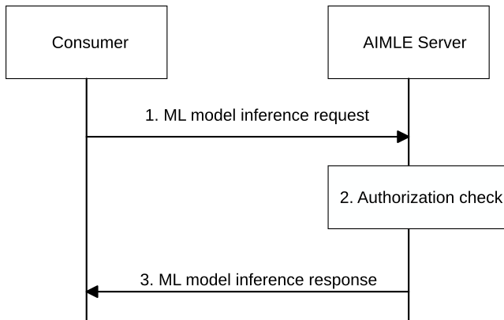

# 8.36 ML model inference

## 8.36.1 General

This clause describes the procedure for supporting the ML model inference by the AIMLE server. The consumer (e.g. VAL server, AIMLE client) requests the AIMLE server for ML model inference by specifying the details about the ML model or requirements to select a ML model for inference.

Pre-condition:

\- The ML model inference service needed to be used for this ML model inference is available by the AIMLE server.

## 8.36.2 Procedure for ML model inference

Figure 8.36.2-1 illustrates the procedure for AIMLE server to support ML model inference based on the request from the consumer.

Figure 8.36.2-1: ML model inference

1\. The consumer (e.g., VAL server, AIMLE client) sends an ML model inference request to AIMLE server, requesting the inference result from the AIMLE server. This request consists of ML model information or ML model inference requirement information, etc. The request includes information elements specified in table 8.36.2.1-1.

2\. The AIMLE server checks whether the consumer is authorized to perform the ML model inference request. If no model information is provided but only the model inference requirement information is provided in step 1, the AIMLE server identifies and selects the appropriate ML model for inference based on the ML model inference requirement information using the procedure as specified in clause 8.11.3. If the inference data or inference data location is not provided by the consumer, the AIMLE server may collect or retrieve the appropriate data based on the inference data requirement provided by the consumer. The AIMLE server handles the request and execute the inference task.

3\. If the consumer is authorized, AIMLE server returns the inference response, otherwise a failure response indication the reason for failure.

## 8.36.3 Information flows

### 8.36.3.1 ML model inference request

Table 8.36.3.1-1 describes the information flow from the consumer to the AIMLE server for requesting the ML model inference.

Table 8.36.3.1-1: ML model inference request

<table>
<colgroup>
<col style="width: 33%" />
<col style="width: 16%" />
<col style="width: 50%" />
</colgroup>
<thead>
<tr class="header">
<th>Information element</th>
<th>Status</th>
<th>Description</th>
</tr>
</thead>
<tbody>
<tr class="odd">
<td>Requestor identity</td>
<td>M</td>
<td>Identity of the consumer (e.g. identifier of the VAL server, AIMLE client or the VAL UE) performing the request.</td>
</tr>
<tr class="even">
<td>Inference data (NOTE 1)</td>
<td>O</td>
<td>
Original data for inference that may include text, images, audio, numerical data, etc.

This IE may be included in the request in the scenario, e.g. the data is small.
</td>
</tr>
<tr class="odd">
<td>Inference data location (NOTE 1)</td>
<td>O</td>
<td>The location of the data used for inference. This IE may be included in the request in the scenario, e.g. the data is big, or stored in different servers. The AIMLE server can fetch the Inference data from the Inference data location.</td>
</tr>
<tr class="even">
<td>Inference data description (NOTE 1)</td>
<td>O</td>
<td>Description related to the data to be used for inference (e.g., data type, data values, temporal or spatial characteristics). This IE may be included in the request when the consumer does not provide the inference data directly. The AIMLE server may collect or retrieve the required data from applicable sources, such as application data or network data, based on the specified requirements, and use the obtained data for inference.</td>
</tr>
<tr class="odd">
<td>Inference Parameters</td>
<td>O</td>
<td>Additional inference parameters that may be needed, such as maximum output length, temperature, batch size, etc., depending on the specific requirements of the model.</td>
</tr>
<tr class="even">
<td>ML model information (NOTE 2)</td>
<td>O</td>
<td>Identifies the ML model that the consumer specified to perform inference. This information consists of the model identifier, address (e.g., a URL or an FQDN) of the ML model file or address of the model repository where the ML model resides</td>
</tr>
<tr class="odd">
<td>ML model inference requirement information (NOTE 2)</td>
<td>O</td>
<td>Identity the type or goal of the inference task, such as 'text classification,' 'image recognition,' 'sentiment analysis,' etc</td>
</tr>
<tr class="even">
<td colspan="3">
NOTE 1: Only one of these IE shall be present.

NOTE 2: At least one of these IE shall be present.
</td>
</tr>
</tbody>
</table>

### 8.36.3.2 ML model inference response

Table 8.36.3.2-1 describes the information flow of ML model inference response from the AIMLE server to the consumer.

Table 8.36.3.2-1: ML model inference response

| Information element                                           | Status | Description                                                                                                    |
|---------------------------------------------------------------|--------|----------------------------------------------------------------------------------------------------------------|
| Service identifier                                            | O      | Indicates the service that executed the inference                                                              |
| Inference invocation ID                                       | O      | Identifier of this inference invocation for tracking or follow-up operations.                                  |
| Inference response                                            | M      | Indicates that the ML model inference request was successful or not.                                           |
| \>Inference result (NOTE)                                     | O      | If the inference ML model inference request is successful, the Inference result is included in the response.   |
| \> ML model identifier                                        | O      | Identifies the ML model selected by AIMLE server for inference.                                                |
| \> Cause (NOTE)                                               | O      | If the inference ML model inference request is failed, the reason for the failure is included in the response. |
| NOTE: Only one of these information elements shall be present |        |                                                                                                                |
