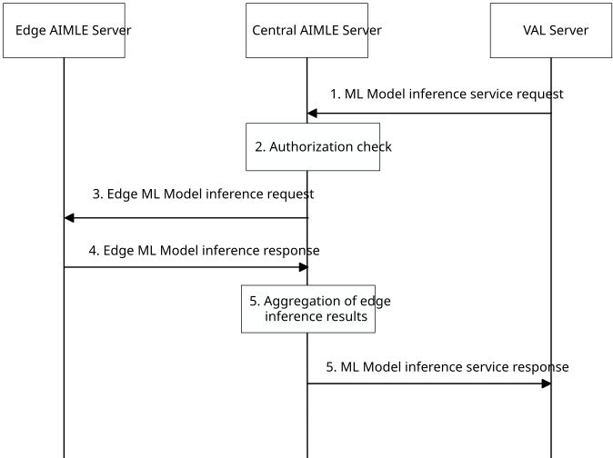

# 8.37 ML model inference in a hierarchical AIMLE deployment

## 8.37.1 General

This clause describes ML model collaborative inference procedures considering AIMLE deployments in edge data networks as described in Annex A.4 of 3GPP TS 23.482 \[2\], where a central AIMLE server can distribute inference tasks to multiple edge AIMLE servers for parallel execution.

## 8.37.2 Procedure for ML model inference in a hierarchical AIMLE deployment

This mechanism enables efficient use of distributed computing resources by offloading heavy or data-local computation to edge AIMLE servers. The general process is illustrated in Figure 8.37.2-1.

Pre-condition:

1\. Each edge AIMLE server has been registered with the central AIMLE server according to clause 8.27.2, allowing the central server to maintain a registry of edge capabilities and locations.

2\. The ML model required for inference has been deployed or is accessible on both central and relevant edge AIMLE servers (e.g., through pre-synchronized ML model repositories).

3\. The central AIMLE server is able to determine how to divide inference tasks among edge nodes based on model type, data locality, and edge capability.

Figure 8.37.2-1: ML model inference in a hierarchical AIMLE deployment

1\. The VAL server sends an ML model inference request to the central AIMLE server. The request includes the model identifier or inference service type, input data or data reference (e.g., a URI of video streams), and optional QoS requirements (e.g., maximum latency, minimum accuracy or confidence level), as defined in clause 8.37.

2\. Upon receiving the inference request, the central AIMLE server performs authorization and validation of the VAL server and the requested service. If the central AIMLE determines that the inference task requires distributed or low-latency processing (for example, high concurrency, or data localized at the edge), it decides to execute the inference in a collaborative edge-inference mode. The central AIMLE selects one or more appropriate edge AIMLE servers based on registered capabilities, proximity to the data source, service area, and current load, according to local policy or performance criteria.

NOTE 1: The central AIMLE determines whether distributed inference is needed based on metadata provided in the inference request (e.g., the use of Inference data index for large or remote data at the edge), as well as on configuration and registered information of edge AIMLE servers. This determination is deployment-specific and not defined in this specification.

3\. The central AIMLE server sends an Edge ML model inference request to each selected edge AIMLE server.
The message includes the assigned task identifier, model identifier, input data reference or partition, and any specific QoS constraints applicable to that edge node. Each request corresponds to a sub-task derived from the original VAL inference request.

NOTE 2: The input data reference or partition information used in the edge inference request is derived from metadata in the VAL inference request and from the registered information of edge AIMLE servers, such as accessible data sources or EDN service areas. The actual data access or transfer is out of scope of this specification.

4\. Each edge AIMLE server authenticates the request, performs inference using the specified model, and returns an Edge ML model inference response to the central AIMLE server. The response includes either the inference result or a failure cause (for example, model unavailable or resource limitation).

5\. The central AIMLE server collects inference responses from all participating edge AIMLE servers. It aggregates or post-processes the partial results into a unified inference outcome, according to the type of model and task (e.g., combining multiple video frame analyses or merging sequence predictions). If any edge response indicates failure, the central AIMLE may perform fallback processing or return partial results, following local policy.

> 6\. After completing aggregation, the central AIMLE server returns an inference service response to the VAL server, using the same message defined in clause 8.37. The response includes the final inference results, execution status, and optional performance metrics.

## 8.37.3 Information flows

### 8.37.3.1 Edge ML model inference request

Table 8.37.3.1-1 describes the Edge ML model inference request sent from the central AIMLE server to an edge AIMLE server. This request extends the base ML model inference request defined in Clause 7.1.3.1 with additional information needed for distributed inference, such as a task identifier and a partitioned input reference.

Table 8.37.3.1-1: Edge ML model inference request

| Information element                                                                                                                                                                | Status | Description                                                                                                                                                                                                                                                             |
|------------------------------------------------------------------------------------------------------------------------------------------------------------------------------------|--------|-------------------------------------------------------------------------------------------------------------------------------------------------------------------------------------------------------------------------------------------------------------------------|
| Requestor identity                                                                                                                                                                 | M      | Identity of the central AIMLE server sending the inference request to the edge AIMLE server.                                                                                                                                                                            |
| Task identifier                                                                                                                                                                    | M      | Unique identifier for the distributed inference sub-task, assigned by the central AIMLE server (e.g. a UUID). This identifier allows correlation of the edge inference request and response with the overall inference task.                                            |
| Inference data (NOTE 1)                                                                                                                                                            | O      | Partition of the input data for inference, included directly if the data segment is small enough to send in the request. This IE contains the portion of the original inference input that the edge AIMLE server should process.                                        |
| Inference data index (NOTE 1)                                                                                                                                                      | O      | Reference or identifier for the input data partition that the edge AIMLE server should process. For example, this could be a URI or data handle pointing to the relevant data segment stored at the edge.                                                               |
| ML model identifier                                                                                                                                                                | M      | Identifies the ML model that the edge AIMLE server is requested to use for this sub-task. This identifier is provided by the central AIMLE server (e.g. a model ID or reference) and corresponds to the model specified or selected for the original inference request. |
| QoS constraints                                                                                                                                                                    | O      | Specifies any quality-of-service requirements for this sub-task as determined by the central AIMLE server. For example, this may include a deadline by which the edge must return results or priority indicators for the inference processing at the edge.              |
| NOTE: Only one of these information elements shall be present. At least one of these information elements must be provided to supply the edge with the input needed for inference. |        |                                                                                                                                                                                                                                                                         |

### 8.37.3.2 Edge ML model inference response

Table 8.37.3.2-1 describes the Edge ML model inference response from the edge AIMLE server to the central AIMLE server. This response aligns with the base ML model inference response defined in Clause 7.1.3.2, with the addition of a task identifier for correlation with the request.

Table 8.37.3.2-1: Edge ML model inference response

| Information element                                            | Status | Description                                                                                                                                                                                       |
|----------------------------------------------------------------|--------|---------------------------------------------------------------------------------------------------------------------------------------------------------------------------------------------------|
| Success response (NOTE)                                        | O      | Indicates that the edge inference sub-task was completed successfully. This IE is present if and only if the edge was able to process the assigned inference task.                                |
| \> Task identifier                                             | M      | Identifier of the inference sub-task for which this response is provided (echoed from the request). It correlates the response to the corresponding edge inference request.                       |
| \> Inference result                                            | M      | The result of the ML model inference performed by the edge AIMLE server on the provided data partition. The format and content of this result correspond to the model’s output for that sub-task. |
| Failure response (NOTE)                                        | O      | Indicates that the edge AIMLE server could not complete the inference sub-task. This IE is present if and only if the inference at the edge failed.                                               |
| \> Cause                                                       | M      | Reason for the inference failure at the edge (e.g. the required model was not available on the edge, insufficient resources, or an execution error occurred).                                     |
| NOTE: Only one of these information elements shall be present. |        |                                                                                                                                                                                                   |
