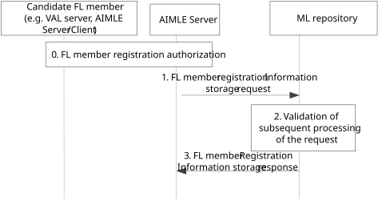

# 8.4.2 Procedure on FL member registration information storage

Figure 8.4.2-1 illustrates the procedure where the registration of a candidate FL member happens via the ML repository, serving as AIML service registry.

Figure 8.4.2-1: Procedure for FL member registration information storage

0\. The candidate FL member sends an FL member registration request to AIMLE server and gets authorization checking.

> The procedure for AIMLE client to register to AIMLE server as FL member is introduced in clause 8.7.2.2. The procedure for VAL server to register to the AIMLE server as FL member is introduced in clause 8.4.3b.

1\. AIMLE server sends an FL member registration information storage request to the ML repository which acts as the AIML service information registry. For FL member registration for VFL, the AIMLE server first maps each local UE identifier in the Sample ID list to a corresponding unified UE identifier (GPSI such as MSISDN) via interaction with the Core Network functions e.g. via NEF-based UE ID retrieval procedures (as in 3GPP TS 23.502 \[9\] clause 4.15.10A) and stores it along with its registration. This unified UE identifier, however, shall not be accessible to the VAL servers and is only used by the AIMLE server for sample alignment purposes as in clause 8.18.2b.

In case of multi-operator support, this request also includes information on the serving PLMN for the communication of the FL member (e.g. towards other FL members and/or the network), as well as the allowed MNO info including all MNO networks from which the candidate FL member can cope with if selected in a potential FL operation.

2\. The ML repository validates the received request and generates the identity and other security related information for all the FL members listed in the request. The ML repository stores the identity of the candidate FL member together with a mapping to one or more PLMNs, and with associated role as serving or allowed PLMN.

3\. The ML repository sends the generated information in the FL member registration information storage response message to the AIMLE server.
