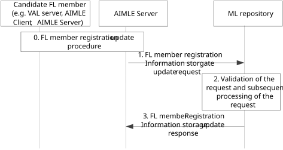

# 8.4.3 Procedure on FL member registration information storage update

Figure 8.4.3-1 illustrates the procedure where the registration update of a candidate FL member happens via the ML repository.

Figure 8.4.3-1: Procedure for registration information update

0\. The candidate FL member (e.g., VAL server or AIMLE client, or another AIMLE server) sends an FL member registration update request to AIMLE server and gets authorization.

> The procedure for AIMLE client to update registration to AIMLE server as FL member is introduced in clause 8.7.2.3.

1\. The candidate FL member (VAL server via AIMLE server or AIMLE Server) sends an FL member registration update request to the ML repository acting as AIML service registry for updating the registration of the FL member.

In case of multi-operator support, this request also includes information on the serving PLMN for the communication of the FL member (e.g. towards other FL members and/or the network), as well as the allowed MNO info including all MNO networks from which the candidate FL member can cope with if selected in a potential FL operation.

2\. The ML repository validates the received update request and generates the identity and other security related information for the FL member. The ML repository stores the identity of the candidate FL member together with a mapping to one or more PLMNs, and with associated role as serving, or allowed PLMN. In case of registration update, the mapping to the one or more PLMNs and/or the roles may be updated accordingly.

3\. The ML repository sends the generated information in the FL member registration update response message to the candidate FL member.

The procedure for AIMLE client to update its registration to ML repository as FL member is introduced in clause 8.7.2.3.
