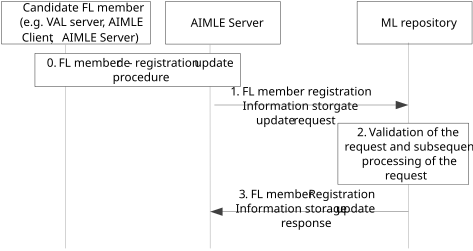

# 8.4.3a Procedure on registration information storage update for FL member deregistration

Figure 8.4.3a-1 illustrates the procedure registration information storage update where the deregistration of a candidate registered FL member happens.

The deregistration may be triggered by the VAL server or AIMLE server in case of an expected or predicted unavailability of the candidate FL member e.g. due to load / energy, access limitation in different VAL service area based on the vertical/ASP requirement.

Such deregistration is provided by the AIMLE server e.g. after offboarding of the VAL server from the SEAL platform, or upon termination of the AIMLE/VAL service (FL task), and then registration information stored at ML repository should be updated accordingly.

Figure 8.4.3a-1: Procedure for due to deregistration information storage update for FL member

0\. The candidate FL member (e.g., VAL server or AIMLE client, or another AIMLE server) sends an FL member de-registration request to AIMLE server and gets authorization.

> The procedure for AIMLE client to deregister to AIMLE server as FL member is introduced in clause 8.7.2.4.

1\. The candidate registered FL member (e.g., VAL server via AIMLE server or AIMLE server) sends an FL member deregistration request to the ML repository for registering to the ML repository which acts as the AIML service registry.

2\. The ML repository validates the received request for all the registered FL members listed in the deregistration request.

3\. The ML repository sends the generated information in the FL member deregistration response message to the candidate registered FL member.

The procedure for AIMLE client to deregister to ML repository as FL member is introduced in clause 8.7.2.4.
