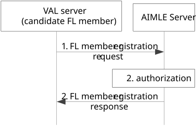

# 8.4.3b Procedure on VAL server registration to AIMLE server

If the candidate FL member is a VAL server, the FL member registration requires that the VAL server registers itself to the AIMLE server, and subsequently the procedure in clause 8.4.2 to follow to enable the registration information storage to the ML repository.

Figure 8.4.3b-1 illustrates the procedure where the registration of a candidate FL member who is a VAL server happens to the AIMLE server.

Figure 8.4.3b-1: Procedure for registration of VAL server as FL member

1\. VAL server sends an FL member registration request to the AIMLE server to register as FL member.

2\. The AIMLE server authorizes the request and stores the registration information to the ML repository based on procedure in clause 8.4.2.

3\. The AIMLE server sends the FL member registration response message to the VAL server.
