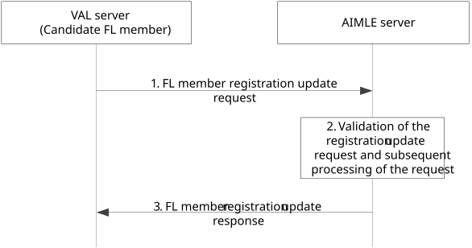

# 8.4.3c Procedure on VAL server registration update to AIMLE server

Figure 8.4.3c-1 illustrates the procedure where the registration update of the VAL server happens to the AIMLE server.

Figure 8.4.3c-1: Procedure for registration update of VAL server as FL member

1\. VAL server sends an FL member registration update request to the AIMLE server for updating the registration of the FL member.

2\. The AIMLE server validates the received update request and generates the identity and other security related information for the FL member.

3\. The AIMLE server sends the generated information in the FL member registration update response message to VAL server.
