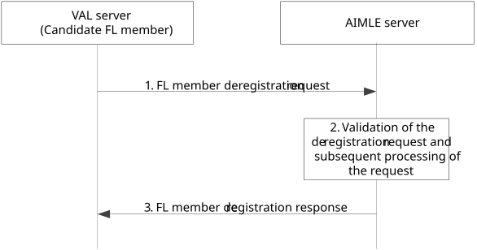

# 8.4.3d Procedure on VAL server deregistration to AIMLE server

Figure 8.4.3d-1 illustrates the procedure where the deregistration of a candidate registered FL member that is a VAL server happens to the AIMLE server.

Figure 8.4.3d-1: Procedure for deregistration of VAL server of VAL server as FL member

1\. VAL server sends an FL member deregistration request to the AIMLE server for deregistering to the AIMLE server.

2\. The AIMLE server validates the received request for all the registered FL members listed in the deregistration request.

3\. The AIMLE server sends the generated information in the FL member deregistration response message to the VAL server.
