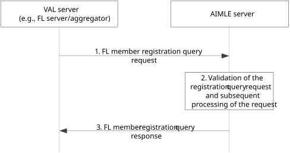

# 8.4.3e Procedure for querying VAL server registration for the AIMLE server

Figure 8.4.3e-1 illustrates the procedure where the registration query for a candidate FL member which is a VAL server is requested by another VAL server via the AIMLE server. This procedure is needed for allowing a VAL server e.g. FL server to get informed on the up-to-date status and availability of another VAL server who is registered as a candidate FL member (e.g. as FL client).

Figure 8.4.2e-1: Procedure on registration query for VAL server as FL member

1\. VAL server (e.g., FL server/aggregator) sends an FL member registration query request to the AIMLE server for retrieving the registration information of the FL member (e.g., FL client).

2\. The AIMLE server validates the received query request and retrieves registration-related information for the FL member.

3\. The AIMLE server sends the generated information in the FL member registration query response message to the VAL server.
