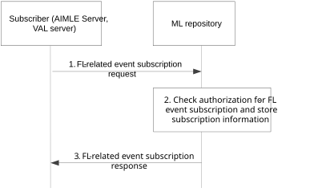
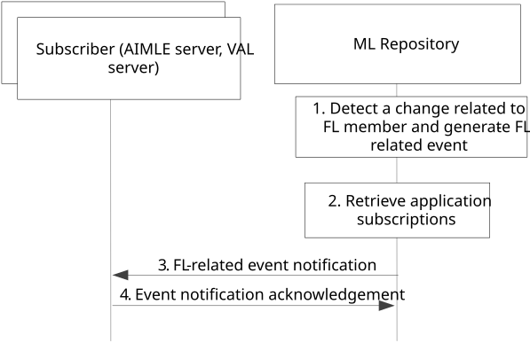
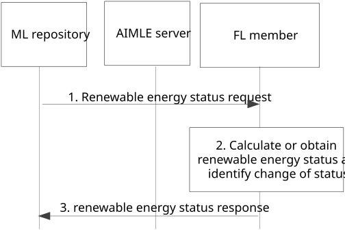

# 8.5 Support for FL events subscription and notification

## 8.5.1 General

This clause consists of the following procedures 1) the subscription for the FL related events in clause 8.5.2 and 2) the event notification procedure in clause 8.5.3.

This capability targets the enhancements to a global ML repository acting as AIML service registry which monitors the status and changes to the availability and capabilities of the FL members. The subscriber can be the AIMLE server or VAL server which requires to get notified on the FL member availability, since this information is vital for enabling the subscriber to perform the FL-related AIML operations (e.g. AIMLE server selecting FL members for a certain FL task). If VAL server is the subscriber, it registers indirectly via AIMLE server for FL-related events.

## 8.5.2 Procedure on subscription for FL related events

This procedure, as illustrated in Figure 8.5.2-1, describes the subscription for events related to FL member availability.

Pre-conditions:

1\. The AIMLE server has the authorization to subscribe for the FL-related events (events described in clause 8.5.4).

Figure 8.5.2-1: Procedure for FL-related event subscription

1\. The subscriber (AIMLE server or VAL server (via AIMLE server)) sends an FL-related event subscription request to the ML repository to receive notification of FL related events and in particular the availability of FL member for a target area and time.

2\. Upon receiving the event subscription request from the AIMLE server, the ML repository checks for the relevant authorization for the event subscription. If the authorization is successful, the ML repository stores the subscription information.

> In case of an event related to the “Renewable Energy Information”, the ML repository also triggers FL member to send status report periodically or based on changes on the renewable energy status (lower ratio). Such trigger may be based on subscription or request from the FL member of interest (according to the subscription), to start sending reports using the reporting criteria as in step 1.3. The ML repository sends an FL-related event subscription response to the subscriber indicating successful operation.

## 8.5.3a Procedure on FL related event notification

This procedure describes the event notification procedure for the FL member availability. This can be triggered based on a change at the availability or capabilities of the candidate or selected FL members.

Pre-conditions:

1\. The subscription procedure in clause 8.5.2 was performed by the AIMLE server or VAL server (via AIMLE server).

2\. The FL member has registered its capabilities or availability or energy status information to the ML repository based on the support for FL registration capability.

Figure 8.5.3a-1: Procedure for FL-related event notifications

1\. The ML repository detects a change related to the availability or the energy status of an FL member and generates events to be consumed by the AIMLE server, based on the notification, or based on a received updated registration from FL member, who has already registered at the ML repository.

> For the event related to the renewable energy status, the detection may be based on either receiving a notification/reporting from SEAL ESE server on the renewable energy status or changes as in 3GPP TS 23.366 \[16\], or via receiving from EIF reporting (indirectly via AIMLE server acting as AF) on the renewable energy using N110 as in 3GPP TS 23.502 \[9\] clause 5.2.28. The detection may also be provided via receiving from the FL member or from AIMLE server (on behalf of FL member) an indication of a change on the renewable energy information as in procedure in clause 8.5.3.b.

If the event is related to the “FL member energy status information*”* the detection is based on receiving a registration update request with the update energy information from the FL member as in clause 8.4.3.2 or 8.4.3.8 (if the FL member is VAL server) or based on receiving a notification/reporting from SEAL ESE server on the energy status or changes as in 3GPP TS 23.366 \[16\].

2\. For the generated event, the ML repository retrieves the list of corresponding subscriptions.

3\. The ML repository sends FL-related event notification to all entities (e.g., AIMLE servers) that have subscribed for the FL-related event matching the criteria. If a notification reception information is available as part of the FL-related event subscription, then the notification reception information is used by the ML repository to send event notifications to the corresponding AIMLE servers.

> If the energy is related to the renewable energy status, the notification includes the renewable energy information including a status change or a new actual or expected value of the ratio of the renewable energy against the total energy for the FL member or FL task.
>
> If the event is related to the “FL member energy status information*”**, ***the information about the event related to the FL member energy status change may include either the FL member credit status (remaining energy credit) or energy usage information (e.g. percentage or qualitative value e.g. high, medium) for the respective EAS or VAL server or AIMLE server acting as FL member. 4. The notified subscriber (s) sends an event notification acknowledgement to the ML repository.

## 8.5.3b Procedure on FL member notifying a change on renewable energy status

This procedure describes the detection of the renewable energy status change via receiving a notification from the FL member. The procedure is provided in Figure 8.5.3b-1.

Pre-conditions:

1\. The subscription procedure in clause 8.5.2 was performed by the AIMLE server or VAL server (via AIMLE server).

2\. The FL member has registered its capabilities or availability or energy status information to the ML repository based on the support for FL registration capability.

Figure 8.5.3b-1: Procedure for FL member notifying change of renewable energy status

1\. The ML repository (directly or via AIMLE server or via ESE server), sends to the registered FL member a request to provide renewable energy information for the registered FL member or for the FL operation or for the user plane supporting the FL task (UE to server) either periodically or when a change occurs.

> 2\. Upon receiving the request in step 1, or based on identifying a change on the use of renewable energy or based on identifying that the ratio of renewable energy is at or below the minimum (or is expected to be), the FL member generates an event related to the detection of an abnormal value or deviation with respect to the renewable energy targets based on the subscription.
>
> 3\. The FL member sends a renewable energy status response indicating a status change or an expected or predicted change of the renewable energy for the FL task, based on the total power expected change (e.g. total power increased, hence the ratio of renewable energy is lower even if the FL member didn’t change anything).

## 8.5.4 Definition of FL-related Events

The definition of the FL related events is provided in Table 8.5.4-1.

Table 8.5.4-1: Definition of FL related events

| Events                                 | Events Description                                                                                                                                                                                                                                                                                     |
|----------------------------------------|--------------------------------------------------------------------------------------------------------------------------------------------------------------------------------------------------------------------------------------------------------------------------------------------------------|
| Availability changes of FL member      | The event type relates to the availability change of a FL member. Such availability change can be an indication of availability or unavailability for a given service area, or for a given ML model ID/profile.                                                                                        |
| FL model information                   | Information such as accuracy, time schedule and latency for the FL training. Latency is considering the target latency, i.e., when the FL model training shall be completed.                                                                                                                           |
| FL member load information             | The event type relates to the monitoring of the computational load for the requested FL member. Such load can be the estimated (based on measurements) or expected/predicted based on the tasks that the FL member undertakes. This event may be triggered on-demand or can be monitored periodically. |
| FL member renewable energy information | The event type relates to the renewable energy information of the FL member, i.e., when the FL member starts to consume renewable energy.                                                                                                                                                              |
| FL member energy status information    | Information on the energy credit or budget or usage for the FL member. Such energy information can be the estimated (based on energy credit monitoring) or expected based on the tasks that the FL member undertakes. This event may be triggered on-demand or can be monitored periodically.          |

## 8.5.5 Information flows

### 8.5.5.1 General

The following information flows are specified for supporting the FL events subscription and events notification based on clause 8.5.2 and clause 8.5.3.

### 8.5.5.2 FL-related event subscription request

Table 8.5.5.2-1 describes information elements for FL-related event subscription request from the subscriber (AIMLE server, or VAL server (via AIMLE server)) to the ML repository.

Table 8.5.5.2-1: FL-related event subscription request

<table>
<colgroup>
<col style="width: 33%" />
<col style="width: 16%" />
<col style="width: 50%" />
</colgroup>
<thead>
<tr class="header">
<th>Information element</th>
<th>Status</th>
<th>Description</th>
</tr>
</thead>
<tbody>
<tr class="odd">
<td>Requestor Identifier</td>
<td>M</td>
<td>The identifier to determine the identity of the requestor entity. This can be either the AIMLE server ID, or AIMLE server ID and VAL server ID.</td>
</tr>
<tr class="even">
<td>Security Credentials</td>
<td>M</td>
<td>The security credentials of the requestor.</td>
</tr>
<tr class="odd">
<td>Time of validity</td>
<td>M</td>
<td>The time validity for the subscription.</td>
</tr>
<tr class="even">
<td>ML model information</td>
<td>M</td>
<td>Information of the ML model for, specified in Table 8.11.4.1-2, which the subscription is needed.</td>
</tr>
<tr class="odd">
<td>FL member information</td>
<td>M</td>
<td>Information on the FL member (candidate or selected).</td>
</tr>
<tr class="even">
<td>&gt;FL member type</td>
<td>
O

(NOTE)
</td>
<td>The type of FL member which can be an FL server or FL client.</td>
</tr>
<tr class="odd">
<td>&gt;FL member ID</td>
<td>
O

(NOTE)
</td>
<td>The ID of the entity serving as FL member. This can be used for events where the FL member is known and possibly selected, and the availability needs to be checked.</td>
</tr>
<tr class="even">
<td>Event Information</td>
<td>M</td>
<td>Information on the FL-related event.</td>
</tr>
<tr class="odd">
<td>&gt; Event ID</td>
<td>O</td>
<td>The identity of the FL-related event (if known by the requestor).</td>
</tr>
<tr class="even">
<td>&gt; Event type</td>
<td>M</td>
<td>The event type requested, based on the Definition of FL related events (shown in Table 8.5.4-1).</td>
</tr>
<tr class="odd">
<td>Renewable Energy information requirement</td>
<td>O</td>
<td>The renewable energy requirement in case of the event “FL member renewable energy information”</td>
</tr>
<tr class="even">
<td>&gt; Renewable energy source/type</td>
<td>M</td>
<td>The source/type of the renewable energy to be monitored. Such source/type may be “wind”, “solar”, “geothermy”.</td>
</tr>
<tr class="odd">
<td>&gt; Renewable energy target</td>
<td>M</td>
<td>
The target renewable energy e.g. percentage or ratio or minimum renewable energy which need to be maintained. Any deviation from this target may trigger an event to be generated.

The target may be per FL member or for the FL process/task end to end (UE to Server /Network)
</td>
</tr>
<tr class="even">
<td>&gt; formula for calculating renewable energy</td>
<td>O</td>
<td>The formula for calculating the renewable energy e.g. based on averaging or statistics.</td>
</tr>
<tr class="odd">
<td>&gt; criteria/thresholds for renewable energy</td>
<td>M</td>
<td>The criteria/threshold for triggering an energy related event, when the minimum renewable energy is reached or is expected to reach. The threshold may be a ratio (e.g. 65%) which may trigger the event.</td>
</tr>
<tr class="even">
<td>&gt;predicted or actual energy status indication</td>
<td>O</td>
<td>This identifies whether the event is about a predicted/expected or actual change of the renewable energy.</td>
</tr>
<tr class="odd">
<td>Notification endpoint</td>
<td>M</td>
<td>The information of the endpoint for receiving the notifications for the event.</td>
</tr>
<tr class="even">
<td colspan="3">NOTE: At least one of these shall be present.</td>
</tr>
</tbody>
</table>

### 8.5.5.3 FL-related event subscription response

Table 8.5.5.3-1 describes information elements for the FL-related event subscription response to the subscriber (e.g. AIMLE server or VAL server (via AIMLE server)) from the ML repository.

Table 8.5.5.3-1: FL-related event subscription response

| Information element     | Status | Description                                                           |
|-------------------------|--------|-----------------------------------------------------------------------|
| Result                  | M      | Indicates the success or failure of the event subscription operation. |
| Subscription Identifier | M      | The unique identifier for the event subscription.                     |

### 8.5.5.4 FL related event notification

Table 8.5.5.4-1 describes information elements for the FL-related event notification from the ML repository to the requestor (e.g., AIMLE server).

Table 8.5.5.4-1: FL-related event notification

| Information element                                             | Status | Description                                                                                                                                                                                              |
|-----------------------------------------------------------------|--------|----------------------------------------------------------------------------------------------------------------------------------------------------------------------------------------------------------|
| Subscription identifier                                         | M      | The unique identifier of the event subscription.                                                                                                                                                         |
| Event identifier                                                | M      | The unique identifier for the event. For the definition of events, refer to the Table 8.5.4-1 with the list of FL related events.                                                                        |
| Event related information                                       | M      | The event related information (e.g., time at which the event originated or is planned to be executed, location of event).                                                                                |
| Event content                                                   | M      | The content of the event information.                                                                                                                                                                    |
| \> List of FL member ID /address                                | O      | The list of the FL members and their addresses.                                                                                                                                                          |
| \>\> FL member enter / leave                                    | O      | The indication of an FL member entering or leaving the available list.                                                                                                                                   |
| \>\> FL member updated capability                               | O      | The update of capabilities for the FL members.                                                                                                                                                           |
| \>\> Time availability of FL member                             | O      | The time period for which the FL member is available.                                                                                                                                                    |
| \>\> Area of interest                                           | O      | The area of interest or exact or predicted location for which the event applies.                                                                                                                         |
| \> renewable energy indicator                                   | O      | In case of a energy related event, this IE indicates the information of the renewable energy                                                                                                             |
| \>\> energy source (s)                                          | M      | The renewable energy source/type (wind, solar, geothermy) for which the event applies                                                                                                                    |
| \>\> change status indication                                   | M      | An indication of the status change which can be e.g., “lower than target”.                                                                                                                               |
| \>\>\> time validity                                            | O      | The time validity for the change.                                                                                                                                                                        |
| \>\> new renewable energy ratio                                 | O      | The new value for the renewable energy ratio which is calculated or expected based on change in the renewable energy or the total energy.                                                                |
| \>\> cause for change                                           | O      | The cause for the event, e.g. weather conditions, UE mobility in case the FL member is a VAL UE.                                                                                                         |
| \>\> granularity of renewable energy                            | M      | The granularity of the renewable energy is whether this is for the FL member itself or for the FL task or for the sessions in the FL service (e.g. FL member to FL member).                              |
| \>Energy related event info                                     | O      | This information is about the event related to the FL member energy status change.                                                                                                                       |
| \>\> FL member credit or usage information                      | M      | The FL member credit status (remaining energy credit) or energy usage information (percentage or qualitative value e.g. high, medium) for the respective EAS or VAL server or AIMLE acting as FL member. |
| \>\>\> FL member credit time validity / sustainability          | O      | The time horizon for which the energy credit will be sustainable (in case of prediction).                                                                                                                |
| \>\>\> FL member energy consumption expected or predicted value | M      | The actual or predicted absolute energy consumption metric if the credit is not supported.                                                                                                               |
| \>\>\> Energy contribution on FL process                        | O      | The impact of the high energy usage to the end to end energy performance of the FL process.                                                                                                              |

### 8.5.5.5 FL-related event notification acknowledgement

Table 8.5.5.5-1 describes information elements for the FL-related event notification acknowledgement from the AIMLE server to the ML repository.

Table 8.5.5.5-1: FL-related event notification acknowledgement

| Information element | Status | Description                                                             |
|---------------------|--------|-------------------------------------------------------------------------|
| Result              | M      | The positive or negative acknowledgement of the notification reception. |
