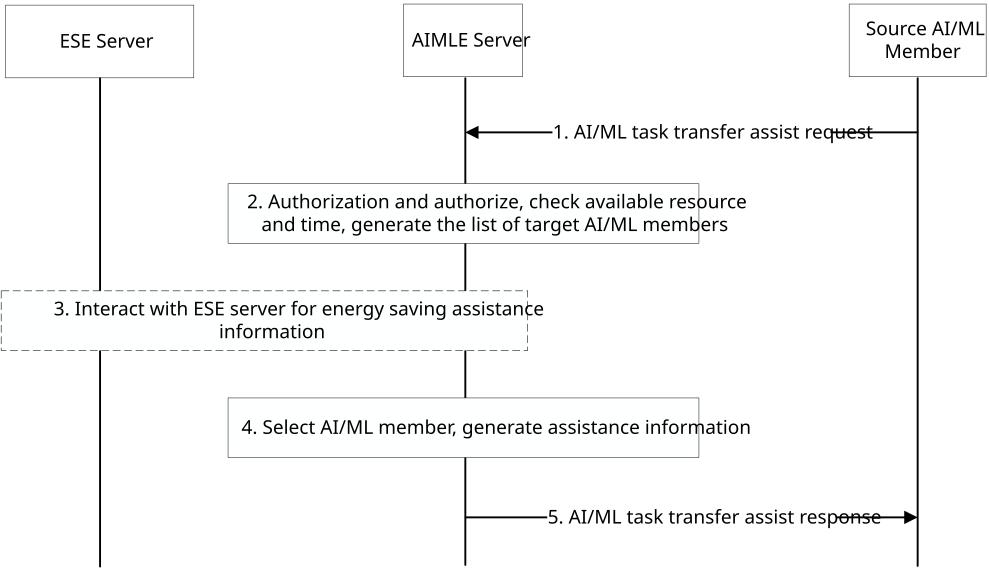
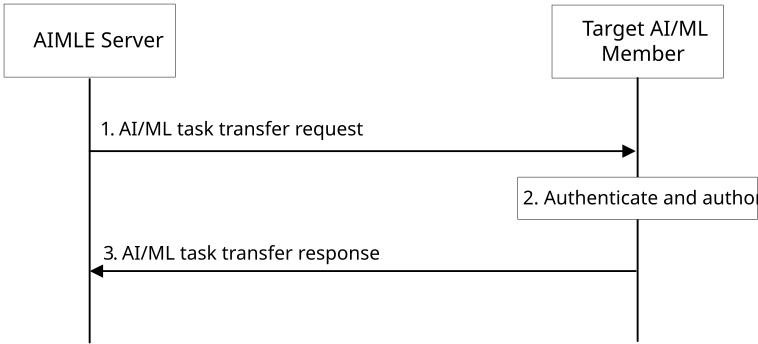
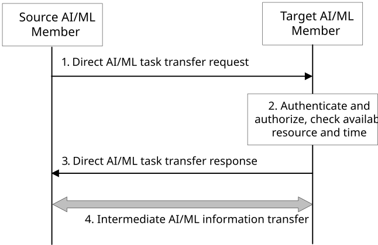
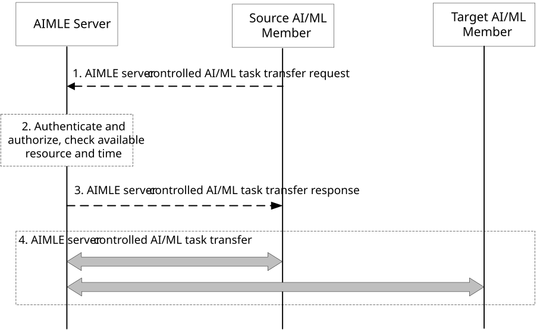

# 8.6 Support AI/ML Task Transfer

## 8.6.1 General

The following clauses specify procedures to support AI/ML task transfer.

## 8.6.2 Procedures for AI/ML task transfer

Due to various reasons (e.g., changes of available resource, changes of available time, changes of energy level), an AI/ML member (e.g., AIMLE Client, VAL Client) finds itself cannot finish the assigned AI/ML task during the performing process. Here AI/ML member means the participant of an AI/ML task. To save resource, energy and time, the AI/ML member (source AI/ML member) decides to transfer the intermediate AI/ML information (e.g., the intermediate AI/ML operation status and results) to another AI/ML member (target AI/ML member) for further operations to complete the AI/ML task.

### 8.6.2.1 Request AIMLE Server to assist AI/ML task transfer

Pre-conditions:

1\. The information of target AI/ML member (e.g., another AIMLE Client or VAL Client different from the source AI/ML member) is unknown at the source AI/ML member. The source AI/ML member decides that assistance from the AIMLE Server is needed.

2\. The source determines which AI/ML tasks to transfer. For example, if the AI/ML task is model training, AI/ML model are obtained by source AI/ML member performing AI/ML model training. Then the source AI/ML member determines the remaining AI/ML model training requirement based on the intermediate AI/ML operation status and results and AI/ML model training requirement.

Figure 8.6.2.1-1: Procedure for requesting AIMLE Server assist AI/ML task transfer

Figure 8.6.2.1-1 illustrates the procedure for requesting AIMLE Server to assist the AI/ML task transfer. The detailed corresponding procedure is detailed as follows:

1\. The source AI/ML member (e.g., an AIMLE Client) sends an AI/ML task transfer assist request to AIMLE Server for assisting the AI/ML task transfer may be based on energy saving. To select a target AI/ML member(s), the source AI/ML member may set energy consumption criteria for the target AI/ML member(s), such as energy consumption level, and maximum energy consumption. The request message contains the information as specified in Table 8.6.3.2-1.

2\. The AIMLE Server discovers other AI/ML members (e.g., other AIMLE Clients) directly or via ML repository, and selects one or more target AI/ML member(s) based on the request from the source AI/ML member.

3\. (Optional) The AIMLE Server interacts with the ESE server for the energy saving assistance information for the list of target AI/ML member(s) that is selected in step** **2. The ESE server generates energy saving assistance information for the list of target AI/ML member(s) and provides it to the AIMLE Server, as defined in 3GPP TS 23.366 \[16\].

4\. The AIMLE Server sends request to the selected target AI/ML member(s) for the AI/ML task transfer, as defined in clause 8.6.2.2. Then, the AIMLE Server determines the transfer mode, i.e., transfer with server-controlled or transfer directly from the source AI/ML member to the target AI/ML member. For example, if the task is model training, the AI/MLE server determines the target AI/ML member(s) based on AI/ML member(s)’s capability in the AIMLE client profile and task's AI/ML model training requirement, and the energy information. The task’s AI/ML model training requirement indicates the AI/ML Information.

If target AI/ML member(s) is discovered, the AIMLE Server generates assistance information for the AI/ML task transfer from the source AI/ML member to the target AI/ML member(s) (e.g., time window for the transfer).

5\. The AIMLE Server sends an AI/ML task transfer assist response to the source AI/ML member with the information of the target AI/ML member(s), and assistance information generated in step 4. The response message contains the information as specified in Table 8.6.3.3-1.

### 8.6.2.2 Request target AI/ML member for AI/ML task transfer

Figure 8.6.2.2-1: Procedure for requesting target AI/ML member for AI/ML task transfer

Figure 8.6.2.2-1 illustrates the procedure for requesting target AI/ML member for AI/ML task transfer. The corresponding procedure in detail is as follows:

1\. The AIMLE Server sends an AI/ML task transfer request to the selected target AI/ML member(s) for AI/ML task transfer. The request message contains the information as specified in Table 8.6.3.4-1.

2\. The target AI/ML member(s) authenticates and authorizes the request from the AIMLE Server. If the request is authorized, the target AI/ML member(s) performs step 3.

3\. The target AI/ML member(s) sends an AI/ML task transfer response to the AIMLE Server with information as specified in Table 8.6.3.5-1.

### 8.6.2.3 Direct AI/ML task transfer

Pre-conditions:

1\. The information of target AI/ML member (e.g., another AIMLE Client or VAL Client different from the source AI/ML member) is assumed to be known at the source AI/ML member, or the source AI/ML member may get the target AI/ML member information via ML repository. The source AI/ML member decides to transfer the AI/ML task to the target AI/ML member.

Figure 8.6.2.3-1: Procedure for direct AI/ML task transfer

Figure 8.6.2.3-1 illustrates the procedure for direct AI/ML task transfer. The corresponding procedure in detail is as follows:

1\. The source AI/ML member (e.g. an AIMLE Client) sends a direct AI/ML task transfer request to the target AI/ML member for direct AI/ML task transfer. The request message contains the information as specified in Table 8.6.3.6-1.

2\. The target AI/ML member authenticates and authorizes the request from the source AI/ML member. If the request is authorized, the target AI/ML member checks its availability for continue the AI/ML operations (e.g., available resource and time).

3\. The target AI/ML member sends a direct AI/ML task transfer response to the source AI/ML member with information as specified in Table 8.6.3.7-1.

4\. The source AI/ML member interacts with the target AI/ML member to perform AI/ML task transfer to the target AI/ML member.

### 8.6.2.4 AIMLE server-controlled AI/ML task transfer

Pre-conditions:

1\. The information of target AI/ML member (e.g. another AIMLE Client or VAL Client different from the source AI/ML member) is unknown at the source AI/ML member. The source AI/ML member decides that AIMLE server-controlled AI/ML task transfer is needed.

Figure 8.6.2.4-1: Procedure for AIMLE server-controlled AI/ML task transfer

Figure 8.6.2.4-1 illustrates the procedure for AIMLE server-controlled AI/ML task transfer. The corresponding procedure in detail is as follows:

1\. The source AI/ML member (e.g., an AIMLE Client) may send an AIMLE server-controlled AI/ML task transfer request to AIMLE Server. The request message contains the information as specified in Table 8.6.3.8-1. Or, AIMLE server-controlled AI/ML task transfer may be decided by the AIMLE server as described in step 2 of clause 8.6.2.1.

2\. If received the request for AIMLE server-controlled AI/ML task transfer from the source AI/ML member, the AIMLE sever authenticates and authorizes the request from the source AI/ML member. If the request is authorized, the AIMLE server checks the availability of the target AI/ML member(s) for AI/ML task transfer as defined in clause 8.6.2.2. The AIMLE server generates assistance information for the transfer of AI/ML task the source AI/ML member to the target AI/ML member(s) via AIMLE server (e.g. time window for the transfer).

3\. The AIMLE server sends response to the source AI/ML member.

4\. The source AI/ML member performs AI/ML task transfer to the target AI/ML member(s) via the AIMLE server based on the information received from the AIMLE server in step 3 if AIMLE server-controlled AI/ML task transfer is requested by the source AI/ML member, or based on the assistance information generated in step 2 of clause 8.6.2.1 if AIMLE server-controlled AI/ML task transfer is decided by the AIMLE server.

## 8.6.3 Information flows

### 8.6.3.1 General

The following information flows are specified for supporting AI/ML task transfer. In the following clauses 8.6.3.2 to 8.6.3.9, the source AI/ML member and the target AI/ML member could be e.g., VAL UE, AIMLE Client.

### 8.6.3.2 AI/ML task transfer assist request

Table 8.6.3.2-1 describes information elements for the AI/ML task transfer assist request from the source AI/ML member to the AIMLE Server.

Table 8.6.3.2-1: AI/ML task transfer assist request

<table>
<colgroup>
<col style="width: 33%" />
<col style="width: 16%" />
<col style="width: 50%" />
</colgroup>
<thead>
<tr class="header">
<th>Information element</th>
<th>Status</th>
<th>Description</th>
</tr>
</thead>
<tbody>
<tr class="odd">
<td>Requestor identity</td>
<td>M</td>
<td>The identifier of the source AI/ML member (e.g. identifier of the source AIMLE client or the VAL UE).</td>
</tr>
<tr class="even">
<td>VAL service ID</td>
<td>O</td>
<td>The identifier of the VAL service for which the assistance information is requested.</td>
</tr>
<tr class="odd">
<td>AI/ML Task Type</td>
<td>M</td>
<td>The type of the AI/ML operation (e.g. ML model training).</td>
</tr>
<tr class="even">
<td>AI/ML Information Type</td>
<td>M</td>
<td>The type of the AI/ML information in the AI/ML task need be transferred (e.g. intermediate AI/ML operation status, intermediate AI/ML operation results).</td>
</tr>
<tr class="odd">
<td>&gt; AI/ML model remaining training requirement (NOTE 1)</td>
<td>O</td>
<td>Indicate the requirement for AI/ML model training including, required remaining training resource, required remaining training number of iterations,</td>
</tr>
<tr class="even">
<td>&gt; AI/ML intermediate information (NOTE 1)</td>
<td>O</td>
<td>Indicate the AI/ML intermediate information for intermediate AI/ML operation and result (e.g. ML model training), including AI/ML intermediate model, AI/ML intermediate model used training time, used training resource, used training number of iterations.</td>
</tr>
<tr class="odd">
<td>Target AI/ML member energy criteria</td>
<td>
O

(NOTE 2)
</td>
<td>Indicate the energy consumption criteria (e.g. energy consumption level, max energy consumption of the target AI/ML member).</td>
</tr>
<tr class="even">
<td>Time validity</td>
<td>O</td>
<td>The time validity of the request.</td>
</tr>
<tr class="odd">
<td colspan="3">
NOTE 1: The IE only present when AI/ML Task Type is ML model training.

NOTE 2: The IE only present if energy saving is considered for the AI/ML task transfer.
</td>
</tr>
</tbody>
</table>

NOTE: The energy level may vary from different vertical applications and is implementation specific, how the value is calculated is outside the scope of the present document.

### 8.6.3.3 AI/ML task transfer assist response

Table 8.6.3.3-1 describes information elements for the AI/ML task transfer assist response from the AIMLE Server to the source AI/ML member.

Table 8.6.3.3-1: AI/ML task transfer assist response

| Information element    | Status | Description                                                                                           |
|------------------------|--------|-------------------------------------------------------------------------------------------------------|
| Transfer Mode          | O      | Indication the transfer mode (e.g. direct transfer).                                                  |
| Target AI/ML member(s) | M      | The identifier of the target AI/ML member (e.g. identifier of the target AIMLE client or the VAL UE). |
| Assistance Information | M      | Assistance information for the AI/ML task transfer (e.g. time window for the transfer).               |

### 8.6.3.4 AI/ML task transfer request

Table 8.6.3.4-1 describes information elements for the AI/ML task transfer request from the AIMLE Server to the target AI/ML member.

Table 8.6.3.4-1: AI/ML task transfer request

| Information element      | Status | Description                                                                                                                                               |
|--------------------------|--------|-----------------------------------------------------------------------------------------------------------------------------------------------------------|
| Requestor identity       | M      | The identifier of the AIMLE server.                                                                                                                       |
| Source AI/ML member      | M      | The identifier of the source AI/ML member (e.g. identifier of the source AIMLE client or the VAL UE).                                                     |
| AI/ML Task Type          | M      | The type of the AI/ML operation (e.g. ML model training).                                                                                                 |
| AI/ML Information Type   | M      | The type of the AI/ML information in the AI/ML task need be transferred (e.g. intermediate AI/ML operation status, intermediate AI/ML operation results). |
| AI/ML Task Transfer Time | O      | Information on time or time window for the AI/ML task transfer.                                                                                           |
| Time validity            | O      | The time validity of the request.                                                                                                                         |

### 8.6.3.5 AI/ML task transfer response

Table 8.6.3.5-1 describes information elements for the AI/ML task transfer response from the target AI/ML member to the AIMLE Server.

Table 8.6.3.5-1: AI/ML task transfer response

| Information element      | Status | Description                                                     |
|--------------------------|--------|-----------------------------------------------------------------|
| Status                   | M      | The status for the request: success or fail.                    |
| AI/ML Task Transfer Time | O      | Information on time or time window for the AI/ML task transfer. |

### 8.6.3.6 Direct AI/ML task transfer request

Table 8.6.3.6-1 describes information elements for the direct AI/ML task transfer request from the source AI/ML member to the target AI/ML member.

Table 8.6.3.6-1: Direct AI/ML task transfer request

| Information element      | Status | Description                                                                                                                                               |
|--------------------------|--------|-----------------------------------------------------------------------------------------------------------------------------------------------------------|
| Requestor identity       | M      | The identifier of the source AI/ML member (e.g. identifier of the source AIMLE client or the VAL UE).                                                     |
| AI/ML Task Type          | M      | The type of the AI/ML operation (e.g. ML model training).                                                                                                 |
| AI/ML Information Type   | M      | The type of the AI/ML information in the AI/ML task need be transferred (e.g. intermediate AI/ML operation status, intermediate AI/ML operation results). |
| AI/ML Task Transfer Time | O      | Information on time or time window for the AI/ML task transfer.                                                                                           |
| Time validity            | O      | The time validity of the request.                                                                                                                         |

### 8.6.3.7 Direct AI/ML task transfer Response

Table 8.6.3.7-1 describes information elements for the direct AI/ML task transfer response from the target AI/ML member to the source AI/ML member.

Table 8.6.3.7-1: Direct AI/ML task transfer response

| Information element | Status | Description                                  |
|---------------------|--------|----------------------------------------------|
| Status              | M      | The status for the request: success or fail. |

### 8.6.3.8 AIMLE server-controlled AI/ML task transfer request

Table 8.6.3.8-1 describes information elements for the AIMLE server-controlled AI/ML task transfer request from the source AI/ML member to the AIMLE server.

Table 8.6.3.8-1: AIMLE server-controlled AI/ML task transfer request

| Information element      | Status | Description                                                                                                                                               |
|--------------------------|--------|-----------------------------------------------------------------------------------------------------------------------------------------------------------|
| Requestor identity       | M      | The identifier of the source AI/ML member (e.g. identifier of the source AIMLE client or the VAL UE).                                                     |
| AI/ML Task Type          | M      | The type of the AI/ML operation (e.g. ML model training).                                                                                                 |
| AI/ML Information Type   | M      | The type of the AI/ML information in the AI/ML task need be transferred (e.g. intermediate AI/ML operation status, intermediate AI/ML operation results). |
| AI/ML Task Transfer Time | O      | Information on time or time window for the AI/ML task transfer.                                                                                           |
| Time validity            | O      | The time validity of the request.                                                                                                                         |

### 8.6.3.9 AIMLE server-controlled AI/ML task transfer Response

Table 8.6.3.9-1 describes information elements for the AIMLE server-controlled AI/ML task transfer response from the AIMLE server to the source AI/ML member.

Table 8.6.3.9-1: AIMLE server-controlled AI/ML task transfer response

| Information element    | Status | Description                                                                             |
|------------------------|--------|-----------------------------------------------------------------------------------------|
| Status                 | M      | The status for the request: success or fail.                                            |
| Assistance Information | M      | Assistance information for the AI/ML task transfer (e.g. time window for the transfer). |
