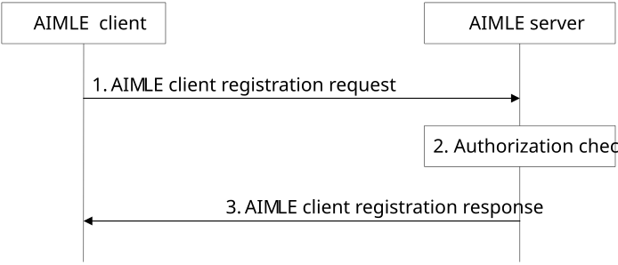
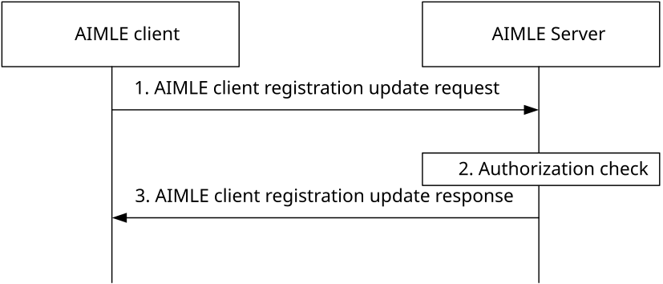
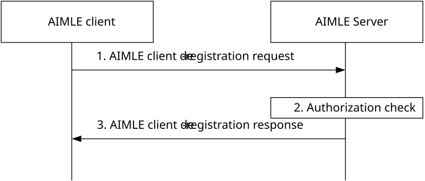

# 8.7 AIMLE client registration

## 8.7.1 General

Prior to participation in AI/ML operations, AI/ML capable UEs register to an AIMLE server and provide an AIMLE client profile and optionally a list of supported services. The AIMLE server uses information provided by the AIMLE client to discover and select suitable AIMLE clients for requested AI/ML operations.

When a UE is roaming and the roaming architecture is home routed (HR) (e.g., based on roaming agreement), the AIMLE client registers with an AIMLE server in the home network and AIMLE services provided by the visited network are not used.

When a UE is roaming and the roaming architecture is local breakout (LBO) (e.g., based on roaming agreement), the AIMLE client first registers with an AIMLE server in the home network, then the AIMLE client may perform an AIMLE server registration with an AIMLE server in the visited network if AIMLE services usage is allowed in the visited network.

> NOTE: Usage of AIMLE service provided by a visited network is dependent on a roaming agreement.

The following clauses specify procedures, information flows, and APIs for AIMLE client registration.

## 8.7.2 Procedures

### 8.7.2.1 General

The following are supported for AIMLE client registration:

\- AIMLE client registration procedure;

\- AIMLE client registration update procedure; and

\- AIMLE client de-registration procedure.

### 8.7.2.2 AIMLE client registration

Pre-conditions:

1\. The AIMLE client has been pre-configured or has discovered the address (e.g., URI) of the AIMLE server.

> 2\. The AIMLE client has been pre-configured with an AIMLE client profile.
>
> 3\. The AIMLE client has determined the serving PLMN identifier.

Figure 8.7.2.2-1: AIMLE client registration

1\. The AIMLE client sends an AIMLE client registration request to the AIMLE server, the registration request includes information as described in Table 8.7.3.2-1. The AIMLE client indicates in the registration request its AI/ML capabilities such as supported ML model types and supported AI/ML operations, supported AIMLE client task capabilities with compute and task performance capabilities, and energy consumption capabilities to assist with performing AIMLE client discovery and AIMLE client selection. The registration request includes the serving PLMN identifier.

For the case that the service is about an AI/ML split learning operation, the AIMLE client requests to register as relay/intermediate node for the service ID. Such indication is part of the AIMLE client profile as in Table 8.7.3.2-2. The AIMLE client may also indicate the policies / criteria in which the VAL UE can act as candidate relay/intermediate node.

> 2\. The AIMLE server validates the registration request and performs an authentication and authorization check to determine if the AIMLE client is permitted to register to the AIMLE server and participate in AI/ML operations. Upon successful authorization, the AIMLE server saves the context of the AIMLE client registration in the ML repository as defined in clause 8.4.2. When the PLMN identifier of the PLMN serving the UE hosting the AIMLE client is provided, the AIMLE server may verify the serving PLMN information from the AIMLE client, using the 3GPP core network services (for example, NEF monitoring event API as described in 3GPP TS 23.502 \[9\] and 3GPP TS 23.682 \[15\]), to obtain the UE roaming status and serving PLMN identifier. Further verify and confirm the serving PLMN information of the AIMLE client. The AIMLE server determines if the registering AIMLE client is allowed to consume AIMLE services for the PLMN identifier and determines allowed AIMLE service operations. The AIMLE server saves the context of roaming (e.g., PLMN identifier, authorization for AIMLE services, allowed AIMLE service operations) in the ML repository.

The ML repository also stores the association of the AIMLE server with a certain candidate role for a split learning operation. The storage at the repository maps the AIMLE client ID with an ML task/service type (or list of services which support split learning), a role indication and a role type (relay, intermediate processing node).

> 3\. The AIMLE server returns an AIMLE client registration response to the AIMLE client with the status of the request. If the AIMLE server has determined that the AIMLE client is allowed to consume AIMLE services with the PLMN identifier, the response includes the V-AIMLE server connectivity information and a list of allowed AIML service operations.

If the response includes V-AIMLE server connectivity information, the AIMLE client registers with the V-AIMLE server. If the AIMLE client has successfully registered with the V-AIMLE server, the AIMLE client sends a registration update to the AIMLE server in the home network to indicate that it is consuming AIMLE services in the visited network.

### 8.7.2.3 AIMLE client registration update

Pre-conditions:

1\. The AIMLE client has already registered with the AIMLE Server.

Figure 8.7.2.3-1: AIMLE client registration update

> 1\. The AIMLE client sends an AIMLE client registration update request to the AIMLE server, the registration update shall include registration identifier, updated list of supported services and updated AIMLE client profile as described in Table 8.7.3.4-1. The AIML client removes services from the list of services identified by Service ID(s) when it ceases to provide a service and adds to the service when it starts to provide a service. The registration request includes the updated serving PLMN identifier if the AIMLE client determines that the serving PLMN changes.
>
> 2\. The AIMLE server validates the registration update and performs an authentication and authorization check. Upon successful authorization, the AIMLE server updates the context of the AIMLE client registration in the ML repository as defined in clause 8.4.3. When the PLMN identifier of the PLMN serving the UE hosting the AIMLE client is updated, the AIMLE server may verify the serving PLMN information from the AIMLE client, using the 3GPP core network services (for example, NEF monitoring event API as described in 3GPP TS 23.502 \[9\] and 3GPP TS 23.682 \[15\]), to obtain the UE roaming status and serving PLMN identifier. Further verify and confirm the serving PLMN information of the AIMLE client. If the serving PLMN has changed, the AIMLE server determines if the AIMLE client is allowed to consume AIMLE services for the PLMN identifier and determines allowed AIMLE service operations. The AIMLE server updates the context of roaming in the ML repository.

3\. The AIMLE server returns an AIMLE client registration update response to the AIMLE client with the status of the update. If the AIMLE server has determined that the AIMLE client is allowed to consume AIMLE services with the updated PLMN identifier, the response includes the V-AIMLE server connectivity information and a list of allowed operations with the V-AIMLE server.

If the the response includes V-AIMLE server connectivity information, the AIMLE client registers with the V-AIMLE server. If the AIMLE client has successfully registered with the V-AIMLE server, the AIMLE client sends a registration update to the AIMLE server in the home network to indicate that it is consuming AIMLE services in the updated visited network.

### 8.7.2.4 AIMLE client de-registration

Pre-conditions:

1\. The AIMLE client has already registered with the AIMLE Server.

Figure 8.7.2.4-1: AIMLE client de-registration

1\. The AIMLE client sends an AIMLE client de-registration request to the AIMLE server. The request shall include registration identifier as described in Table 8.7.3.6-1.

2\. The AIMLE server validates the deregistration request and performs an authentication and authorization check to determine whether the AIMLE client can deregister from AI/ML operations. Upon successful authorization, the AIMLE server removes the context of the AIMLE client registration and context of roaming from the ML repository as defined in clause 8.4.2.

3\. The AIMLE server returns an AIMLE client de-registration response to the AIMLE client with the status of the request.

If the AIMLE client has previously registered with a V-AIMLE server, the AIMLE client de-registers with the V-AIMLE server.

## 8.7.3 Information flows

### 8.7.3.1 General

The following information flows are specified for AIMLE client registration:

\- AIMLE client registration request and response;

\- AIMLE client registration update request and response; and

\- AIMLE client de-registration request and response

### 8.7.3.2 AIMLE client registration request

Table 8.7.3.2-1 shows the request sent by an AIMLE client to an AIMLE server for the AIMLE client registration request.

Table 8.7.3.2-1: AIMLE client registration request

| Information element           | Status | Description                                                                                                                             |
|-------------------------------|--------|-----------------------------------------------------------------------------------------------------------------------------------------|
| Requestor identifier          | M      | The identifier of the requestor.                                                                                                        |
| List of supported profiles    | M      | Supported AIML client profile(s). For each client profile provided in the list, the supported service information is provided.          |
| \> AIMLE client profile       | M      | Information about the capability of the AIMLE client to support AI/ML operations for the VAL service ID as detailed in Table 8.7.3.2-2. |
| \> List of supported services | M      | List of VAL service IDs with corresponding permissions.                                                                                 |
| \> VAL service ID             | M      | The identifier of the VAL service.                                                                                                      |
| \> Service permission level   | O      | Service permission level (e.g., premium resource usage, standard resource usage, limited resource usage).                               |
| \> PLMN Identifier            | O      | The identifier of the serving PLMN, where the UE hosting the AIMLE client is currently registered.                                      |

Table 8.7.3.2-2: AIMLE client profile

<table>
<colgroup>
<col style="width: 33%" />
<col style="width: 16%" />
<col style="width: 50%" />
</colgroup>
<thead>
<tr class="header">
<th>Information element</th>
<th>Status</th>
<th>Description</th>
</tr>
</thead>
<tbody>
<tr class="odd">
<td>Supported AI/ML model types</td>
<td>O</td>
<td>AI/ML model types supported by the AIMLE client (e.g., decision trees, linear regression, neural networks).</td>
</tr>
<tr class="even">
<td>Supported AI/ML operations</td>
<td>M</td>
<td>AI/ML operations supported by the AIMLE client such as ML model training, model transfer, model inference, model offload, model split, continue perform intermediate AI/ML operation/task).</td>
</tr>
<tr class="odd">
<td>AIMLE client time schedule configurations</td>
<td>O</td>
<td>Indicates the availability schedule of the AIMLE client for the AIML service, e.g., the AIMLE client is (not) available to participate in the AIML operations (e.g., ML model training) in the given time slot(s) and/or day(s) of the week.</td>
</tr>
<tr class="even">
<td>AIMLE client location configurations</td>
<td>O</td>
<td>Indicates the location-based configurations of the AIMLE client for the AIML service, e.g., the AI/ML member is (not) available to participate in the AI/ML operations in the given locations represented by coordinates, civic addresses, network areas, or VAL service area ID.</td>
</tr>
<tr class="odd">
<td>AIMLE client capabilities</td>
<td>M</td>
<td>AIMLE client capability information (e.g., ML application type, allowed resource usage level).</td>
</tr>
<tr class="even">
<td>Dataset availability</td>
<td>O</td>
<td>Dataset availability such as dataset size, age, list of dataset features, and dataset identifiers.</td>
</tr>
<tr class="odd">
<td>Data capabilities</td>
<td>O</td>
<td>A list of data capabilities such as the type of data that can be collected (e.g., raw data), supported data processing capabilities (e.g., processed data), and supported exploratory data analysis functions.</td>
</tr>
<tr class="even">
<td>AIMLE client task capability</td>
<td>
O

See (NOTE 1)
</td>
<td>Indicates the AIML task performing capabilities. It includes compute capabilities (e.g., high, low), task performance preference capabilities (e.g., green task, energy-efficient, low costs)</td>
</tr>
<tr class="odd">
<td>Energy consumption capabilities</td>
<td>O</td>
<td>The energy consumption capabilities of the AIMLE client.</td>
</tr>
<tr class="even">
<td>&gt; Maximum energy budget</td>
<td>
O

(NOTE 2)
</td>
<td>A configuration parameter of the maximum energy budget (e.g., watt-hour, joules) allocated for AI/ML operations.</td>
</tr>
<tr class="odd">
<td>&gt; Processing capability</td>
<td>
O

(NOTE 2)
</td>
<td>The processing capability of the VAL UE (e.g., entry-level, mid-tier, premium, high performance, high efficiency). The processing capability is used to determine the usage rate of energy per unit time that factors into the determination of energy consumption and is static.</td>
</tr>
<tr class="even">
<td>Information on the model split option or topology</td>
<td>O</td>
<td>
Information on how the ML model can be split, given that different option may depend on the model type.

ML model split option can be equivalent to model split topology. This refers to how a model is divided and distributed across different devices or computational units for training or inference. 

These topologies can be broadly categorized into data parallelism, model parallelism, and hybrid approaches. Data parallelism involves splitting the training data, while model parallelism involves splitting the model itself. Hybrid approaches combine both data and model parallelism to optimize performance.
</td>
</tr>
<tr class="odd">
<td>
Split Operation/Learning related information

supported role / capability
</td>
<td>O</td>
<td>The VAL UE capability and availability information for acting as intermediate / relay node for the Split Operation and the type of relay (A&amp;F, S&amp;F, handle some layers/cuts).</td>
</tr>
<tr class="even">
<td>&gt; supported role(s)</td>
<td>M</td>
<td>The role of the AIMLE client as relay/intermediate node and the type of relay (A&amp;F, S&amp;F, handle some layers/cuts).</td>
</tr>
<tr class="odd">
<td>&gt; VAL policies for split operation</td>
<td>O</td>
<td>The policies related to the selection of the VAL UE as relay/intermediate node (compute, load, energy constraints and requirements).</td>
</tr>
<tr class="even">
<td>&gt; List of DNNs/VAL servers</td>
<td>M</td>
<td>The list of servers/DNNs for which the VAL UE can be utilized in the split operation as relay.</td>
</tr>
<tr class="odd">
<td colspan="3">
NOTE 1: The Green and Energy-efficient task performance may not be applicable to a UE.

NOTE 2: At least one of these information elements shall be present.
</td>
</tr>
</tbody>
</table>

### 8.7.3.3 AIMLE client registration response

Table 8.7.3.3-1 shows the AIMLE client registration response sent by the AIMLE server to the AIMLE client.

Table 8.7.3.3-1: AIMLE client registration response

<table>
<colgroup>
<col style="width: 33%" />
<col style="width: 16%" />
<col style="width: 50%" />
</colgroup>
<thead>
<tr class="header">
<th>Information element</th>
<th>Status</th>
<th>Description</th>
</tr>
</thead>
<tbody>
<tr class="odd">
<td>Successful response</td>
<td>
O

(NOTE)
</td>
<td>Indicates that the registration was successful.</td>
</tr>
<tr class="even">
<td>&gt; Registration ID</td>
<td>M</td>
<td>The identifier of the registration.</td>
</tr>
<tr class="odd">
<td>&gt; Expiration time</td>
<td>O</td>
<td>
Indicates the expiration time of the updated registration. To maintain an active registration status, a registration update is required before the expiration time.

If the Expiration time IE is not included, it indicates that the updated registration never expires.
</td>
</tr>
<tr class="even">
<td>&gt; Roaming configuration</td>
<td>O</td>
<td>The configuration for using AIMLE services in the visited network.</td>
</tr>
<tr class="odd">
<td>&gt;&gt; Roaming connectivity information</td>
<td>O</td>
<td>The connectivity information to a V-AIMLE server.</td>
</tr>
<tr class="even">
<td>&gt;&gt; Allowed roaming operations</td>
<td>O</td>
<td>The list of allowed operations with the V-AIMLE server.</td>
</tr>
<tr class="odd">
<td>Failure response</td>
<td>
O

(NOTE)
</td>
<td>Indicates that the registration request failed.</td>
</tr>
<tr class="even">
<td>&gt; Cause</td>
<td>O</td>
<td>Indicates the cause of registration request failure</td>
</tr>
<tr class="odd">
<td colspan="3">NOTE: One of the IEs shall be present.</td>
</tr>
</tbody>
</table>

### 8.7.3.4 AIMLE client registration update request

Table 8.7.3.4-1 shows the request sent by an AIMLE client to an AIMLE server for the AIMLE client registration update request.

Table 8.7.3.4-1: AIMLE client registration update request

| Information element                 | Status | Description                                                                                                                                                                                                                          |
|-------------------------------------|--------|--------------------------------------------------------------------------------------------------------------------------------------------------------------------------------------------------------------------------------------|
| Registration identifier             | M      | Identifier of the existing registration for which the update request applies.                                                                                                                                                        |
| AIMLE client profile                | O      | Update information about the capability of the AIMLE client to support AI/ML operations as detailed in Table 8.7.3.2-2.                                                                                                              |
| List of supported services          | O      | Update to supported service information. Services identified by their VAL Service ID are either removed from the list when the AIMLE client ceases to provide a service and added when the AIMLE client starts to provide a service. |
| \> VAL service ID                   | M      | The identifier of the VAL service.                                                                                                                                                                                                   |
| \> Service permission level         | O      | Service permission level (e.g., premium resource usage, standard resource usage, limited resource usage).                                                                                                                            |
| \> PLMN Identifier                  | O      | The identifier of the serving PLMN, where the UE hosting the AIMLE client is currently registered.                                                                                                                                   |
| \> Roaming AIMLE service indication | O      | The indication that the AIMLE client is registered with the AIMLE server in the visited network (e.g., the V-AIMLE server indicated by the H-AIMLE server).                                                                          |

### 8.7.3.5 AIMLE client registration update response

Table 8.7.3.5-1 shows the AIMLE client de-registration update response sent by the AIMLE server to the AIMLE client.

Table 8.7.3.5-1: AIMLE client registration update response

<table>
<colgroup>
<col style="width: 33%" />
<col style="width: 16%" />
<col style="width: 50%" />
</colgroup>
<thead>
<tr class="header">
<th>Information element</th>
<th>Status</th>
<th>Description</th>
</tr>
</thead>
<tbody>
<tr class="odd">
<td>Successful response</td>
<td>
O

(NOTE)
</td>
<td>Indicates that the registration update request was successful.</td>
</tr>
<tr class="even">
<td>&gt; Expiration time</td>
<td>O</td>
<td>
Indicates the expiration time of the updated registration. To maintain an active registration status, a registration update is required before the expiration time.

If the Expiration time IE is not included, it indicates that the updated registration never expires.
</td>
</tr>
<tr class="odd">
<td>&gt; Roaming configuration</td>
<td>O</td>
<td>The configuration for using AIMLE services in the visited network</td>
</tr>
<tr class="even">
<td>&gt;&gt; Roaming connectivity information</td>
<td>O</td>
<td>The connectivity information to a V-AIMLE server.</td>
</tr>
<tr class="odd">
<td>&gt;&gt; Allowed roaming operations</td>
<td>O</td>
<td>The list of allowed operations with the V-AIMLE server</td>
</tr>
<tr class="even">
<td>Failure response</td>
<td>
O

(NOTE)
</td>
<td>Indicates that the registration update request failed.</td>
</tr>
<tr class="odd">
<td>&gt; Cause</td>
<td>O</td>
<td>Indicates the cause of registration update request failure</td>
</tr>
<tr class="even">
<td colspan="3">NOTE: One of the IEs shall be present.</td>
</tr>
</tbody>
</table>

### 8.7.3.6 AIMLE client de-registration request

Table 8.7.3.6-1 shows the request sent by an AIMLE client to an AIMLE server for the AIMLE client de-registration request.

Table 8.7.3.6-1: AIMLE client de-registration request

| Information element | Status | Description                                                                   |
|---------------------|--------|-------------------------------------------------------------------------------|
| Registration ID     | M      | Identifier of the existing registration for which the update request applies. |

### 8.7.3.7 AIMLE client de-registration response

Table 8.7.3.7-1 shows the AIMLE client de-registration response sent by the AIMLE server to the AIMLE client.

Table 8.7.3.7-1: AIMLE client de-registration response

<table>
<colgroup>
<col style="width: 33%" />
<col style="width: 16%" />
<col style="width: 50%" />
</colgroup>
<thead>
<tr class="header">
<th>Information element</th>
<th>Status</th>
<th>Description</th>
</tr>
</thead>
<tbody>
<tr class="odd">
<td>Successful response</td>
<td>
O

(NOTE)
</td>
<td>Indicates that the de-registration request was successful.</td>
</tr>
<tr class="even">
<td>Failure response</td>
<td>
O

(NOTE)
</td>
<td>Indicates that the de-registration request failed.</td>
</tr>
<tr class="odd">
<td>&gt; Cause</td>
<td>O</td>
<td>Indicates the cause of de-registration request failure</td>
</tr>
<tr class="even">
<td colspan="3">NOTE: One of the IEs shall be present.</td>
</tr>
</tbody>
</table>
