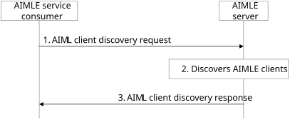

# 8.8 AIMLE client discovery

## 8.8.1 General

Discovery of AIMLE clients is an important step in the AI/ML process for distributed, federated, split AI/ML, and transfer learning. Due to the nature of such learning, VAL servers need to discover suitable AIMLE clients to fulfil the requirements for the AI/ML application. The VAL server can then use the discovered AIMLE clients to select a set of AIMLE clients to perform AI/ML operations.

The following clauses specify procedures, information flows, and APIs for AIMLE client discovery.

## 8.8.2 Procedure

### 8.8.2.1 AIMLE client discovery

Pre-conditions:

1\. AIMLE clients that support AI/ML operations have registered with the AIMLE server and included their AIMLE client profiles and optionally a list of supported services.

2\. The AIMLE server can access a ML repository to obtain AIMLE client profiles and supported services associated with AIMLE clients.

Figure 8.8.2.1-1: AIMLE client discovery

1\. A VAL server sends an AIMLE client discovery request to an AIMLE server to discover a list of AIMLE clients that are available to participate in AI/ML operations (e.g., is available and have required data to train an ML model). The request may also include AIML client task capability requirements to discover clients who can perform the AIML tasks like AIML model training/offload/split with compute requirements and task performance preference like green task performance. The AIMLE client discovery request includes information as described in Table 8.8.3.1-1.

> This request also includes information on the serving PLMN for the communication of the VAL service, as well as the allowed MNO info from another MNO network from which the AIMLE consumer / VAL server can discover AIMLE clients / VAL UEs.
>
> For AIMLE client discovery in hierarchical AIMLE deployments, the request also includes information about edge deployed AIMLE server(s). The edge deployed AIMLE server(s) has AIMLE clients registered, and these AIMLE clients are the potential discovery target.

2\. The AIMLE server performs authentication, and authorization checks to determine if the requestor is able to discover AIMLE clients for the VAL UEs connected to the serving PLMN. If the requestor is authorized, the AIMLE server performs the following to discover AIMLE clients fulfilling the provided AIMLE client discovery criteria.

The AIMLE server also obtains candidate UEs connected to the serving PLMN from the ML repository.

From the list of candidate UEs, the AIMLE server discovers a list of UEs (i.e., AIMLE clients) that fulfils the discovery criteria based on supported services and AIMLE client profiles.

The AIMLE server determines whether the discovered UEs fulfil the location information in the discovery criteria by using their identifiers to determine their location and includes in the discovery response only those UEs that meet the requirements. The AIMLE server may use SEAL-LMS (as in 3GPP TS 23.434 \[5\] clause 9.3.9, or 3GPP TS 23.434 \[5\] clause 9.3.10) or 3GPP 5G Core Network Services (such as GMLC as in 3GPP TS 23.273 \[13\] and NEF as in 3GPP TS 23.273 \[13\] or 3GPP TS 23.502 \[9\]) to determine the UEs which fulfil the location requirement.

If the available AIMLE clients (as determined by the AIMLE server) that fulfil discovery criteria are less than the required minimum number of AIMLE clients for AI/ML operation (e.g., split AI/ML), then the AIMLE server may discover the remaining required AIMLE clients from other AIMLE servers within the same domain over AIML-E reference point and include them in the response message. The AIMLE server may also perform federated discovery of additional AIMLE clients from other AIMLE server(s) from a different domain.

For federated discovery, the AIMLE server may identify a partner AIMLE server in another domain/PLMN (subject to policy/federation agreement) and send an AIMLE client discovery request to the partner AIMLE server over AIML-E, including the AIMLE client discovery criteria and optionally the number of additional AIMLE clients required.

The partner AIMLE server performs authentication and authorization checks of the requesting AIMLE server and discovers AIMLE clients in its domain/PLMN fulfilling the provided discovery criteria and returns the discovered AIMLE client information to the requesting AIMLE server over AIML-E.

The requesting AIMLE server may consolidate the locally discovered AIMLE clients and the AIMLE clients discovered via federation and include them in the discovery response message.

For AIMLE client discovery in hierarchical AIMLE deployments, the AIMLE server may interact with the edge deployed AIMLE server for AIMLE client discovery, according to the Edge AIMLE server Information received in step 1.

> 3\. The AIMLE server sends an AIMLE client discovery response that includes information in Table 8.8.3.2-1.
>
> The response may include AIMLE clients discovered within the serving domain/PLMN and, when federated discovery is performed, AIMLE clients discovered via partner AIMLE server(s) over AIML-E.
>
> If the required number of AIMLE clients are not included in the response message from the AIMLE server (i.e., the AIMLE clients in the response message are less than the required minimum number of AIMLE clients), then the AIML service consumer may discover the remaining required AIMLE clients from other AIML enablement server indicating the required number of AIMLE clients. The response may also include information related to supported tasks with guaranteed task KPIs, available AIML tasks service duration, AIML task expected KPI like latency.
>
> If the available AIMLE clients (as determined by the AIMLE server) that fulfil discovery criteria are less than the required minimum number of AIMLE clients for AI/ML operation (e.g., split AI/ML) or the AIMLE clients are not available or capable for undertaking the operation, then the AIMLE server determines to discover and discovers the remaining required AIMLE clients connected to other PLMNs based on the allowed MNO information and the permissions as in step 1. The AIMLE server also obtains candidate UEs connected to the target/destination PLMN (other than the serving PLMN) from the ML repository.
>
> The AIMLE server may also determine if a candidate UE is suitable based on roaming status and roaming policies.

## 8.8.3 Information flows

### 8.8.3.1 AIMLE client discovery request

Table 8.8.3.1-1 shows the request sent by a requestor (e.g., VAL server, AIMLE server) to an AIMLE server for the AIMLE client discovery procedure.

Table 8.8.3.1-1: AIMLE client discovery request

| Information element              | Status | Description                                                                                                                                                                                                                                    |
|----------------------------------|--------|------------------------------------------------------------------------------------------------------------------------------------------------------------------------------------------------------------------------------------------------|
| Requestor identity               | M      | The identifier of the requestor (e.g., VAL server, AIMLE server).                                                                                                                                                                              |
| AIMLE client discovery criteria  | M      | Discovery criteria for finding suitable AIMLE clients for AI/ML operations as detailed in Table 8.8.3.1-2.                                                                                                                                     |
| Number of required AIMLE clients | O      | Indicates the requested number of AIMLE clients to be discovered based on the discovery criteria.                                                                                                                                              |
| Cross-PLMN discovery requirement | O      | This parameter indicates whether the discover may span across multiple MNO networks or not. It can be seen as a multi-PLMN flag for the discovery or an indicator to further look in the AIMLE client discovery criteria for additional PLMNs. |

Table 8.8.3.1-2: AIMLE client discovery criteria

<table>
<colgroup>
<col style="width: 33%" />
<col style="width: 11%" />
<col style="width: 54%" />
</colgroup>
<thead>
<tr class="header">
<th><strong>Information element</strong></th>
<th><strong>Status</strong></th>
<th><strong>Description</strong></th>
</tr>
</thead>
<tbody>
<tr class="odd">
<td>Service requirement</td>
<td>M</td>
<td>Information about the required service</td>
</tr>
<tr class="even">
<td>&gt; VAL Service ID</td>
<td>M</td>
<td>VAL Service ID that the client is required to support. This identifies the service associated with the requester.</td>
</tr>
<tr class="odd">
<td>&gt; Service permission level</td>
<td>O</td>
<td>Required corresponding service permission level (e.g., premium resource usage standard resource usage, limited resource usage).</td>
</tr>
<tr class="even">
<td>Requested ML model types</td>
<td>O</td>
<td>Requested ML model types (decision trees, linear regression, neural networks).</td>
</tr>
<tr class="odd">
<td>Requested AIML operations</td>
<td>M</td>
<td>Requested role for AI/ML operations such as model training, model transfer, model inference, model offload, model split.</td>
</tr>
<tr class="even">
<td>Application layer AIMLE client capabilities</td>
<td>M</td>
<td>Application layer AIMLE client capability information (e.g., ML application type like FL/TL/SL, client availability to support AIML operations at the UE, AIMLE drop off rate).</td>
</tr>
<tr class="odd">
<td>Dataset requirements</td>
<td>O</td>
<td>Information about dataset.</td>
</tr>
<tr class="even">
<td>&gt; Dataset availability</td>
<td>O</td>
<td>Dataset availability, including dataset identifiers, dataset size, age, list of dataset features.</td>
</tr>
<tr class="odd">
<td>&gt; Data capabilities</td>
<td>O</td>
<td>A list of data capabilities such as the type of data that can be collected (e.g., raw data), supported data processing capabilities (e.g., processed data) and supported exploratory data analysis functions.</td>
</tr>
<tr class="even">
<td>AIML client task capability requirements</td>
<td>O</td>
<td>
Indicates the AIML task requirements to discover the AIML clients for performing AIML tasks.

It includes compute capabilities (e.g., high, low), task performance preference capabilities (e.g. Green task, Energy-efficient, low costs)
</td>
</tr>
<tr class="odd">
<td>AIMLE client velocity</td>
<td>O</td>
<td>Indicates the AIMLE client velocity. It includes mobile (e.g., high, low), static.</td>
</tr>
<tr class="even">
<td>Location information</td>
<td>O</td>
<td>Indicates the location information (e.g., Cell Identity, Tracking Area Identity, GPS Coordinates or civic addresses, VAL service area ID) to discover the AIMLE clients.</td>
</tr>
<tr class="odd">
<td>AIMLE client QoS requirements</td>
<td>O</td>
<td>Indicates the AIMLE client QoS information (like PLR, bandwidth, latency jitter) with the corresponding threshold(s) and threshold matching direction(s) (e.g., above or below) to discover the AIMLE clients.</td>
</tr>
<tr class="even">
<td>Allowed MNO info</td>
<td>M</td>
<td>Information of the allowed operator(s) (e.g. MNO name, PLMN ID) from which its subscriber can consume the AIMLE services.</td>
</tr>
<tr class="odd">
<td>&gt; capability limitations</td>
<td>O</td>
<td>
Capability limitations per PLMN (which is not the service PLMN) are based on the service agreement between the vertical / ASP and the allowed MNO network and can provide limitations on the capabilities to be supported by the entities connected to that PLMN.

One example is the reduced performance or energy limitations or exposure limitations when utilizing the access from the target PLMN (which is not the serving).
</td>
</tr>
<tr class="even">
<td>&gt;Serving PLMN info</td>
<td>M</td>
<td>Information on the serving operator (MNO name, PLMN ID) where the subscriber is registered / connected.</td>
</tr>
<tr class="odd">
<td>Energy consumption requirements</td>
<td>
O

(NOTE 1)
</td>
<td>The energy consumption requirements of the requestor.</td>
</tr>
<tr class="even">
<td>&gt; Maximum energy budget</td>
<td>M</td>
<td>The maximum energy budget (e.g., watt-hour, joules) that is acceptable to the requestor.</td>
</tr>
<tr class="odd">
<td>Edge AIMLE server Information</td>
<td>O</td>
<td>Information about edge deployed AIMLE server(s).</td>
</tr>
<tr class="even">
<td>&gt; EAS information</td>
<td>
O

(NOTE 2)
</td>
<td>Indicates information of the AIMLE server deployed as EAS, which may include EAS ID, EAS Endpoint, DNAIs and service area of the EAS.</td>
</tr>
<tr class="odd">
<td>&gt; AIMLE server ID</td>
<td>
O

(NOTE 2)
</td>
<td>The identifier of the AIMLE server.</td>
</tr>
<tr class="even">
<td>Intermediate node discovery criteria</td>
<td>O</td>
<td>Discovery criteria for finding suitable intermediate nodes.</td>
</tr>
<tr class="odd">
<td>&gt; VAL UE capability</td>
<td>
O

(NOTE 3)
</td>
<td>Indicates the capability of the VAL UE to be considered as candidate relay. This can be the compute capability of the VAL UE (e.g. workloads supported, processing power and capacity, energy consumption limitations/restrictions), the network capabilities</td>
</tr>
<tr class="even">
<td>&gt; VAL UE mobility information</td>
<td>
O

(NOTE 3)
</td>
<td>Information on the mobility of the VAL UE or relative mobility to the VAL UE of interest (source VAL UE), and optionally whether whether the UE is static/low or high mobile VAL UE.</td>
</tr>
<tr class="odd">
<td colspan="3">
NOTE 1: This information element applies to AIMLE client selection.

NOTE 2: At least one of the IEs shall be provided when edge deployed AIMLE server.

NOTE 3: At least one of these shall be present.
</td>
</tr>
</tbody>
</table>

### 8.8.3.2 AIMLE client discovery response

Table 8.8.3.2-1 shows the response sent by the AIMLE server to the VAL server for the AIMLE client discovery procedure.

Table 8.8.3.2-1: AIMLE client discovery response

<table>
<colgroup>
<col style="width: 33%" />
<col style="width: 11%" />
<col style="width: 54%" />
</colgroup>
<thead>
<tr class="header">
<th>Information element</th>
<th>Status</th>
<th>Description</th>
</tr>
</thead>
<tbody>
<tr class="odd">
<td>Status</td>
<td>M</td>
<td>The status for the request: success or fail.</td>
</tr>
<tr class="even">
<td>List of AIMLE client IDs</td>
<td>M</td>
<td>A list of AIMLE client IDs that matches the AIML discovery criteria.</td>
</tr>
<tr class="odd">
<td>&gt; PLMN ID/name per AIMLE client</td>
<td>O</td>
<td>The PLMN in which the VAL UE is connected/registered.</td>
</tr>
<tr class="even">
<td>&gt; EAS information</td>
<td>
O

(NOTE)
</td>
<td>Indicates information of the AIMLE server deployed as EAS (which serving the AIMLE client), which may include EAS ID, EAS Endpoint, DNAIs and service area of the EAS.</td>
</tr>
<tr class="odd">
<td>&gt; AIMLE server ID</td>
<td>
O

(NOTE)
</td>
<td>The identifier of the AIMLE server which serving the AIMLE client.</td>
</tr>
<tr class="even">
<td>AIML supported tasks</td>
<td>O</td>
<td>Indicates the discovered AIML task providers fulfilling the AIML task and AIML task requirements. It includes expected AIML task KPIs like latency, available AIML tasks service duration, list of AIML task providers like IDs or URI, and supported tasks.</td>
</tr>
<tr class="odd">
<td colspan="3">NOTE: At least one of the IEs shall be provided when the AIMLE client is served by edge deployed AIMLE server.</td>
</tr>
</tbody>
</table>
