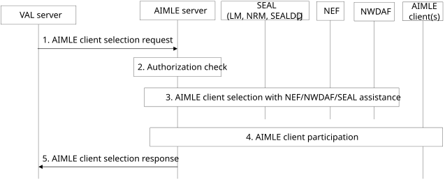

# 8.9 AIMLE client selection

## 8.9.1 General

The AIMLE client selection procedure has two modes of operation: VAL server selection and AIMLE server selection. In VAL server selection, a List of AIMLE client IDs is provided to form an AIMLE client set, which can be used for AI/ML operations (e.g., training). In AIMLE server selection, a VAL server provides AIMLE client selection criteria and number of the required AIMLE clients for the AIMLE server to select the AIMLE client set.

The following clauses specify procedures, information flows, and APIs for AIMLE client selection.

## 8.9.2 Procedure

### 8.9.2.1 AIMLE client selection

Pre-conditions:

1\. AIMLE clients that support AI/ML operations have registered with the AIMLE server and included their AIMLE client profiles and optionally a list of supported services.

2\. The AIMLE server can access a ML repository to obtain AIMLE client profiles and supported services associated with the AIMLE clients.

3\. When cross-domain/PLMN selection is supported, the AIMLE server is authorized (subject to policy/federation agreement) to interact with partner AIMLE server(s) over AIML-E for federated selection.

Figure 8.9.2.1-1: AIMLE client selection

1\. A requestor (e.g., VAL server, AIMLE server) sends an AIMLE client selection request to an AIMLE server to select AIMLE clients available for participation in AI/ML operations (e.g., is available and have required data to train an ML model). The AIMLE client selection request includes information as described in Table 8.9.3.1-1.

2\. The AIMLE server performs authentication and authorization checks to determine if the requestor is able to select AIMLE clients.

3\. If the requestor is authorized, the AIMLE server performs AIMLE client selection based on the provided inputs as described below.

For VAL server selection, the AIMLE server receives a list of AIMLE client IDs in the request and selects the AIMLE clients in the list as candidate AIMLE clients.

For AIMLE server selection, the AIMLE server retrieves a list of clients with AI/ML capabilities from the ML repository. From the list of clients, the AIMLE server selects a list of candidate AIMLE clients, whose client profiles fulfil the AIMLE client selection criteria. The AIMLE server may use SEAL (LM service), NEF (e.g. MonitoringEvent API), and NWDAF (e.g. UE mobility analytics as defined in clause 6.7.2 of 3GPP TS 23.288 \[2\]) capabilities to assist the AIMLE client selection.

The AIMLE server determines UEs by using their identifiers to determine their location and then selects only those that fulfil the location requirements specified in the AIMLE client selection criteria. The AIMLE server may use SEAL-LMS (as in 3GPP TS 23.434 \[5\] clause 9.3.9, or 3GPP TS 23.434 \[5\] clause 9.3.10) or 3GPP 5G Core Network Services (such as GMLC as in 3GPP TS 23.273 \[13\] and NEF as in 3GPP TS 23.273 \[13\] or 3GPP TS 23.502 \[9\]) to determine the UEs which fulfil the location requirement.

The AIMLE server may then determine the QoS parameters for the AIML traffic session between the requestor and the VAL client associated with the candidate AIMLE client(s) and configure the AI/ML traffic session(s) via SEALDD (Sdd_RegularTransmission API) or NEF services (AfSessionWithQoS API). The AIMLE server determines the application QoS parameters based on the VAL Service ID.

NOTE 1: To determine the application QoS parameters based on the VAL service ID, the AIMLE server can use the VAL service ID associated AIMLE client QoS requirements in the AIMLE client selection criteria provided in step 1.

The AIMLE server retrieves a list of ML model information from the ML repository based on energy consumption requirements using the ML model information discovery procedure as described in clause 8.11.3. The AIMLE server uses information from the AIMLE client selection criteria as filtering criteria for ML model information discovery.

The AIMLE server selects candidate AIMLE clients that fulfill the expected energy consumption needs for the retrieved ML models. The expected energy consumption needs are based on the requested AI/ML operations and on the AIMLE client’s processing capability.

The AIMLE server identifies and selects ML models and candidate AIMLE clients that can perform the requested AI/ML operations without exceeding the maximum energy budget.NOTE 2: If the available AIMLE clients (as determined by the AIMLE server) that fulfil selection criteria are less than the required number of AIMLE clients for AI/ML operation (e.g., split AI/ML), then the AIMLE server can discover and select the remaining required AIMLE clients from other AIMLE servers over AIML-E reference point and include them in the AIMLE client selection response message.

NOTE 3: The AIMLE server can reuse SEAL group management for any necessary group management.

The AIMLE server may perform federated discovery of additional AIMLE clients from other AIMLE server(s) from a different domain, as in clause 8.8.2.1.

If AIMLE client(s) from other AIMLE server(s) from a different domain are discovered with federation, then the AIMLE server performs cross-domain/PLMN selection by interacting with partner AIMLE server(s) over the AIML-E reference point. The AIMLE server may identify a partner AIMLE server in another domain/PLMN (subject to policy/federation agreement) and send an AIMLE client selection request over AIML-E including the AIMLE client selection criteria and optionally the number of additional AIMLE clients required as in Table 8.9.3.1-1. The AIMLE server may consolidate the candidate AIMLE clients selected in the serving domain/PLMN and the candidate AIMLE clients selected via partner AIMLE server(s) and proceed with the AIMLE client participation procedure in step 4.

The partner AIMLE server performs authentication and authorization checks of the requesting AIMLE server, performs AIMLE client selection within its domain/PLMN based on the received criteria and returns the selected candidate AIMLE clients information to the requesting AIMLE server over AIML-E.

4\. The AIMLE server performs AIMLE client participation procedure with each candidate AIMLE client as described in clause 8.10.

> For candidate AIMLE clients selected in another domain/PLMN, the AIMLE server may coordinate with the partner AIMLE server over AIML-E so that the partner AIMLE server performs the AIMLE client participation procedure (clause 8.10) with those AIMLE clients and provides the participation outcome to the AIMLE server.
>
> For all candidate AIMLE clients that agreed to participate in AI/ML operations, the AIMLE server selects the AIMLE clients and assigns an AIMLE client set identifier for the selected clients. The AIMLE client set may then be used for training a ML model.

NOTE 4: If a required minimum number of AIMLE clients for AI/ML operation is provided in the AIMLE client selection request and the number of AIMLE clients that agreed to participate in AI/ML operations is less than this number, an AIMLE client set identifier will not be assigned and the status will be set to fail in the AIMLE client selection response in step 5.

5\. The AIMLE server sends an AIMLE client selection response that includes information in Table 8.9.3.2-1.

## 8.9.3 Information flows

### 8.9.3.1 AIMLE client selection request

Table 8.9.3.1-1 shows the request sent by a requestor (e.g., VAL server, AIMLE server) to an AIMLE server for the AIMLE client selection procedure.

Table 8.9.3.1-1: AIMLE client selection request

<table>
<colgroup>
<col style="width: 31%" />
<col style="width: 13%" />
<col style="width: 55%" />
</colgroup>
<thead>
<tr class="header">
<th>Information element</th>
<th>Status</th>
<th>Description</th>
</tr>
</thead>
<tbody>
<tr class="odd">
<td>Requestor identity</td>
<td>M</td>
<td>The identifier of the requestor (e.g., VAL server, AIMLE server).</td>
</tr>
<tr class="even">
<td>VAL service identifier</td>
<td>O</td>
<td>An identifier for the VAL service associated with the requestor.</td>
</tr>
<tr class="odd">
<td>List of AIMLE client IDs</td>
<td>
O

(NOTE 1)

(NOTE 3)
</td>
<td>A list of AIMLE client IDs that was previously discovered for inclusion into an AIMLE client set.</td>
</tr>
<tr class="even">
<td>AIMLE client selection criteria</td>
<td>
O

(NOTE 2)
</td>
<td>Selection criteria for finding suitable AIMLE clients for AI/ML operations as detailed in Table 8.8.3.1-2.</td>
</tr>
<tr class="odd">
<td>Number of required AIMLE clients</td>
<td>
O

(NOTE 2)

(NOTE 3)
</td>
<td>Indicates the requested number of AIMLE clients to be selected based on selection criteria.</td>
</tr>
<tr class="even">
<td>Federation indication</td>
<td>O</td>
<td>Indicates whether the AIMLE server may use federation with other AIMLE server(s) in another PLMN/domain to fulfil the selection request, subject to policy/federation agreement.</td>
</tr>
<tr class="odd">
<td colspan="3">
NOTE 1: This information element is only present for VAL server selection.

NOTE 2: These information elements are only present for AIMLE server selection.

NOTE 3: At least one of the information elements are present.
</td>
</tr>
</tbody>
</table>

### 8.9.3.2 AIMLE client selection response

Table 8.9.3.2-1 shows the response sent by the AIMLE server to the requestor (e.g., VAL server, AIMLE server) for the AIMLE client selection procedure.

Table 8.9.3.2-1: AIMLE client selection response

<table>
<colgroup>
<col style="width: 33%" />
<col style="width: 11%" />
<col style="width: 54%" />
</colgroup>
<thead>
<tr class="header">
<th>Information element</th>
<th>Status</th>
<th>Description</th>
</tr>
</thead>
<tbody>
<tr class="odd">
<td>Status</td>
<td>M</td>
<td>The status for the request: success or fail.</td>
</tr>
<tr class="even">
<td>AIMLE client set identifier</td>
<td>
O

(NOTE 1)
</td>
<td>An identifier to associate with the set of AIMLE clients selected and agreed to participate in AI/ML operations. The AIMLE client set can be updated by using this identifier.</td>
</tr>
<tr class="odd">
<td>List of AIMLE client IDs</td>
<td>
O

(NOTE 1)

(NOTE2)
</td>
<td>A list of AIMLE client IDs that matches the AIML selection criteria. The list may include clients selected via federation and may include associated serving domain/PLMN info.</td>
</tr>
<tr class="even">
<td colspan="3">
NOTE 1: This is present if the response status is success.

NOTE 2: This information element is present for dynamic selection.
</td>
</tr>
</tbody>
</table>
