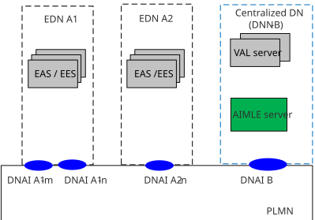
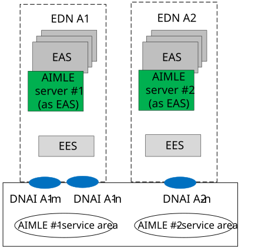
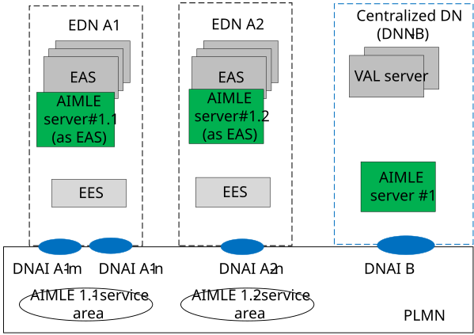
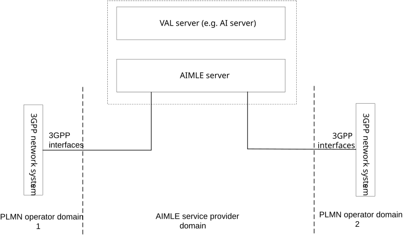
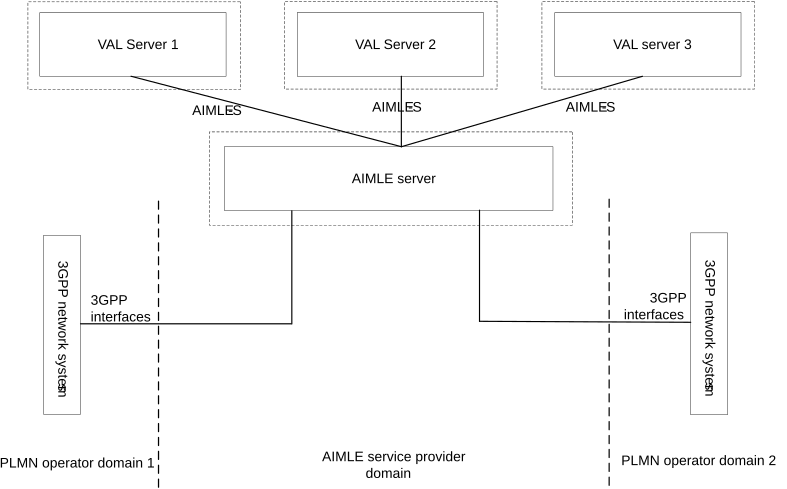
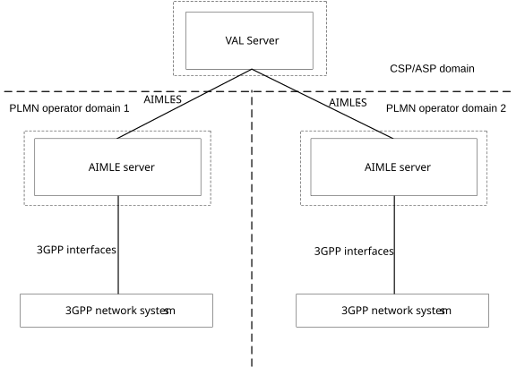
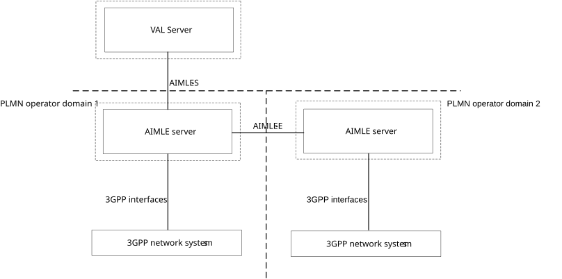
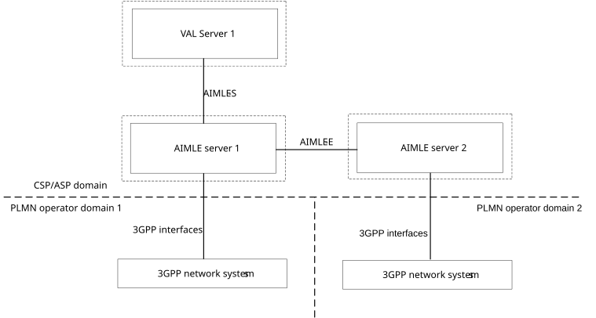

# Annex A (informative): Deployment scenarios

## A.1 General

This Annex provides the different deployment models for AIMLE services. There could be five deployment options:

\- AIMLE server can be deployed at a centralized cloud platform and collects data from multiple EDNs.

\- AIMLE server can be deployed at the edge platform.

\- Hierarchical AIMLE server deployment, where multiple AIML enablement services are deployed in edge or central clouds (e.g., in hierarchical architecture). Such deployment allows for local-global analytics for system wide optimization.

\- Centralized AIMLE server in multi-operator scenarios.

\- Distributed AIMLE servers in multi-operator scenarios.

## A.2 Deployment model #1: Cloud-deployed AIMLE server

In this deployment, , the AIMLE server is centrally located and can provide support for AIML operations to the application and edge services (EAS/EES, VAL server). An example deployment option for AIMLE server at the cloud is shown in Figure A.2-1

Figure A.2-1: Example deployment for AIMLE at the cloud

## A.3 Deployment model #2: Edge-deployed AIMLE server

In this deployment, the AIMLE server deployed as EAS is located at the EDN and provides AIML enablement services to the other EAS(s) or other edge native applications at the edge platform. AIMLE services can be deployed by the ECSP or the MNO to provide value-add services related to AI/ML operations.

The ML support operations, that the edge deployed AIMLE Server provides, are applicable to the AIMLE service areas (as shown in the example deployment scenario in Figure A.3-1), which are equivalent to the EDN service areas.

NOTE: AIMLE server deployed as EAS can provide application enablement service to EES.

Figure A.3-1: Example deployment for AIMLE at the cloud

## A.4 Deployment model #3: Hierarchical AIMLE server deployment

In this deployment, multiple AIMLE servers can be located at different EDNs (deployed as EASs)/DNs and can be deployed by the same provider. Such hierarchical deployments allow the local – global ML operations (e.g., federated learning across domains).

The ML support services that the edge deployed AIMLE server correspond to the AIMLE service areas (as shown in the example in Figure A.4-1), which is equivalent to the EDN service areas. The central AIMLE server covers all PLMN area and is used to coordinate the ML related operations (e.g., FL server / aggregator) with the distributed AIMLE servers.

Figure A.4-1: Example hierarchical deployment of AIMLE

## A.5 Deployment model #4: Centralized AIMLE server in multi-operator scenarios

Figure A.5‑1 illustrates a deployment of the AIMLE server which connects to the 3GPP network systems in multiple PLMN operator domain. The AIMLE server can be co-located with the VAL server (e.g. AI server) in a single physical entity or deployed in different physical entities.

Figure A.5-1: Deployment of AIMLE server with connections to 3GPP network systems in multiple PLMN operator domains

Figure A5-2 illustrates a deployment of the AIMLE server which provides AIMLE capabilities to multiple VAL servers over AIMLE-S reference point and connects to the 3GPP network systems in multiple PLMN operator domain.

Figure A.5-2: Deployment of AIMLE server with connections to multiple VAL servers

## A.6 Deployment model #5: Distributed AIMLE server in multi-operator scenarios

The distributed deployment is where multiple AIMLE servers are deployed either in the AIMLE service provider domain or in the PLMN operator domain. The distributed deployment of the AIMLE servers provide geographical coverage or support multiple PLMN operator domains in a geographical location. The AIMLE servers interconnect via AIMLE-E and the AIMLE-S reference point is used for interaction between VAL server and the AIMLE server.

Figure A.6-1 illustrates the deployment of AIMLE servers in multiple PLMN operator domain and provides AIMLE capabilities to the VAL server deployed in the Cloud Service Provider (CSP) or ASP domain. The VAL server connects via AIMLE-S to the AIMLE servers.

Figure A.6-1: Distributed deployment of AIMLE servers in multiple PLMN operator domain without interconnection between AIMLE servers

Figure A.6-2 illustrates the deployment of multiple AIMLE servers deployed in multiple PLMN operator domains. The VAL server connects via AIMLE-S to the AIMLE server. The interconnection between AIMLE servers is via AIMLE-E and supports the AI/ML applications for the VAL UEs connected to the AIMLE servers in multiple PLMN operator domains.

Figure A.6-2: Distributed deployment of AIMLE servers in multiple PLMN operator domain with interconnection between AIMLE servers

Figure A.6-3 illustrates the deployment of multiple AIMLE servers in the Cloud Service Provider (CSP) or ASP domain where AIMLE server 1 and AIMLE server 2 connect with 3GPP network system of PLMN operator domain 1 and PLMN operator domain 2 respectively. The VAL server 1 connects via AIMLE-S to the AIMLE server 1. The AIMLE servers interconnect via AIMLE-E and support the VAL applications (e.g. AI apps) for the VAL UEs connected via both the PLMN operator domains.

Figure A.6-3: Distributed deployment of AIMLE servers in CSP/ASP domain
